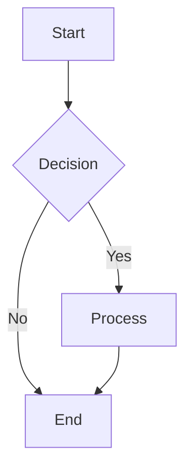
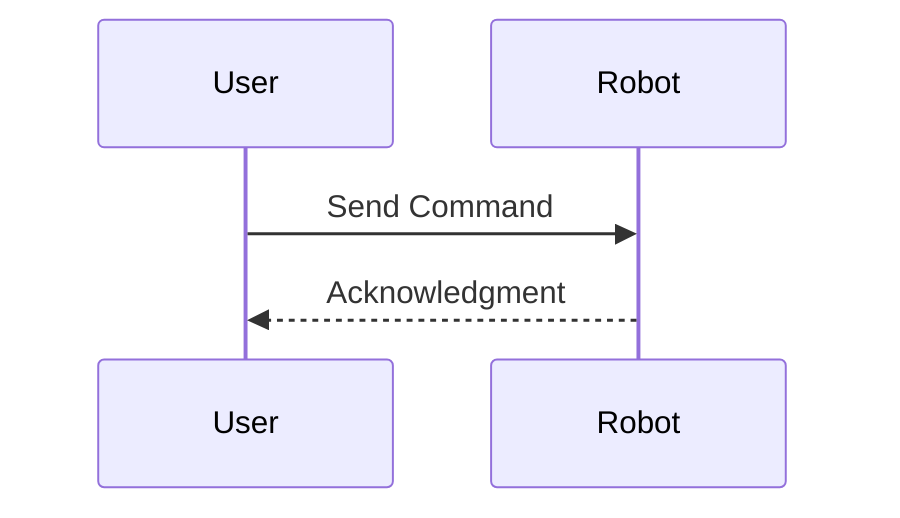
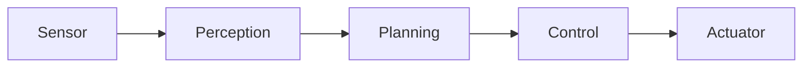

# Skill: create-mermaid-diagram

**Purpose**: Generate Mermaid diagrams for architecture, flowcharts, and sequence diagrams.

## Input

- `type`: Diagram type (flowchart, sequence, class, state, er)
- `description`: Diagram description
- `nodes`: Array of nodes/entities
- `connections`: Array of connections/relationships

## Output

- Mermaid diagram code block

## Diagram Types

### Flowchart


### Sequence Diagram


### Architecture Diagram


## Example Usage

Input:
```json
{
  "type": "flowchart",
  "description": "ROS2 Node Communication",
  "nodes": [
    {"id": "publisher", "label": "Publisher Node"},
    {"id": "topic", "label": "Topic"},
    {"id": "subscriber", "label": "Subscriber Node"}
  ],
  "connections": [
    {"from": "publisher", "to": "topic", "label": "publish"},
    {"from": "topic", "to": "subscriber", "label": "subscribe"}
  ]
}
```

Output:
```mdx
ROS2 Node Communication:

\`\`\`mermaid
flowchart LR
    publisher[Publisher Node] -->|publish| topic[Topic]
    topic -->|subscribe| subscriber[Subscriber Node]
\`\`\`
```
