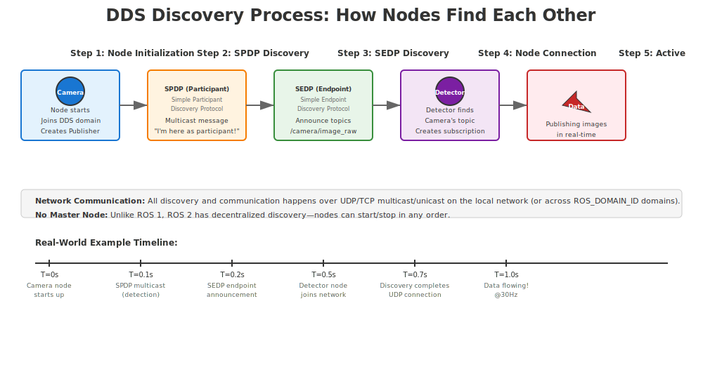
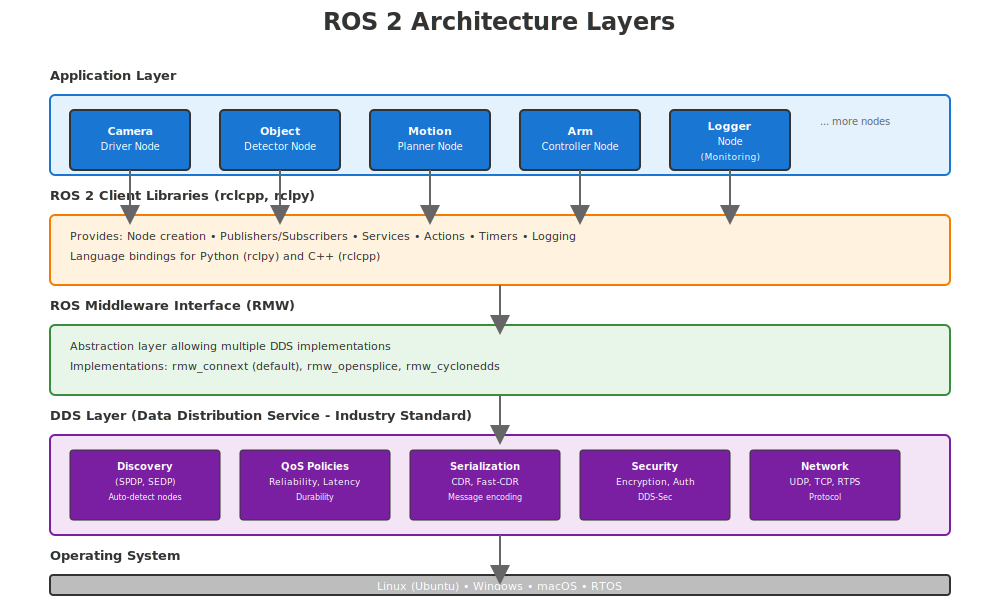
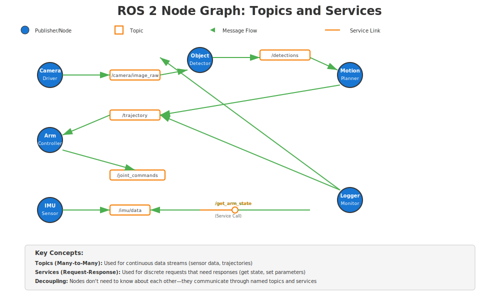

import NodeVisualizer from '@site/src/components/chapter-2/NodeVisualizer/NodeVisualizer';

# Lesson 2.1: ROS 2 Fundamentals - The Robot Middleware

**Reading Time**: 35 minutes | **Coding Time**: 75 minutes

## Learning Objectives

By the end of this lesson, you will be able to:
- Understand ROS 2 architecture and DDS layer
- Install and configure ROS 2 Humble
- Create publisher and subscriber nodes in Python and C++
- Use ROS 2 CLI tools for debugging

## Prerequisites

- Chapter 1: Physical AI Foundations (completed)
- Ubuntu 22.04 installed (native, VM, or WSL2)
- Basic Linux command-line skills
- Python 3.10+ or C++ 17 compiler

---

## Introduction: The Robot Operating System

Imagine you're building a humanoid robot. You need the sensors to communicate with the motors, the vision system to talk to the path planner, and the speech recognition to trigger arm movements. How do all these components talk to each other?

This is where **ROS 2 (Robot Operating System 2)** comes in—a middleware framework that acts as the **nervous system** of your robot, enabling seamless communication between all components.

### What is Middleware?

Middleware is software that sits between your application code and the operating system, handling:
- **Inter-process communication (IPC)**: How programs talk to each other
- **Message serialization**: Converting data into bytes for transmission
- **Service discovery**: Finding other programs on the network
- **Time synchronization**: Keeping all components on the same clock

Think of middleware as the **postal service** for your robot—it ensures messages get delivered reliably, even if components are running on different machines.

### ROS 1 vs ROS 2: Why the Upgrade?

ROS 1 (released 2007) revolutionized robotics research but had fundamental limitations:

| Feature | ROS 1 | ROS 2 |
|---------|-------|-------|
| **Communication** | Custom TCPROS protocol | DDS (Data Distribution Service) standard |
| **Master Node** | Required (single point of failure) | No master—fully distributed |
| **Real-time Support** | None | Real-time Linux kernel support |
| **Security** | None | DDS Security (encryption, auth) |
| **Multi-robot** | Difficult | Native support via DDS domains |
| **Language Support** | Python, C++ | Python, C++, Rust, Java, more |

**Key Insight**: ROS 2 was rebuilt from scratch to support production robotics (self-driving cars, industrial robots, drones) while maintaining backward compatibility with ROS 1 concepts.

### The DDS Layer: Industry-Standard Communication

ROS 2 uses **DDS (Data Distribution Service)**, an OMG standard used in:
- Military defense systems
- Medical devices
- Financial trading platforms
- Autonomous vehicles

**DDS provides**:
- **Quality of Service (QoS)**: Tune reliability, durability, and latency per topic
- **Discovery**: Automatic detection of publishers and subscribers
- **Scalability**: Handle 1000+ nodes across multiple machines
- **Type safety**: Compile-time message type checking

#### How DDS Discovery Works



The discovery process is **automatic and decentralized**:
1. **SPDP (Simple Participant Discovery Protocol)**: Nodes announce their presence via multicast
2. **SEDP (Simple Endpoint Discovery Protocol)**: Nodes advertise their topics and services
3. **Connection Establishment**: Publishers and subscribers find each other automatically
4. **Data Flow**: Once connected, messages flow directly between nodes (no master server)

---

## ROS 2 Architecture: The Building Blocks

ROS 2 applications are built from five core primitives:



### 1. Nodes

A **node** is a single-purpose process in your robot system.

**Examples**:
- `camera_driver`: Publishes image data from camera
- `object_detector`: Processes images and detects objects
- `arm_controller`: Moves robot arm based on detections

**Key Principles**:
- Each node runs in its own process (crash isolation)
- Nodes can be written in different languages
- Nodes can run on different machines

### 2. Topics

A **topic** is a named bus for streaming data (publisher-subscriber pattern).

**Characteristics**:
- **Many-to-many**: Multiple publishers and subscribers
- **Asynchronous**: Publishers don't wait for subscribers
- **Type-safe**: All messages on a topic have the same type
- **Best for**: Continuous data streams (sensor readings, camera frames)

**Example**:
```
/camera/image_raw (sensor_msgs/Image)
   Publisher: camera_driver
   Subscribers: object_detector, video_recorder
```

### 3. Services

A **service** is a request-response interaction (client-server pattern).

**Characteristics**:
- **One-to-one**: Client sends request, server sends response
- **Synchronous**: Client blocks until response received
- **Best for**: Occasional operations (take photo, reset odometry)

**Example**:
```
/arm/set_position (control_msgs/SetJointPosition)
   Server: arm_controller
   Clients: motion_planner, teleop_node
```

### 4. Actions

An **action** is a long-running task with feedback and cancellation.

**Characteristics**:
- **Goal**: Client sends target (e.g., "move to position X")
- **Feedback**: Server sends progress updates (e.g., "50% complete")
- **Result**: Final outcome (e.g., "success" or "failed")
- **Cancellation**: Client can abort mid-execution

**Example**:
```
/navigate_to_pose (nav2_msgs/NavigateToPose)
   Goal: Target (x, y, θ)
   Feedback: Current distance remaining
   Result: Success/failure status
```

### Visual: Node Graph Example



The diagram above shows a typical ROS 2 system:
- **Nodes** (blue circles) represent processes
- **Topics** (rectangles) show data streams
- **Arrows** indicate publisher → subscriber relationships
- The logger/monitor node subscribes to multiple topics for debugging

### 5. Parameters

**Parameters** are runtime configuration values for nodes.

**Characteristics**:
- **Dynamic**: Can be changed while node is running
- **Typed**: Int, float, string, boolean, arrays
- **Persistent**: Can be saved to YAML files

**Example**:
```
/camera_driver parameters:
  - frame_rate: 30
  - exposure: auto
  - resolution: [1920, 1080]
```

---

## ROS 2 CLI Tools: Debugging Your Robot

ROS 2 provides powerful command-line tools for introspection:

### Node Inspection

```bash
# List all running nodes
ros2 node list

# Show node info (publishers, subscribers, services)
ros2 node info /camera_driver

# Kill a node
ros2 lifecycle set /node_name shutdown
```

### Topic Debugging

```bash
# List all topics
ros2 topic list

# Show topic info (type, publishers, subscribers)
ros2 topic info /camera/image_raw

# Print messages in real-time
ros2 topic echo /camera/image_raw

# Publish a test message
ros2 topic pub /cmd_vel geometry_msgs/Twist "{linear: {x: 0.5}}"

# Measure topic frequency
ros2 topic hz /camera/image_raw

# Measure topic bandwidth
ros2 topic bw /camera/image_raw
```

### Service Operations

```bash
# List all services
ros2 service list

# Call a service
ros2 service call /arm/set_position control_msgs/SetJointPosition "{positions: [0.0, 1.57, 0.0]}"

# Show service type
ros2 service type /arm/set_position
```

### Parameter Management

```bash
# List node parameters
ros2 param list /camera_driver

# Get parameter value
ros2 param get /camera_driver frame_rate

# Set parameter value
ros2 param set /camera_driver frame_rate 60

# Dump all parameters to YAML
ros2 param dump /camera_driver > camera_params.yaml

# Load parameters from YAML
ros2 param load /camera_driver camera_params.yaml
```

### Recording and Playback (Bag Files)

```bash
# Record all topics to bag file
ros2 bag record -a

# Record specific topics
ros2 bag record /camera/image_raw /imu/data

# Play back bag file
ros2 bag play my_recording.bag

# Get bag file info
ros2 bag info my_recording.bag
```

---

## Installation Guide: ROS 2 Humble on Ubuntu 22.04

### Step 1: Set Locale

```bash
locale  # check for UTF-8

sudo apt update && sudo apt install locales
sudo locale-gen en_US en_US.UTF-8
sudo update-locale LC_ALL=en_US.UTF-8 LANG=en_US.UTF-8
export LANG=en_US.UTF-8

locale  # verify settings
```

### Step 2: Add ROS 2 APT Repository

```bash
# Enable Ubuntu Universe repository
sudo apt install software-properties-common
sudo add-apt-repository universe

# Add ROS 2 GPG key
sudo apt update && sudo apt install curl -y
sudo curl -sSL https://raw.githubusercontent.com/ros/rosdistro/master/ros.key -o /usr/share/keyrings/ros-archive-keyring.gpg

# Add repository to sources list
echo "deb [arch=$(dpkg --print-architecture) signed-by=/usr/share/keyrings/ros-archive-keyring.gpg] http://packages.ros.org/ros2/ubuntu $(. /etc/os-release && echo $UBUNTU_CODENAME) main" | sudo tee /etc/apt/sources.list.d/ros2.list > /dev/null
```

### Step 3: Install ROS 2 Humble

```bash
# Update package index
sudo apt update

# Install ROS 2 Desktop (includes RViz, demos, tutorials)
sudo apt install ros-humble-desktop

# Or install ROS 2 Base (minimal, no GUI tools)
# sudo apt install ros-humble-ros-base
```

### Step 4: Setup Environment

```bash
# Source ROS 2 setup file (add to ~/.bashrc for persistence)
source /opt/ros/humble/setup.bash

# Verify installation
ros2 --version
# Expected output: ros2 doctor 0.10.4
```

### Step 5: Install Development Tools

```bash
# Install colcon build tool
sudo apt install python3-colcon-common-extensions

# Install rosdep (dependency management)
sudo apt install python3-rosdep
sudo rosdep init
rosdep update
```

### Troubleshooting

**Issue**: `ros2: command not found`
**Solution**: Source the setup file: `source /opt/ros/humble/setup.bash`

**Issue**: `Gazebo fails to start`
**Solution**: Install Gazebo separately: `sudo apt install ros-humble-gazebo-ros-pkgs`

**Issue**: `Permission denied` errors
**Solution**: Add user to dialout group: `sudo usermod -a -G dialout $USER` (logout required)

---

## Hands-On: Your First ROS 2 Package

### Step 1: Create Workspace

```bash
# Create workspace directory
mkdir -p ~/ros2_ws/src
cd ~/ros2_ws/src

# Create a Python package
ros2 pkg create --build-type ament_python my_first_package

cd ~/ros2_ws
```

### Step 2: Build Package

```bash
# Build with colcon
colcon build

# Source the workspace
source install/setup.bash
```

### Step 3: Run Talker and Listener Demo

Terminal 1 (Talker):
```bash
source /opt/ros/humble/setup.bash
ros2 run demo_nodes_cpp talker
```

Terminal 2 (Listener):
```bash
source /opt/ros/humble/setup.bash
ros2 run demo_nodes_cpp listener
```

**Expected Output**:
```
[INFO] [talker]: Publishing: "Hello World: 1"
[INFO] [listener]: I heard: [Hello World: 1]
```

### Step 4: Visualize with RQT Graph

```bash
# Install rqt tools
sudo apt install ros-humble-rqt ros-humble-rqt-graph

# Launch graph visualization
rqt_graph
```

You should see:
- Two nodes: `/talker` and `/listener`
- One topic: `/chatter` connecting them

### Step 5: Inspect with RViz2

```bash
# Launch RViz2 (3D visualization tool)
rviz2
```

**RViz2 Features**:
- 3D model visualization
- TF (transform) tree display
- Sensor data visualization (camera, lidar, IMU)
- Interactive markers

---

## Quality of Service (QoS): Tuning Communication

ROS 2's biggest advantage is **QoS policies** for fine-grained control:

### QoS Profiles

| Policy | Options | Use Case |
|--------|---------|----------|
| **Reliability** | Best Effort, Reliable | Sensor streams vs critical commands |
| **Durability** | Volatile, Transient Local | Late-joining subscribers |
| **History** | Keep Last (N), Keep All | Buffer management |
| **Deadline** | Duration | Detect slow publishers |
| **Lifespan** | Duration | Expire old data |

### Example: Camera Stream (Best Effort)

```python
from rclpy.qos import QoSProfile, ReliabilityPolicy

qos = QoSProfile(
    reliability=ReliabilityPolicy.BEST_EFFORT,  # Don't retransmit lost packets
    depth=10  # Keep last 10 messages
)

self.camera_sub = self.create_subscription(
    Image,
    '/camera/image_raw',
    self.image_callback,
    qos
)
```

### Example: Safety Command (Reliable)

```python
qos = QoSProfile(
    reliability=ReliabilityPolicy.RELIABLE,  # Guarantee delivery
    durability=DurabilityPolicy.TRANSIENT_LOCAL,  # Keep for late subscribers
    depth=1
)

self.estop_pub = self.create_publisher(
    Bool,
    '/emergency_stop',
    qos
)
```

---

## Summary

You've learned:
- ✅ ROS 2 is **middleware** that connects robot components
- ✅ **DDS** provides industry-standard, scalable communication
- ✅ **Nodes** are processes; **topics** are data streams; **services** are request-response; **actions** are long-running tasks
- ✅ **CLI tools** (`ros2 topic`, `ros2 node`, etc.) are essential for debugging
- ✅ **QoS policies** let you tune reliability, latency, and bandwidth per topic

**Next Steps**:
- Complete the quiz to test your understanding
- Try the coding assignment: Build a custom publisher-subscriber pair
- Proceed to Lesson 2.2 to learn URDF robot modeling

---

## Interactive Visualization: Node Graph Explorer

Below you'll find the **Node Visualizer**—an interactive visualization of a ROS 2 system showing nodes, topics, and message flow.

**How to use the visualizer:**
- Click "Graph View" to see the full node-topic network
- Click on nodes or topics to view detailed information
- Enable "Auto-play message flow" to watch data moving through the system
- Use "Node Details" and "Topic Browser" tabs to explore each element

<NodeVisualizer />
