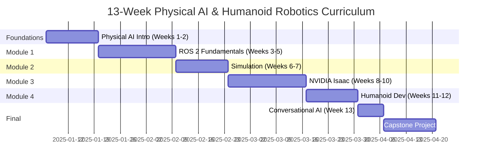

# Course Overview

This 13-week curriculum is structured to take you from zero robotics knowledge to building autonomous humanoid systems. Each week builds on previous concepts with a mix of theory, hands-on coding, and simulation exercises.

## Curriculum Timeline

## Weekly Breakdown

### **Weeks 1-2: Introduction to Physical AI**
*Foundation concepts for embodied intelligence*

**Week 1: Foundations**
- What is Physical AI?
- Digital vs. embodied intelligence
- Key challenges in robotics
- History and evolution of humanoid robots

**Week 2: Hardware & Sensors**
- Robot anatomy: sensors, actuators, computation
- Sensor types: cameras, LiDAR, IMU, encoders
- Actuator types: DC motors, servos, steppers
- Computational platforms: Jetson, embedded systems

**Learning Outcomes**:
- Define Physical AI and its applications
- Identify core components of robot systems
- Understand sensor/actuator capabilities and limitations
- Recognize challenges unique to physical embodiment

**Assessment**: None (introductory material)

---

### **Module 1: ROS 2 Fundamentals (Weeks 3-5)**
*Master the Robot Operating System for production robotics*

**Week 3: ROS 2 Architecture**
- Why ROS 2? Differences from ROS 1
- Distributed computing model
- Communication patterns: publish/subscribe, services, actions
- Quality of Service (QoS) policies

**Week 4: Building ROS 2 Applications**
- Creating nodes in Python and C++
- Publishing and subscribing to topics
- Implementing services and actions
- Parameter management and configuration

**Week 5: Advanced ROS 2**
- Custom message and service types
- Launch files for complex systems
- Lifecycle nodes and managed composition
- Debugging and introspection tools

**Learning Outcomes**:
- Design distributed robot applications using ROS 2
- Implement nodes, topics, services, and actions
- Create launch configurations for multi-node systems
- Debug ROS 2 applications using command-line tools

**Assessment**: Build a multi-node ROS 2 application for a simulated mobile robot with sensor fusion

---

### **Module 2: Robot Simulation (Weeks 6-7)**
*Test and iterate in high-fidelity simulation environments*

**Week 6: Gazebo Fundamentals**
- Gazebo architecture and plugins
- Creating worlds and environments
- URDF and SDF robot modeling
- Integrating sensors (cameras, LiDAR) and physics

**Week 7: Advanced Simulation**
- Physics engine tuning (ODE, Bullet, DART)
- Sensor noise models
- Unity integration for visualization
- Sim-to-real gap considerations

**Learning Outcomes**:
- Create realistic simulation environments in Gazebo
- Model robots using URDF/SDF formats
- Integrate simulated sensors with ROS 2
- Understand and mitigate sim-to-real transfer challenges

**Assessment**: Build a complete Gazebo simulation of a mobile manipulator robot with cameras and LiDAR

---

### **Module 3: NVIDIA Isaac Platform (Weeks 8-10)**
*Leverage GPU acceleration for perception and learning*

**Week 8: Isaac Sim & SDK**
- NVIDIA Omniverse and Isaac Sim overview
- Photorealistic rendering and sensor simulation
- Isaac SDK: building blocks for robotics
- ROS 2 integration with Isaac

**Week 9: Perception & Manipulation**
- GPU-accelerated computer vision pipelines
- Object detection and pose estimation
- Grasp planning and execution
- SLAM and navigation

**Week 10: Reinforcement Learning**
- RL fundamentals for robotics
- Isaac Gym: parallel RL training
- Training locomotion policies
- Sim-to-real transfer techniques

**Learning Outcomes**:
- Set up and use NVIDIA Isaac Sim
- Implement GPU-accelerated perception pipelines
- Train RL policies for robot tasks
- Transfer learned behaviors from simulation to reality

**Assessment**: Train a reinforcement learning policy for robot manipulation and deploy in Isaac Sim

---

### **Module 4: Humanoid Development (Weeks 11-13)**
*Build complete autonomous humanoid systems*

**Week 11: Kinematics & Dynamics**
- Forward and inverse kinematics
- Jacobians and velocity control
- Dynamics: mass, inertia, forces
- Whole-body controllers

**Week 12: Bipedal Locomotion**
- Zero Moment Point (ZMP) stability
- Gait generation and foot placement
- Balance and disturbance rejection
- Stair climbing and uneven terrain

**Week 13: Conversational Robotics**
- Large language model integration (GPT-4, LLaMA)
- Speech recognition (Whisper) and synthesis (TTS)
- Multimodal interaction: vision + language
- Context-aware conversation management

**Learning Outcomes**:
- Implement kinematics and dynamics for humanoid robots
- Develop stable bipedal locomotion controllers
- Integrate conversational AI for natural interaction
- Coordinate full-body motion with manipulation and locomotion

**Assessment**: Final Capstone Project (see below)

---

## Capstone Project: Autonomous Humanoid Robot

**Objective**: Build a complete autonomous humanoid system that can:
1. Navigate to a target location using SLAM
2. Detect and grasp objects using vision-based manipulation
3. Respond to voice commands in natural language
4. Maintain balance during locomotion and manipulation

**Requirements**:
- Simulation: Must work in Isaac Sim or Gazebo
- Perception: Object detection + SLAM
- Manipulation: Pick and place at least 3 objects
- Locomotion: Walk at least 5 meters, handle obstacles
- Conversation: Respond to 10 predefined voice commands

**Deliverables**:
- Source code (ROS 2 workspace)
- Simulation world and robot model (URDF/USD)
- Demo video (3-5 minutes)
- Technical report (5-10 pages)

**Evaluation Criteria** (100 points):
- Functionality (40 pts): Does it work reliably?
- Code Quality (20 pts): Clean, modular, well-documented
- Technical Depth (20 pts): Advanced techniques used appropriately
- Creativity (10 pts): Novel approaches or features
- Documentation (10 pts): Clear explanation of design decisions

---

## Time Commitment

**Per Week**:
- Lectures/Reading: 3 hours
- Hands-on Labs: 4 hours
- Assignments/Projects: 3 hours
- **Total**: ~10 hours/week

**Total Course**: ~130 hours + ~40 hours capstone = **170 hours**

---

## Prerequisites Recap

### **Required**:
- Python programming (intermediate level)
- Linear algebra (vectors, matrices, transformations)
- Basic physics (Newton's laws, kinematics)
- Command-line comfort (bash, ssh)

### **Recommended (but not required)**:
- C++ programming
- Calculus (derivatives, optimization)
- Control theory (PID controllers)
- Machine learning basics

### **Software Setup** (before Week 1):
- Ubuntu 22.04 (native or WSL2)
- ROS 2 Humble
- Gazebo Garden
- Python 3.10+
- VS Code or PyCharm

See the **Software Architecture** chapter for detailed installation guides.

---

## Learning Pathways

Different learners can follow different paths through the material:

### **Path 1: Beginner (All Weeks)**
Complete all 13 weeks sequentially. Ideal for students with no robotics experience.

### **Path 2: Accelerated (10 Weeks)**
Skip Weeks 1-2 (Physical AI Intro) if you already understand robotics fundamentals.
Focus on ROS 2, simulation, and Isaac platform.

### **Path 3: Specialization Tracks**

**Software Engineering Focus**:
- Weeks 3-5 (ROS 2) + Week 6-7 (Simulation) + Capstone

**AI/ML Focus**:
- Weeks 1-2 (Physical AI) + Weeks 8-10 (Isaac/RL) + Week 13 (Conversational AI) + Capstone

**Mechanical/Controls Focus**:
- Weeks 6-7 (Simulation) + Weeks 11-12 (Kinematics/Locomotion) + Capstone

---

## What Makes This Curriculum Unique?

1. **End-to-End**: From zero to autonomous humanoid—no gaps
2. **Simulation-First**: Test everything in simulation before touching hardware
3. **Modern Stack**: ROS 2 (not ROS 1), Isaac Sim (not Gazebo-only), GPT integration
4. **Hands-On**: Every concept has a runnable code example
5. **Scalable**: Works with zero hardware or full robot lab
6. **Conversational AI**: Integrate LLMs for natural human-robot interaction
7. **GPU-Accelerated**: Leverage NVIDIA Isaac for 10-100x speedups

---

## Next Steps

👉 **[Learning Outcomes](/docs/introduction/learning-outcomes)** — Detailed skills you'll master

👉 **[Why Physical AI?](/docs/introduction/why-physical-ai)** — The future of embodied intelligence

👉 **[Week 1-2: Physical AI Intro](/docs/physical-ai-intro/)** — Start the journey!
