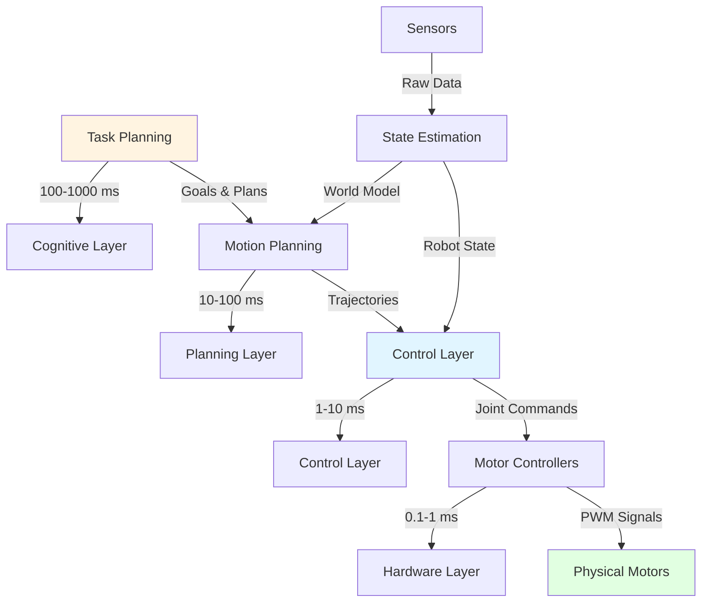
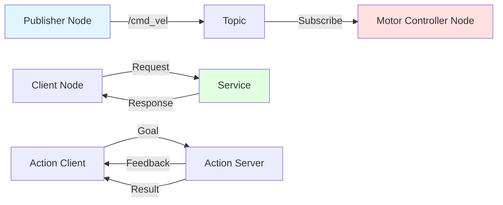
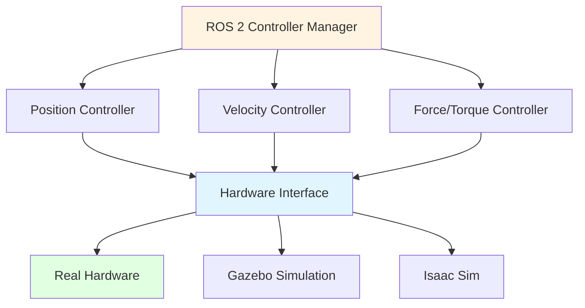
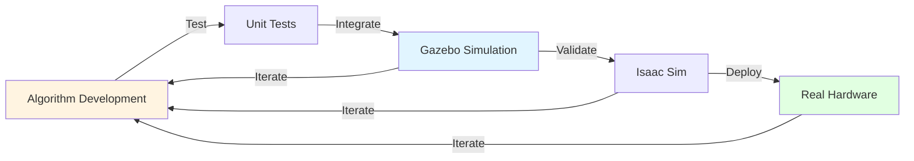
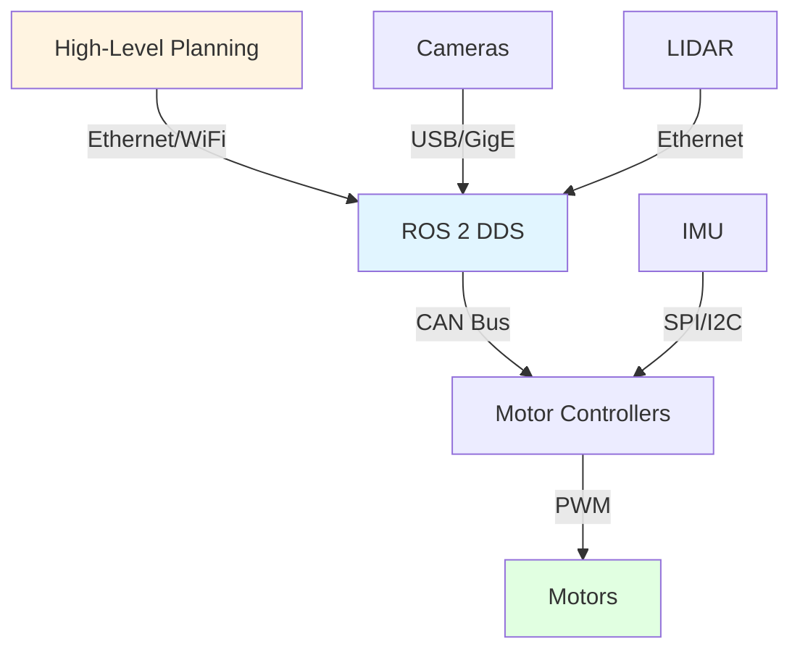

# Digital-to-Physical Transition

## 🌉 Bridging the Digital-Physical Gap

The transition from digital AI (software) to physical robots (hardware) requires multiple layers of abstraction, middleware, and control systems. This module explores how high-level AI decisions become low-level motor commands.

## 🏗️ The Control Hierarchy

Physical AI systems operate at multiple levels of abstraction, from milliseconds (motor control) to seconds (task planning):



### Layer Breakdown

**1. Task Planning Layer (Cognitive)** — 100-1000 ms
- High-level decision making: "Pick up the cup"
- Uses: LLMs, classical planning, reinforcement learning
- Output: Sequence of subtasks and goals

**2. Motion Planning Layer** — 10-100 ms
- Path planning: Navigate from A to B avoiding obstacles
- Trajectory generation: Smooth paths for arms/legs
- Uses: RRT, PRM, optimization-based planners
- Output: Waypoints and trajectories

**3. Control Layer** — 1-10 ms
- Track planned trajectories with feedback control
- Handle disturbances and errors
- Uses: PID, MPC, impedance control
- Output: Joint position/velocity/torque commands

**4. Hardware Layer** — 0.1-1 ms
- Low-level motor drivers
- PWM generation for motors
- Emergency stops and safety interlocks
- Output: Electrical signals to motors

## 🤖 ROS 2: The Bridge Between Layers

**ROS 2 (Robot Operating System 2)** is the industry-standard middleware that enables communication between different layers and components.

### Core Concepts



**Topics** (Publish-Subscribe)
- One-to-many communication
- Used for continuous data streams (sensor readings, commands)
- Anonymous: publishers don't know subscribers

**Services** (Request-Response)
- One-to-one synchronous communication
- Used for occasional operations (get parameter, trigger calibration)
- Blocking until response received

**Actions** (Goal-Feedback-Result)
- Long-running tasks with progress updates
- Can be preempted (cancelled)
- Used for navigation, manipulation tasks

### Example: ROS 2 Node for Joint Control

```python
import rclpy
from rclpy.node import Node
from sensor_msgs.msg import JointState
from trajectory_msgs.msg import JointTrajectory

class JointController(Node):
    def __init__(self):
        super().__init__('joint_controller')

        # Subscribe to desired trajectory
        self.trajectory_sub = self.create_subscription(
            JointTrajectory,
            '/joint_trajectory',
            self.trajectory_callback,
            10
        )

        # Publish current joint states
        self.state_pub = self.create_publisher(
            JointState,
            '/joint_states',
            10
        )

        # Timer for control loop (100 Hz)
        self.timer = self.create_timer(0.01, self.control_loop)

        self.current_position = [0.0] * 6  # 6 joints

    def trajectory_callback(self, msg: JointTrajectory):
        """Receive new trajectory to follow"""
        self.desired_trajectory = msg
        self.get_logger().info(f'Received trajectory with {len(msg.points)} points')

    def control_loop(self):
        """Main control loop - runs at 100 Hz"""
        # PID control logic here
        # Read encoders, compute error, send motor commands

        # Publish current state
        state_msg = JointState()
        state_msg.header.stamp = self.get_clock().now().to_msg()
        state_msg.name = ['joint1', 'joint2', 'joint3', 'joint4', 'joint5', 'joint6']
        state_msg.position = self.current_position
        self.state_pub.publish(state_msg)

def main(args=None):
    rclpy.init(args=args)
    controller = JointController()
    rclpy.spin(controller)
    controller.destroy_node()
    rclpy.shutdown()

if __name__ == '__main__':
    main()
```

## 🎮 Hardware Abstraction Layer

The **Hardware Abstraction Layer (HAL)** provides a consistent interface to different hardware platforms.

### ros2_control Framework



**Benefits:**
- Same controller code works in simulation and on real robot
- Easy to switch between hardware platforms
- Plugin architecture for custom hardware

### Example: Hardware Interface Configuration

```yaml
controller_manager:
  ros__parameters:
    update_rate: 100  # Hz

    joint_state_broadcaster:
      type: joint_state_broadcaster/JointStateBroadcaster

    position_controller:
      type: position_controllers/JointGroupPositionController

position_controller:
  ros__parameters:
    joints:
      - shoulder_pan_joint
      - shoulder_lift_joint
      - elbow_joint
      - wrist_1_joint
      - wrist_2_joint
      - wrist_3_joint

    interface_name: position
```

## 🔄 Simulation-to-Deployment Pipeline

The typical development workflow progresses through multiple stages:



### Stage 1: Algorithm Development
- Pure Python/C++ code
- Unit tests with mocked interfaces
- Fast iteration (seconds)
- No physics simulation

### Stage 2: Gazebo Simulation
- Physics-based simulation
- Basic sensors (LIDAR, cameras)
- ROS 2 integration
- Moderate speed (0.1-1x real-time)

```bash
# Launch Gazebo with robot
ros2 launch my_robot gazebo.launch.py

# Run your controller
ros2 run my_robot controller_node
```

### Stage 3: Isaac Sim
- High-fidelity physics
- Photorealistic rendering
- Synthetic data generation
- GPU-accelerated (can run >1x real-time)

```python
from omni.isaac.kit import SimulationApp
simulation_app = SimulationApp({"headless": False})

from omni.isaac.core import World
from omni.isaac.core.robots import Robot

world = World()
robot = world.scene.add(Robot(prim_path="/World/Humanoid", name="humanoid"))

world.reset()
for i in range(1000):
    world.step(render=True)
```

### Stage 4: Real Hardware
- Deploy to physical robot
- Monitor performance
- Collect real-world data
- Update simulation models

## 📡 Sensor-Motor Latency

Understanding and managing latency is critical in Physical AI:

| Component | Typical Latency |
|-----------|----------------|
| Camera capture | 16-33 ms (30-60 FPS) |
| Vision processing | 10-50 ms |
| Network transmission | 1-10 ms |
| Planning computation | 10-100 ms |
| Control computation | 1-5 ms |
| Motor response | 1-10 ms |
| **Total: Perception → Action** | **40-200 ms** |

### Latency Mitigation Strategies

1. **Predictive Control**: Anticipate future states
2. **Multi-rate Systems**: Fast control loops, slower planning
3. **Edge Computing**: Process data close to sensors
4. **Hardware Acceleration**: GPU/TPU for vision, FPGA for control
5. **Optimize Algorithms**: Reduce computational complexity

## 🔌 Communication Protocols

Different layers use different protocols based on requirements:



**DDS (Data Distribution Service)**
- Middleware for ROS 2
- Real-time publish-subscribe
- Quality-of-Service (QoS) policies

**CAN Bus (Controller Area Network)**
- Real-time communication for actuators
- Used in automotive and robotics
- Deterministic latency

**EtherCAT**
- Industrial Ethernet for high-speed control
- Microsecond synchronization
- Used in high-performance robots

## 🧪 Example: End-to-End Pipeline

Let's trace how "pick up the cup" becomes motor commands:

1. **Task Planning (LLM)**: "pick_up(cup)" → sequence of primitives
2. **Perception**: Vision model detects cup at position (x, y, z)
3. **Motion Planning**: Plan arm trajectory to reach position
4. **Inverse Kinematics**: Convert Cartesian path to joint angles
5. **Trajectory Generation**: Create smooth joint angle profiles
6. **Control Loop**: Track trajectory with PID controllers
7. **Motor Drivers**: Send PWM signals to motors
8. **Actuators**: Physical motors move robot arm

```python
# Pseudo-code for the pipeline
async def pick_up_cup():
    # 1. Perceive
    cup_position = await vision_system.detect_object("cup")

    # 2. Plan motion
    trajectory = motion_planner.plan_reach(cup_position)

    # 3. Execute with control
    await arm_controller.execute_trajectory(trajectory)

    # 4. Grasp
    await gripper.close(force=10.0)  # Newtons

    # 5. Lift
    lift_trajectory = motion_planner.plan_lift(height=0.1)
    await arm_controller.execute_trajectory(lift_trajectory)
```

## 🎯 Self-Assessment Questions

1. Explain the four layers of the control hierarchy and their typical update rates.
2. What are the differences between ROS 2 topics, services, and actions? When would you use each?
3. Why is a Hardware Abstraction Layer important for robot development?
4. Describe the typical simulation-to-deployment pipeline and the purpose of each stage.
5. What are three strategies for mitigating sensor-motor latency in real-time control?

## 📚 Additional Resources

- [ROS 2 Documentation](https://docs.ros.org/en/humble/)
- [ros2_control Framework](https://control.ros.org/master/index.html)
- [NVIDIA Isaac Sim](https://developer.nvidia.com/isaac-sim)
- [Gazebo Tutorials](https://classic.gazebosim.org/tutorials)

---

**Previous**: [← Foundations of Physical AI](./foundations) | **Next**: [Humanoid Robotics Landscape →](./humanoid-landscape)
