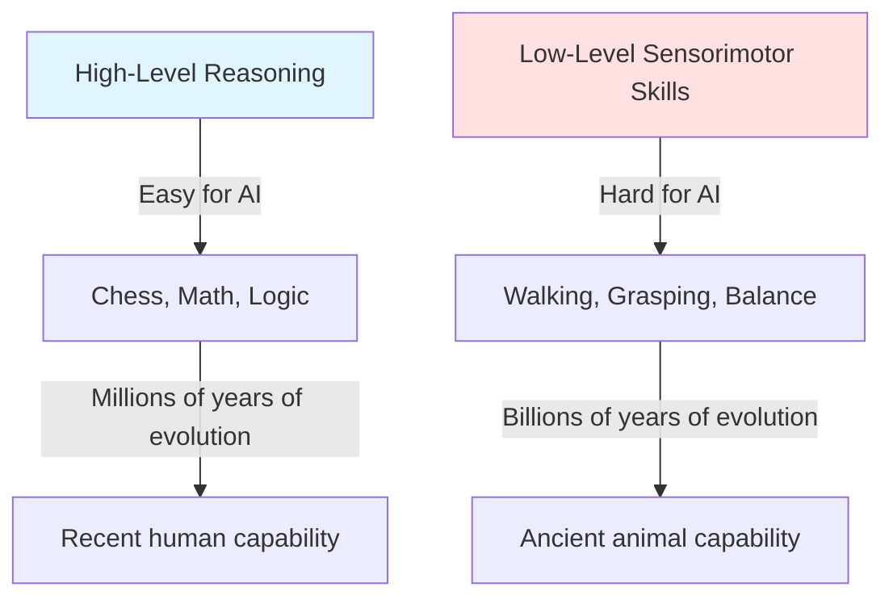
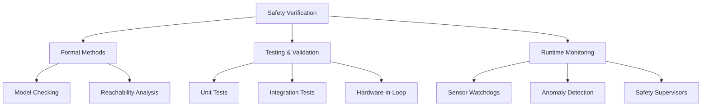

# Foundations of Physical AI

## 🎯 Understanding Embodied Intelligence

**Embodied intelligence** is the theory that intelligence arises from the interaction between an agent's body, brain, and environment. Unlike traditional AI that processes abstract symbols, embodied AI:

- **Grounds knowledge in physical experience**: Learning happens through sensorimotor interaction
- **Uses the body as a computational resource**: Physical morphology simplifies control problems
- **Exploits environmental structure**: The world serves as its own best model
- **Develops through interaction**: Intelligence emerges from doing, not just thinking

### The Moravec Paradox

A key insight in Physical AI is the **Moravec Paradox**: tasks humans find difficult (chess, calculus) are easy for computers, while tasks humans find easy (walking, grasping) are extremely hard for robots.



**Why?** Evolution spent billions of years optimizing sensorimotor skills but only millions on abstract reasoning. Our brains have massive, ancient infrastructure for physical interaction.

## ⚙️ The Sense-Think-Act Loop

Physical AI systems operate in continuous **sense-think-act loops**, fundamentally different from batch-processing digital AI:


### Key Characteristics

1. **Real-Time Constraints**: Must respond within milliseconds (vision: 30-60 Hz, control loops: 100-1000 Hz)
2. **Continuous Operation**: No clear start/end, always processing
3. **Noisy Inputs**: Sensor data is incomplete and uncertain
4. **Delayed Feedback**: Actions take time to affect the world
5. **Safety Critical**: Mistakes can cause physical harm

### Contrast with Digital AI

| Aspect | Traditional AI | Physical AI |
|--------|---------------|-------------|
| **Input** | Clean, structured data | Noisy sensor streams |
| **Processing** | Batch or request-response | Continuous real-time loops |
| **Output** | Predictions, classifications | Motor commands, physical actions |
| **Feedback** | Immediate (digital) | Delayed (physical laws) |
| **Error Cost** | Low (retry possible) | High (physical damage) |
| **Latency** | Seconds acceptable | Milliseconds critical |

## 🔬 Physics Understanding in AI

Physical AI systems must **understand and predict physical laws** to interact successfully with the world.

### Core Physics Concepts

1. **Kinematics**: Position, velocity, acceleration
2. **Dynamics**: Forces, torques, momentum
3. **Gravity**: 9.81 m/s² constant acceleration
4. **Friction**: Static and kinetic friction coefficients
5. **Collisions**: Elastic and inelastic impacts
6. **Center of Mass**: Balance and stability
7. **Inertia**: Resistance to motion changes

### Physics Simulation Engines

Modern robotics relies heavily on physics simulators for training and testing:

**PyBullet** (Open-source)
```python
import pybullet as p
import pybullet_data

# Connect to physics server
physicsClient = p.connect(p.GUI)
p.setAdditionalSearchPath(pybullet_data.getDataPath())

# Set gravity
p.setGravity(0, 0, -9.81)

# Load ground plane and robot
planeId = p.loadURDF("plane.urdf")
robotId = p.loadURDF("humanoid.urdf", [0, 0, 1])

# Simulate
for i in range(10000):
    p.stepSimulation()
```

**MuJoCo** (High-performance)
- Used by DeepMind for humanoid control research
- Accurate contact dynamics
- Extremely fast (>1000x real-time possible)

**Isaac Sim** (NVIDIA)
- Photorealistic rendering for vision
- GPU-accelerated physics
- ROS 2 integration
- Synthetic data generation

### Sim-to-Real Transfer

The **sim-to-real gap** is a major challenge: policies trained in simulation often fail on real robots due to:

- **Modeling errors**: Simulators approximate reality
- **Unmodeled dynamics**: Friction, backlash, flex
- **Sensor noise**: Real sensors are noisier than simulated
- **Latency**: Real systems have communication delays

**Solutions:**
- **Domain randomization**: Train with varied physics parameters
- **System identification**: Measure real robot parameters
- **Reality gap compensation**: Learn correction policies
- **Sim-to-real-to-sim**: Use real data to improve simulation

## 🧠 Embodied Cognition Theory

Embodied cognition argues that cognitive processes are deeply rooted in the body's interactions with the world.

### Key Principles

1. **Cognition is situated**: Thinking happens in real-world contexts, not abstract symbol spaces
2. **Cognition is time-pressured**: Real-time constraints shape cognitive strategies
3. **Cognition offloads work onto the environment**: Use the world as external memory
4. **The environment is part of the cognitive system**: Brain-body-world forms one system
5. **Cognition is for action**: Thinking evolved to guide movement

### Implications for Robot Design

- **Morphological computation**: Body design can simplify control (passive walkers, compliant grippers)
- **Action-oriented perception**: See only what's needed for current task
- **Sensorimotor contingencies**: Learn relationships between actions and sensory changes
- **Embodied memory**: Use body state (e.g., hand position) to remember information

## 🛡️ Safety and Robustness

Physical AI operates in the real world where mistakes have consequences. Safety is paramount.

### Safety Requirements

1. **Collision avoidance**: Never hit humans, walls, or self
2. **Force limiting**: Cap motor torques to prevent damage
3. **Emergency stops**: Immediate shutdown on critical failures
4. **Redundancy**: Backup systems for critical functions
5. **Graceful degradation**: Continue safe operation when components fail

### Verification Approaches



### Example: Emergency Stop System

```python
class SafetyMonitor:
    def __init__(self, robot):
        self.robot = robot
        self.max_joint_velocity = 3.0  # rad/s
        self.max_joint_torque = 50.0    # Nm
        self.collision_threshold = 10.0  # N

    async def monitor(self):
        while True:
            # Check joint limits
            for joint in self.robot.joints:
                if abs(joint.velocity) > self.max_joint_velocity:
                    await self.emergency_stop("Joint velocity exceeded")
                if abs(joint.torque) > self.max_joint_torque:
                    await self.emergency_stop("Joint torque exceeded")

            # Check for collisions
            if self.robot.external_force > self.collision_threshold:
                await self.emergency_stop("Collision detected")

            await asyncio.sleep(0.001)  # 1 kHz monitoring

    async def emergency_stop(self, reason: str):
        logger.critical(f"EMERGENCY STOP: {reason}")
        await self.robot.disable_all_motors()
        await self.robot.apply_brakes()
```

## 🎯 Self-Assessment Questions

1. Explain the Moravec Paradox and its implications for humanoid robotics.
2. What are the key differences between the sense-think-act loop in Physical AI versus request-response in traditional web services?
3. Why is the sim-to-real gap a problem, and what techniques help address it?
4. How does embodied cognition theory differ from traditional symbolic AI approaches?
5. What are three critical safety mechanisms every humanoid robot should have?

## 📚 Additional Resources

- [Embodied AI Workshop Papers](https://embodied-ai.org/)
- [PyBullet Quickstart Guide](https://docs.google.com/document/d/10sXEhzFRSnvFcl3XxNGhnD4N2SedqwdAvK3dsihxVUA/)
- [MuJoCo Documentation](https://mujoco.readthedocs.io/)
- [Safety in Human-Robot Interaction (ISO 13482)](https://www.iso.org/standard/53820.html)

---

**Previous**: [← Introduction to Physical AI](./index.mdx) | **Next**: [Digital-to-Physical Transition →](./digital-to-physical.mdx)
