# Humanoid Robotics Landscape

## 🌍 The Humanoid Robotics Revolution

We are entering a new era of humanoid robotics. Major technology companies and startups are investing billions in developing general-purpose humanoid robots. This module surveys the current landscape of humanoid platforms.

## 🤖 Leading Humanoid Platforms

### Boston Dynamics Atlas

**Organization**: Boston Dynamics (Hyundai)
**Status**: Research platform
**First Release**: 2013


**Key Capabilities:**
- Advanced parkour and gymnastics (backflips, running jumps)
- Hydraulic actuation for high power-to-weight ratio
- Whole-body motion planning
- Robust balance recovery

**Notable Achievements:**
- First humanoid to perform a backflip (2017)
- Parkour demonstrations with box jumps and bar grabs
- Pick-and-place manipulation in construction scenarios

**Limitations:**
- Primarily a research platform (not commercially available)
- Hydraulic system requires complex infrastructure
- High cost (estimated $1M+)

### Tesla Optimus (Tesla Bot)

**Organization**: Tesla
**Status**: Active development, limited production
**Announced**: 2021, Gen-2 released 2023

**Key Specifications (Gen-2):**
- Height: 173 cm (5'8")
- Weight: 73 kg (160 lbs)
- Walking speed: 2 m/s (5 mph)
- DoF: 28 (11 per arm, 6 per leg)
- Payload: 20 kg (45 lbs)

**Design Philosophy:**
- Leverage Tesla's manufacturing scale and AI infrastructure
- Electric actuation with custom actuators
- Vision-based perception (no LIDAR)
- Target price: &lt;$20,000 at scale

**Current Capabilities:**
- Object manipulation and sorting
- Walking on uneven terrain
- Following human demonstration
- Integration with Tesla's AI stack (training on driving data)

**Target Applications:**
- Factory automation
- Household assistance
- Repetitive/dangerous tasks

### Figure AI - Figure 01 & Figure 02

**Organization**: Figure AI
**Status**: Commercial development
**Released**: Figure 01 (2023), Figure 02 (2024)

**Specifications (Figure 02):**
- Height: 170 cm
- Weight: 70 kg
- Battery life: 5 hours
- Payload: 25 kg
- DoF: 16

**Key Innovations:**
- Partnership with OpenAI for multimodal AI integration
- Natural language understanding for task specification
- Vision-language-action (VLA) models
- Pilot deployments in BMW factory

**Example Interaction:**
```
Human: "Can you give me something to eat?"
Figure 02: [Identifies apple on table, picks it up, hands it to human]
           "Here you go!"
```

### Agility Robotics - Digit

**Organization**: Agility Robotics
**Status**: Commercial product
**Specialization**: Logistics and warehouse automation

**Key Features:**
- Bipedal but not fully humanoid (no head, specialized torso)
- Optimized for package handling
- 4 hour battery life
- 35 lb (16 kg) payload
- Deployed at Amazon fulfillment centers

**Unique Design:**
- Bird-like legs for efficient walking
- Retractable arms for safe navigation
- Modular battery packs

### 1X Technologies (formerly Halodi) - NEO

**Organization**: 1X Technologies (backed by OpenAI)
**Status**: Active development

**Specifications:**
- Height: 165 cm
- Weight: 30 kg (remarkably lightweight)
- Running speed: Up to 4 m/s (15 km/h)
- Battery: 2-4 hours

**Design Focus:**
- Safe human interaction (soft materials, lightweight)
- Wheeled base for efficient locomotion
- Biomimetic design
- Home assistance applications

### Unitree H1 & G1

**Organization**: Unitree Robotics (China)
**Status**: Available for purchase

**H1 Specifications:**
- Height: 180 cm
- Weight: 47 kg
- Top speed: 3.3 m/s (walking)
- DoF: 25+
- Price: ~$90,000

**G1 Specifications (2024):**
- Height: 127 cm
- Weight: 35 kg
- DoF: 23 (43 with hands)
- Price: $16,000 (base) - $90,000 (full)

**Notable:**
- Most affordable full humanoid robot
- Open SDK for researchers
- Impressive agility demonstrations

### Sanctuary AI - Phoenix

**Organization**: Sanctuary AI (Canada)
**Status**: 7th generation in development

**Key Innovation:**
- **Carbon AI Control System**: Unified AI platform combining vision, language, and control
- Focus on general-purpose manipulation
- Pilot programs in retail (picking items)

**Approach:**
- "Human-like intelligence for robots"
- Emphasizes cognitive capabilities over just mechanics
- Cloud-connected AI brain

## 📊 Comparative Analysis

| Platform | Height | Weight | DoF | Battery | Speed | Focus Area |
|----------|--------|--------|-----|---------|-------|------------|
| **Atlas** | 150cm | 89kg | 28 | 1h | 2.5 m/s | Research/Agility |
| **Optimus Gen-2** | 173cm | 73kg | 28 | 2h | 2 m/s | General Purpose |
| **Figure 02** | 170cm | 70kg | 16 | 5h | 1.2 m/s | Industrial |
| **Digit** | 175cm | 65kg | 20 | 4h | 1.5 m/s | Logistics |
| **NEO** | 165cm | 30kg | 20+ | 2-4h | 4 m/s | Home Assistance |
| **Unitree H1** | 180cm | 47kg | 25+ | 1h | 3.3 m/s | Research/Platform |
| **Phoenix** | 170cm | 70kg | 20+ | Unknown | 1 m/s | Manipulation |

## 🏭 Industry Landscape

### Major Players by Category

**Tech Giants:**
- Tesla (Optimus)
- Google DeepMind (research, no product yet)
- Amazon (funding Agility Robotics)
- Microsoft (partnerships, cloud infrastructure)

**Pure-Play Humanoid Robotics:**
- Figure AI ($700M raised, $2.6B valuation)
- 1X Technologies ($100M from OpenAI Startup Fund)
- Agility Robotics ($150M Series B)
- Sanctuary AI ($140M raised)

**Traditional Robotics:**
- Boston Dynamics (Atlas)
- Hanson Robotics (Sophia - social robot)
- PAL Robotics (TALOS, Reem)

**Chinese Companies:**
- Unitree Robotics (H1, G1)
- Fourier Intelligence (GR-1)
- UBTECH Robotics (Walker X)

## 🎯 Design Considerations

### Degrees of Freedom (DoF) Trade-offs

```mermaid
graph TD
    A[DoF Count] --> B{More DoF}
    A --> C{Fewer DoF}

    B --> D[✅ Greater dexterity]
    B --> E[✅ More human-like motion]
    B --> F[❌ Higher cost]
    B --> G[❌ More complex control]
    B --> H[❌ More failure points]

    C --> I[✅ Lower cost]
    C --> J[✅ Simpler control]
    C --> K[✅ More reliable]
    C --> L[❌ Limited motion range]

    style B fill:#e1ffe1
    style C fill:#ffe1e1
```



**Minimum DoF for Humanoid:**
- Legs: 6 per leg (12 total) for walking
- Arms: 6 per arm (12 total) for manipulation
- Torso: 1-3 for bending/twisting
- Head: 2-3 for looking around
- **Total Minimum: 27-30 DoF**

**Hands are Critical:**
- Simple gripper: 1 DoF
- Three-finger hand: 9-12 DoF
- Five-finger dexterous hand: 15-20 DoF
- Human hand: 27 DoF (23 actuated)

### Actuation Technology

**Electric Motors** (most common)
- ✅ Precise control, quiet, efficient
- ✅ Easy maintenance
- ❌ Lower power-to-weight ratio
- Examples: Optimus, Figure, Unitree

**Hydraulic** (high performance)
- ✅ Very high power-to-weight ratio
- ✅ Fast, explosive movements
- ❌ Loud, requires pumps and fluid
- ❌ Messy (oil leaks)
- Examples: Atlas

**Pneumatic** (soft robotics)
- ✅ Inherently compliant and safe
- ✅ Lightweight
- ❌ Difficult to control precisely
- ❌ Requires air compressor
- Examples: Research prototypes

**Series Elastic Actuators (SEA)**
- ✅ Force control capability
- ✅ Shock absorption
- ❌ More complex, adds weight
- Examples: Atlas (hybrid)

### Power and Battery Life

**Current State:**
- Most humanoids: 1-5 hour battery life
- Trade-off: battery weight vs. runtime
- Typical power consumption: 200-500W walking, 100-200W idle

**Future Trends:**
- Improved battery energy density (solid-state batteries)
- Dynamic charging (swap batteries without full shutdown)
- Wireless/inductive charging
- Energy-efficient actuators and electronics

## 🚀 Application Domains

### Manufacturing and Warehousing
- **Current**: Digit at Amazon, Figure at BMW
- **Tasks**: Package handling, part assembly, quality inspection
- **Advantage**: Adapt to human-designed workspaces

### Healthcare
- **Potential**: Patient mobility assistance, supply delivery
- **Challenges**: Safety certification, human interaction
- **Timeline**: 5-10 years to widespread deployment

### Domestic Service
- **Vision**: Cooking, cleaning, eldercare
- **Challenges**: Unstructured environments, safety, cost
- **Timeline**: 10+ years to affordable home robots

### Hazardous Environments
- **Applications**: Disaster response, nuclear inspection, mining
- **Advantage**: Traverse human-designed spaces (stairs, ladders)
- **Current**: Limited deployments, mostly teleoperation

## 📈 Market Projections

According to Goldman Sachs (2023):
- Humanoid robotics market could reach **$38 billion by 2035**
- Potential to fill **4% of manufacturing labor gaps by 2030**
- Total addressable market: **$154 billion** (if cost falls to $20-25k)

**Key Factors:**
1. Manufacturing cost reduction (economies of scale)
2. AI capability improvements (foundation models)
3. Battery technology advancement
4. Regulatory frameworks for human-robot interaction

## 🎯 Self-Assessment Questions

1. Compare and contrast the design philosophies of Tesla Optimus and Boston Dynamics Atlas.
2. Why are most companies choosing electric actuation over hydraulic for humanoid robots?
3. What is the minimum number of DoF needed for a functional humanoid robot, and why?
4. What are the three main application domains for humanoid robots in the next 5 years?
5. Explain the trade-offs between having more degrees of freedom versus fewer in a humanoid robot.

## 📚 Additional Resources

- [Boston Dynamics Atlas](https://bostondynamics.com/atlas/)
- [Tesla Optimus Updates](https://www.tesla.com/ai)
- [Figure AI](https://www.figure.ai/)
- [Agility Robotics](https://agilityrobotics.com/)
- [Humanoid Robot Market Analysis](https://www.goldmansachs.com/insights/articles/humanoid-robots)

---

**Previous**: [← Digital-to-Physical Transition](./digital-to-physical) | **Next**: [Sensor Systems →](./sensor-systems)
