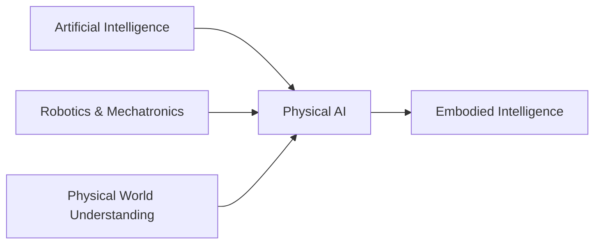
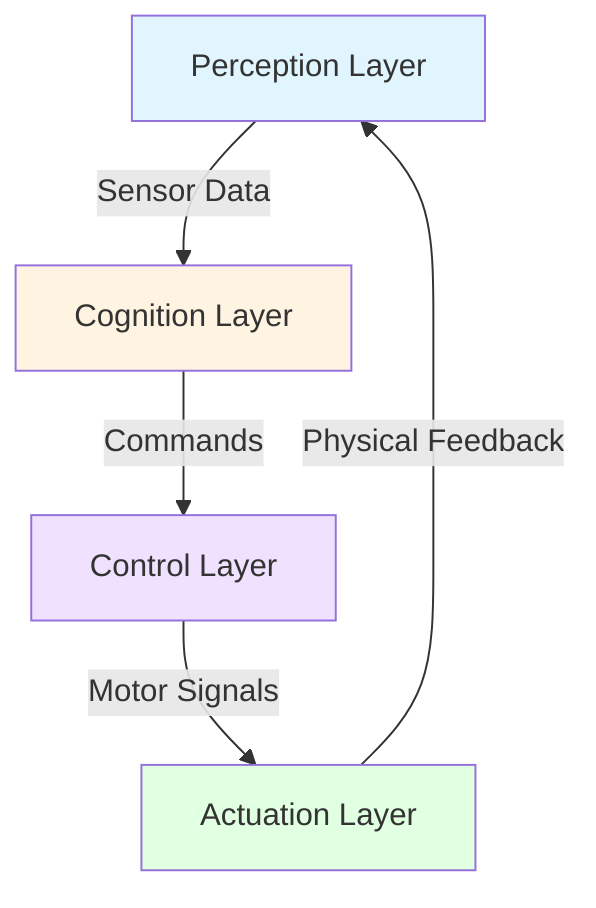

# Week 1-2: Introduction to Physical AI

## 📚 Learning Outcomes

By the end of this module, you will be able to:

- Define Physical AI and explain how it differs from traditional AI systems
- Understand the concept of embodied intelligence and its importance
- Identify key components of humanoid robot systems
- Recognize the role of sensors and actuators in Physical AI
- Understand the digital-to-physical continuum in robotics

## 🎯 Module Overview

The future of AI extends beyond digital spaces into the physical world. This introductory module covers **Physical AI**—AI systems that function in reality, comprehend physical laws, and interact with the physical environment through robotic bodies.

Traditional AI operates in digital environments: chatbots, recommendation systems, and image classifiers process information but don't physically interact with the world. Physical AI bridges this gap by combining artificial intelligence with robotic systems that can see, hear, move, and manipulate objects in real-world environments.

## 🤖 What is Physical AI?

Physical AI represents the convergence of three critical domains:

### Key Characteristics

1. **Physical Embodiment**: The AI has a physical form (robot body)
2. **Real-time Interaction**: Responds to the physical environment in real-time
3. **Sensor Integration**: Uses cameras, LIDAR, IMUs, and other sensors to perceive the world
4. **Actuation**: Can manipulate objects and navigate through space
5. **Physics Understanding**: Comprehends gravity, friction, collisions, and other physical laws

### Why Humanoid Form Factor?

Humanoid robots are particularly promising because:

- **Human-Centered World**: Our infrastructure (stairs, doors, tools) is designed for human proportions
- **Intuitive Interaction**: People naturally understand humanoid movements and gestures
- **Training Data**: Vast amounts of human movement data exist for training AI models
- **Versatility**: A humanoid form can adapt to many different tasks

## 🌐 The Digital-to-Physical Continuum

Understanding Physical AI requires recognizing the progression from purely digital to fully physical systems:

| Level | Type | Examples | Physical Interaction |
|-------|------|----------|---------------------|
| 1 | Pure Digital AI | ChatGPT, Image Classifiers | None |
| 2 | AI with Digital Actuators | Recommendation Systems, Trading Bots | Indirect (through digital actions) |
| 3 | AI with Sensors | Autonomous Vehicles (perception only) | Input only |
| 4 | **Physical AI** | **Humanoid Robots, Drones** | **Full bidirectional** |

**Physical AI** sits at Level 4, where the AI system both perceives and acts upon the physical world.

## 🏗️ Architecture of a Physical AI System

A complete Physical AI system consists of four interconnected layers:

### 1. Perception Layer (The Senses)

Sensors that allow the robot to understand its environment:

- **Vision**: RGB cameras, depth cameras (RealSense)
- **Range Finding**: LIDAR, ultrasonic sensors
- **Inertial**: IMUs (Inertial Measurement Units) for balance
- **Tactile**: Force/torque sensors in hands and feet
- **Auditory**: Microphone arrays for voice commands

### 2. Cognition Layer (The Brain)

AI models that process sensor data and make decisions:

- **Perception Models**: Object detection, scene understanding, SLAM
- **Planning Algorithms**: Path planning, task planning, motion planning
- **Learning Systems**: Reinforcement learning, imitation learning
- **Language Models**: For natural language understanding and generation

### 3. Control Layer (The Nervous System)

Middleware that translates high-level commands into low-level motor control:

- **ROS 2** (Robot Operating System): The primary middleware we'll use
- Real-time control loops
- Sensor fusion
- Safety systems

### 4. Actuation Layer (The Muscles)

Physical motors and actuators that move the robot:

- **Electric Motors**: DC motors, servo motors, stepper motors
- **Actuators**: Linear actuators, pneumatic systems
- **End Effectors**: Grippers, hands with multiple degrees of freedom

## 🔬 Key Technologies in This Course

Throughout this quarter, you'll work with industry-standard tools:

### ROS 2 (Robot Operating System 2)
- Open-source middleware for robot control
- Node-based architecture for distributed systems
- Standard in academic and industrial robotics

### Gazebo & Unity
- **Gazebo**: Physics simulation for testing robot behavior
- **Unity**: High-fidelity visualization and human-robot interaction simulation

### NVIDIA Isaac Platform
- **Isaac Sim**: Photorealistic simulation with synthetic data generation
- **Isaac ROS**: Hardware-accelerated perception and navigation
- **Nav2**: Path planning for autonomous navigation

### Vision-Language-Action (VLA)
- Integration of Large Language Models with robotic control
- Voice-to-action using OpenAI Whisper
- Natural language task planning

## 🚀 Real-World Applications

Physical AI and humanoid robotics are transforming multiple industries:

### Manufacturing & Logistics
- Assembly line automation
- Warehouse picking and packing
- Quality inspection

### Healthcare
- Surgical assistants
- Patient care and mobility assistance
- Rehabilitation therapy

### Service Industries
- Hotel concierge robots
- Restaurant servers
- Retail assistance

### Research & Exploration
- Space exploration (NASA's Valkyrie)
- Disaster response and search-and-rescue
- Hazardous environment inspection

## 💡 The Future: Partnership Between Humans and Robots

The vision for Physical AI isn't to replace humans but to create a **partnership** between:
- **People**: Providing creativity, judgment, and emotional intelligence
- **Intelligent Agents**: Offering data processing and decision support
- **Robots**: Delivering physical capabilities and tireless execution

This partnership will lead to:
- New job categories focused on human-robot collaboration
- Enhanced human capabilities through robotic augmentation
- Increased productivity in physical labor tasks
- Improved safety by removing humans from dangerous work

## 📖 What's Next?

In the following sections, we'll dive deeper into:

1. **Foundations of Physical AI**: Core principles and physics understanding
2. **Digital-to-Physical Transition**: How AI models control real hardware
3. **Humanoid Robotics Landscape**: Survey of existing humanoid robots
4. **Sensor Systems**: Understanding the robot's senses

## 🎯 Self-Assessment Questions

1. What distinguishes Physical AI from traditional digital AI systems?
2. Why are humanoid robots particularly well-suited for our human-centered world?
3. Name and describe the four layers of a Physical AI system architecture.
4. What role does ROS 2 play in the Physical AI ecosystem?
5. Give three real-world applications where humanoid robots could provide significant value.

## 📚 Additional Resources

- [NVIDIA Isaac Platform Documentation](https://developer.nvidia.com/isaac)
- [ROS 2 Official Documentation](https://docs.ros.org/en/humble/)
- [Physical AI Research Papers](https://arxiv.org/list/cs.RO/recent)

---

**Next**: [Foundations of Physical AI](./foundations.mdx) →
