# Sensor Systems for Humanoid Robots

## 👁️ The Robot's Senses

Just as humans rely on sight, touch, hearing, and balance to navigate the world, humanoid robots require sophisticated sensor systems to perceive their environment. This module explores the key sensor modalities used in Physical AI systems.

## 📷 Vision Systems

### RGB Cameras

**Purpose**: Color imaging for object recognition, scene understanding, and human interaction


**Key Specifications:**
- **Resolution**: 1920x1080 (1080p) to 3840x2160 (4K)
- **Frame Rate**: 30-60 FPS (some up to 120 FPS)
- **Field of View (FoV)**: 60-120 degrees
- **Interface**: USB 3.0, GigE, MIPI CSI-2

**Common Cameras in Robotics:**
- **Logitech C920/C930**: Affordable USB webcams ($50-100)
- **Intel RealSense D435i**: Depth + RGB ($200)
- **Luxonis OAK-D**: On-board AI processing ($200-400)
- **FLIR Blackfly**: Industrial-grade GigE camera ($500-2000)

**Challenges:**
- Lighting variations (shadows, glare, low light)
- Motion blur from robot/environment movement
- Limited depth information (monocular)

### Depth Cameras

**Purpose**: 3D perception for obstacle avoidance, grasping, and navigation

**Technologies:**

**1. Stereo Vision** (like human eyes)
```python
# Stereo depth estimation concept
left_image = camera_left.capture()
right_image = camera_right.capture()

disparity_map = stereo_matcher.compute(left_image, right_image)
depth_map = (focal_length * baseline) / disparity_map

# Disparity is inversely proportional to depth
# Objects closer have larger disparity
```

**2. Structured Light** (Intel RealSense)
- Projects IR pattern onto scene
- Measures pattern distortion
- Accurate at 0.3-3 meters
- Struggles outdoors (sunlight interference)

**3. Time-of-Flight (ToF)**
- Measures time for light to bounce back
- Fast depth acquisition (30-60 FPS)
- Lower resolution than stereo
- Examples: Azure Kinect, PMD sensors

**Comparison:**

| Technology | Range | Outdoor | Resolution | Cost |
|------------|-------|---------|------------|------|
| **Stereo** | 1-50m | ✅ Yes | High | Low |
| **Structured Light** | 0.3-3m | ❌ No | Medium | Medium |
| **ToF** | 0.5-5m | 🟡 Limited | Low | High |

### Example: Using RealSense in ROS 2

```python
import rclpy
from rclpy.node import Node
from sensor_msgs.msg import Image, PointCloud2
from cv_bridge import CvBridge
import cv2
import numpy as np

class DepthProcessor(Node):
    def __init__(self):
        super().__init__('depth_processor')

        # Subscribe to depth and color images
        self.depth_sub = self.create_subscription(
            Image,
            '/camera/depth/image_raw',
            self.depth_callback,
            10
        )
        self.color_sub = self.create_subscription(
            Image,
            '/camera/color/image_raw',
            self.color_callback,
            10
        )

        self.bridge = CvBridge()
        self.depth_image = None
        self.color_image = None

    def depth_callback(self, msg: Image):
        # Convert ROS Image to OpenCV format
        self.depth_image = self.bridge.imgmsg_to_cv2(msg, desired_encoding='16UC1')

        # Depth is in millimeters, convert to meters
        depth_meters = self.depth_image.astype(np.float32) / 1000.0

        # Find closest obstacle
        min_distance = np.min(depth_meters[depth_meters > 0])
        self.get_logger().info(f'Closest obstacle: {min_distance:.2f}m')

    def color_callback(self, msg: Image):
        self.color_image = self.bridge.imgmsg_to_cv2(msg, desired_encoding='bgr8')

        # Display image with OpenCV
        cv2.imshow('Robot View', self.color_image)
        cv2.waitKey(1)
```

## 📡 LIDAR (Light Detection and Ranging)

**Purpose**: Precise distance measurements for mapping, localization, and obstacle detection

### How LIDAR Works

```mermaid
sequenceDiagram
    participant L as LIDAR
    participant E as Environment

    L->>E: Emit laser pulse
    Note over E: Laser reflects off surface
    E->>L: Reflected light returns
    Note over L: Measure time-of-flight
    Note over L: Distance = (speed_of_light × time) / 2
```



**Key Principles:**
- Emit laser pulse (typically 905nm infrared)
- Measure time for reflection to return
- Calculate distance: `distance = (c × t) / 2`
- Rotate to scan 360° (or use solid-state)

### Types of LIDAR

**2D LIDAR** (Planar scanning)
- Scans in a single horizontal plane
- Range: 5-100 meters
- Update rate: 10-40 Hz
- Use: Floor-level obstacle detection
- Examples:
  - **Hokuyo UST-10LX**: $1,500, 10m range, 40 Hz
  - **SICK TiM**: $1,000-2,000, 25m range

**3D LIDAR** (Volumetric scanning)
- Multiple scanning planes or solid-state
- Generates point clouds
- Range: 10-200 meters
- Use: Autonomous vehicles, outdoor navigation
- Examples:
  - **Velodyne VLP-16**: $4,000, 16 channels, 100m range
  - **Ouster OS1**: $3,500-13,000, 32-128 channels
  - **Livox Mid-360**: $500, 360° FoV (affordable!)

### LIDAR Data Format: Point Clouds

```python
# Point cloud structure
# Each point has: [x, y, z, intensity]

import numpy as np

# Sample point cloud (4 points)
points = np.array([
    [1.2, 0.3, 0.0, 0.8],  # x, y, z, intensity
    [1.5, -0.2, 0.0, 0.9],
    [2.0, 0.1, 0.0, 0.7],
    [0.8, 0.5, 0.0, 0.85],
])

# Filter points by distance
distances = np.linalg.norm(points[:, :3], axis=1)
close_points = points[distances < 1.5]

# Find minimum distance (obstacle detection)
min_distance = np.min(distances)
print(f"Closest obstacle: {min_distance:.2f}m")
```

### SLAM with LIDAR

**SLAM (Simultaneous Localization and Mapping)** uses LIDAR to build maps while tracking position:

```bash
# Launch SLAM Toolbox in ROS 2
ros2 launch slam_toolbox online_async_launch.py

# SLAM subscribes to /scan topic
# Publishes /map and /tf (robot pose)
```

**Output:** 2D occupancy grid map
- White: Free space
- Black: Obstacles
- Gray: Unknown

## ⚖️ Inertial Measurement Units (IMUs)

**Purpose**: Measure acceleration, angular velocity, and orientation for balance and control

### IMU Components


**1. Accelerometer**
- Measures linear acceleration in 3 axes (x, y, z)
- Includes gravity (9.81 m/s²)
- Use: Detect falls, tilt angle

**2. Gyroscope**
- Measures angular velocity (rotation rate)
- Units: degrees/second or radians/second
- Use: Track orientation changes, stabilization

**3. Magnetometer** (optional)
- Measures Earth's magnetic field
- Provides absolute heading (compass)
- Affected by metal and magnetic interference

### IMU Data Processing

```python
import rclpy
from rclpy.node import Node
from sensor_msgs.msg import Imu
import numpy as np

class ImuProcessor(Node):
    def __init__(self):
        super().__init__('imu_processor')

        self.imu_sub = self.create_subscription(
            Imu,
            '/imu/data',
            self.imu_callback,
            10
        )

        self.orientation = None
        self.angular_velocity = None
        self.linear_acceleration = None

    def imu_callback(self, msg: Imu):
        # Extract quaternion orientation
        q = msg.orientation
        self.orientation = [q.x, q.y, q.z, q.w]

        # Convert quaternion to Euler angles (roll, pitch, yaw)
        roll, pitch, yaw = self.quaternion_to_euler(self.orientation)

        # Extract angular velocity
        w = msg.angular_velocity
        self.angular_velocity = [w.x, w.y, w.z]

        # Extract linear acceleration
        a = msg.linear_acceleration
        self.linear_acceleration = [a.x, a.y, a.z]

        # Check for falling (large pitch/roll)
        if abs(roll) > 0.5 or abs(pitch) > 0.5:  # radians (~30 degrees)
            self.get_logger().warn('Robot is tilting! Taking corrective action.')

    def quaternion_to_euler(self, q):
        """Convert quaternion to Euler angles"""
        # Standard quaternion to Euler conversion
        roll = np.arctan2(2*(q[3]*q[0] + q[1]*q[2]), 1 - 2*(q[0]**2 + q[1]**2))
        pitch = np.arcsin(2*(q[3]*q[1] - q[2]*q[0]))
        yaw = np.arctan2(2*(q[3]*q[2] + q[0]*q[1]), 1 - 2*(q[1]**2 + q[2]**2))
        return roll, pitch, yaw
```

### Common IMUs in Robotics

- **MPU-6050**: 6-axis (accel + gyro), $2, I2C, hobby projects
- **BMI088**: 6-axis, automotive-grade, $10-20
- **VectorNav VN-100**: 9-axis with sensor fusion, $500-1000
- **Lord MicroStrain 3DM-GX5**: Industrial IMU/AHRS, $2000-5000

### Sensor Fusion

IMUs suffer from **drift** (gyroscope) and **noise** (accelerometer). **Sensor fusion** algorithms combine multiple sensors for accurate state estimation:

**Complementary Filter** (simple)
- Combine high-frequency gyro with low-frequency accel
- Fast, works on microcontrollers

**Extended Kalman Filter (EKF)** (common)
- Probabilistic sensor fusion
- Used in `robot_localization` ROS 2 package

**Unscented Kalman Filter (UKF)** (advanced)
- Better for non-linear systems
- More computationally expensive

```bash
# Launch sensor fusion in ROS 2
ros2 launch robot_localization ekf.launch.py

# Fuses IMU + odometry + GPS → /odometry/filtered
```

## 🤲 Force/Torque Sensors

**Purpose**: Measure contact forces for manipulation, balance, and human interaction

### Applications

**1. Foot Force Sensors** (Zero-Moment Point)
- Detect when feet touch ground
- Measure weight distribution
- Critical for balance control
- Type: Load cells or pressure mats

**2. Wrist Force/Torque Sensors**
- 6-axis force and torque measurement
- Enable compliant manipulation
- Detect contact with objects
- Examples: ATI Nano17 ($1500), Robotiq FT 300 ($8000)

**3. Tactile Sensors** (Hands)
- Distributed pressure sensing
- Detect contact location and force
- Enable gentle grasping
- Examples: BioTac ($3000), OptoForce ($2000)

### Force Control Example

```python
import rclpy
from rclpy.node import Node
from geometry_msgs.msg import WrenchStamped

class ForceControlNode(Node):
    def __init__(self):
        super().__init__('force_control')

        self.ft_sub = self.create_subscription(
            WrenchStamped,
            '/wrist_ft_sensor',
            self.ft_callback,
            10
        )

        self.max_force = 10.0  # Newtons
        self.contact_threshold = 1.0  # Newtons

    def ft_callback(self, msg: WrenchStamped):
        # Extract force components
        fx = msg.wrench.force.x
        fy = msg.wrench.force.y
        fz = msg.wrench.force.z

        # Calculate magnitude
        force_magnitude = (fx**2 + fy**2 + fz**2)**0.5

        if force_magnitude > self.contact_threshold:
            self.get_logger().info(f'Contact detected! Force: {force_magnitude:.2f}N')

        if force_magnitude > self.max_force:
            self.get_logger().warn('Force limit exceeded! Stopping motion.')
            # Send stop command to motion controller
```

## 🎤 Audio Sensors (Microphones)

**Purpose**: Voice commands, human detection, sound localization

### Microphone Arrays

- **Single Microphone**: Voice input only
- **Dual Microphone**: Basic noise cancellation
- **Circular Array (4-8 mics)**: Sound source localization, beamforming

**Example: ReSpeaker Mic Array v2.0**
- 4 microphones
- 360° sound localization
- Built-in VAD (Voice Activity Detection)
- USB interface, $40

### Voice Processing Pipeline


## 📊 Sensor Fusion Architecture

Real humanoid robots fuse data from multiple sensors for robust perception:


**Example: Atlas (Boston Dynamics)**
- 2x stereo camera pairs (front, back)
- LIDAR for terrain mapping
- IMU for balance
- Joint encoders for proprioception
- Foot force sensors for contact detection

**Example: Tesla Optimus**
- 8x RGB cameras (360° vision)
- No LIDAR (vision-only like Tesla cars)
- IMU for balance
- Joint torque sensors

## 🔧 Sensor Selection Criteria

When choosing sensors for a humanoid robot:

**1. Update Rate**
- Vision: 30-60 Hz minimum
- IMU: 100-1000 Hz
- LIDAR: 10-40 Hz
- Force sensors: 100-1000 Hz

**2. Latency**
- Total latency budget: &lt;50ms for real-time control
- Camera processing: 10-30ms
- Network transmission: 1-10ms

**3. Range**
- Close-range: 0.1-3m (manipulation)
- Mid-range: 3-10m (navigation)
- Long-range: 10-100m (planning)

**4. Cost vs. Performance**
- Research platform: High-end sensors ($10k-50k total)
- Consumer product: Budget sensors ($500-2000 total)

**5. Environmental Robustness**
- Indoor-only vs. outdoor capable
- Lighting conditions (IR sensors fail in sunlight)
- Weather resistance (IP rating)

## 🎯 Self-Assessment Questions

1. Compare stereo vision, structured light, and time-of-flight depth cameras. When would you use each?
2. Explain how LIDAR works and why it's useful for outdoor navigation.
3. What three components does an IMU contain, and what does each measure?
4. Why is sensor fusion necessary in humanoid robots? Give two examples.
5. What types of force sensors would you include in a humanoid robot, and where would you place them?

## 📚 Additional Resources

- [Intel RealSense Documentation](https://www.intelrealsense.com/developers/)
- [ROS 2 Sensor Tutorials](https://docs.ros.org/en/humble/Tutorials/Advanced/Simulators/Gazebo/Gazebo.html)
- [LIDAR Point Cloud Processing](https://pointclouds.org/)
- [IMU Sensor Fusion Tutorial](https://www.roboticsbackend.com/ros2-imu-sensor-fusion/)

---

**Previous**: [← Humanoid Robotics Landscape](./humanoid-landscape.mdx) | **Next**: [Week 3-4: ROS 2 Architecture →](../02-ros2-architecture/index.mdx)
