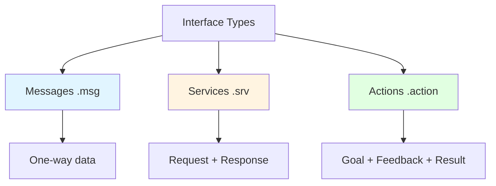

# Custom Messages and Interfaces

## 📨 Why Custom Messages?

While ROS 2 provides many standard message types (`geometry_msgs`, `sensor_msgs`, etc.), you'll often need **custom messages** for your specific robot or application.

**When to create custom messages:**
- ✅ Domain-specific data structures (robot joint states, mission commands)
- ✅ Combining multiple standard messages into one
- ✅ Adding metadata or timestamps to custom datatypes
- ❌ For simple data, prefer standard messages when possible

## 🏗️ Message Types in ROS 2

ROS 2 uses three types of interfaces:



## 📄 Creating Custom Messages

### Package Structure

Custom interfaces live in a dedicated package:

```
my_robot_interfaces/
├── msg/
│   ├── RobotStatus.msg
│   ├── JointCommand.msg
│   └── ObjectDetection.msg
├── srv/
│   ├── SetMode.srv
│   └── GetBatteryLevel.srv
├── action/
│   └── NavigateToGoal.action
├── CMakeLists.txt
└── package.xml
```

### Creating the Package

```bash
cd ~/ros2_ws/src
ros2 pkg create --build-type ament_cmake my_robot_interfaces
cd my_robot_interfaces

# Create directories
mkdir msg srv action
```

### Example: Robot Status Message

**`msg/RobotStatus.msg`:**
```
# Robot operational status message

# Header with timestamp
std_msgs/Header header

# Robot identification
string robot_id
string firmware_version

# Battery information
float32 battery_voltage      # Volts
float32 battery_percentage   # 0-100
bool is_charging

# Operational state
uint8 IDLE=0
uint8 MOVING=1
uint8 ERROR=2
uint8 CHARGING=3
uint8 state

# Current pose
geometry_msgs/Pose current_pose

# Error information
bool has_error
string error_message

# Temperature sensors
float32[] joint_temperatures  # Celsius, one per joint
```

**Key features:**
- **Header**: Standard timestamp and frame_id
- **Constants**: `IDLE=0`, `MOVING=1` for state enumeration
- **Nested messages**: `geometry_msgs/Pose`
- **Arrays**: `float32[]` for joint temperatures

### Example: Object Detection Message

**`msg/ObjectDetection.msg`:**
```
# Single detected object

# Object classification
string class_name
float32 confidence  # 0.0 to 1.0

# Bounding box in image coordinates
uint32 x_min
uint32 y_min
uint32 x_max
uint32 y_max

# 3D position (if depth available)
geometry_msgs/Point position
bool has_3d_position
```

**`msg/ObjectDetectionArray.msg`:**
```
# Array of detected objects

std_msgs/Header header
ObjectDetection[] detections
uint32 image_width
uint32 image_height
```

## 🔧 Service Definitions

Services have two parts: **Request** and **Response**, separated by `---`.

### Example: Set Robot Mode Service

**`srv/SetMode.srv`:**
```
# Request
uint8 IDLE=0
uint8 MANUAL=1
uint8 AUTONOMOUS=2

uint8 mode
---
# Response
bool success
string message
```

### Example: Get Battery Level Service

**`srv/GetBatteryLevel.srv`:**
```
# Request (empty - no input needed)
---
# Response
float32 voltage
float32 percentage
bool is_charging
float32 time_remaining  # minutes, -1 if unknown
```

## 🎯 Action Definitions

Actions have three parts: **Goal**, **Result**, and **Feedback**.

### Example: Navigate to Goal Action

**`action/NavigateToGoal.action`:**
```
# Goal
geometry_msgs/PoseStamped target_pose
float32 max_speed  # m/s
bool avoid_obstacles
---
# Result
bool success
float32 total_distance  # meters
float32 total_time      # seconds
string outcome_message
---
# Feedback
geometry_msgs/PoseStamped current_pose
float32 distance_remaining
float32 estimated_time_remaining
uint32 obstacles_detected
```

## 🔨 Building Custom Interfaces

### Update `CMakeLists.txt`

```cmake
cmake_minimum_required(VERSION 3.8)
project(my_robot_interfaces)

# Find dependencies
find_package(ament_cmake REQUIRED)
find_package(std_msgs REQUIRED)
find_package(geometry_msgs REQUIRED)
find_package(rosidl_default_generators REQUIRED)

# Declare messages, services, actions
rosidl_generate_interfaces(${PROJECT_NAME}
  "msg/RobotStatus.msg"
  "msg/ObjectDetection.msg"
  "msg/ObjectDetectionArray.msg"
  "srv/SetMode.srv"
  "srv/GetBatteryLevel.srv"
  "action/NavigateToGoal.action"
  DEPENDENCIES std_msgs geometry_msgs
)

ament_package()
```

### Update `package.xml`

```xml
<?xml version="1.0"?>
<package format="3">
  <name>my_robot_interfaces</name>
  <version>1.0.0</version>
  <description>Custom messages, services, and actions for my robot</description>
  <maintainer email="you@example.com">Your Name</maintainer>
  <license>MIT</license>

  <buildtool_depend>ament_cmake</buildtool_depend>

  <depend>std_msgs</depend>
  <depend>geometry_msgs</depend>

  <build_depend>rosidl_default_generators</build_depend>
  <exec_depend>rosidl_default_runtime</exec_depend>
  <member_of_group>rosidl_interface_packages</member_of_group>

  <export>
    <build_type>ament_cmake</build_type>
  </export>
</package>
```

### Build the Package

```bash
cd ~/ros2_ws
colcon build --packages-select my_robot_interfaces

# Source the workspace
source install/setup.bash

# Verify interfaces are available
ros2 interface list | grep my_robot
```

## 📝 Using Custom Messages in Python

### Publishing Custom Messages

```python
import rclpy
from rclpy.node import Node
from my_robot_interfaces.msg import RobotStatus
from geometry_msgs.msg import Pose

class StatusPublisher(Node):
    def __init__(self):
        super().__init__('status_publisher')

        self.publisher = self.create_publisher(RobotStatus, '/robot_status', 10)
        self.timer = self.create_timer(1.0, self.publish_status)

    def publish_status(self):
        msg = RobotStatus()

        # Fill header
        msg.header.stamp = self.get_clock().now().to_msg()
        msg.header.frame_id = 'base_link'

        # Fill fields
        msg.robot_id = 'robot_001'
        msg.firmware_version = 'v2.1.3'
        msg.battery_voltage = 48.2
        msg.battery_percentage = 85.5
        msg.is_charging = False
        msg.state = RobotStatus.MOVING

        # Fill nested message
        msg.current_pose = Pose()
        msg.current_pose.position.x = 1.2
        msg.current_pose.position.y = 0.5
        msg.current_pose.position.z = 0.0

        # Fill array
        msg.joint_temperatures = [35.2, 36.1, 34.8, 35.5, 36.0, 35.7]

        # Error info
        msg.has_error = False
        msg.error_message = ''

        self.publisher.publish(msg)
        self.get_logger().info(f'Published status: {msg.battery_percentage}%')
```

### Subscribing to Custom Messages

```python
from my_robot_interfaces.msg import RobotStatus

class StatusMonitor(Node):
    def __init__(self):
        super().__init__('status_monitor')

        self.subscription = self.create_subscription(
            RobotStatus,
            '/robot_status',
            self.status_callback,
            10
        )

    def status_callback(self, msg: RobotStatus):
        # Check state
        if msg.state == RobotStatus.ERROR:
            self.get_logger().error(f'Robot error: {msg.error_message}')
        elif msg.state == RobotStatus.IDLE:
            self.get_logger().info('Robot idle')

        # Check battery
        if msg.battery_percentage < 20.0 and not msg.is_charging:
            self.get_logger().warn(
                f'Low battery: {msg.battery_percentage:.1f}%'
            )

        # Check temperatures
        max_temp = max(msg.joint_temperatures)
        if max_temp > 60.0:
            self.get_logger().warn(f'High joint temperature: {max_temp}°C')
```

## 🔧 Using Custom Services

### Service Server

```python
from my_robot_interfaces.srv import SetMode

class ModeService(Node):
    def __init__(self):
        super().__init__('mode_service')

        self.service = self.create_service(
            SetMode,
            'set_mode',
            self.set_mode_callback
        )

        self.current_mode = SetMode.Request.IDLE

    def set_mode_callback(self, request, response):
        mode = request.mode

        # Validate mode
        if mode not in [SetMode.Request.IDLE,
                       SetMode.Request.MANUAL,
                       SetMode.Request.AUTONOMOUS]:
            response.success = False
            response.message = f'Invalid mode: {mode}'
            return response

        # Set mode
        self.current_mode = mode
        response.success = True
        response.message = f'Mode set to {mode}'

        self.get_logger().info(response.message)
        return response
```

### Service Client

```python
from my_robot_interfaces.srv import SetMode

class ModeClient(Node):
    def __init__(self):
        super().__init__('mode_client')

        self.client = self.create_client(SetMode, 'set_mode')

        while not self.client.wait_for_service(timeout_sec=1.0):
            self.get_logger().info('Waiting for set_mode service...')

    async def set_mode(self, mode):
        request = SetMode.Request()
        request.mode = mode

        future = self.client.call_async(request)
        response = await future

        if response.success:
            self.get_logger().info(f'Success: {response.message}')
        else:
            self.get_logger().error(f'Failed: {response.message}')

        return response.success
```

## 🎯 Using Custom Actions

### Action Server

```python
from rclpy.action import ActionServer
from my_robot_interfaces.action import NavigateToGoal

class NavigationActionServer(Node):
    def __init__(self):
        super().__init__('navigation_action_server')

        self._action_server = ActionServer(
            self,
            NavigateToGoal,
            'navigate_to_goal',
            self.execute_callback
        )

    async def execute_callback(self, goal_handle):
        self.get_logger().info('Executing navigation goal...')

        # Get goal
        target_pose = goal_handle.request.target_pose
        max_speed = goal_handle.request.max_speed

        # Simulate navigation
        feedback_msg = NavigateToGoal.Feedback()

        for i in range(10):
            # Check if cancelled
            if goal_handle.is_cancel_requested:
                goal_handle.canceled()
                return NavigateToGoal.Result()

            # Publish feedback
            feedback_msg.distance_remaining = 10.0 - i
            feedback_msg.estimated_time_remaining = (10.0 - i) / max_speed
            goal_handle.publish_feedback(feedback_msg)

            await asyncio.sleep(1.0)

        # Success
        goal_handle.succeed()

        result = NavigateToGoal.Result()
        result.success = True
        result.total_distance = 10.0
        result.total_time = 10.0
        result.outcome_message = 'Goal reached successfully'

        return result
```

## 🎯 Best Practices

1. **Use Standard Messages When Possible**: Don't reinvent the wheel
2. **Document Your Messages**: Add comments explaining each field
3. **Include Headers**: Add timestamps for debugging
4. **Use Constants**: For enumerations (IDLE, MOVING, etc.)
5. **Version Your Interfaces**: Update package version when changing messages
6. **Avoid Breaking Changes**: Add new fields instead of modifying existing ones
7. **Keep Messages Flat**: Avoid deep nesting for better performance

## 🎯 Self-Assessment Questions

1. When should you create a custom message instead of using standard ROS 2 messages?
2. What are the three types of interfaces in ROS 2, and when would you use each?
3. How do you define an array field in a `.msg` file?
4. Explain the difference between a service and an action.
5. What is the purpose of the `rosidl_generate_interfaces` function in CMakeLists.txt?

## 📚 Additional Resources

- [ROS 2 Interface Design](https://design.ros2.org/articles/interface_definition.html)
- [Standard ROS 2 Messages](https://github.com/ros2/common_interfaces)
- [Creating Custom Interfaces Tutorial](https://docs.ros.org/en/humble/Tutorials/Beginner-Client-Libraries/Custom-ROS2-Interfaces.html)

---

**Previous**: [← Nodes and Communication](./nodes-communication.mdx) | **Next**: [Quality of Service Policies →](./qos-policies.mdx)
