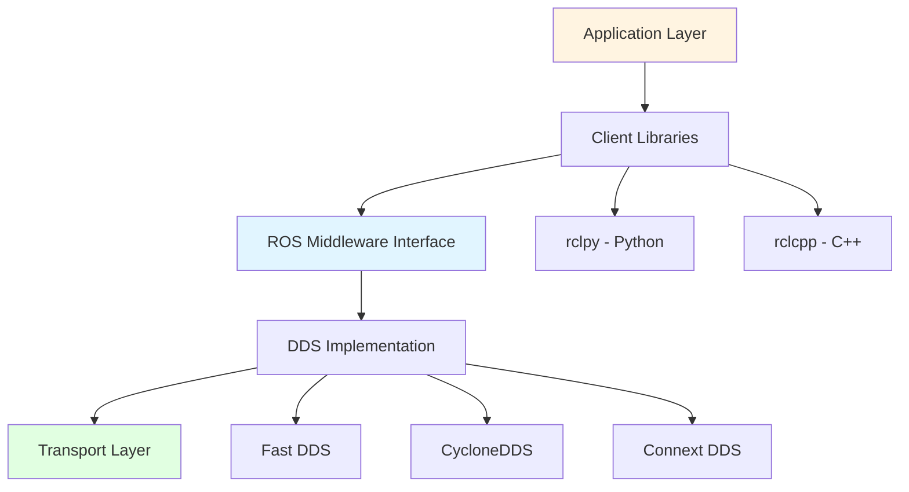
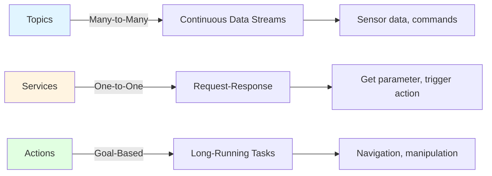

# Week 3-4: ROS 2 Architecture

## 📚 Learning Outcomes

By the end of this module, you will be able to:

- Understand the ROS 2 architecture and its advantages over ROS 1
- Create and manage ROS 2 nodes, topics, services, and actions
- Write publisher and subscriber nodes in Python and C++
- Design effective communication patterns for robot systems
- Use launch files to orchestrate multiple nodes
- Understand the DDS middleware layer and QoS policies

## 🎯 Module Overview

**ROS 2 (Robot Operating System 2)** is the de facto standard middleware for building robot systems. It provides a flexible framework for:

- **Inter-process communication**: Nodes communicate via topics, services, and actions
- **Hardware abstraction**: Same code works across different robots
- **Distributed systems**: Nodes can run on multiple computers
- **Tooling ecosystem**: Visualization (RViz), simulation (Gazebo), debugging tools

ROS 2 represents a complete redesign from ROS 1, addressing critical limitations:
- **Real-time capable**: Deterministic communication for control loops
- **Production-ready**: Used in commercial robots, not just research
- **Secure**: Built-in encryption and authentication
- **Multi-platform**: Linux, Windows, macOS, RTOS

## 🏗️ ROS 2 Architecture Overview



### Layer Breakdown

**1. Application Layer**
- Your robot code (perception, planning, control)
- Uses client libraries to interact with ROS 2

**2. Client Libraries (rclpy, rclcpp)**
- Python (`rclpy`) and C++ (`rclcpp`) interfaces
- Abstract away middleware complexity
- Provide node, publisher, subscriber, service, action APIs

**3. ROS Middleware Interface (RMW)**
- Vendor-neutral abstraction layer
- Allows switching between DDS implementations
- Defines common interface for all middleware

**4. DDS (Data Distribution Service)**
- Industry-standard publish-subscribe middleware
- Handles discovery, serialization, transport
- Provides QoS (Quality of Service) controls

**5. Transport Layer**
- UDP/TCP network protocols
- Shared memory for intra-process communication
- CAN bus, serial for embedded systems

## 🔄 Core Communication Patterns

ROS 2 provides three fundamental communication mechanisms:



### Topics (Publish-Subscribe)

**Use case**: Continuous data streams (sensor readings, control commands)

**Characteristics:**
- Anonymous: Publishers don't know subscribers
- One-to-many: Multiple subscribers can listen
- Asynchronous: No blocking
- Lossy or reliable (configurable via QoS)

**Example: Publishing velocity commands**

```python
import rclpy
from rclpy.node import Node
from geometry_msgs.msg import Twist

class VelocityPublisher(Node):
    def __init__(self):
        super().__init__('velocity_publisher')

        self.publisher = self.create_publisher(Twist, '/cmd_vel', 10)
        self.timer = self.create_timer(0.1, self.publish_velocity)

    def publish_velocity(self):
        msg = Twist()
        msg.linear.x = 0.5   # Move forward at 0.5 m/s
        msg.angular.z = 0.2  # Turn at 0.2 rad/s

        self.publisher.publish(msg)
        self.get_logger().info(f'Publishing: linear={msg.linear.x}, angular={msg.angular.z}')

def main(args=None):
    rclpy.init(args=args)
    node = VelocityPublisher()
    rclpy.spin(node)
    node.destroy_node()
    rclpy.shutdown()
```

**Subscribing to the topic:**

```python
class VelocitySubscriber(Node):
    def __init__(self):
        super().__init__('velocity_subscriber')

        self.subscription = self.create_subscription(
            Twist,
            '/cmd_vel',
            self.velocity_callback,
            10
        )

    def velocity_callback(self, msg: Twist):
        self.get_logger().info(
            f'Received: linear={msg.linear.x}, angular={msg.angular.z}'
        )
```

### Services (Request-Response)

**Use case**: Occasional operations with immediate response (get configuration, trigger calibration)

**Characteristics:**
- Synchronous: Client waits for response
- One-to-one: One client, one server
- Reliable: Guaranteed delivery
- Blocking: Client pauses until response

**Example: Service to add two numbers**

```python
from example_interfaces.srv import AddTwoInts

class AdditionServer(Node):
    def __init__(self):
        super().__init__('addition_server')

        self.service = self.create_service(
            AddTwoInts,
            'add_two_ints',
            self.add_callback
        )

    def add_callback(self, request, response):
        response.sum = request.a + request.b
        self.get_logger().info(f'{request.a} + {request.b} = {response.sum}')
        return response

# Client code
class AdditionClient(Node):
    def __init__(self):
        super().__init__('addition_client')
        self.client = self.create_client(AddTwoInts, 'add_two_ints')

        # Wait for service to be available
        while not self.client.wait_for_service(timeout_sec=1.0):
            self.get_logger().info('Service not available, waiting...')

    def send_request(self, a, b):
        request = AddTwoInts.Request()
        request.a = a
        request.b = b

        future = self.client.call_async(request)
        return future
```

### Actions (Goal-Feedback-Result)

**Use case**: Long-running tasks with progress updates (navigation to goal, pick-and-place)

**Characteristics:**
- Asynchronous with feedback
- Can be cancelled/preempted
- Three components: Goal, Feedback, Result
- Used for tasks taking >1 second

**Example: Fibonacci action**

```python
from rclpy.action import ActionServer
from action_tutorials_interfaces.action import Fibonacci

class FibonacciActionServer(Node):
    def __init__(self):
        super().__init__('fibonacci_action_server')

        self._action_server = ActionServer(
            self,
            Fibonacci,
            'fibonacci',
            self.execute_callback
        )

    def execute_callback(self, goal_handle):
        self.get_logger().info('Executing goal...')

        # Generate Fibonacci sequence
        feedback_msg = Fibonacci.Feedback()
        feedback_msg.partial_sequence = [0, 1]

        for i in range(1, goal_handle.request.order):
            # Check if goal was cancelled
            if goal_handle.is_cancel_requested:
                goal_handle.canceled()
                return Fibonacci.Result()

            # Compute next Fibonacci number
            next_num = feedback_msg.partial_sequence[i] + feedback_msg.partial_sequence[i-1]
            feedback_msg.partial_sequence.append(next_num)

            # Publish feedback
            goal_handle.publish_feedback(feedback_msg)
            time.sleep(1)  # Simulate long-running task

        goal_handle.succeed()

        result = Fibonacci.Result()
        result.sequence = feedback_msg.partial_sequence
        return result
```

## 📦 ROS 2 Workspace Structure

A typical ROS 2 workspace follows this structure:

```
ros2_ws/
├── src/
│   ├── my_robot_pkg/
│   │   ├── my_robot_pkg/
│   │   │   ├── __init__.py
│   │   │   ├── node1.py
│   │   │   └── node2.py
│   │   ├── package.xml
│   │   ├── setup.py
│   │   └── resource/
│   ├── my_robot_description/
│   │   ├── urdf/
│   │   ├── meshes/
│   │   └── launch/
├── build/           # Build artifacts (generated)
├── install/         # Installed packages (generated)
└── log/             # Build logs (generated)
```

**Creating a new package:**

```bash
cd ~/ros2_ws/src
ros2 pkg create --build-type ament_python my_robot_pkg --dependencies rclpy geometry_msgs

# Build the workspace
cd ~/ros2_ws
colcon build

# Source the workspace
source install/setup.bash
```

## 🚀 Launch Files

**Launch files** orchestrate multiple nodes with configuration:

```python
from launch import LaunchDescription
from launch_ros.actions import Node

def generate_launch_description():
    return LaunchDescription([
        Node(
            package='my_robot_pkg',
            executable='velocity_publisher',
            name='velocity_pub',
            parameters=[{'linear_speed': 0.5}]
        ),
        Node(
            package='my_robot_pkg',
            executable='velocity_subscriber',
            name='velocity_sub',
            output='screen'
        ),
    ])
```

**Running the launch file:**

```bash
ros2 launch my_robot_pkg my_launch.launch.py
```

## 🛠️ Essential ROS 2 Command-Line Tools

```bash
# List active nodes
ros2 node list

# Get info about a node
ros2 node info /my_node

# List all topics
ros2 topic list

# Echo messages on a topic
ros2 topic echo /cmd_vel

# Get topic info
ros2 topic info /cmd_vel

# Publish to a topic
ros2 topic pub /cmd_vel geometry_msgs/msg/Twist "{linear: {x: 0.5}, angular: {z: 0.0}}"

# List services
ros2 service list

# Call a service
ros2 service call /add_two_ints example_interfaces/srv/AddTwoInts "{a: 2, b: 3}"

# Show message structure
ros2 interface show geometry_msgs/msg/Twist
```

## 🎯 What's Next?

In the following sections, we'll dive deeper into:

1. **Nodes and Communication**: Creating publishers, subscribers, and managing node lifecycle
2. **Custom Messages**: Defining your own message types
3. **Quality of Service (QoS)**: Configuring reliability, durability, and history
4. **Launch Systems**: Advanced launch file patterns
5. **Practical Example**: Building a complete robot control system

## 🎯 Self-Assessment Questions

1. What are the three main communication patterns in ROS 2, and when would you use each?
2. Explain the difference between synchronous and asynchronous communication in ROS 2.
3. What is the role of DDS in the ROS 2 architecture?
4. How would you create a simple publisher node in Python?
5. What is the purpose of a launch file, and what advantages does it provide?

## 📚 Additional Resources

- [ROS 2 Documentation](https://docs.ros.org/en/humble/)
- [ROS 2 Tutorials](https://docs.ros.org/en/humble/Tutorials.html)
- [ROS 2 Design](https://design.ros2.org/)
- [DDS Foundation](https://www.dds-foundation.org/)

---

**Previous**: [← Sensor Systems](../01-physical-ai-intro/sensor-systems.mdx) | **Next**: [Nodes and Communication →](./nodes-communication.mdx)
