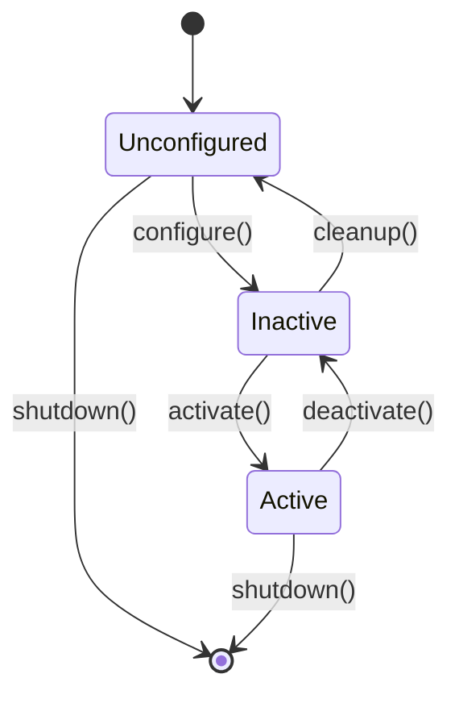

# Nodes and Communication

## 🧩 What is a Node?

A **node** is a fundamental building block in ROS 2—a single-purpose process that performs computation. Nodes communicate with each other via topics, services, and actions.

### Node Design Philosophy

**Single Responsibility Principle**: Each node should do one thing well.


**Benefits:**
- **Modularity**: Replace one component without affecting others
- **Testability**: Test each node in isolation
- **Reusability**: Use the same camera node for different robots
- **Parallelism**: Nodes can run on different CPU cores or machines

## 📝 Creating Your First Node

### Minimal Python Node

```python
import rclpy
from rclpy.node import Node

class MinimalNode(Node):
    def __init__(self):
        super().__init__('minimal_node')
        self.get_logger().info('Minimal node has been started')

def main(args=None):
    rclpy.init(args=args)
    node = MinimalNode()
    rclpy.spin(node)
    node.destroy_node()
    rclpy.shutdown()

if __name__ == '__main__':
    main()
```

**Running the node:**
```bash
python3 minimal_node.py

# In another terminal, check that it's running
ros2 node list
# Output: /minimal_node
```

### Node with Parameters

```python
from rclpy.parameter import Parameter

class ConfigurableNode(Node):
    def __init__(self):
        super().__init__('configurable_node')

        # Declare parameters with defaults
        self.declare_parameter('max_speed', 1.0)
        self.declare_parameter('robot_name', 'my_robot')
        self.declare_parameter('enable_safety', True)

        # Get parameter values
        self.max_speed = self.get_parameter('max_speed').value
        self.robot_name = self.get_parameter('robot_name').value
        self.enable_safety = self.get_parameter('enable_safety').value

        self.get_logger().info(f'Robot: {self.robot_name}, Max Speed: {self.max_speed}')

        # Set up parameter change callback
        self.add_on_set_parameters_callback(self.parameters_callback)

    def parameters_callback(self, params):
        for param in params:
            if param.name == 'max_speed':
                self.max_speed = param.value
                self.get_logger().info(f'Updated max_speed to {self.max_speed}')
        return SetParametersResult(successful=True)
```

**Setting parameters from command line:**
```bash
ros2 run my_pkg configurable_node --ros-args \
  -p max_speed:=2.5 \
  -p robot_name:=atlas \
  -p enable_safety:=false

# Change parameters while running
ros2 param set /configurable_node max_speed 3.0
```

## 📡 Publishers and Subscribers

### Publisher Example: Sensor Data

```python
import rclpy
from rclpy.node import Node
from sensor_msgs.msg import Temperature
import random

class TemperatureSensor(Node):
    def __init__(self):
        super().__init__('temperature_sensor')

        # Create publisher
        self.publisher = self.create_publisher(
            Temperature,
            '/robot/temperature',
            qos_profile=10
        )

        # Timer to publish at 10 Hz
        self.timer = self.create_timer(0.1, self.publish_temperature)

        self.get_logger().info('Temperature sensor started')

    def publish_temperature(self):
        msg = Temperature()
        msg.header.stamp = self.get_clock().now().to_msg()
        msg.header.frame_id = 'temperature_sensor'

        # Simulate temperature reading (20-30°C with noise)
        msg.temperature = 25.0 + random.gauss(0, 2.0)
        msg.variance = 0.1

        self.publisher.publish(msg)
```

### Subscriber Example: Processing Sensor Data

```python
from sensor_msgs.msg import Temperature

class TemperatureMonitor(Node):
    def __init__(self):
        super().__init__('temperature_monitor')

        self.subscription = self.create_subscription(
            Temperature,
            '/robot/temperature',
            self.temperature_callback,
            10
        )

        self.high_temp_threshold = 28.0
        self.low_temp_threshold = 22.0

    def temperature_callback(self, msg: Temperature):
        temp = msg.temperature

        if temp > self.high_temp_threshold:
            self.get_logger().warn(
                f'High temperature detected: {temp:.2f}°C',
                throttle_duration_sec=5.0  # Log at most once every 5 seconds
            )
        elif temp < self.low_temp_threshold:
            self.get_logger().warn(f'Low temperature detected: {temp:.2f}°C')
        else:
            self.get_logger().info(f'Temperature normal: {temp:.2f}°C')
```

## 🔄 Pub-Sub with Custom Logic

### Example: Velocity Smoother

This node subscribes to raw velocity commands and publishes smoothed commands to avoid sudden jerks:

```python
from geometry_msgs.msg import Twist
from collections import deque

class VelocitySmoother(Node):
    def __init__(self):
        super().__init__('velocity_smoother')

        # Subscriber for raw commands
        self.sub = self.create_subscription(
            Twist,
            '/cmd_vel_raw',
            self.velocity_callback,
            10
        )

        # Publisher for smoothed commands
        self.pub = self.create_publisher(Twist, '/cmd_vel', 10)

        # Moving average filter (5 samples)
        self.linear_buffer = deque(maxlen=5)
        self.angular_buffer = deque(maxlen=5)

    def velocity_callback(self, msg: Twist):
        # Add to buffers
        self.linear_buffer.append(msg.linear.x)
        self.angular_buffer.append(msg.angular.z)

        # Compute moving average
        smoothed_msg = Twist()
        smoothed_msg.linear.x = sum(self.linear_buffer) / len(self.linear_buffer)
        smoothed_msg.angular.z = sum(self.angular_buffer) / len(self.angular_buffer)

        # Publish smoothed command
        self.pub.publish(smoothed_msg)

        self.get_logger().debug(
            f'Raw: ({msg.linear.x:.2f}, {msg.angular.z:.2f}) → '
            f'Smoothed: ({smoothed_msg.linear.x:.2f}, {smoothed_msg.angular.z:.2f})'
        )
```

## 🧬 Node Lifecycle Management

ROS 2 supports **managed nodes** with explicit lifecycle states for controlled startup/shutdown:



### Lifecycle Node Example

```python
from rclpy.lifecycle import LifecycleNode, LifecycleState, TransitionCallbackReturn

class ManagedSensor(LifecycleNode):
    def __init__(self):
        super().__init__('managed_sensor')
        self.publisher = None

    def on_configure(self, state: LifecycleState):
        self.get_logger().info('Configuring...')

        # Create publisher (but don't publish yet)
        self.publisher = self.create_lifecycle_publisher(
            Temperature,
            '/temperature',
            10
        )

        # Initialize hardware
        self.init_hardware()

        return TransitionCallbackReturn.SUCCESS

    def on_activate(self, state: LifecycleState):
        self.get_logger().info('Activating...')

        # Start publishing
        self.timer = self.create_timer(0.1, self.publish_temperature)

        return super().on_activate(state)

    def on_deactivate(self, state: LifecycleState):
        self.get_logger().info('Deactivating...')

        # Stop publishing
        self.destroy_timer(self.timer)

        return super().on_deactivate(state)

    def on_cleanup(self, state: LifecycleState):
        self.get_logger().info('Cleaning up...')

        # Destroy publisher
        self.destroy_publisher(self.publisher)

        # Shutdown hardware
        self.shutdown_hardware()

        return TransitionCallbackReturn.SUCCESS

    def publish_temperature(self):
        if self.publisher.is_activated:
            msg = Temperature()
            msg.temperature = self.read_sensor()
            self.publisher.publish(msg)
```

**Controlling lifecycle:**
```bash
# Trigger transitions
ros2 lifecycle set /managed_sensor configure
ros2 lifecycle set /managed_sensor activate

# Check current state
ros2 lifecycle get /managed_sensor

# Deactivate
ros2 lifecycle set /managed_sensor deactivate
```

## 🎭 Multi-threaded Executors

By default, ROS 2 uses a **single-threaded executor**. For nodes with blocking callbacks or heavy computation, use multi-threaded executors:

### Single-Threaded Executor (Default)

```python
def main():
    rclpy.init()
    node = MyNode()

    # Single-threaded executor (blocks on each callback)
    rclpy.spin(node)

    node.destroy_node()
    rclpy.shutdown()
```

### Multi-Threaded Executor

```python
from rclpy.executors import MultiThreadedExecutor

def main():
    rclpy.init()

    node1 = SensorNode()
    node2 = ProcessorNode()

    executor = MultiThreadedExecutor(num_threads=4)
    executor.add_node(node1)
    executor.add_node(node2)

    try:
        executor.spin()
    finally:
        executor.shutdown()
        node1.destroy_node()
        node2.destroy_node()
        rclpy.shutdown()
```

**When to use multi-threading:**
- ✅ Long-running callbacks (> 10ms)
- ✅ Multiple independent nodes in one process
- ✅ Heavy computation that shouldn't block I/O
- ❌ Real-time control loops (use real-time executors instead)

## 🔍 Introspection and Debugging

### Node Info

```bash
# Get detailed node information
ros2 node info /velocity_smoother

# Output:
#   Subscribers:
#     /cmd_vel_raw: geometry_msgs/msg/Twist
#   Publishers:
#     /cmd_vel: geometry_msgs/msg/Twist
#   Services:
#     /velocity_smoother/describe_parameters
#     /velocity_smoother/get_parameters
#     /velocity_smoother/set_parameters
```

### Topic Inspection

```bash
# See message rate
ros2 topic hz /cmd_vel

# See bandwidth usage
ros2 topic bw /camera/image_raw

# Record data for later analysis
ros2 bag record /cmd_vel /odom

# Playback recorded data
ros2 bag play my_recording.db3
```

### Logging Levels

```python
# In your node
self.get_logger().debug('Detailed debug info')
self.get_logger().info('Normal operation')
self.get_logger().warn('Warning condition')
self.get_logger().error('Error occurred')
self.get_logger().fatal('Fatal error, shutting down')
```

**Set logging level:**
```bash
ros2 run my_pkg my_node --ros-args --log-level debug

# Or set per-logger
ros2 run my_pkg my_node --ros-args --log-level my_node:=debug
```

## 🎯 Self-Assessment Questions

1. What is the Single Responsibility Principle for ROS 2 nodes, and why is it important?
2. How do you declare and retrieve parameters in a ROS 2 node?
3. Explain the difference between a regular node and a managed (lifecycle) node.
4. When should you use a multi-threaded executor instead of the default single-threaded executor?
5. How would you implement a node that aggregates data from multiple sensor topics?

## 📚 Additional Resources

- [ROS 2 rclpy API Documentation](https://docs.ros2.org/latest/api/rclpy/)
- [Managed Nodes Tutorial](https://design.ros2.org/articles/node_lifecycle.html)
- [Executor Design](https://design.ros2.org/articles/executor.html)

---

**Previous**: [← ROS 2 Architecture](./index.mdx) | **Next**: [Custom Messages →](./custom-messages.mdx)
