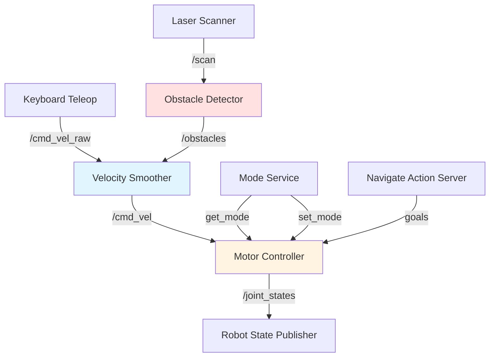

# Practical Example: Building a Complete Robot Control System

## 🎯 Project Overview

In this practical example, we'll build a **complete robot control system** that demonstrates all the concepts covered in this module:

- Multiple nodes communicating via topics
- Custom message types
- Services for configuration
- Actions for complex tasks
- QoS policies for reliable communication
- Launch files to orchestrate the system

## 🤖 System Architecture

We'll build a simple mobile robot system with:



**Components:**
1. **Keyboard Teleop**: Manual control input
2. **Velocity Smoother**: Filters sudden commands
3. **Motor Controller**: Sends commands to motors
4. **Obstacle Detector**: Processes laser scan for safety
5. **Mode Service**: Switch between manual/auto modes
6. **Navigate Action**: Long-running navigation tasks

## 📦 Package Structure

```bash
# Create package
cd ~/ros2_ws/src
ros2 pkg create --build-type ament_python robot_control \
  --dependencies rclpy geometry_msgs sensor_msgs std_msgs
```

```
robot_control/
├── robot_control/
│   ├── __init__.py
│   ├── keyboard_teleop.py
│   ├── velocity_smoother.py
│   ├── motor_controller.py
│   ├── obstacle_detector.py
│   ├── mode_service.py
│   └── navigate_action.py
├── launch/
│   └── robot.launch.py
├── config/
│   └── params.yaml
├── package.xml
└── setup.py
```

## 1️⃣ Keyboard Teleop Node

**`robot_control/keyboard_teleop.py`:**

```python
import rclpy
from rclpy.node import Node
from geometry_msgs.msg import Twist
import sys, select, termios, tty

class KeyboardTeleop(Node):
    def __init__(self):
        super().__init__('keyboard_teleop')

        self.publisher = self.create_publisher(Twist, '/cmd_vel_raw', 10)

        self.linear_speed = 0.5
        self.angular_speed = 1.0

        self.get_logger().info('Keyboard Teleop Started')
        self.get_logger().info('Use WASD to control, Space to stop, Q to quit')

    def get_key(self):
        """Get keyboard input (Linux only)"""
        tty.setraw(sys.stdin.fileno())
        select.select([sys.stdin], [], [], 0)
        key = sys.stdin.read(1)
        termios.tcsetattr(sys.stdin, termios.TCSADRAIN, self.settings)
        return key

    def run(self):
        """Main control loop"""
        self.settings = termios.tcgetattr(sys.stdin)

        try:
            while True:
                key = self.get_key()

                twist = Twist()

                if key == 'w':
                    twist.linear.x = self.linear_speed
                elif key == 's':
                    twist.linear.x = -self.linear_speed
                elif key == 'a':
                    twist.angular.z = self.angular_speed
                elif key == 'd':
                    twist.angular.z = -self.angular_speed
                elif key == ' ':
                    twist.linear.x = 0.0
                    twist.angular.z = 0.0
                elif key == 'q':
                    break

                self.publisher.publish(twist)

        except Exception as e:
            self.get_logger().error(f'Error: {e}')

        finally:
            # Send stop command
            twist = Twist()
            self.publisher.publish(twist)
            termios.tcsetattr(sys.stdin, termios.TCSADRAIN, self.settings)

def main(args=None):
    rclpy.init(args=args)
    node = KeyboardTeleop()

    try:
        node.run()
    except KeyboardInterrupt:
        pass

    node.destroy_node()
    rclpy.shutdown()
```

## 2️⃣ Velocity Smoother Node

**`robot_control/velocity_smoother.py`:**

```python
import rclpy
from rclpy.node import Node
from geometry_msgs.msg import Twist
from collections import deque

class VelocitySmoother(Node):
    def __init__(self):
        super().__init__('velocity_smoother')

        # Declare parameters
        self.declare_parameter('window_size', 5)
        self.declare_parameter('max_linear', 1.0)
        self.declare_parameter('max_angular', 2.0)

        window_size = self.get_parameter('window_size').value
        self.max_linear = self.get_parameter('max_linear').value
        self.max_angular = self.get_parameter('max_angular').value

        # Subscriber and publisher
        self.sub = self.create_subscription(
            Twist,
            '/cmd_vel_raw',
            self.velocity_callback,
            10
        )

        self.pub = self.create_publisher(Twist, '/cmd_vel', 10)

        # Moving average buffers
        self.linear_buffer = deque(maxlen=window_size)
        self.angular_buffer = deque(maxlen=window_size)

        self.get_logger().info('Velocity Smoother Started')

    def velocity_callback(self, msg: Twist):
        # Add to buffers
        self.linear_buffer.append(msg.linear.x)
        self.angular_buffer.append(msg.angular.z)

        # Compute moving average
        smoothed = Twist()
        smoothed.linear.x = sum(self.linear_buffer) / len(self.linear_buffer)
        smoothed.angular.z = sum(self.angular_buffer) / len(self.angular_buffer)

        # Apply limits
        smoothed.linear.x = max(-self.max_linear,
                               min(self.max_linear, smoothed.linear.x))
        smoothed.angular.z = max(-self.max_angular,
                                min(self.max_angular, smoothed.angular.z))

        self.pub.publish(smoothed)

def main(args=None):
    rclpy.init(args=args)
    node = VelocitySmoother()
    rclpy.spin(node)
    node.destroy_node()
    rclpy.shutdown()
```

## 3️⃣ Motor Controller Node

**`robot_control/motor_controller.py`:**

```python
import rclpy
from rclpy.node import Node
from geometry_msgs.msg import Twist
from sensor_msgs.msg import JointState
from std_srvs.srv import SetBool

class MotorController(Node):
    def __init__(self):
        super().__init__('motor_controller')

        # Subscribe to velocity commands
        self.cmd_sub = self.create_subscription(
            Twist,
            '/cmd_vel',
            self.cmd_callback,
            10
        )

        # Publish joint states
        self.joint_pub = self.create_publisher(JointState, '/joint_states', 10)

        # Service to enable/disable motors
        self.enable_srv = self.create_service(
            SetBool,
            'enable_motors',
            self.enable_callback
        )

        # State
        self.motors_enabled = True
        self.current_velocity = Twist()

        # Timer to publish joint states
        self.timer = self.create_timer(0.01, self.publish_joint_states)  # 100 Hz

        self.get_logger().info('Motor Controller Started')

    def cmd_callback(self, msg: Twist):
        """Receive velocity commands"""
        if self.motors_enabled:
            self.current_velocity = msg

            # In a real system, send commands to motor drivers here
            # motor_driver.set_velocity(msg.linear.x, msg.angular.z)

            self.get_logger().debug(
                f'CMD: linear={msg.linear.x:.2f}, angular={msg.angular.z:.2f}'
            )
        else:
            self.get_logger().warn('Motors disabled, ignoring command')

    def publish_joint_states(self):
        """Publish current joint positions (simulated)"""
        msg = JointState()
        msg.header.stamp = self.get_clock().now().to_msg()
        msg.name = ['left_wheel_joint', 'right_wheel_joint']

        # Simulate joint positions based on velocity
        # In reality, read from encoders
        msg.position = [0.0, 0.0]
        msg.velocity = [self.current_velocity.linear.x] * 2
        msg.effort = [0.0, 0.0]

        self.joint_pub.publish(msg)

    def enable_callback(self, request, response):
        """Service to enable/disable motors"""
        self.motors_enabled = request.data

        if self.motors_enabled:
            response.success = True
            response.message = 'Motors enabled'
            self.get_logger().info('Motors enabled')
        else:
            response.success = True
            response.message = 'Motors disabled'
            self.get_logger().warn('Motors disabled')

            # Stop robot
            self.current_velocity = Twist()

        return response

def main(args=None):
    rclpy.init(args=args)
    node = MotorController()
    rclpy.spin(node)
    node.destroy_node()
    rclpy.shutdown()
```

## 4️⃣ Obstacle Detector Node

**`robot_control/obstacle_detector.py`:**

```python
import rclpy
from rclpy.node import Node
from sensor_msgs.msg import LaserScan
from std_msgs.msg import Bool
import numpy as np

class ObstacleDetector(Node):
    def __init__(self):
        super().__init__('obstacle_detector')

        # Parameters
        self.declare_parameter('min_distance', 0.5)  # meters
        self.declare_parameter('warning_distance', 1.0)

        self.min_distance = self.get_parameter('min_distance').value
        self.warning_distance = self.get_parameter('warning_distance').value

        # Subscribe to laser scan
        self.scan_sub = self.create_subscription(
            LaserScan,
            '/scan',
            self.scan_callback,
            10
        )

        # Publish obstacle alert
        self.obstacle_pub = self.create_publisher(Bool, '/obstacle_detected', 10)

        self.get_logger().info('Obstacle Detector Started')

    def scan_callback(self, msg: LaserScan):
        """Process laser scan for obstacles"""
        # Convert ranges to numpy array
        ranges = np.array(msg.ranges)

        # Filter out invalid readings
        valid_ranges = ranges[(ranges > msg.range_min) & (ranges < msg.range_max)]

        if len(valid_ranges) == 0:
            return

        # Find minimum distance
        min_dist = np.min(valid_ranges)

        # Publish obstacle alert
        alert = Bool()
        alert.data = (min_dist < self.warning_distance)
        self.obstacle_pub.publish(alert)

        if min_dist < self.min_distance:
            self.get_logger().warn(
                f'DANGER: Obstacle at {min_dist:.2f}m!',
                throttle_duration_sec=1.0
            )
        elif min_dist < self.warning_distance:
            self.get_logger().info(
                f'Warning: Obstacle at {min_dist:.2f}m',
                throttle_duration_sec=2.0
            )

def main(args=None):
    rclpy.init(args=args)
    node = ObstacleDetector()
    rclpy.spin(node)
    node.destroy_node()
    rclpy.shutdown()
```

## 5️⃣ Launch File

**`launch/robot.launch.py`:**

```python
import os
from ament_index_python.packages import get_package_share_directory
from launch import LaunchDescription
from launch.actions import DeclareLaunchArgument
from launch.substitutions import LaunchConfiguration
from launch_ros.actions import Node

def generate_launch_description():
    # Get config file
    config_file = os.path.join(
        get_package_share_directory('robot_control'),
        'config',
        'params.yaml'
    )

    # Declare arguments
    use_sim_time = LaunchConfiguration('use_sim_time')

    declare_use_sim_time = DeclareLaunchArgument(
        'use_sim_time',
        default_value='false',
        description='Use simulation time'
    )

    # Nodes
    keyboard_teleop = Node(
        package='robot_control',
        executable='keyboard_teleop',
        name='keyboard_teleop',
        output='screen'
    )

    velocity_smoother = Node(
        package='robot_control',
        executable='velocity_smoother',
        name='velocity_smoother',
        parameters=[config_file, {'use_sim_time': use_sim_time}]
    )

    motor_controller = Node(
        package='robot_control',
        executable='motor_controller',
        name='motor_controller',
        parameters=[{'use_sim_time': use_sim_time}]
    )

    obstacle_detector = Node(
        package='robot_control',
        executable='obstacle_detector',
        name='obstacle_detector',
        parameters=[config_file, {'use_sim_time': use_sim_time}]
    )

    return LaunchDescription([
        declare_use_sim_time,
        velocity_smoother,
        motor_controller,
        obstacle_detector,
        keyboard_teleop  # Launch last so terminal is ready
    ])
```

## 6️⃣ Configuration File

**`config/params.yaml`:**

```yaml
velocity_smoother:
  ros__parameters:
    window_size: 5
    max_linear: 1.0
    max_angular: 2.0

obstacle_detector:
  ros__parameters:
    min_distance: 0.5
    warning_distance: 1.0
```

## 7️⃣ Setup File

**`setup.py`:**

```python
from setuptools import setup
import os
from glob import glob

package_name = 'robot_control'

setup(
    name=package_name,
    version='1.0.0',
    packages=[package_name],
    data_files=[
        ('share/ament_index/resource_index/packages',
            ['resource/' + package_name]),
        ('share/' + package_name, ['package.xml']),
        (os.path.join('share', package_name, 'launch'),
            glob('launch/*.launch.py')),
        (os.path.join('share', package_name, 'config'),
            glob('config/*.yaml')),
    ],
    install_requires=['setuptools'],
    zip_safe=True,
    maintainer='Your Name',
    maintainer_email='you@example.com',
    description='Robot control system example',
    license='MIT',
    tests_require=['pytest'],
    entry_points={
        'console_scripts': [
            'keyboard_teleop = robot_control.keyboard_teleop:main',
            'velocity_smoother = robot_control.velocity_smoother:main',
            'motor_controller = robot_control.motor_controller:main',
            'obstacle_detector = robot_control.obstacle_detector:main',
        ],
    },
)
```

## 🏗️ Building and Running

```bash
# Build
cd ~/ros2_ws
colcon build --packages-select robot_control

# Source
source install/setup.bash

# Launch the system
ros2 launch robot_control robot.launch.py

# In another terminal, test the service
ros2 service call /enable_motors std_srvs/srv/SetBool "{data: false}"
ros2 service call /enable_motors std_srvs/srv/SetBool "{data: true}"

# Monitor topics
ros2 topic echo /cmd_vel
ros2 topic echo /joint_states
ros2 topic echo /obstacle_detected

# Check node graph
rqt_graph
```

## 📊 Visualizing the System

```bash
# View computation graph
rqt_graph

# Monitor all topics
rqt_topic

# Plot velocity over time
rqt_plot /cmd_vel/linear/x /cmd_vel/angular/z
```

## 🎯 Exercises

1. **Add Emergency Stop**: Create a subscriber that stops the robot when `/emergency_stop` is published
2. **Add Battery Monitoring**: Create a node that publishes battery level and warns when low
3. **Implement Obstacle Avoidance**: Modify velocity_smoother to reduce speed when obstacles are near
4. **Add Logging**: Record all velocities to a bag file for later analysis
5. **Create Unit Tests**: Write pytest tests for the velocity smoother logic

## 🎯 Self-Assessment Questions

1. Draw the complete node graph for this system, showing all topics and nodes.
2. What would happen if the velocity_smoother node crashed? How would you detect it?
3. How would you modify the system to support multiple robots?
4. What QoS policies would you use for the `/cmd_vel` topic and why?
5. How could you extend this system to include autonomous navigation?

## 📚 Next Steps

Now that you understand ROS 2 architecture, you're ready to dive into:
- **Perception**: Computer vision, object detection, SLAM
- **Planning**: Path planning, task planning, motion planning
- **Control**: PID control, model predictive control, whole-body control

---

**Previous**: [← Launch Systems](./launch-systems.mdx) | **Next**: [Week 5-6: Perception Systems →](../03-perception/index.mdx)
