# Quality of Service (QoS) Policies

## 🎯 What is QoS?

**Quality of Service (QoS)** policies control how messages are transmitted between publishers and subscribers. QoS is a powerful feature of DDS (Data Distribution Service) that ROS 2 exposes to users.

**Why QoS matters:**
- **Reliability**: Should every message be guaranteed to arrive?
- **Durability**: Should late-joining subscribers receive old messages?
- **History**: How many messages should be buffered?
- **Latency**: Trade reliability for speed?

## 📊 QoS Policy Parameters


### 1. Reliability

**RELIABLE** (TCP-like)
- Every message is guaranteed to arrive
- Retransmits lost packets
- Higher latency, more bandwidth
- **Use for**: Commands, configuration, critical data

**BEST_EFFORT** (UDP-like)
- Send-and-forget, no guarantees
- Lower latency, less bandwidth
- **Use for**: High-frequency sensor data (camera, LIDAR)

```python
from rclpy.qos import QoSProfile, ReliabilityPolicy

# Reliable (guarantee delivery)
reliable_qos = QoSProfile(
    reliability=ReliabilityPolicy.RELIABLE,
    depth=10
)

# Best effort (fast, lossy)
best_effort_qos = QoSProfile(
    reliability=ReliabilityPolicy.BEST_EFFORT,
    depth=10
)

# Create publishers with different QoS
self.cmd_pub = self.create_publisher(Twist, '/cmd_vel', reliable_qos)
self.camera_pub = self.create_publisher(Image, '/camera/image', best_effort_qos)
```

### 2. Durability

**TRANSIENT_LOCAL**
- Store messages for late-joining subscribers
- Late subscribers receive the last N messages
- **Use for**: Static data (robot description, maps)

**VOLATILE**
- No history for late subscribers
- Subscribers only receive messages sent after they connect
- **Use for**: Real-time sensor streams

```python
from rclpy.qos import DurabilityPolicy

# Transient local (store history)
transient_qos = QoSProfile(
    durability=DurabilityPolicy.TRANSIENT_LOCAL,
    depth=10
)

# Volatile (no history)
volatile_qos = QoSProfile(
    durability=DurabilityPolicy.VOLATILE,
    depth=10
)
```

### 3. History

**KEEP_LAST(N)**
- Buffer the last N messages
- Older messages are dropped
- **Use for**: Most applications

**KEEP_ALL**
- Buffer all messages (limited by resources)
- Can lead to memory issues if consumer is slow
- **Use for**: Critical logging, audit trails

```python
from rclpy.qos import HistoryPolicy

# Keep last 10 messages
keep_last_qos = QoSProfile(
    history=HistoryPolicy.KEEP_LAST,
    depth=10
)

# Keep all messages
keep_all_qos = QoSProfile(
    history=HistoryPolicy.KEEP_ALL
)
```

### 4. Deadline

Maximum expected time between messages. If exceeded, triggers a callback.

```python
from rclpy.qos import Duration

qos = QoSProfile(
    deadline=Duration(seconds=0, nanoseconds=100_000_000)  # 100 ms
)

# Set deadline event callback
self.subscription = self.create_subscription(
    LaserScan,
    '/scan',
    self.scan_callback,
    qos
)

# Override deadline event callback
self.subscription.add_event_callback(
    self.on_deadline_missed,
    rclpy.qos.QoSEventType.DEADLINE
)

def on_deadline_missed(self, event):
    self.get_logger().warn('Deadline missed! Sensor not publishing fast enough.')
```

### 5. Lifespan

Maximum time a message remains valid after publication.

```python
from rclpy.qos import Duration

qos = QoSProfile(
    lifespan=Duration(seconds=1)  # Messages expire after 1 second
)

# Use for time-sensitive commands
self.cmd_pub = self.create_publisher(Twist, '/cmd_vel', qos)
```

### 6. Liveliness

Mechanism to detect if a publisher is still alive.

**AUTOMATIC**
- DDS automatically monitors
- Less control, easier to use

**MANUAL_BY_TOPIC**
- Publisher must explicitly assert liveliness
- More control, more work

```python
from rclpy.qos import LivelinessPolicy, Duration

qos = QoSProfile(
    liveliness=LivelinessPolicy.AUTOMATIC,
    liveliness_lease_duration=Duration(seconds=2)
)

# If no messages for 2 seconds, publisher considered dead
```

## 📋 Predefined QoS Profiles

ROS 2 provides common QoS profiles for typical use cases:

```python
from rclpy.qos import qos_profile_sensor_data, qos_profile_system_default, qos_profile_services_default

# Sensor data profile (best effort, volatile)
self.camera_sub = self.create_subscription(
    Image,
    '/camera/image',
    self.image_callback,
    qos_profile_sensor_data
)

# System default (reliable, volatile, keep last 10)
self.status_pub = self.create_publisher(
    RobotStatus,
    '/status',
    qos_profile_system_default
)

# Services default (reliable, volatile, keep last 10)
self.service = self.create_service(
    GetMode,
    'get_mode',
    self.get_mode_callback,
    qos_profile_services_default
)
```

### Comparison of Predefined Profiles

| Profile | Reliability | Durability | History | Use Case |
|---------|-------------|------------|---------|----------|
| **sensor_data** | BEST_EFFORT | VOLATILE | KEEP_LAST(5) | High-frequency sensor streams |
| **system_default** | RELIABLE | VOLATILE | KEEP_LAST(10) | General pub/sub |
| **services_default** | RELIABLE | VOLATILE | KEEP_LAST(10) | Service calls |
| **parameters** | RELIABLE | VOLATILE | KEEP_LAST(1000) | Parameter updates |
| **parameter_events** | RELIABLE | TRANSIENT_LOCAL | KEEP_LAST(1000) | Parameter change notifications |

## 🔄 QoS Compatibility

For communication to work, publisher and subscriber QoS must be **compatible**.

### Compatibility Rules

```mermaid
graph TD
    A[Publisher: RELIABLE] --> B{Compatible with}
    B -->|✅ Yes| C[Subscriber: RELIABLE]
    B -->|❌ No| D[Subscriber: BEST_EFFORT]

    E[Publisher: BEST_EFFORT] --> F{Compatible with}
    F -->|✅ Yes| G[Subscriber: BEST_EFFORT]
    F -->|✅ Yes| H[Subscriber: RELIABLE]

    style A fill:#e1ffe1
    style E fill:#ffe1e1
```



**Reliability:**
- RELIABLE publisher → RELIABLE subscriber ✅
- RELIABLE publisher → BEST_EFFORT subscriber ❌
- BEST_EFFORT publisher → BEST_EFFORT subscriber ✅
- BEST_EFFORT publisher → RELIABLE subscriber ✅

**Durability:**
- TRANSIENT_LOCAL publisher → TRANSIENT_LOCAL subscriber ✅
- TRANSIENT_LOCAL publisher → VOLATILE subscriber ✅
- VOLATILE publisher → TRANSIENT_LOCAL subscriber ❌
- VOLATILE publisher → VOLATILE subscriber ✅

### Debugging QoS Mismatches

```bash
# Check QoS of a topic
ros2 topic info /camera/image --verbose

# Output shows:
#   Publisher count: 1
#   Subscription count: 1
#   QoS profile:
#     Reliability: BEST_EFFORT
#     Durability: VOLATILE
#     History: KEEP_LAST (5)
```

If no messages are flowing, check for QoS incompatibility:

```python
# Enable QoS event callbacks
from rclpy.qos import QoSEventType

self.subscription = self.create_subscription(
    Image,
    '/camera/image',
    self.image_callback,
    qos_profile
)

# Add QoS event callbacks
self.subscription.add_event_callback(
    self.on_incompatible_qos,
    QoSEventType.INCOMPATIBLE_QOS
)

def on_incompatible_qos(self, event):
    self.get_logger().error(
        f'Incompatible QoS! Publisher and subscriber QoS do not match.'
    )
```

## 🎯 Practical Examples

### Example 1: Camera Stream (Best Effort)

```python
from sensor_msgs.msg import Image
from rclpy.qos import QoSProfile, ReliabilityPolicy, HistoryPolicy

class CameraPublisher(Node):
    def __init__(self):
        super().__init__('camera_publisher')

        # High-frequency sensor data - best effort
        qos = QoSProfile(
            reliability=ReliabilityPolicy.BEST_EFFORT,
            history=HistoryPolicy.KEEP_LAST,
            depth=1  # Only keep most recent frame
        )

        self.publisher = self.create_publisher(Image, '/camera/image', qos)
        self.timer = self.create_timer(1/30, self.publish_frame)  # 30 FPS

    def publish_frame(self):
        msg = Image()
        # Fill with camera data...
        self.publisher.publish(msg)
```

### Example 2: Command Stream (Reliable)

```python
from geometry_msgs.msg import Twist

class CommandPublisher(Node):
    def __init__(self):
        super().__init__('command_publisher')

        # Critical commands - reliable
        qos = QoSProfile(
            reliability=ReliabilityPolicy.RELIABLE,
            history=HistoryPolicy.KEEP_LAST,
            depth=10
        )

        self.publisher = self.create_publisher(Twist, '/cmd_vel', qos)

    def send_command(self, linear, angular):
        msg = Twist()
        msg.linear.x = linear
        msg.angular.z = angular
        self.publisher.publish(msg)
```

### Example 3: Map Data (Transient Local)

```python
from nav_msgs.msg import OccupancyGrid

class MapPublisher(Node):
    def __init__(self):
        super().__init__('map_publisher')

        # Static map - transient local so late subscribers get it
        qos = QoSProfile(
            reliability=ReliabilityPolicy.RELIABLE,
            durability=DurabilityPolicy.TRANSIENT_LOCAL,
            history=HistoryPolicy.KEEP_LAST,
            depth=1
        )

        self.publisher = self.create_publisher(OccupancyGrid, '/map', qos)

    def publish_map(self):
        msg = OccupancyGrid()
        # Fill with map data...
        self.publisher.publish(msg)

        self.get_logger().info('Map published (will be stored for late subscribers)')
```

### Example 4: Sensor with Deadline Monitoring

```python
from sensor_msgs.msg import LaserScan
from rclpy.qos import Duration

class LaserMonitor(Node):
    def __init__(self):
        super().__init__('laser_monitor')

        # Expect laser scans at 40 Hz = 25 ms
        # Set deadline to 50 ms (2x expected rate)
        qos = QoSProfile(
            reliability=ReliabilityPolicy.BEST_EFFORT,
            history=HistoryPolicy.KEEP_LAST,
            depth=1,
            deadline=Duration(seconds=0, nanoseconds=50_000_000)  # 50 ms
        )

        self.subscription = self.create_subscription(
            LaserScan,
            '/scan',
            self.scan_callback,
            qos
        )

        self.subscription.add_event_callback(
            self.on_deadline,
            QoSEventType.DEADLINE
        )

    def scan_callback(self, msg):
        self.get_logger().info('Scan received')

    def on_deadline(self, event):
        self.get_logger().warn('LIDAR deadline missed! Sensor may have failed.')
```

## 🎯 Choosing the Right QoS

**Decision Tree:**

```
Is the data time-sensitive?
├─ Yes: History = KEEP_LAST(1), Best Effort
└─ No: Continue...

Must every message arrive?
├─ Yes: Reliability = RELIABLE
└─ No: Reliability = BEST_EFFORT

Should late subscribers get old messages?
├─ Yes: Durability = TRANSIENT_LOCAL
└─ No: Durability = VOLATILE

High frequency (>10 Hz)?
├─ Yes: History = KEEP_LAST(1-5)
└─ No: History = KEEP_LAST(10+)
```

## 🎯 Self-Assessment Questions

1. What is the difference between RELIABLE and BEST_EFFORT reliability policies?
2. When should you use TRANSIENT_LOCAL durability instead of VOLATILE?
3. Why might a RELIABLE publisher and BEST_EFFORT subscriber fail to communicate?
4. What QoS settings would you use for a 60 FPS camera stream?
5. How can you detect if a publisher has stopped sending messages?

## 📚 Additional Resources

- [ROS 2 QoS Documentation](https://docs.ros.org/en/humble/Concepts/About-Quality-of-Service-Settings.html)
- [DDS QoS Policies](https://www.omg.org/spec/DDS/1.4/PDF)
- [QoS Best Practices](https://docs.ros.org/en/humble/How-To-Guides/DDS-tuning.html)

---

**Previous**: [← Custom Messages](./custom-messages.mdx) | **Next**: [Launch Systems →](./launch-systems.mdx)
