# ROS 2 Architecture & Design Patterns

## Learning Objectives

By the end of this lesson, you will be able to:

1. Explain the layered architecture of ROS 2 and the role of DDS middleware
2. Choose appropriate communication patterns (topics, services, actions) for different robotic tasks
3. Configure Quality of Service (QoS) policies for reliable real-time communication
4. Design distributed robot applications using ROS 2 design patterns

---

## ROS 2 Layered Architecture

ROS 2 is built on a layered architecture that separates concerns and enables flexibility:


### Layers Explained

#### 1. **Application Layer** (Your Code)
- **Purpose**: Implements robot-specific behavior
- **Languages**: Python (`rclpy`), C++ (`rclcpp`)
- **Examples**: Navigation nodes, perception pipelines, control algorithms

#### 2. **ROS Client Library (RCL)**
- **Purpose**: Provides high-level APIs for nodes, topics, services, actions
- **Abstraction**: Hides DDS complexity from application developers
- **Features**: Node lifecycle, parameter management, logging, time synchronization

#### 3. **ROS Middleware Interface (rmw)**
- **Purpose**: Vendor-neutral abstraction over DDS implementations
- **Benefit**: Switch DDS vendors without changing application code
- **Default**: Fast-DDS (ROS 2 Humble), Cyclone DDS (alternative)

#### 4. **DDS (Data Distribution Service)**
- **Purpose**: Real-time, reliable, distributed data exchange
- **Features**:
  - Discovery: Nodes find each other automatically (no central broker)
  - QoS: Fine-grained reliability, durability, lifespan policies
  - Security: DDS Security for authentication and encryption
- **Standard**: OMG (Object Management Group) specification

---

## ROS 2 Communication Patterns

ROS 2 provides three primary communication patterns for different use cases:

### 1. **Topics (Publish/Subscribe)**

**Use Case**: Streaming sensor data, robot state, continuous telemetry

**Pattern**: Many-to-many asynchronous data distribution

```mermaid
graph LR
    P1[Camera Node] -->|Image| T[/camera/image Topic]
    P2[LiDAR Node] -->|Point Cloud| T2[/scan Topic]
    T --> S1[Perception Node]
    T --> S2[Recording Node]
    T2 --> S1
```

**Characteristics**:
- ✅ **Asynchronous**: Publishers don't wait for subscribers
- ✅ **Many-to-many**: Multiple publishers and subscribers
- ✅ **Decoupled**: Publishers/subscribers don't need to know about each other
- ✅ **High throughput**: Optimized for sensor data streams

**Python Example**:

```python
import rclpy
from rclpy.node import Node
from sensor_msgs.msg import LaserScan

class LiDARPublisher(Node):
    def __init__(self):
        super().__init__('lidar_publisher')

        # Create publisher with QoS profile
        self.publisher = self.create_publisher(
            LaserScan,
            '/scan',
            qos_profile=10  # Queue size
        )

        # Publish at 10 Hz
        self.timer = self.create_timer(0.1, self.publish_scan)

    def publish_scan(self):
        msg = LaserScan()
        msg.header.stamp = self.get_clock().now().to_msg()
        msg.header.frame_id = 'laser_frame'
        msg.angle_min = -1.57  # -90 degrees
        msg.angle_max = 1.57   # +90 degrees
        msg.angle_increment = 0.01  # 1 degree
        msg.range_min = 0.1
        msg.range_max = 30.0
        msg.ranges = [5.0] * 314  # Dummy data

        self.publisher.publish(msg)
        self.get_logger().info('Published laser scan')

def main():
    rclpy.init()
    node = LiDARPublisher()
    rclpy.spin(node)
    rclpy.shutdown()
```

**When to use topics**:
- ✅ Sensor data (camera, LiDAR, IMU)
- ✅ Robot state (odometry, joint states)
- ✅ Telemetry and logging
- ❌ Commands requiring acknowledgment (use services)
- ❌ Long-running tasks with feedback (use actions)

---

### 2. **Services (Request/Response)**

**Use Case**: Trigger actions, query state, one-time commands

**Pattern**: One-to-one synchronous request/response

```mermaid
sequenceDiagram
    participant C as Client Node
    participant S as Service Server
    C->>S: Request (e.g., "Get current pose")
    S->>S: Process request
    S-->>C: Response (e.g., x=2.5, y=1.3, θ=45°)
```



**Characteristics**:
- ✅ **Synchronous**: Client blocks until response arrives
- ✅ **One-to-one**: Single request, single response
- ✅ **Reliable**: Guaranteed delivery (TCP-like)
- ⚠️ **Not for streaming**: Services are for one-shot requests

**Python Example**:

```python
from example_interfaces.srv import AddTwoInts

# Service Server
class AdditionServer(Node):
    def __init__(self):
        super().__init__('addition_server')
        self.srv = self.create_service(
            AddTwoInts,
            'add_two_ints',
            self.add_callback
        )

    def add_callback(self, request, response):
        response.sum = request.a + request.b
        self.get_logger().info(f'{request.a} + {request.b} = {response.sum}')
        return response

# Service Client
class AdditionClient(Node):
    def __init__(self):
        super().__init__('addition_client')
        self.client = self.create_client(AddTwoInts, 'add_two_ints')

    def send_request(self, a, b):
        request = AddTwoInts.Request()
        request.a = a
        request.b = b

        # Wait for service to be available
        while not self.client.wait_for_service(timeout_sec=1.0):
            self.get_logger().info('Waiting for service...')

        # Send request
        future = self.client.call_async(request)
        return future
```

**When to use services**:
- ✅ Trigger calibration or reset
- ✅ Query current pose or state
- ✅ Enable/disable sensors
- ✅ Save map or configuration
- ❌ Continuous data (use topics)
- ❌ Tasks taking >1 second (use actions)

---

### 3. **Actions (Goal-Feedback-Result)**

**Use Case**: Long-running tasks with progress feedback and cancellation

**Pattern**: One-to-one with feedback loop


**Characteristics**:
- ✅ **Asynchronous with feedback**: Client receives progress updates
- ✅ **Cancelable**: Client can cancel goal mid-execution
- ✅ **Preemptable**: New goals can replace old ones
- ✅ **State machine**: Goals have states (PENDING, ACTIVE, SUCCEEDED, ABORTED, CANCELED)

**Python Example**:

```python
import rclpy
from rclpy.action import ActionServer
from rclpy.node import Node
from nav2_msgs.action import NavigateToPose

class NavigationActionServer(Node):
    def __init__(self):
        super().__init__('navigation_server')
        self._action_server = ActionServer(
            self,
            NavigateToPose,
            'navigate_to_pose',
            self.execute_callback
        )

    def execute_callback(self, goal_handle):
        self.get_logger().info('Executing navigation goal...')

        feedback_msg = NavigateToPose.Feedback()

        # Simulate navigation with feedback
        for i in range(10):
            if goal_handle.is_cancel_requested:
                goal_handle.canceled()
                return NavigateToPose.Result()

            # Send feedback
            feedback_msg.current_pose.pose.position.x = i * 0.5
            goal_handle.publish_feedback(feedback_msg)

            time.sleep(1)

        # Success
        goal_handle.succeed()
        result = NavigateToPose.Result()
        return result
```

**When to use actions**:
- ✅ Navigation to waypoints (takes seconds/minutes)
- ✅ Grasping objects (multi-step process)
- ✅ Arm trajectory execution
- ✅ Mapping or exploration tasks
- ❌ Instant commands (use services)
- ❌ Continuous data streams (use topics)

---

## Quality of Service (QoS) Policies

QoS policies control **how** data is transmitted, enabling fine-grained control over reliability, latency, and resource usage.

### Key QoS Policies

| Policy | Values | Use Case |
|--------|--------|----------|
| **Reliability** | `RELIABLE`, `BEST_EFFORT` | Reliable for commands, best-effort for sensors |
| **Durability** | `VOLATILE`, `TRANSIENT_LOCAL` | Transient for late-joining subscribers |
| **History** | `KEEP_LAST(n)`, `KEEP_ALL` | Keep last 10 for sensors, all for critical data |
| **Lifespan** | Duration | Expire old data (e.g., 1-second-old sensor readings) |
| **Deadline** | Duration | Expect data every X ms (alert if missed) |

### QoS Profiles

ROS 2 provides predefined QoS profiles:

```python
from rclpy.qos import QoSProfile, ReliabilityPolicy, DurabilityPolicy, HistoryPolicy

# Sensor data (best effort, volatile, last 10)
sensor_qos = QoSProfile(
    reliability=ReliabilityPolicy.BEST_EFFORT,
    durability=DurabilityPolicy.VOLATILE,
    history=HistoryPolicy.KEEP_LAST,
    depth=10
)

# Services (reliable, volatile, last 10)
services_qos = QoSProfile(
    reliability=ReliabilityPolicy.RELIABLE,
    durability=DurabilityPolicy.VOLATILE,
    history=HistoryPolicy.KEEP_LAST,
    depth=10
)

# Parameters (reliable, transient, last 1)
parameter_qos = QoSProfile(
    reliability=ReliabilityPolicy.RELIABLE,
    durability=DurabilityPolicy.TRANSIENT_LOCAL,
    history=HistoryPolicy.KEEP_LAST,
    depth=1
)

# Create publisher with custom QoS
self.publisher = self.create_publisher(
    LaserScan,
    '/scan',
    qos_profile=sensor_qos
)
```

### QoS Compatibility

Publishers and subscribers must have **compatible QoS** to communicate:

| Publisher | Subscriber | Compatible? |
|-----------|------------|-------------|
| RELIABLE | RELIABLE | ✅ Yes |
| RELIABLE | BEST_EFFORT | ✅ Yes |
| BEST_EFFORT | RELIABLE | ❌ No |
| BEST_EFFORT | BEST_EFFORT | ✅ Yes |

**Debug QoS mismatches**:
```bash
ros2 topic info /scan --verbose
```

---

## Design Patterns for Robot Systems

### 1. **Sense-Plan-Act Pattern**


**Example**: Autonomous navigation
- **Sense**: LiDAR publishes `/scan` topic
- **Plan**: Path planner subscribes to `/scan`, publishes `/path`
- **Act**: Controller subscribes to `/path`, publishes `/cmd_vel`

---

### 2. **Component-Based Architecture**

Break complex nodes into **composable components**:

```python
# Component 1: Sensor driver
class CameraDriver(Node):
    def __init__(self):
        super().__init__('camera_driver')
        self.publisher = self.create_publisher(Image, '/camera/image', 10)

# Component 2: Image processor
class ImageProcessor(Node):
    def __init__(self):
        super().__init__('image_processor')
        self.subscription = self.create_subscription(Image, '/camera/image', self.callback, 10)
        self.publisher = self.create_publisher(DetectionArray, '/detections', 10)
```

**Benefits**:
- Easier testing (test each component independently)
- Reusability (swap components, e.g., different cameras)
- Scalability (run components on different machines)

---

### 3. **Lifecycle Nodes**

Nodes with **managed states** (configure → activate → deactivate → cleanup):


**Use case**: Sensors that need initialization before publishing data

---

## Hands-On Exercise: Multi-Node Teleoperation

**Goal**: Build a teleoperation system with keyboard input and motor control

**Architecture**:


**Implementation steps**:

1. **Keyboard Node**: Reads arrow keys, publishes `Twist` messages to `/cmd_vel`
2. **Controller Node**: Subscribes to `/cmd_vel`, calls `/set_motor_speed` service
3. **Motor Driver Node**: Provides service, publishes odometry to `/odom`
4. **Visualization Node**: Subscribes to `/odom`, displays robot position

**Run the system**:

```bash
# Terminal 1: Start all nodes
ros2 launch my_robot teleop.launch.py

# Terminal 2: Monitor topics
ros2 topic hz /cmd_vel
ros2 topic echo /odom

# Terminal 3: Introspect graph
ros2 node list
ros2 node info /keyboard_node
rqt_graph
```

---

## Key Takeaways

✅ **ROS 2 is layered**: Your code → RCL → rmw → DDS → OS
✅ **Three communication patterns**: Topics (streams), Services (requests), Actions (tasks)
✅ **QoS is critical**: Match reliability, durability, history to your use case
✅ **Design for decoupling**: Small, focused nodes communicating via topics
✅ **Use DDS discovery**: No central broker, nodes find each other automatically

---

## What's Next?

Now that you understand ROS 2 architecture, let's dive deeper into building nodes:

👉 **[Nodes, Topics, and Services](/docs/02-ros2-fundamentals/nodes-topics-services)** — Hands-on implementation

---

## Additional Resources

- [ROS 2 Concepts Documentation](https://docs.ros.org/en/humble/Concepts.html)
- [DDS vs MQTT vs ZeroMQ Comparison](https://design.ros2.org/articles/ros_on_dds.html)
- [QoS Design Guide](https://docs.ros.org/en/humble/Concepts/About-Quality-of-Service-Settings.html)
- [ROS 2 Design Principles](https://design.ros2.org/)
