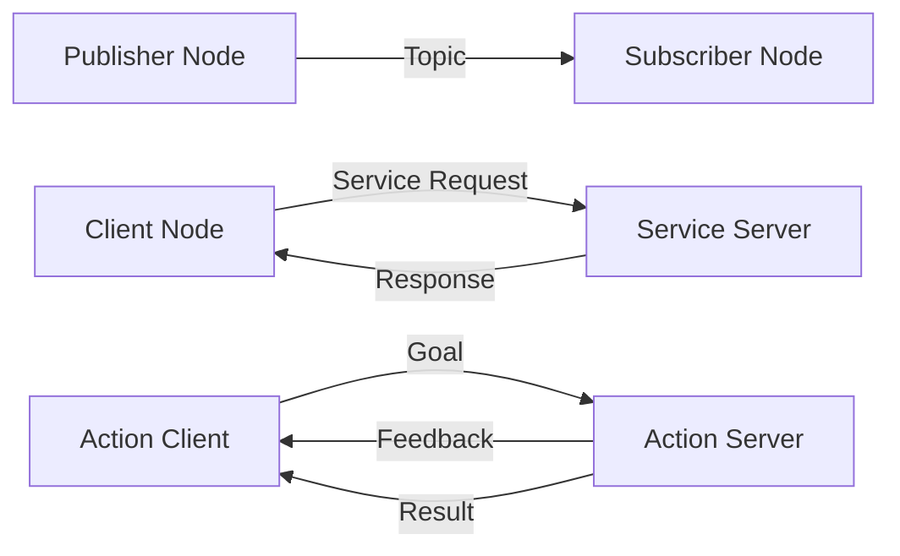

# Module 1: ROS 2 Fundamentals

## 📚 Learning Outcomes

By the end of this module, you will be able to:

1. **Architect** distributed robot applications using ROS 2's publisher/subscriber, service, and action patterns
2. **Develop** production-quality ROS 2 nodes in Python and C++
3. **Configure** Quality of Service (QoS) policies for reliable real-time communication
4. **Build** custom message and service types for domain-specific applications
5. **Orchestrate** complex multi-node systems using launch files
6. **Debug** ROS 2 applications using command-line introspection tools

## 🎯 Module Overview

**Duration**: 3 weeks (21 days)
**Prerequisites**: Python programming, Linux command line, Physical AI foundations (Weeks 1-2)

ROS 2 (Robot Operating System 2) is the industry-standard middleware for building robot software. Unlike its predecessor ROS 1, ROS 2 is built for:
- **Production deployment** (not just research)
- **Real-time** communication with deterministic timing
- **Multi-robot** systems with distributed computing
- **Security** with DDS (Data Distribution Service) authentication

This module takes you from zero ROS 2 knowledge to building production-grade robotics applications.

---

## Weekly Breakdown

### **Week 3: ROS 2 Architecture & Communication**

**Topics**:
- ROS 2 architecture: nodes, topics, services, actions
- DDS middleware and Quality of Service (QoS)
- Publish/subscribe pattern for sensor data streaming
- Request/response pattern with services
- Long-running tasks with actions

**Hands-On**:
- Install ROS 2 Humble
- Create your first publisher and subscriber nodes
- Implement a service for robot state queries
- Build an action server for navigation

**Assessment**: Build a teleoperation system with keyboard input published to `/cmd_vel` topic

### **Week 4: Building ROS 2 Applications**

**Topics**:
- Creating ROS 2 packages with Python and C++
- Parameter management and dynamic reconfiguration
- Coordinate transforms with `tf2`
- Time synchronization and clock management
- ROS 2 logging and diagnostics

**Hands-On**:
- Build a sensor fusion package combining camera and odometry
- Configure parameters via YAML files
- Publish transforms for a robot arm
- Debug nodes using `ros2 topic echo` and `ros2 node info`

**Assessment**: Sensor fusion node that combines IMU and wheel odometry for dead reckoning

### **Week 5: Advanced ROS 2 & Production Deployment**

**Topics**:
- Custom message and service definitions
- Launch files for multi-node orchestration
- Lifecycle nodes and managed composition
- ROS 2 bags for recording and playback
- Integration with Gazebo simulation

**Hands-On**:
- Define custom messages for robot state
- Write launch files with conditional logic
- Implement lifecycle nodes with state transitions
- Record sensor data to ROS bags
- Connect ROS 2 nodes to Gazebo robot

**Assessment**: Complete mobile robot system with navigation, perception, and control nodes launched via single launch file

---

## Key Technologies

### **ROS 2 Communication Patterns**



### **Why ROS 2?**

| Feature | ROS 1 | ROS 2 |
|---------|-------|-------|
| **Real-time** | ❌ Best-effort | ✅ DDS with QoS |
| **Multi-robot** | ⚠️ Requires custom networking | ✅ Native support |
| **Security** | ❌ None | ✅ DDS security |
| **Production** | ⚠️ Research-focused | ✅ Industrial-grade |
| **Platforms** | 🐧 Linux only | ✅ Linux, Windows, macOS |
| **Language** | Python 2, C++ | Python 3, C++14+ |

---

## Recommended Schedule

### **Week 3**: Architecture & Communication (7 days)
- **Day 1-2**: Install ROS 2, understand architecture, run tutorials
- **Day 3-4**: Build publisher/subscriber nodes (Python)
- **Day 5**: Implement service client/server
- **Day 6**: Create action server for long-running tasks
- **Day 7**: Assessment project + review

### **Week 4**: Building Applications (7 days)
- **Day 8-9**: Create ROS 2 packages, parameter management
- **Day 10-11**: Work with `tf2` for coordinate transforms
- **Day 12-13**: Sensor fusion project
- **Day 14**: Assessment + debugging practice

### **Week 5**: Advanced & Production (7 days)
- **Day 15-16**: Custom messages and services
- **Day 17-18**: Launch files and lifecycle nodes
- **Day 19-20**: ROS bags and Gazebo integration
- **Day 21**: Final assessment + module review

---

## Module Assessment: Mobile Robot Navigation System

**Objective**: Build a complete ROS 2 application for a simulated mobile robot

**Requirements**:
1. **Teleoperation Node**: Keyboard control publishing to `/cmd_vel`
2. **Sensor Fusion Node**: Combine camera and odometry data
3. **Obstacle Avoidance Node**: Reactive control using laser scan
4. **State Publisher**: Broadcast robot pose to `/tf`
5. **Launch File**: Start all nodes with single command
6. **ROS Bag**: Record 1 minute of sensor data

**Success Criteria**:
- Robot navigates 10 meters without collisions
- All nodes communicate via proper QoS settings
- Launch file includes parameter configuration
- Code follows ROS 2 best practices (naming, structure, logging)

**Deliverables**:
- Source code (ROS 2 workspace with packages)
- Launch file
- README with setup instructions
- Demo video (2-3 minutes)

---

## Code Example: Publisher/Subscriber Pattern

```python
# publisher_node.py
import rclpy
from rclpy.node import Node
from std_msgs.msg import String

class PublisherNode(Node):
    def __init__(self):
        super().__init__('publisher_node')
        self.publisher_ = self.create_publisher(String, 'topic', 10)
        self.timer = self.create_timer(1.0, self.timer_callback)
        self.counter = 0

    def timer_callback(self):
        msg = String()
        msg.data = f'Hello ROS 2: {self.counter}'
        self.publisher_.publish(msg)
        self.get_logger().info(f'Publishing: "{msg.data}"')
        self.counter += 1

def main(args=None):
    rclpy.init(args=args)
    node = PublisherNode()
    rclpy.spin(node)
    node.destroy_node()
    rclpy.shutdown()

if __name__ == '__main__':
    main()
```

```python
# subscriber_node.py
import rclpy
from rclpy.node import Node
from std_msgs.msg import String

class SubscriberNode(Node):
    def __init__(self):
        super().__init__('subscriber_node')
        self.subscription = self.create_subscription(
            String,
            'topic',
            self.listener_callback,
            10)

    def listener_callback(self, msg):
        self.get_logger().info(f'Received: "{msg.data}"')

def main(args=None):
    rclpy.init(args=args)
    node = SubscriberNode()
    rclpy.spin(node)
    node.destroy_node()
    rclpy.shutdown()

if __name__ == '__main__':
    main()
```

**Run the nodes**:
```bash
# Terminal 1
ros2 run my_package publisher_node

# Terminal 2
ros2 run my_package subscriber_node

# Inspect topics
ros2 topic list
ros2 topic echo /topic
ros2 topic hz /topic
```

---

## Key Takeaways

After completing Module 1, you should understand:

✅ **ROS 2 is a middleware**, not an operating system—it sits between your application code and the OS
✅ **Nodes are the building blocks**—each node does one thing well
✅ **Topics for data streams**—sensor readings, robot state
✅ **Services for requests**—query current pose, trigger calibration
✅ **Actions for long tasks**—navigation, grasping, multi-step plans
✅ **QoS policies matter**—reliable vs. best-effort, durability, lifespan
✅ **Launch files orchestrate complexity**—start dozens of nodes with one command

---

## What's Next?

With ROS 2 fundamentals mastered, you're ready to simulate and test your robots:

👉 **[Module 2: Robot Simulation](/docs/03-gazebo-simulation/)** — Build high-fidelity simulations in Gazebo

---

## Additional Resources

- [ROS 2 Humble Documentation](https://docs.ros.org/en/humble/)
- [ROS 2 Design Docs](https://design.ros2.org/)
- [Quality of Service Guide](https://docs.ros.org/en/humble/Concepts/About-Quality-of-Service-Settings.html)
- [ROS 2 Best Practices](https://github.com/ros2/ros2_documentation)
- [Awesome ROS 2 (GitHub)](https://github.com/fkromer/awesome-ros2)
