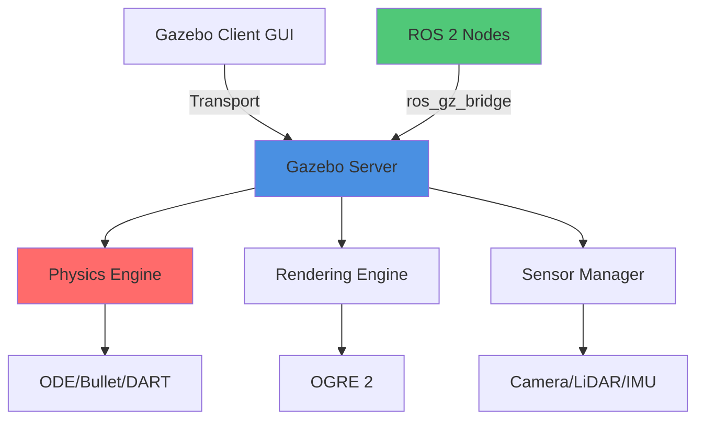

# Gazebo Environment Setup

Gazebo is a powerful 3D robotics simulator that enables testing and development of robots in realistic environments without hardware. This guide covers installing and configuring Gazebo with ROS 2 for simulation-based robotics development.

## Overview

Gazebo provides:
- High-fidelity physics simulation
- Realistic sensor simulation (cameras, LiDAR, IMU)
- Support for multiple physics engines
- Integration with ROS 2 ecosystem
- Distributed simulation capabilities

## Gazebo Architecture



### Client-Server Model

Gazebo uses a client-server architecture:

- **Gazebo Server** (`gz sim -s`): Runs physics and sensor simulation
- **Gazebo Client** (`gz sim -g`): Provides GUI for visualization
- **Transport Layer**: Uses Ignition Transport for communication

This separation enables:
- Running simulations on powerful servers with lightweight clients
- Headless simulation for automated testing
- Multiple clients connected to one server

### Gazebo vs gz Command

Understanding the command-line tools:

```bash
# Legacy command (Gazebo Classic, up to version 11)
gazebo empty.world

# New Ignition/Gazebo (version 6+)
gz sim empty.sdf

# Alternative names based on version
ign gazebo empty.sdf  # Ignition Gazebo (Fortress)
gz sim empty.sdf       # Gazebo (Garden, Harmonic)
```

## Installation

### Prerequisites

Ensure you have ROS 2 Humble installed:

```bash
# Verify ROS 2 installation
source /opt/ros/humble/setup.bash
ros2 --version
```

### Installing Gazebo Garden with ROS 2 Humble

```bash
# Add OSRF repository
sudo wget https://packages.osrfoundation.org/gazebo.gpg -O /usr/share/keyrings/pkgs-osrf-archive-keyring.gpg
echo "deb [arch=$(dpkg --print-architecture) signed-by=/usr/share/keyrings/pkgs-osrf-archive-keyring.gpg] http://packages.osrfoundation.org/gazebo/ubuntu-stable $(lsb_release -cs) main" | sudo tee /etc/apt/sources.list.d/gazebo-stable.list > /dev/null

# Update package list
sudo apt update

# Install Gazebo Garden (recommended for ROS 2 Humble)
sudo apt install gz-garden

# Install ROS 2 - Gazebo bridge
sudo apt install ros-humble-ros-gz-bridge ros-humble-ros-gz-sim ros-humble-ros-gz-interfaces

# Verify installation
gz sim --version
```

### Post-Installation Configuration

Set up environment variables in `~/.bashrc`:

```bash
# Add to ~/.bashrc
source /opt/ros/humble/setup.bash
export GZ_SIM_RESOURCE_PATH=$HOME/gazebo_models:$GZ_SIM_RESOURCE_PATH
export GZ_SIM_SYSTEM_PLUGIN_PATH=/opt/ros/humble/lib:$GZ_SIM_SYSTEM_PLUGIN_PATH

# Source the file
source ~/.bashrc
```

## Creating Simulation Worlds

### Basic World File Structure

World files use SDF (Simulation Description Format):

```xml
<?xml version="1.0" ?>
<sdf version="1.8">
  <world name="basic_world">
    <!-- Physics configuration -->
    <physics name="1ms" type="ode">
      <max_step_size>0.001</max_step_size>
      <real_time_factor>1.0</real_time_factor>
    </physics>

    <!-- Scene configuration -->
    <scene>
      <ambient>0.4 0.4 0.4</ambient>
      <background>0.7 0.7 0.7</background>
      <shadows>true</shadows>
    </scene>

    <!-- Sun light -->
    <light type="directional" name="sun">
      <cast_shadows>true</cast_shadows>
      <pose>0 0 10 0 0 0</pose>
      <diffuse>0.8 0.8 0.8 1</diffuse>
      <specular>0.2 0.2 0.2 1</specular>
      <direction>-0.5 0.1 -0.9</direction>
    </light>

    <!-- Ground plane -->
    <model name="ground_plane">
      <static>true</static>
      <link name="link">
        <collision name="collision">
          <geometry>
            <plane>
              <normal>0 0 1</normal>
            </plane>
          </geometry>
        </collision>
        <visual name="visual">
          <geometry>
            <plane>
              <normal>0 0 1</normal>
              <size>100 100</size>
            </plane>
          </geometry>
          <material>
            <ambient>0.8 0.8 0.8 1</ambient>
            <diffuse>0.8 0.8 0.8 1</diffuse>
          </material>
        </visual>
      </link>
    </model>
  </world>
</sdf>
```

Save as `basic_world.sdf` and run:

```bash
gz sim basic_world.sdf
```

### Warehouse Environment

Creating a realistic warehouse simulation:

```xml
<?xml version="1.0" ?>
<sdf version="1.8">
  <world name="warehouse">
    <physics name="1ms" type="ode">
      <max_step_size>0.001</max_step_size>
      <real_time_factor>1.0</real_time_factor>
    </physics>

    <scene>
      <ambient>0.5 0.5 0.5</ambient>
      <background>0.3 0.3 0.3</background>
      <shadows>true</shadows>
    </scene>

    <!-- Overhead lighting -->
    <light type="point" name="light1">
      <pose>5 5 5 0 0 0</pose>
      <diffuse>0.8 0.8 0.8 1</diffuse>
      <specular>0.1 0.1 0.1 1</specular>
      <attenuation>
        <range>20</range>
        <linear>0.1</linear>
        <constant>0.2</constant>
        <quadratic>0.01</quadratic>
      </attenuation>
    </light>

    <light type="point" name="light2">
      <pose>-5 5 5 0 0 0</pose>
      <diffuse>0.8 0.8 0.8 1</diffuse>
      <specular>0.1 0.1 0.1 1</specular>
      <attenuation>
        <range>20</range>
      </attenuation>
    </light>

    <!-- Ground -->
    <model name="ground">
      <static>true</static>
      <link name="link">
        <collision name="collision">
          <geometry>
            <plane>
              <normal>0 0 1</normal>
            </plane>
          </geometry>
        </collision>
        <visual name="visual">
          <geometry>
            <plane>
              <normal>0 0 1</normal>
              <size>50 50</size>
            </plane>
          </geometry>
          <material>
            <ambient>0.5 0.5 0.5 1</ambient>
            <diffuse>0.5 0.5 0.5 1</diffuse>
          </material>
        </visual>
      </link>
    </model>

    <!-- Walls -->
    <model name="wall_north">
      <static>true</static>
      <pose>0 10 1.5 0 0 0</pose>
      <link name="link">
        <collision name="collision">
          <geometry>
            <box>
              <size>20 0.2 3</size>
            </box>
          </geometry>
        </collision>
        <visual name="visual">
          <geometry>
            <box>
              <size>20 0.2 3</size>
            </box>
          </geometry>
          <material>
            <ambient>0.7 0.7 0.7 1</ambient>
            <diffuse>0.7 0.7 0.7 1</diffuse>
          </material>
        </visual>
      </link>
    </model>

    <!-- Shelving units -->
    <model name="shelf_1">
      <static>true</static>
      <pose>5 0 0.75 0 0 0</pose>
      <link name="link">
        <collision name="collision">
          <geometry>
            <box>
              <size>2 0.5 1.5</size>
            </box>
          </geometry>
        </collision>
        <visual name="visual">
          <geometry>
            <box>
              <size>2 0.5 1.5</size>
            </box>
          </geometry>
          <material>
            <ambient>0.8 0.6 0.4 1</ambient>
            <diffuse>0.8 0.6 0.4 1</diffuse>
          </material>
        </visual>
      </link>
    </model>

    <!-- Boxes on shelves -->
    <model name="box_1">
      <pose>5 0 1.6 0 0 0</pose>
      <link name="link">
        <inertial>
          <mass>1.0</mass>
          <inertia>
            <ixx>0.0083</ixx>
            <iyy>0.0083</iyy>
            <izz>0.0083</izz>
          </inertia>
        </inertial>
        <collision name="collision">
          <geometry>
            <box>
              <size>0.3 0.3 0.3</size>
            </box>
          </geometry>
        </collision>
        <visual name="visual">
          <geometry>
            <box>
              <size>0.3 0.3 0.3</size>
            </box>
          </geometry>
          <material>
            <ambient>0.8 0.3 0.3 1</ambient>
            <diffuse>0.8 0.3 0.3 1</diffuse>
          </material>
        </visual>
      </link>
    </model>
  </world>
</sdf>
```

### Outdoor Terrain

Creating outdoor environments with heightmaps:

```xml
<?xml version="1.0" ?>
<sdf version="1.8">
  <world name="outdoor_terrain">
    <physics name="1ms" type="ode">
      <max_step_size>0.001</max_step_size>
      <real_time_factor>1.0</real_time_factor>
    </physics>

    <scene>
      <ambient>0.6 0.6 0.6</ambient>
      <background>0.5 0.7 0.9</background>
      <sky>
        <clouds>
          <speed>12</speed>
        </clouds>
      </sky>
      <shadows>true</shadows>
    </scene>

    <!-- Sun -->
    <light type="directional" name="sun">
      <cast_shadows>true</cast_shadows>
      <pose>0 0 10 0 0 0</pose>
      <diffuse>0.9 0.9 0.8 1</diffuse>
      <specular>0.2 0.2 0.2 1</specular>
      <direction>-0.5 0.1 -0.9</direction>
    </light>

    <!-- Terrain with heightmap -->
    <model name="terrain">
      <static>true</static>
      <link name="link">
        <collision name="collision">
          <geometry>
            <heightmap>
              <uri>https://fuel.gazebosim.org/1.0/OpenRobotics/models/Heightmap/tip/files/materials/textures/heightmap.png</uri>
              <size>129 129 10</size>
              <pos>0 0 -5</pos>
            </heightmap>
          </geometry>
        </collision>
        <visual name="visual">
          <geometry>
            <heightmap>
              <uri>https://fuel.gazebosim.org/1.0/OpenRobotics/models/Heightmap/tip/files/materials/textures/heightmap.png</uri>
              <size>129 129 10</size>
              <pos>0 0 -5</pos>
              <texture>
                <diffuse>https://fuel.gazebosim.org/1.0/OpenRobotics/models/Heightmap/tip/files/materials/textures/dirt_diffusespecular.png</diffuse>
                <normal>https://fuel.gazebosim.org/1.0/OpenRobotics/models/Heightmap/tip/files/materials/textures/flat_normal.png</normal>
                <size>5</size>
              </texture>
            </heightmap>
          </geometry>
        </visual>
      </link>
    </model>
  </world>
</sdf>
```

## Spawning Objects and Robots

### Using Gazebo GUI

1. **Launch Gazebo**: `gz sim warehouse.sdf`
2. **Add models**: Click the "Insert" button (top left)
3. **Browse models**: Select from local or Gazebo Fuel models
4. **Position**: Click to place in the world
5. **Adjust**: Use transform controls to reposition

### Using Command Line

```bash
# Spawn a model from SDF file
gz service -s /world/warehouse/create \
  --reqtype gz.msgs.EntityFactory \
  --reptype gz.msgs.Boolean \
  --timeout 1000 \
  --req 'sdf_filename: "/path/to/robot.sdf", name: "my_robot"'
```

### Programmatic Spawning with ROS 2

Create a Python script to spawn robots:

```python
#!/usr/bin/env python3

import rclpy
from rclpy.node import Node
from ros_gz_interfaces.srv import SpawnEntity
import os

class RobotSpawner(Node):
    def __init__(self):
        super().__init__('robot_spawner')
        self.client = self.create_client(SpawnEntity, '/world/warehouse/create')

        while not self.client.wait_for_service(timeout_sec=1.0):
            self.get_logger().info('Waiting for spawn service...')

    def spawn_robot(self, name, sdf_file, x=0.0, y=0.0, z=0.5):
        """Spawn a robot at specified position"""

        # Read SDF file
        with open(sdf_file, 'r') as f:
            sdf_content = f.read()

        # Create request
        request = SpawnEntity.Request()
        request.name = name
        request.xml = sdf_content
        request.robot_namespace = name
        request.initial_pose.position.x = x
        request.initial_pose.position.y = y
        request.initial_pose.position.z = z

        # Send request
        future = self.client.call_async(request)
        rclpy.spin_until_future_complete(self, future)

        if future.result() is not None:
            self.get_logger().info(f'Successfully spawned {name}')
            return True
        else:
            self.get_logger().error(f'Failed to spawn {name}')
            return False

def main(args=None):
    rclpy.init(args=args)
    spawner = RobotSpawner()

    # Spawn multiple robots
    sdf_file = os.path.expanduser('~/ros2_ws/src/my_robot/models/robot.sdf')

    spawner.spawn_robot('robot_1', sdf_file, x=0.0, y=0.0)
    spawner.spawn_robot('robot_2', sdf_file, x=2.0, y=0.0)
    spawner.spawn_robot('robot_3', sdf_file, x=4.0, y=0.0)

    spawner.destroy_node()
    rclpy.shutdown()

if __name__ == '__main__':
    main()
```

## Using Gazebo Tools

### GUI Controls

**Navigation**:
- **Orbit**: Left-click + drag
- **Pan**: Middle-click + drag or Shift + left-click + drag
- **Zoom**: Scroll wheel
- **Look**: Right-click + drag

**Manipulation**:
- **Select**: Click objects
- **Translate**: T key (then drag arrows)
- **Rotate**: R key (then drag circles)
- **Scale**: S key (then drag boxes)

### Command-Line Tools

```bash
# List running worlds
gz topic -l | grep world

# Get world state
gz topic -e -t /world/warehouse/state

# List all models
gz model -m

# Get model info
gz model -m robot_1 -i

# Set model pose
gz model -m robot_1 -p "1,2,0.5,0,0,0"

# Pause/unpause simulation
gz service -s /world/warehouse/control \
  --reqtype gz.msgs.WorldControl \
  --reptype gz.msgs.Boolean \
  --req 'pause: true'

# Reset simulation
gz service -s /world/warehouse/control \
  --reqtype gz.msgs.WorldControl \
  --reptype gz.msgs.Boolean \
  --req 'reset: {all: true}'
```

### Topic Inspection

```bash
# List all topics
gz topic -l

# Echo a topic
gz topic -e -t /world/warehouse/stats

# Get topic info
gz topic -i -t /clock

# Publish to a topic
gz topic -t /cmd_vel -m gz.msgs.Twist \
  -p "linear: {x: 0.5}, angular: {z: 0.2}"
```

## Key Takeaways

- Gazebo uses a client-server architecture enabling distributed simulation
- World files define the simulation environment using SDF format
- Models can be spawned through GUI, CLI, or programmatically via ROS 2
- The `gz` command provides extensive tools for simulation control
- Proper lighting and physics configuration are crucial for realistic simulation
- Environment complexity should balance realism with performance

## Additional Resources

- [Gazebo Documentation](https://gazebosim.org/docs)
- [SDF Format Specification](http://sdformat.org/)
- [Gazebo Fuel Models](https://app.gazebosim.org/fuel/models)
- [ROS 2 Gazebo Integration](https://github.com/gazebosim/ros_gz)
- [Gazebo Tutorials](https://gazebosim.org/docs/latest/tutorials)

## Hands-On Exercises

### Exercise 1: Custom World Creation

Create a world file for a robotics competition arena:
- 10m x 10m playing field
- Colored zones (red, blue, green)
- Obstacles (cylinders, boxes)
- Proper lighting from all sides
- Goal areas at opposite ends

**Objectives**:
- Practice SDF syntax
- Understand lighting and materials
- Create reusable model definitions

### Exercise 2: Dynamic Object Spawning

Write a ROS 2 node that:
- Spawns 10 random boxes at startup
- Each box has random size (0.1-0.5m)
- Random positions within 5m radius
- Random colors
- Implements cleanup service to remove all boxes

**Skills developed**:
- ROS 2 service clients
- Gazebo spawn service
- Random generation
- Service implementation

### Exercise 3: Environment Inspector

Create a tool that:
- Lists all models in current world
- Displays their positions and orientations
- Shows model hierarchy (links, joints)
- Exports world state to JSON
- Implements real-time monitoring (1Hz updates)

**Learning outcomes**:
- Gazebo service API
- Topic subscription
- Data serialization
- Real-time systems

---

**Next**: [URDF and SDF Modeling](./urdf-sdf) - Learn to create detailed robot models
