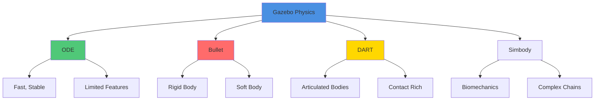
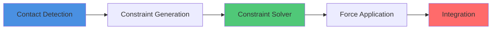

# Physics Simulation

Accurate physics simulation is critical for developing robust robot controllers. This guide covers physics engines, contact dynamics, and performance optimization in Gazebo.

## Physics Engines Overview

Gazebo supports multiple physics engines, each with different trade-offs.



### Physics Engine Comparison

| Engine | Speed | Stability | Features | Best For |
|--------|-------|-----------|----------|----------|
| **ODE** | Fast | Good | Basic | Mobile robots, simple articulation |
| **Bullet** | Medium | Good | Rigid+Soft body | Manipulation, deformable objects |
| **DART** | Medium | Excellent | Advanced contacts | Legged robots, complex dynamics |
| **Simbody** | Slower | Excellent | Biological systems | Humanoids, biomechanics |

### Selecting a Physics Engine

```xml
<?xml version="1.0" ?>
<sdf version="1.8">
  <world name="physics_demo">

    <!-- ODE Physics Engine -->
    <physics name="ode_physics" type="ode">
      <max_step_size>0.001</max_step_size>
      <real_time_factor>1.0</real_time_factor>
      <real_time_update_rate>1000</real_time_update_rate>

      <ode>
        <solver>
          <type>quick</type>
          <iters>50</iters>
          <sor>1.3</sor>
        </solver>
        <constraints>
          <cfm>0.0</cfm>
          <erp>0.2</erp>
          <contact_max_correcting_vel>100.0</contact_max_correcting_vel>
          <contact_surface_layer>0.001</contact_surface_layer>
        </constraints>
      </ode>
    </physics>

    <!-- Bullet Physics Engine -->
    <physics name="bullet_physics" type="bullet" default="false">
      <max_step_size>0.001</max_step_size>
      <real_time_factor>1.0</real_time_factor>

      <bullet>
        <solver>
          <type>sequential_impulse</type>
          <iters>50</iters>
          <sor>1.3</sor>
        </solver>
        <constraints>
          <cfm>0.0</cfm>
          <erp>0.2</erp>
          <split_impulse>true</split_impulse>
          <split_impulse_penetration_threshold>-0.01</split_impulse_penetration_threshold>
        </constraints>
      </bullet>
    </physics>

    <!-- DART Physics Engine -->
    <physics name="dart_physics" type="dart" default="false">
      <max_step_size>0.001</max_step_size>
      <real_time_factor>1.0</real_time_factor>

      <dart>
        <solver>
          <type>dantzig</type>
        </solver>
        <collision_detector>bullet</collision_detector>
      </dart>
    </physics>

  </world>
</sdf>
```

## Configuring Physics Properties

### Gravity

```xml
<world name="custom_gravity">
  <physics name="physics" type="ode">
    <!-- Earth gravity -->
    <gravity>0 0 -9.81</gravity>

    <!-- Mars gravity -->
    <!-- <gravity>0 0 -3.721</gravity> -->

    <!-- Moon gravity -->
    <!-- <gravity>0 0 -1.62</gravity> -->

    <!-- Zero gravity -->
    <!-- <gravity>0 0 0</gravity> -->
  </physics>
</world>
```

### Friction

Friction determines how surfaces interact:

```xml
<collision name="collision">
  <geometry>
    <box>
      <size>1 1 0.1</size>
    </box>
  </geometry>

  <surface>
    <friction>
      <ode>
        <!-- Primary friction direction -->
        <mu>1.0</mu>
        <!-- Secondary friction direction -->
        <mu2>1.0</mu2>

        <!-- Friction direction (optional) -->
        <fdir1>0 0 0</fdir1>

        <!-- Slip compliance -->
        <slip1>0.0</slip1>
        <slip2>0.0</slip2>
      </ode>

      <bullet>
        <friction>1.0</friction>
        <friction2>1.0</friction2>
        <rolling_friction>0.01</rolling_friction>
      </bullet>
    </friction>

    <contact>
      <ode>
        <!-- Softness of contact -->
        <soft_cfm>0.0</soft_cfm>
        <soft_erp>0.2</soft_erp>

        <!-- Stiffness and damping -->
        <kp>1000000.0</kp>
        <kd>1.0</kd>

        <!-- Max contact force -->
        <max_vel>100.0</max_vel>
        <min_depth>0.001</min_depth>
      </ode>
    </contact>
  </surface>
</collision>
```

### Material Friction Values

Common friction coefficients:

| Material Pair | mu (friction) |
|---------------|---------------|
| Rubber on concrete | 1.0 - 1.5 |
| Rubber on dry asphalt | 0.7 - 1.0 |
| Steel on steel | 0.4 - 0.6 |
| Aluminum on steel | 0.45 - 0.65 |
| Wood on wood | 0.4 - 0.6 |
| Ice on ice | 0.02 - 0.05 |
| Teflon on steel | 0.04 - 0.08 |

### Restitution (Bounciness)

```xml
<surface>
  <bounce>
    <!-- Coefficient of restitution (0 = no bounce, 1 = perfect bounce) -->
    <restitution_coefficient>0.8</restitution_coefficient>

    <!-- Velocity threshold for bouncing -->
    <threshold>0.01</threshold>
  </bounce>
</surface>
```

Restitution values:
- **0.0**: Inelastic (clay, putty)
- **0.5**: Semi-elastic (basketball)
- **0.8**: Elastic (rubber ball)
- **0.95**: Highly elastic (superball)

## Contact Dynamics

### Understanding Contacts



### Contact Parameters

```xml
<collision name="collision">
  <surface>
    <contact>
      <collide_without_contact>false</collide_without_contact>
      <collide_without_contact_bitmask>1</collide_without_contact_bitmask>
      <collide_bitmask>1</collide_bitmask>

      <ode>
        <!-- Contact constraint force mixing -->
        <soft_cfm>0.0</soft_cfm>

        <!-- Error reduction parameter -->
        <soft_erp>0.2</soft_erp>

        <!-- Spring stiffness -->
        <kp>1000000.0</kp>

        <!-- Damping coefficient -->
        <kd>1.0</kd>

        <!-- Maximum correcting velocity -->
        <max_vel>100.0</max_vel>

        <!-- Minimum penetration depth -->
        <min_depth>0.001</min_depth>
      </ode>

      <bullet>
        <soft_cfm>0.0</soft_cfm>
        <soft_erp>0.2</soft_erp>
        <kp>1000000.0</kp>
        <kd>1.0</kd>
        <split_impulse>true</split_impulse>
        <split_impulse_penetration_threshold>-0.01</split_impulse_penetration_threshold>
      </bullet>
    </contact>
  </surface>
</collision>
```

### Collision Detection

```xml
<world name="collision_demo">
  <physics type="ode">
    <ode>
      <constraints>
        <!-- Maximum number of contacts between two bodies -->
        <contact_max_correcting_vel>100</contact_max_correcting_vel>

        <!-- Depth of surface layer for contacts -->
        <contact_surface_layer>0.001</contact_surface_layer>
      </constraints>
    </ode>
  </physics>

  <!-- Model with collision filtering -->
  <model name="filtered_collisions">
    <link name="link1">
      <collision name="collision">
        <geometry>
          <box>
            <size>1 1 1</size>
          </box>
        </geometry>

        <!-- Collision bitmask filtering -->
        <surface>
          <contact>
            <!-- This link collides with bitmask 0x01 -->
            <collide_bitmask>0x01</collide_bitmask>
          </contact>
        </surface>
      </collision>
    </link>
  </model>
</world>
```

## Inertia and Center of Mass

### Calculating Inertia Tensors

Accurate inertia is crucial for realistic dynamics:

```python
import numpy as np

class InertiaTensor:
    """Calculate inertia tensors for common shapes"""

    @staticmethod
    def box(mass, x, y, z):
        """Box inertia tensor"""
        ixx = mass * (y**2 + z**2) / 12
        iyy = mass * (x**2 + z**2) / 12
        izz = mass * (x**2 + y**2) / 12
        return np.diag([ixx, iyy, izz])

    @staticmethod
    def cylinder(mass, radius, length, axis='z'):
        """Cylinder inertia tensor along specified axis"""
        if axis == 'z':
            ixx = mass * (3*radius**2 + length**2) / 12
            iyy = ixx
            izz = mass * radius**2 / 2
        elif axis == 'y':
            iyy = mass * (3*radius**2 + length**2) / 12
            ixx = mass * radius**2 / 2
            izz = iyy
        else:  # x-axis
            ixx = mass * (3*radius**2 + length**2) / 12
            iyy = mass * radius**2 / 2
            izz = ixx
        return np.diag([ixx, iyy, izz])

    @staticmethod
    def sphere(mass, radius):
        """Sphere inertia tensor"""
        i = 2 * mass * radius**2 / 5
        return np.diag([i, i, i])

    @staticmethod
    def parallel_axis_theorem(I_cm, mass, d):
        """
        Apply parallel axis theorem
        I_cm: Inertia tensor at center of mass
        mass: Object mass
        d: Displacement vector [dx, dy, dz]
        """
        d = np.array(d)
        d_squared = np.dot(d, d)
        d_outer = np.outer(d, d)

        I_parallel = I_cm + mass * (d_squared * np.eye(3) - d_outer)
        return I_parallel

    @staticmethod
    def composite_inertia(inertias, masses, positions):
        """
        Combine multiple bodies into single inertia tensor
        inertias: List of 3x3 inertia tensors
        masses: List of masses
        positions: List of [x, y, z] positions relative to new origin
        """
        total_mass = sum(masses)

        # Find center of mass
        com = np.zeros(3)
        for m, pos in zip(masses, positions):
            com += m * np.array(pos)
        com /= total_mass

        # Calculate composite inertia
        I_total = np.zeros((3, 3))
        for I, m, pos in zip(inertias, masses, positions):
            d = np.array(pos) - com
            I_total += InertiaTensor.parallel_axis_theorem(I, m, d)

        return I_total, com

# Example usage
if __name__ == "__main__":
    # Box: 0.5m x 0.3m x 0.2m, mass 10kg
    I_box = InertiaTensor.box(10.0, 0.5, 0.3, 0.2)
    print("Box inertia:")
    print(I_box)

    # Cylinder: radius 0.15m, length 0.05m, mass 1kg
    I_cyl = InertiaTensor.cylinder(1.0, 0.15, 0.05, axis='z')
    print("\nCylinder inertia:")
    print(I_cyl)

    # Composite: box + two wheels
    I_composite, com = InertiaTensor.composite_inertia(
        inertias=[I_box, I_cyl, I_cyl],
        masses=[10.0, 1.0, 1.0],
        positions=[[0, 0, 0], [0, 0.25, 0], [0, -0.25, 0]]
    )
    print("\nComposite inertia:")
    print(I_composite)
    print("Center of mass:", com)
```

### Inertia in SDF

```xml
<link name="complex_link">
  <inertial>
    <!-- Center of mass offset -->
    <pose>0.05 0 0.02 0 0 0</pose>

    <!-- Mass -->
    <mass>12.5</mass>

    <!-- Inertia tensor -->
    <inertia>
      <ixx>0.2292</ixx>
      <iyy>0.5208</iyy>
      <izz>0.6250</izz>
      <ixy>0.0</ixy>
      <ixz>0.01</ixz>
      <iyz>0.0</iyz>
    </inertia>
  </inertial>

  <!-- Visual and collision geometry -->
  <visual name="visual">
    <geometry>
      <mesh>
        <uri>model://my_robot/meshes/complex_part.dae</uri>
      </mesh>
    </geometry>
  </visual>
</link>
```

## Actuator Models

### Motor Models

```xml
<joint name="wheel_joint" type="revolute">
  <parent>base_link</parent>
  <child>wheel_link</child>
  <axis>
    <xyz>0 0 1</xyz>

    <!-- Joint limits -->
    <limit>
      <lower>-1e16</lower>
      <upper>1e16</upper>
      <effort>10.0</effort>
      <velocity>20.0</velocity>
    </limit>

    <!-- Joint dynamics -->
    <dynamics>
      <damping>0.1</damping>
      <friction>0.05</friction>
      <spring_reference>0</spring_reference>
      <spring_stiffness>0</spring_stiffness>
    </dynamics>
  </axis>
</joint>
```

### Servo Models

Servos have position control with limits:

```xml
<joint name="arm_joint" type="revolute">
  <parent>base_link</parent>
  <child>arm_link</child>
  <axis>
    <xyz>0 1 0</xyz>

    <limit>
      <!-- Joint range -->
      <lower>-1.57</lower>
      <upper>1.57</upper>

      <!-- Maximum torque -->
      <effort>50.0</effort>

      <!-- Maximum velocity -->
      <velocity>2.0</velocity>
    </limit>

    <dynamics>
      <!-- Damping simulates internal friction -->
      <damping>1.0</damping>

      <!-- Friction at joint -->
      <friction>0.5</friction>
    </dynamics>
  </axis>
</joint>

<!-- Add PID control plugin -->
<plugin filename="gz-sim-joint-position-controller-system"
        name="gz::sim::systems::JointPositionController">
  <joint_name>arm_joint</joint_name>
  <topic>arm_position_cmd</topic>
  <p_gain>100</p_gain>
  <i_gain>0.1</i_gain>
  <d_gain>10</d_gain>
  <i_max>1.0</i_max>
  <i_min>-1.0</i_min>
  <cmd_max>50.0</cmd_max>
  <cmd_min>-50.0</cmd_min>
</plugin>
```

### Advanced Motor Control

ROS 2 node for motor control with velocity ramping:

```python
#!/usr/bin/env python3

import rclpy
from rclpy.node import Node
from std_msgs.msg import Float64
from sensor_msgs.msg import JointState
import numpy as np

class MotorController(Node):
    def __init__(self):
        super().__init__('motor_controller')

        # Parameters
        self.max_acceleration = 5.0  # rad/s^2
        self.max_velocity = 10.0     # rad/s
        self.max_torque = 10.0       # Nm

        # State
        self.current_velocity = 0.0
        self.target_velocity = 0.0
        self.current_position = 0.0

        # Publishers and subscribers
        self.joint_state_sub = self.create_subscription(
            JointState,
            '/joint_states',
            self.joint_state_callback,
            10
        )

        self.velocity_cmd_sub = self.create_subscription(
            Float64,
            '/motor/velocity_cmd',
            self.velocity_cmd_callback,
            10
        )

        self.effort_pub = self.create_publisher(
            Float64,
            '/motor/effort_cmd',
            10
        )

        # Control loop
        self.control_timer = self.create_timer(0.01, self.control_loop)

        # PID gains
        self.kp = 5.0
        self.ki = 0.1
        self.kd = 0.5
        self.integral_error = 0.0
        self.last_error = 0.0

    def joint_state_callback(self, msg):
        """Update current joint state"""
        if 'wheel_joint' in msg.name:
            idx = msg.name.index('wheel_joint')
            self.current_position = msg.position[idx]
            self.current_velocity = msg.velocity[idx]

    def velocity_cmd_callback(self, msg):
        """Receive target velocity command"""
        self.target_velocity = np.clip(msg.data, -self.max_velocity, self.max_velocity)

    def control_loop(self):
        """PID control with acceleration limits"""
        dt = 0.01

        # Calculate error
        error = self.target_velocity - self.current_velocity

        # PID terms
        p_term = self.kp * error
        self.integral_error += error * dt
        self.integral_error = np.clip(self.integral_error, -1.0, 1.0)
        i_term = self.ki * self.integral_error
        d_term = self.kd * (error - self.last_error) / dt

        # Calculate effort
        effort = p_term + i_term + d_term

        # Apply acceleration limits
        max_effort_from_accel = self.max_acceleration * dt
        effort = np.clip(effort, -max_effort_from_accel, max_effort_from_accel)

        # Apply torque limits
        effort = np.clip(effort, -self.max_torque, self.max_torque)

        # Publish command
        msg = Float64()
        msg.data = effort
        self.effort_pub.publish(msg)

        self.last_error = error

def main(args=None):
    rclpy.init(args=args)
    controller = MotorController()
    rclpy.spin(controller)
    controller.destroy_node()
    rclpy.shutdown()

if __name__ == '__main__':
    main()
```

## Debugging Physics Issues

### Common Problems

#### 1. Model Penetration

**Symptoms**: Models sink into ground or intersect

**Solutions**:
```xml
<physics type="ode">
  <ode>
    <constraints>
      <!-- Reduce contact surface layer -->
      <contact_surface_layer>0.0001</contact_surface_layer>

      <!-- Increase solver iterations -->
      <solver>
        <iters>100</iters>
      </solver>
    </constraints>
  </ode>
</physics>
```

#### 2. Unstable Simulation

**Symptoms**: Jittering, exploding models

**Solutions**:
```xml
<physics type="ode">
  <!-- Reduce step size -->
  <max_step_size>0.0005</max_step_size>

  <ode>
    <constraints>
      <!-- Increase ERP -->
      <erp>0.4</erp>

      <!-- Reduce CFM -->
      <cfm>0.0</cfm>
    </constraints>

    <solver>
      <!-- Increase iterations -->
      <iters>100</iters>

      <!-- Use world solver -->
      <type>world</type>
    </solver>
  </ode>
</physics>
```

#### 3. Slow Simulation

**Symptoms**: Real-time factor < 1.0

**Solutions**:
- Simplify collision geometry
- Reduce solver iterations
- Increase step size (carefully)
- Use faster physics engine
- Disable unnecessary sensors

### Physics Debugging Tools

Monitor physics performance:

```python
#!/usr/bin/env python3

import rclpy
from rclpy.node import Node
from rosgraph_msgs.msg import Clock
from gz.msgs import WorldStatistics
import time

class PhysicsMonitor(Node):
    def __init__(self):
        super().__init__('physics_monitor')

        self.last_sim_time = 0.0
        self.last_real_time = time.time()
        self.rtf_samples = []

        self.create_subscription(
            Clock,
            '/clock',
            self.clock_callback,
            10
        )

        self.create_timer(1.0, self.report)

    def clock_callback(self, msg):
        """Calculate real-time factor"""
        sim_time = msg.clock.sec + msg.clock.nanosec * 1e-9
        real_time = time.time()

        if self.last_sim_time > 0:
            sim_dt = sim_time - self.last_sim_time
            real_dt = real_time - self.last_real_time

            if real_dt > 0:
                rtf = sim_dt / real_dt
                self.rtf_samples.append(rtf)

                if len(self.rtf_samples) > 100:
                    self.rtf_samples.pop(0)

        self.last_sim_time = sim_time
        self.last_real_time = real_time

    def report(self):
        """Report physics performance"""
        if self.rtf_samples:
            avg_rtf = sum(self.rtf_samples) / len(self.rtf_samples)
            min_rtf = min(self.rtf_samples)
            max_rtf = max(self.rtf_samples)

            self.get_logger().info(
                f'RTF: avg={avg_rtf:.3f}, min={min_rtf:.3f}, max={max_rtf:.3f}'
            )

def main(args=None):
    rclpy.init(args=args)
    monitor = PhysicsMonitor()
    rclpy.spin(monitor)
    rclpy.shutdown()

if __name__ == '__main__':
    main()
```

## Performance Tuning

### Step Size Selection

```xml
<physics type="ode">
  <!-- Smaller = more accurate but slower -->
  <max_step_size>0.001</max_step_size>

  <!-- Target real-time performance -->
  <real_time_factor>1.0</real_time_factor>

  <!-- Update rate (Hz) -->
  <real_time_update_rate>1000</real_time_update_rate>
</physics>
```

**Guidelines**:
- Default: 0.001s (1ms)
- Fast robots: 0.0005s
- Slow robots: 0.002s
- Trade accuracy for speed

### Solver Iterations

```xml
<ode>
  <solver>
    <!-- More iterations = better accuracy -->
    <iters>50</iters>

    <!-- Quick solver for speed -->
    <type>quick</type>

    <!-- SOR parameter (1.0-1.3) -->
    <sor>1.3</sor>
  </solver>
</ode>
```

### Optimization Checklist

- [ ] Use simple collision geometry (boxes, cylinders, spheres)
- [ ] Minimize number of contacts
- [ ] Disable unused sensors
- [ ] Reduce sensor update rates
- [ ] Use appropriate physics engine
- [ ] Tune solver iterations
- [ ] Profile and identify bottlenecks
- [ ] Consider distributed simulation

## Key Takeaways

- Choose physics engine based on robot type and requirements
- Accurate inertia tensors are crucial for realistic dynamics
- Friction and restitution determine contact behavior
- Solver parameters balance accuracy and performance
- Monitor real-time factor to detect performance issues
- Debugging requires understanding constraint solvers
- Performance tuning is application-specific

## Additional Resources

- [ODE User Guide](https://ode.org/wiki/index.php/Manual)
- [Bullet Physics Documentation](https://pybullet.org/wordpress/)
- [DART Documentation](https://dartsim.github.io/)
- [Physics Simulation in Gazebo](https://gazebosim.org/api/sim/7/physicssystem.html)
- [Contact Dynamics Tutorial](https://gazebosim.org/api/sim/7/contact.html)

## Hands-On Exercises

### Exercise 1: Material Testing

Create a simulation to test different materials:
- Spawn spheres with different restitution (0.1 to 0.95)
- Drop from 2m height
- Measure bounce height
- Plot restitution vs bounce ratio
- Compare ODE, Bullet, and DART

### Exercise 2: Friction Analysis

Build a ramp test:
- Create adjustable angle ramp
- Place robot on ramp
- Find critical angle for different friction values
- Compare with theoretical predictions
- Test different physics engines

### Exercise 3: Performance Profiling

Optimize a complex scene:
- Warehouse with 20+ objects
- Mobile robot with sensors
- Measure baseline RTF
- Identify bottlenecks
- Apply optimizations
- Achieve RTF > 0.95

Target improvements:
- 20% from collision simplification
- 15% from sensor tuning
- 10% from solver optimization

---

**Next**: [Unity Visualization](./unity-visualization) - Photorealistic rendering integration

**Previous**: [URDF and SDF Modeling](./urdf-sdf)
