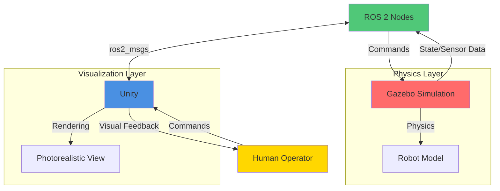

# Unity Visualization

Unity provides photorealistic rendering capabilities that complement Gazebo's physics simulation. This guide covers integrating Unity with ROS 2 and Gazebo for visualization, marketing demos, and human-robot interaction scenarios.

## Architecture Overview



### Why Unity + Gazebo?

| Aspect | Gazebo | Unity | Combined Benefit |
|--------|--------|-------|------------------|
| Physics | Excellent | Basic | Gazebo provides accurate physics |
| Graphics | Functional | Photorealistic | Unity provides visual quality |
| Sensors | Realistic | Limited | Gazebo simulates sensors |
| HRI | Limited | Excellent | Unity for human interaction |
| Performance | Good | Excellent | Offload rendering to Unity |

## Use Cases

### 1. Marketing and Demonstrations

- Photorealistic product demonstrations
- Customer presentations
- Trade show videos
- Investor pitches

### 2. Human-Robot Interaction

- Teleop interfaces with immersive views
- VR/AR robot control
- Training simulators
- User experience testing

### 3. Algorithm Visualization

- Path planning visualization
- Sensor data overlay
- Multi-robot coordination
- Debug visualization

### 4. Digital Twins

- Real-time robot mirroring
- Factory simulation
- Remote monitoring
- Predictive maintenance

## Unity-ROS 2 Setup

### Prerequisites

Install Unity (2021.3 LTS or later):

```bash
# Download Unity Hub
wget https://public-cdn.cloud.unity3d.com/hub/prod/UnityHubSetup.AppImage

# Make executable
chmod +x UnityHubSetup.AppImage

# Run Unity Hub
./UnityHubSetup.AppImage
```

### Installing ROS 2 Unity Package

```bash
# Clone Unity-Robotics-Hub
cd ~/unity_projects
git clone https://github.com/Unity-Technologies/Unity-Robotics-Hub.git

# The package includes:
# - ROS TCP Connector
# - URDF Importer
# - ROS Messages
```

### Unity Project Setup

1. **Create New Unity Project**:
   - Open Unity Hub
   - New Project → 3D Template
   - Name: "RobotVisualization"

2. **Import ROS 2 Package**:
   ```
   Window → Package Manager → Add package from git URL
   https://github.com/Unity-Technologies/ROS-TCP-Connector.git?path=/com.unity.robotics.ros-tcp-connector
   ```

3. **Import URDF Importer**:
   ```
   Add package from git URL:
   https://github.com/Unity-Technologies/URDF-Importer.git?path=/com.unity.robotics.urdf-importer
   ```

### ROS 2 Side Configuration

Install Unity bridge:

```bash
# Install ros_tcp_endpoint
sudo apt install ros-humble-ros-tcp-endpoint

# Or build from source
cd ~/ros2_ws/src
git clone https://github.com/Unity-Technologies/ROS-TCP-Endpoint
cd ~/ros2_ws
colcon build --packages-select ros_tcp_endpoint
source install/setup.bash
```

## Basic Integration

### Starting the Bridge

Terminal 1 - Start ROS 2 endpoint:

```bash
# Source ROS 2
source /opt/ros/humble/setup.bash
source ~/ros2_ws/install/setup.bash

# Launch TCP endpoint
ros2 run ros_tcp_endpoint default_server_endpoint --ros-args -p ROS_IP:=0.0.0.0
```

Terminal 2 - Start Gazebo simulation:

```bash
gz sim warehouse.sdf
```

### Unity Connection Script

Create `ROS2Connection.cs`:

```csharp
using UnityEngine;
using Unity.Robotics.ROSTCPConnector;
using RosMessageTypes.Std;

public class ROS2Connection : MonoBehaviour
{
    private ROSConnection ros;
    private string rosIPAddress = "127.0.0.1";
    private int rosPort = 10000;

    void Start()
    {
        // Connect to ROS
        ros = ROSConnection.GetOrCreateInstance();
        ros.ConnectOnStart = true;
        ros.RosIPAddress = rosIPAddress;
        ros.RosPort = rosPort;

        Debug.Log($"Connecting to ROS at {rosIPAddress}:{rosPort}");

        // Test connection
        ros.Subscribe<StringMsg>("test_topic", TestCallback);
    }

    void TestCallback(StringMsg message)
    {
        Debug.Log($"Received: {message.data}");
    }

    void OnApplicationQuit()
    {
        if (ros != null)
        {
            ros.Disconnect();
        }
    }
}
```

### Subscribing to Robot State

Create `RobotStateSubscriber.cs`:

```csharp
using UnityEngine;
using Unity.Robotics.ROSTCPConnector;
using RosMessageTypes.Sensor;
using RosMessageTypes.Geometry;

public class RobotStateSubscriber : MonoBehaviour
{
    private ROSConnection ros;

    [Header("Topics")]
    public string jointStateTopic = "/joint_states";
    public string poseTopic = "/robot_pose";

    [Header("Robot Parts")]
    public Transform baseLink;
    public Transform[] joints;

    void Start()
    {
        ros = ROSConnection.GetOrCreateInstance();

        // Subscribe to joint states
        ros.Subscribe<JointStateMsg>(jointStateTopic, UpdateJointStates);

        // Subscribe to pose
        ros.Subscribe<PoseStampedMsg>(poseTopic, UpdatePose);
    }

    void UpdateJointStates(JointStateMsg message)
    {
        // Update joint positions
        for (int i = 0; i < message.position.Length && i < joints.Length; i++)
        {
            if (joints[i] != null)
            {
                // Convert from radians to degrees and apply rotation
                float angleDeg = (float)(message.position[i] * Mathf.Rad2Deg);
                joints[i].localRotation = Quaternion.Euler(0, angleDeg, 0);
            }
        }
    }

    void UpdatePose(PoseStampedMsg message)
    {
        if (baseLink != null)
        {
            // Update position (convert ROS to Unity coordinates)
            Vector3 position = new Vector3(
                (float)message.pose.position.x,
                (float)message.pose.position.z,  // ROS Z -> Unity Y
                (float)message.pose.position.y   // ROS Y -> Unity Z
            );
            baseLink.position = position;

            // Update rotation
            Quaternion rotation = new Quaternion(
                -(float)message.pose.orientation.x,
                -(float)message.pose.orientation.z,
                -(float)message.pose.orientation.y,
                (float)message.pose.orientation.w
            );
            baseLink.rotation = rotation;
        }
    }
}
```

## URDF Import to Unity

### Importing Robot Model

1. **Prepare URDF**:
   ```bash
   # Export meshes if needed
   rosrun xacro xacro robot.urdf.xacro > robot.urdf
   ```

2. **Import to Unity**:
   - Assets → Import Robot from URDF
   - Select robot.urdf file
   - Configure import settings:
     - Axis Type: Y Axis
     - Mesh Decomposer: VHACD
   - Click Import

3. **Configure Materials**:
   ```csharp
   // Auto-assign materials
   using UnityEditor;
   using UnityEngine;

   public class MaterialAssigner : EditorWindow
   {
       [MenuItem("Tools/Assign Robot Materials")]
       static void AssignMaterials()
       {
           GameObject robot = Selection.activeGameObject;
           if (robot == null) return;

           Material defaultMat = AssetDatabase.LoadAssetAtPath<Material>(
               "Assets/Materials/RobotMetal.mat"
           );

           MeshRenderer[] renderers = robot.GetComponentsInChildren<MeshRenderer>();
           foreach (var renderer in renderers)
           {
               renderer.sharedMaterial = defaultMat;
           }

           Debug.Log($"Assigned materials to {renderers.Length} objects");
       }
   }
   ```

### Optimizing Imported Models

Create `ModelOptimizer.cs`:

```csharp
using UnityEngine;
using UnityEditor;

public class ModelOptimizer : EditorWindow
{
    [MenuItem("Tools/Optimize Robot Model")]
    static void OptimizeModel()
    {
        GameObject robot = Selection.activeGameObject;
        if (robot == null)
        {
            Debug.LogError("Select a robot GameObject");
            return;
        }

        // Combine meshes where possible
        CombineMeshes(robot);

        // Setup LOD groups
        SetupLODs(robot);

        // Optimize colliders
        OptimizeColliders(robot);

        Debug.Log("Model optimization complete");
    }

    static void CombineMeshes(GameObject root)
    {
        MeshFilter[] meshFilters = root.GetComponentsInChildren<MeshFilter>();
        CombineInstance[] combine = new CombineInstance[meshFilters.Length];

        for (int i = 0; i < meshFilters.Length; i++)
        {
            combine[i].mesh = meshFilters[i].sharedMesh;
            combine[i].transform = meshFilters[i].transform.localToWorldMatrix;
        }

        GameObject combined = new GameObject("CombinedMesh");
        combined.transform.parent = root.transform;

        MeshFilter mf = combined.AddComponent<MeshFilter>();
        mf.mesh = new Mesh();
        mf.mesh.CombineMeshes(combine);

        combined.AddComponent<MeshRenderer>();
    }

    static void SetupLODs(GameObject root)
    {
        LODGroup lodGroup = root.AddComponent<LODGroup>();

        LOD[] lods = new LOD[3];
        lods[0] = new LOD(0.5f, root.GetComponentsInChildren<Renderer>());
        lods[1] = new LOD(0.2f, new Renderer[0]);  // Medium detail
        lods[2] = new LOD(0.05f, new Renderer[0]); // Low detail

        lodGroup.SetLODs(lods);
        lodGroup.RecalculateBounds();
    }

    static void OptimizeColliders(GameObject root)
    {
        // Replace mesh colliders with primitives where possible
        MeshCollider[] meshColliders = root.GetComponentsInChildren<MeshCollider>();

        foreach (var mc in meshColliders)
        {
            Bounds bounds = mc.bounds;
            Vector3 size = bounds.size;

            // If roughly box-shaped, use box collider
            if (Mathf.Abs(size.x - size.y) < 0.1f && Mathf.Abs(size.y - size.z) < 0.1f)
            {
                BoxCollider bc = mc.gameObject.AddComponent<BoxCollider>();
                bc.size = size;
                DestroyImmediate(mc);
            }
        }
    }
}
```

## Synchronizing with Gazebo

### State Publisher

ROS 2 node to bridge Gazebo state to Unity:

```python
#!/usr/bin/env python3

import rclpy
from rclpy.node import Node
from sensor_msgs.msg import JointState
from geometry_msgs.msg import PoseStamped, TransformStamped
from tf2_ros import TransformBroadcaster
import numpy as np

class GazeboUnityBridge(Node):
    def __init__(self):
        super().__init__('gazebo_unity_bridge')

        # Subscribers (from Gazebo)
        self.joint_state_sub = self.create_subscription(
            JointState,
            '/joint_states',
            self.joint_state_callback,
            10
        )

        # Publishers (to Unity)
        self.unity_joint_pub = self.create_publisher(
            JointState,
            '/unity/joint_states',
            10
        )

        self.unity_pose_pub = self.create_publisher(
            PoseStamped,
            '/unity/robot_pose',
            10
        )

        # TF broadcaster
        self.tf_broadcaster = TransformBroadcaster(self)

        self.get_logger().info('Gazebo-Unity bridge started')

    def joint_state_callback(self, msg):
        """Forward joint states to Unity"""
        # Filter and remap joint names if needed
        unity_msg = JointState()
        unity_msg.header = msg.header
        unity_msg.name = msg.name
        unity_msg.position = msg.position
        unity_msg.velocity = msg.velocity
        unity_msg.effort = msg.effort

        self.unity_joint_pub.publish(unity_msg)

        # Publish base transform
        self.publish_base_transform()

    def publish_base_transform(self):
        """Publish robot base transform"""
        t = TransformStamped()
        t.header.stamp = self.get_clock().now().to_msg()
        t.header.frame_id = 'world'
        t.child_frame_id = 'base_link'

        # Get from Gazebo model state
        t.transform.translation.x = 0.0
        t.transform.translation.y = 0.0
        t.transform.translation.z = 0.0

        t.transform.rotation.x = 0.0
        t.transform.rotation.y = 0.0
        t.transform.rotation.z = 0.0
        t.transform.rotation.w = 1.0

        self.tf_broadcaster.sendTransform(t)

        # Publish as PoseStamped for Unity
        pose_msg = PoseStamped()
        pose_msg.header = t.header
        pose_msg.pose.position.x = t.transform.translation.x
        pose_msg.pose.position.y = t.transform.translation.y
        pose_msg.pose.position.z = t.transform.translation.z
        pose_msg.pose.orientation = t.transform.rotation

        self.unity_pose_pub.publish(pose_msg)

def main(args=None):
    rclpy.init(args=args)
    bridge = GazeboUnityBridge()
    rclpy.spin(bridge)
    bridge.destroy_node()
    rclpy.shutdown()

if __name__ == '__main__':
    main()
```

### Camera Synchronization

Match Unity camera with Gazebo sensor:

```csharp
using UnityEngine;
using Unity.Robotics.ROSTCPConnector;
using RosMessageTypes.Sensor;

public class CameraSynchronizer : MonoBehaviour
{
    private ROSConnection ros;

    [Header("Configuration")]
    public string cameraInfoTopic = "/camera/camera_info";
    public Camera unityCamera;

    void Start()
    {
        ros = ROSConnection.GetOrCreateInstance();
        ros.Subscribe<CameraInfoMsg>(cameraInfoTopic, UpdateCameraParameters);

        if (unityCamera == null)
            unityCamera = GetComponent<Camera>();
    }

    void UpdateCameraParameters(CameraInfoMsg msg)
    {
        // Update camera parameters from ROS
        float focalLength = (float)msg.K[0]; // fx
        float sensorWidth = (float)msg.width;
        float sensorHeight = (float)msg.height;

        // Calculate FOV
        float fov = 2.0f * Mathf.Atan2(sensorHeight / 2.0f, focalLength) * Mathf.Rad2Deg;

        unityCamera.fieldOfView = fov;
        unityCamera.aspect = sensorWidth / sensorHeight;

        Debug.Log($"Camera updated: FOV={fov}, Aspect={unityCamera.aspect}");
    }
}
```

## Camera Feeds to ROS 2

### Publishing Unity Camera to ROS

Create `CameraPublisher.cs`:

```csharp
using UnityEngine;
using Unity.Robotics.ROSTCPConnector;
using RosMessageTypes.Sensor;
using RosMessageTypes.Std;

public class CameraPublisher : MonoBehaviour
{
    private ROSConnection ros;

    [Header("Configuration")]
    public string imageTopic = "/unity/camera/image_raw";
    public string cameraInfoTopic = "/unity/camera/camera_info";
    public int publishRate = 30; // Hz

    [Header("Camera")]
    public Camera targetCamera;
    private RenderTexture renderTexture;
    private Texture2D texture2D;

    private float publishInterval;
    private float timeSinceLastPublish;

    void Start()
    {
        ros = ROSConnection.GetOrCreateInstance();

        if (targetCamera == null)
            targetCamera = GetComponent<Camera>();

        // Setup render texture
        renderTexture = new RenderTexture(640, 480, 24);
        targetCamera.targetTexture = renderTexture;

        texture2D = new Texture2D(640, 480, TextureFormat.RGB24, false);

        publishInterval = 1.0f / publishRate;
        timeSinceLastPublish = 0f;

        // Publish camera info once
        PublishCameraInfo();
    }

    void Update()
    {
        timeSinceLastPublish += Time.deltaTime;

        if (timeSinceLastPublish >= publishInterval)
        {
            PublishImage();
            timeSinceLastPublish = 0f;
        }
    }

    void PublishImage()
    {
        // Render camera
        RenderTexture.active = renderTexture;
        targetCamera.Render();

        // Read pixels
        texture2D.ReadPixels(new Rect(0, 0, renderTexture.width, renderTexture.height), 0, 0);
        texture2D.Apply();

        // Convert to ROS message
        ImageMsg msg = new ImageMsg
        {
            header = new HeaderMsg
            {
                stamp = new TimeMsg
                {
                    sec = (int)Time.time,
                    nanosec = (uint)((Time.time % 1) * 1e9)
                },
                frame_id = "unity_camera"
            },
            height = (uint)texture2D.height,
            width = (uint)texture2D.width,
            encoding = "rgb8",
            is_bigendian = 0,
            step = (uint)(texture2D.width * 3),
            data = texture2D.GetRawTextureData()
        };

        ros.Publish(imageTopic, msg);

        RenderTexture.active = null;
    }

    void PublishCameraInfo()
    {
        // Create camera info message
        CameraInfoMsg msg = new CameraInfoMsg
        {
            header = new HeaderMsg
            {
                frame_id = "unity_camera"
            },
            height = (uint)renderTexture.height,
            width = (uint)renderTexture.width,
            distortion_model = "plumb_bob",
            D = new double[] { 0, 0, 0, 0, 0 },
            K = new double[9],
            R = new double[] { 1, 0, 0, 0, 1, 0, 0, 0, 1 },
            P = new double[12]
        };

        // Calculate camera matrix
        float focalLength = (renderTexture.height / 2.0f) / Mathf.Tan(targetCamera.fieldOfView * 0.5f * Mathf.Deg2Rad);

        msg.K[0] = focalLength; // fx
        msg.K[4] = focalLength; // fy
        msg.K[2] = renderTexture.width / 2.0f;  // cx
        msg.K[5] = renderTexture.height / 2.0f; // cy
        msg.K[8] = 1.0;

        ros.Publish(cameraInfoTopic, msg);
    }

    void OnDestroy()
    {
        if (renderTexture != null)
            renderTexture.Release();
    }
}
```

### Viewing Unity Camera in RViz

```bash
# Launch RViz
ros2 run rviz2 rviz2

# Add Image display
# Topic: /unity/camera/image_raw
# Transport: raw
```

## Photorealistic Rendering

### High-Quality Graphics Setup

Unity configuration for photorealistic rendering:

1. **Universal Render Pipeline (URP)**:
   ```
   Window → Package Manager → Universal RP
   Assets → Create → Rendering → URP Asset
   Edit → Project Settings → Graphics → Scriptable Render Pipeline Settings
   ```

2. **Post-Processing**:
   ```csharp
   using UnityEngine.Rendering;
   using UnityEngine.Rendering.Universal;

   public class PostProcessingSetup : MonoBehaviour
   {
       public Volume globalVolume;

       void Start()
       {
           if (globalVolume == null)
           {
               GameObject volumeGO = new GameObject("Global Volume");
               globalVolume = volumeGO.AddComponent<Volume>();
               globalVolume.isGlobal = true;
           }

           // Add effects
           var profile = globalVolume.profile;

           // Bloom
           Bloom bloom;
           if (profile.TryGet(out bloom))
           {
               bloom.intensity.value = 0.3f;
               bloom.threshold.value = 1.0f;
           }

           // Ambient Occlusion
           ScreenSpaceAmbientOcclusion ssao;
           if (profile.TryGet(out ssao))
           {
               ssao.intensity.value = 0.5f;
               ssao.radius.value = 0.25f;
           }

           // Color Grading
           ColorAdjustments colorAdj;
           if (profile.TryGet(out colorAdj))
           {
               colorAdj.contrast.value = 10f;
               colorAdj.saturation.value = 10f;
           }
       }
   }
   ```

3. **Lighting**:
   ```csharp
   public class LightingSetup : MonoBehaviour
   {
       void SetupWarehouseLighting()
       {
           // Main directional light (sun)
           GameObject sunGO = new GameObject("Sun");
           Light sun = sunGO.AddComponent<Light>();
           sun.type = LightType.Directional;
           sun.intensity = 1.5f;
           sun.color = new Color(1.0f, 0.95f, 0.9f);
           sun.shadows = LightShadows.Soft;
           sunGO.transform.rotation = Quaternion.Euler(50, -30, 0);

           // Ambient lighting
           RenderSettings.ambientMode = UnityEngine.Rendering.AmbientMode.Trilight;
           RenderSettings.ambientSkyColor = new Color(0.4f, 0.5f, 0.6f);
           RenderSettings.ambientEquatorColor = new Color(0.3f, 0.3f, 0.3f);
           RenderSettings.ambientGroundColor = new Color(0.2f, 0.2f, 0.2f);

           // Reflection probe
           GameObject probeGO = new GameObject("Reflection Probe");
           ReflectionProbe probe = probeGO.AddComponent<ReflectionProbe>();
           probe.mode = UnityEngine.Rendering.ReflectionProbeMode.Realtime;
           probe.refreshMode = UnityEngine.Rendering.ReflectionProbeRefreshMode.EveryFrame;
       }
   }
   ```

### Material Setup

Create realistic materials:

```csharp
public class MaterialLibrary : MonoBehaviour
{
    public static Material CreateMetalMaterial()
    {
        Material mat = new Material(Shader.Find("Universal Render Pipeline/Lit"));
        mat.SetFloat("_Metallic", 0.9f);
        mat.SetFloat("_Smoothness", 0.8f);
        mat.SetColor("_BaseColor", new Color(0.7f, 0.7f, 0.7f));
        return mat;
    }

    public static Material CreatePlasticMaterial()
    {
        Material mat = new Material(Shader.Find("Universal Render Pipeline/Lit"));
        mat.SetFloat("_Metallic", 0.0f);
        mat.SetFloat("_Smoothness", 0.6f);
        mat.SetColor("_BaseColor", new Color(0.2f, 0.2f, 0.8f));
        return mat;
    }

    public static Material CreateRubberMaterial()
    {
        Material mat = new Material(Shader.Find("Universal Render Pipeline/Lit"));
        mat.SetFloat("_Metallic", 0.0f);
        mat.SetFloat("_Smoothness", 0.3f);
        mat.SetColor("_BaseColor", new Color(0.1f, 0.1f, 0.1f));
        return mat;
    }
}
```

## Complete Integration Example

### Launch Files

`unity_simulation.launch.py`:

```python
from launch import LaunchDescription
from launch_ros.actions import Node
from launch.actions import ExecuteProcess

def generate_launch_description():
    return LaunchDescription([
        # Gazebo simulation
        ExecuteProcess(
            cmd=['gz', 'sim', 'warehouse.sdf'],
            output='screen'
        ),

        # ROS-Unity bridge
        Node(
            package='ros_tcp_endpoint',
            executable='default_server_endpoint',
            name='ros_unity_bridge',
            parameters=[{
                'ROS_IP': '0.0.0.0',
                'ROS_TCP_PORT': 10000
            }]
        ),

        # Gazebo-Unity state bridge
        Node(
            package='robot_simulation',
            executable='gazebo_unity_bridge.py',
            name='gazebo_unity_bridge',
            output='screen'
        ),

        # Robot state publisher
        Node(
            package='robot_state_publisher',
            executable='robot_state_publisher',
            name='robot_state_publisher',
            parameters=[{'robot_description': 'robot.urdf'}]
        ),
    ])
```

## Key Takeaways

- Unity provides photorealistic rendering complementing Gazebo's physics
- ROS TCP Connector enables bidirectional ROS 2-Unity communication
- URDF models can be imported directly into Unity
- Separate visualization from simulation for better performance
- Unity excels at human-robot interaction scenarios
- Camera synchronization enables testing vision algorithms
- Proper lighting and materials are crucial for realism

## Additional Resources

- [Unity Robotics Hub](https://github.com/Unity-Technologies/Unity-Robotics-Hub)
- [ROS TCP Connector](https://github.com/Unity-Technologies/ROS-TCP-Connector)
- [URDF Importer](https://github.com/Unity-Technologies/URDF-Importer)
- [Unity Learn - Robotics](https://learn.unity.com/course/unity-robotics-hub)
- [Universal Render Pipeline](https://docs.unity3d.com/Packages/com.unity.render-pipelines.universal@latest)

## Hands-On Exercises

### Exercise 1: Basic Integration

Setup Unity-ROS 2-Gazebo pipeline:
- Import robot URDF to Unity
- Connect Unity to ROS 2 bridge
- Subscribe to joint states from Gazebo
- Visualize robot movement in Unity
- Publish Unity camera to ROS 2

**Deliverables**:
- Unity project with robot model
- Synchronized robot movement
- Camera feed viewable in RViz

### Exercise 2: Photorealistic Environment

Create photorealistic warehouse:
- Model warehouse in Unity with URP
- Setup realistic lighting (HDRI, point lights)
- Create material library (metal, plastic, concrete)
- Add post-processing effects
- Synchronize with Gazebo warehouse

**Goal**: Marketing-quality render at 30+ FPS.

### Exercise 3: VR Teleoperation

Build VR teleop interface:
- Setup VR camera rig in Unity
- Display robot camera feeds in VR
- Implement VR controller input
- Publish commands to ROS 2
- Add haptic feedback
- Visualize sensor data (LiDAR overlay)

**Advanced**: Add hand tracking for manipulation control.

---

**Previous**: [Physics Simulation](./physics-simulation)

**Next**: Continue to Advanced Manipulation module
