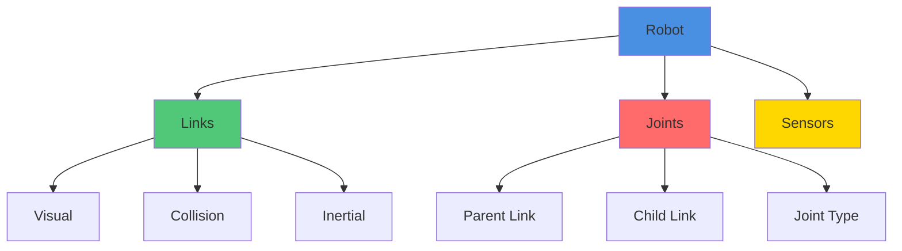

# URDF and SDF Modeling

Robot modeling is fundamental to simulation and real-world deployment. This guide covers creating accurate robot descriptions using URDF (Unified Robot Description Format) and SDF (Simulation Description Format).

## URDF Overview

URDF is an XML format for describing robot kinematics, dynamics, and visual properties. It's the standard for ROS robot descriptions.

### URDF Structure



### Basic URDF Syntax

```xml
<?xml version="1.0"?>
<robot name="simple_robot">

  <!-- Base link -->
  <link name="base_link">
    <visual>
      <geometry>
        <box size="0.5 0.3 0.2"/>
      </geometry>
      <material name="blue">
        <color rgba="0 0 0.8 1"/>
      </material>
    </visual>

    <collision>
      <geometry>
        <box size="0.5 0.3 0.2"/>
      </geometry>
    </collision>

    <inertial>
      <mass value="10.0"/>
      <inertia ixx="0.0875" ixy="0.0" ixz="0.0"
               iyy="0.2292" iyz="0.0"
               izz="0.2917"/>
    </inertial>
  </link>

  <!-- Wheel link -->
  <link name="left_wheel">
    <visual>
      <geometry>
        <cylinder radius="0.1" length="0.05"/>
      </geometry>
      <material name="black">
        <color rgba="0 0 0 1"/>
      </material>
    </visual>

    <collision>
      <geometry>
        <cylinder radius="0.1" length="0.05"/>
      </geometry>
    </collision>

    <inertial>
      <mass value="1.0"/>
      <inertia ixx="0.0013" ixy="0.0" ixz="0.0"
               iyy="0.0013" iyz="0.0"
               izz="0.0025"/>
    </inertial>
  </link>

  <!-- Joint connecting base to wheel -->
  <joint name="left_wheel_joint" type="continuous">
    <parent link="base_link"/>
    <child link="left_wheel"/>
    <origin xyz="0 0.2 0" rpy="-1.5707 0 0"/>
    <axis xyz="0 0 1"/>
  </joint>

</robot>
```

### Link Elements

**Visual**: Appearance in simulation/visualization
```xml
<visual>
  <origin xyz="0 0 0" rpy="0 0 0"/>
  <geometry>
    <mesh filename="package://my_robot/meshes/body.dae" scale="1 1 1"/>
  </geometry>
  <material name="gray">
    <color rgba="0.5 0.5 0.5 1"/>
  </material>
</visual>
```

**Collision**: Simplified geometry for collision detection
```xml
<collision>
  <origin xyz="0 0 0" rpy="0 0 0"/>
  <geometry>
    <box size="0.5 0.3 0.2"/>
  </geometry>
</collision>
```

**Inertial**: Mass and inertia properties
```xml
<inertial>
  <origin xyz="0 0 0.05" rpy="0 0 0"/>
  <mass value="5.0"/>
  <inertia ixx="0.0347" ixy="0" ixz="0"
           iyy="0.0505" iyz="0"
           izz="0.0347"/>
</inertial>
```

### Joint Types

| Type | Description | Use Case |
|------|-------------|----------|
| `revolute` | Rotates around axis with limits | Robot arm joints |
| `continuous` | Rotates around axis without limits | Wheels |
| `prismatic` | Slides along axis with limits | Linear actuators |
| `fixed` | No movement | Mounting sensors |
| `floating` | 6 DOF | Free-flying robots |
| `planar` | Moves in plane | Mobile bases |

## SDF Format

SDF is Gazebo's native format, offering more features than URDF.

### URDF vs SDF

| Feature | URDF | SDF |
|---------|------|-----|
| Multiple models | No | Yes |
| Closed kinematic chains | No | Yes |
| Joint friction | Limited | Comprehensive |
| Plugin system | Basic | Advanced |
| World description | No | Yes |
| Physics engines | One | Multiple |

### SDF Model Example

```xml
<?xml version="1.0" ?>
<sdf version="1.8">
  <model name="differential_drive_robot">
    <pose>0 0 0.15 0 0 0</pose>

    <!-- Base link -->
    <link name="chassis">
      <inertial>
        <mass>15.0</mass>
        <inertia>
          <ixx>0.1875</ixx>
          <iyy>0.4583</iyy>
          <izz>0.5208</izz>
        </inertia>
      </inertial>

      <collision name="collision">
        <geometry>
          <box>
            <size>0.6 0.4 0.2</size>
          </box>
        </geometry>
      </collision>

      <visual name="visual">
        <geometry>
          <box>
            <size>0.6 0.4 0.2</size>
          </box>
        </geometry>
        <material>
          <ambient>0.2 0.2 0.8 1</ambient>
          <diffuse>0.2 0.2 0.8 1</diffuse>
          <specular>0.1 0.1 0.1 1</specular>
        </material>
      </visual>
    </link>

    <!-- Left wheel -->
    <link name="left_wheel">
      <pose relative_to="chassis">0 0.25 0 -1.5707 0 0</pose>
      <inertial>
        <mass>1.0</mass>
        <inertia>
          <ixx>0.0013</ixx>
          <iyy>0.0025</iyy>
          <izz>0.0013</izz>
        </inertia>
      </inertial>

      <collision name="collision">
        <geometry>
          <cylinder>
            <radius>0.15</radius>
            <length>0.05</length>
          </cylinder>
        </geometry>
        <surface>
          <friction>
            <ode>
              <mu>1.0</mu>
              <mu2>1.0</mu2>
            </ode>
          </friction>
        </surface>
      </collision>

      <visual name="visual">
        <geometry>
          <cylinder>
            <radius>0.15</radius>
            <length>0.05</length>
          </cylinder>
        </geometry>
        <material>
          <ambient>0.1 0.1 0.1 1</ambient>
          <diffuse>0.1 0.1 0.1 1</diffuse>
        </material>
      </visual>
    </link>

    <!-- Joint -->
    <joint name="left_wheel_joint" type="revolute">
      <pose relative_to="left_wheel"/>
      <parent>chassis</parent>
      <child>left_wheel</child>
      <axis>
        <xyz>0 0 1</xyz>
        <limit>
          <lower>-1.79769e+308</lower>
          <upper>1.79769e+308</upper>
        </limit>
      </axis>
    </joint>

    <!-- Repeat for right wheel -->
    <link name="right_wheel">
      <pose relative_to="chassis">0 -0.25 0 -1.5707 0 0</pose>
      <inertial>
        <mass>1.0</mass>
        <inertia>
          <ixx>0.0013</ixx>
          <iyy>0.0025</iyy>
          <izz>0.0013</izz>
        </inertia>
      </inertial>

      <collision name="collision">
        <geometry>
          <cylinder>
            <radius>0.15</radius>
            <length>0.05</length>
          </cylinder>
        </geometry>
        <surface>
          <friction>
            <ode>
              <mu>1.0</mu>
              <mu2>1.0</mu2>
            </ode>
          </friction>
        </surface>
      </collision>

      <visual name="visual">
        <geometry>
          <cylinder>
            <radius>0.15</radius>
            <length>0.05</length>
          </cylinder>
        </geometry>
        <material>
          <ambient>0.1 0.1 0.1 1</ambient>
          <diffuse>0.1 0.1 0.1 1</diffuse>
        </material>
      </visual>
    </link>

    <joint name="right_wheel_joint" type="revolute">
      <pose relative_to="right_wheel"/>
      <parent>chassis</parent>
      <child>right_wheel</child>
      <axis>
        <xyz>0 0 1</xyz>
        <limit>
          <lower>-1.79769e+308</lower>
          <upper>1.79769e+308</upper>
        </limit>
      </axis>
    </joint>

    <!-- Caster wheel for stability -->
    <link name="caster">
      <pose relative_to="chassis">-0.25 0 -0.1 0 0 0</pose>
      <inertial>
        <mass>0.5</mass>
        <inertia>
          <ixx>0.0001</ixx>
          <iyy>0.0001</iyy>
          <izz>0.0001</izz>
        </inertia>
      </inertial>

      <collision name="collision">
        <geometry>
          <sphere>
            <radius>0.05</radius>
          </sphere>
        </geometry>
        <surface>
          <friction>
            <ode>
              <mu>0.1</mu>
              <mu2>0.1</mu2>
            </ode>
          </friction>
        </surface>
      </collision>

      <visual name="visual">
        <geometry>
          <sphere>
            <radius>0.05</radius>
          </sphere>
        </geometry>
      </visual>
    </link>

    <joint name="caster_joint" type="ball">
      <parent>chassis</parent>
      <child>caster</child>
    </joint>

    <!-- Differential drive plugin -->
    <plugin filename="gz-sim-diff-drive-system"
            name="gz::sim::systems::DiffDrive">
      <left_joint>left_wheel_joint</left_joint>
      <right_joint>right_wheel_joint</right_joint>
      <wheel_separation>0.5</wheel_separation>
      <wheel_radius>0.15</wheel_radius>
      <odom_publish_frequency>50</odom_publish_frequency>
      <topic>cmd_vel</topic>
    </plugin>
  </model>
</sdf>
```

## Adding Sensors

### Camera Sensor

```xml
<!-- Add to a link in URDF -->
<link name="camera_link">
  <visual>
    <geometry>
      <box size="0.05 0.05 0.05"/>
    </geometry>
  </visual>

  <collision>
    <geometry>
      <box size="0.05 0.05 0.05"/>
    </geometry>
  </collision>

  <inertial>
    <mass value="0.1"/>
    <inertia ixx="0.00002" ixy="0" ixz="0"
             iyy="0.00002" iyz="0"
             izz="0.00002"/>
  </inertial>
</link>

<!-- Gazebo-specific camera configuration -->
<gazebo reference="camera_link">
  <sensor name="camera" type="camera">
    <camera>
      <horizontal_fov>1.047</horizontal_fov>
      <image>
        <width>640</width>
        <height>480</height>
      </image>
      <clip>
        <near>0.1</near>
        <far>100</far>
      </clip>
    </camera>
    <always_on>1</always_on>
    <update_rate>30</update_rate>
    <visualize>true</visualize>
    <topic>camera/image_raw</topic>
  </sensor>
</gazebo>
```

### LiDAR Sensor (SDF)

```xml
<link name="lidar_link">
  <pose relative_to="chassis">0.2 0 0.15 0 0 0</pose>

  <inertial>
    <mass>0.5</mass>
    <inertia>
      <ixx>0.0001</ixx>
      <iyy>0.0001</iyy>
      <izz>0.0001</izz>
    </inertia>
  </inertial>

  <collision name="collision">
    <geometry>
      <cylinder>
        <radius>0.04</radius>
        <length>0.06</length>
      </cylinder>
    </geometry>
  </collision>

  <visual name="visual">
    <geometry>
      <cylinder>
        <radius>0.04</radius>
        <length>0.06</length>
      </cylinder>
    </geometry>
    <material>
      <ambient>0.1 0.1 0.1 1</ambient>
      <diffuse>0.1 0.1 0.1 1</diffuse>
    </material>
  </visual>

  <sensor name="lidar" type="gpu_lidar">
    <topic>scan</topic>
    <update_rate>10</update_rate>
    <lidar>
      <scan>
        <horizontal>
          <samples>360</samples>
          <resolution>1</resolution>
          <min_angle>-3.14159</min_angle>
          <max_angle>3.14159</max_angle>
        </horizontal>
      </scan>
      <range>
        <min>0.1</min>
        <max>30.0</max>
        <resolution>0.01</resolution>
      </range>
      <noise>
        <type>gaussian</type>
        <mean>0.0</mean>
        <stddev>0.01</stddev>
      </noise>
    </lidar>
    <visualize>true</visualize>
  </sensor>
</link>

<joint name="lidar_joint" type="fixed">
  <parent>chassis</parent>
  <child>lidar_link</child>
</joint>
```

### IMU Sensor

```xml
<link name="imu_link">
  <pose relative_to="chassis">0 0 0.05 0 0 0</pose>

  <inertial>
    <mass>0.01</mass>
    <inertia>
      <ixx>0.000001</ixx>
      <iyy>0.000001</iyy>
      <izz>0.000001</izz>
    </inertia>
  </inertial>

  <sensor name="imu" type="imu">
    <topic>imu</topic>
    <update_rate>100</update_rate>
    <imu>
      <angular_velocity>
        <x>
          <noise type="gaussian">
            <mean>0.0</mean>
            <stddev>0.009</stddev>
          </noise>
        </x>
        <y>
          <noise type="gaussian">
            <mean>0.0</mean>
            <stddev>0.009</stddev>
          </noise>
        </y>
        <z>
          <noise type="gaussian">
            <mean>0.0</mean>
            <stddev>0.009</stddev>
          </noise>
        </z>
      </angular_velocity>
      <linear_acceleration>
        <x>
          <noise type="gaussian">
            <mean>0.0</mean>
            <stddev>0.017</stddev>
          </noise>
        </x>
        <y>
          <noise type="gaussian">
            <mean>0.0</mean>
            <stddev>0.017</stddev>
          </noise>
        </y>
        <z>
          <noise type="gaussian">
            <mean>0.0</mean>
            <stddev>0.017</stddev>
          </noise>
        </z>
      </linear_acceleration>
    </imu>
  </sensor>
</link>

<joint name="imu_joint" type="fixed">
  <parent>chassis</parent>
  <child>imu_link</child>
</joint>
```

### Depth Camera

```xml
<link name="depth_camera_link">
  <pose relative_to="chassis">0.25 0 0.1 0 0 0</pose>

  <inertial>
    <mass>0.2</mass>
    <inertia>
      <ixx>0.00004</ixx>
      <iyy>0.00004</iyy>
      <izz>0.00004</izz>
    </inertia>
  </inertial>

  <visual name="visual">
    <geometry>
      <box>
        <size>0.02 0.09 0.025</size>
      </box>
    </geometry>
  </visual>

  <sensor name="depth_camera" type="depth_camera">
    <topic>depth_camera</topic>
    <update_rate>30</update_rate>
    <camera>
      <horizontal_fov>1.57</horizontal_fov>
      <image>
        <width>640</width>
        <height>480</height>
        <format>R_FLOAT32</format>
      </image>
      <clip>
        <near>0.1</near>
        <far>10.0</far>
      </clip>
    </camera>
  </sensor>
</link>

<joint name="depth_camera_joint" type="fixed">
  <parent>chassis</parent>
  <child>depth_camera_link</child>
</joint>
```

## Xacro for Modular URDF

Xacro (XML Macros) enables parameterized, reusable URDF components.

### Basic Xacro Syntax

```xml
<?xml version="1.0"?>
<robot xmlns:xacro="http://www.ros.org/wiki/xacro" name="modular_robot">

  <!-- Parameters -->
  <xacro:property name="wheel_radius" value="0.15"/>
  <xacro:property name="wheel_width" value="0.05"/>
  <xacro:property name="wheel_mass" value="1.0"/>
  <xacro:property name="chassis_length" value="0.6"/>
  <xacro:property name="chassis_width" value="0.4"/>
  <xacro:property name="chassis_height" value="0.2"/>

  <!-- Macros -->
  <xacro:macro name="wheel" params="prefix reflect">
    <link name="${prefix}_wheel">
      <visual>
        <geometry>
          <cylinder radius="${wheel_radius}" length="${wheel_width}"/>
        </geometry>
        <material name="black">
          <color rgba="0 0 0 1"/>
        </material>
      </visual>

      <collision>
        <geometry>
          <cylinder radius="${wheel_radius}" length="${wheel_width}"/>
        </geometry>
      </collision>

      <inertial>
        <mass value="${wheel_mass}"/>
        <inertia ixx="${wheel_mass * (3 * wheel_radius * wheel_radius + wheel_width * wheel_width) / 12}"
                 iyy="${wheel_mass * wheel_radius * wheel_radius / 2}"
                 izz="${wheel_mass * (3 * wheel_radius * wheel_radius + wheel_width * wheel_width) / 12}"
                 ixy="0" ixz="0" iyz="0"/>
      </inertial>
    </link>

    <joint name="${prefix}_wheel_joint" type="continuous">
      <parent link="base_link"/>
      <child link="${prefix}_wheel"/>
      <origin xyz="0 ${reflect * chassis_width/2} 0" rpy="${-pi/2} 0 0"/>
      <axis xyz="0 0 1"/>
    </joint>
  </xacro:macro>

  <!-- Base link -->
  <link name="base_link">
    <visual>
      <geometry>
        <box size="${chassis_length} ${chassis_width} ${chassis_height}"/>
      </geometry>
      <material name="blue">
        <color rgba="0.2 0.2 0.8 1"/>
      </material>
    </visual>

    <collision>
      <geometry>
        <box size="${chassis_length} ${chassis_width} ${chassis_height}"/>
      </geometry>
    </collision>

    <inertial>
      <mass value="15.0"/>
      <inertia ixx="${15.0 * (chassis_width * chassis_width + chassis_height * chassis_height) / 12}"
               iyy="${15.0 * (chassis_length * chassis_length + chassis_height * chassis_height) / 12}"
               izz="${15.0 * (chassis_length * chassis_length + chassis_width * chassis_width) / 12}"
               ixy="0" ixz="0" iyz="0"/>
    </inertial>
  </link>

  <!-- Instantiate wheels -->
  <xacro:wheel prefix="left" reflect="1"/>
  <xacro:wheel prefix="right" reflect="-1"/>

  <!-- Include sensor package -->
  <xacro:include filename="$(find my_robot_description)/urdf/sensors.xacro"/>

  <!-- Instantiate sensors -->
  <xacro:lidar_sensor parent="base_link"/>
  <xacro:camera_sensor parent="base_link" xyz="0.25 0 0.15"/>

</robot>
```

### Sensor Macro Library

Create `sensors.xacro`:

```xml
<?xml version="1.0"?>
<robot xmlns:xacro="http://www.ros.org/wiki/xacro">

  <!-- LiDAR macro -->
  <xacro:macro name="lidar_sensor" params="parent">
    <link name="lidar_link">
      <visual>
        <geometry>
          <cylinder radius="0.04" length="0.06"/>
        </geometry>
        <material name="black"/>
      </visual>

      <collision>
        <geometry>
          <cylinder radius="0.04" length="0.06"/>
        </geometry>
      </collision>

      <inertial>
        <mass value="0.5"/>
        <inertia ixx="0.0001" iyy="0.0001" izz="0.0001"
                 ixy="0" ixz="0" iyz="0"/>
      </inertial>
    </link>

    <joint name="lidar_joint" type="fixed">
      <parent link="${parent}"/>
      <child link="lidar_link"/>
      <origin xyz="0.2 0 0.15" rpy="0 0 0"/>
    </joint>

    <gazebo reference="lidar_link">
      <sensor name="lidar" type="gpu_lidar">
        <topic>scan</topic>
        <update_rate>10</update_rate>
        <lidar>
          <scan>
            <horizontal>
              <samples>360</samples>
              <resolution>1</resolution>
              <min_angle>-3.14159</min_angle>
              <max_angle>3.14159</max_angle>
            </horizontal>
          </scan>
          <range>
            <min>0.1</min>
            <max>30.0</max>
          </range>
        </lidar>
      </sensor>
    </gazebo>
  </xacro:macro>

  <!-- Camera macro -->
  <xacro:macro name="camera_sensor" params="parent xyz">
    <link name="camera_link">
      <visual>
        <geometry>
          <box size="0.05 0.05 0.05"/>
        </geometry>
      </visual>

      <inertial>
        <mass value="0.1"/>
        <inertia ixx="0.00002" iyy="0.00002" izz="0.00002"
                 ixy="0" ixz="0" iyz="0"/>
      </inertial>
    </link>

    <joint name="camera_joint" type="fixed">
      <parent link="${parent}"/>
      <child link="camera_link"/>
      <origin xyz="${xyz}" rpy="0 0 0"/>
    </joint>

    <gazebo reference="camera_link">
      <sensor name="camera" type="camera">
        <camera>
          <horizontal_fov>1.047</horizontal_fov>
          <image>
            <width>640</width>
            <height>480</height>
          </image>
          <clip>
            <near>0.1</near>
            <far>100</far>
          </clip>
        </camera>
        <update_rate>30</update_rate>
        <topic>camera/image_raw</topic>
      </sensor>
    </gazebo>
  </xacro:macro>

</robot>
```

### Processing Xacro Files

```bash
# Convert xacro to URDF
xacro robot.xacro > robot.urdf

# With arguments
xacro robot.xacro use_lidar:=true wheel_radius:=0.2 > robot.urdf

# Check URDF validity
check_urdf robot.urdf

# Visualize robot
urdf_to_graphviz robot.urdf
```

## Best Practices

### 1. Coordinate Frames

Follow ROS REP 105 conventions:
- **X**: Forward
- **Y**: Left
- **Z**: Up

### 2. Inertia Calculation

Use accurate inertia tensors:

```python
# Box inertia
def box_inertia(mass, x, y, z):
    ixx = mass * (y*y + z*z) / 12
    iyy = mass * (x*x + z*z) / 12
    izz = mass * (x*x + y*y) / 12
    return ixx, iyy, izz

# Cylinder inertia (along z-axis)
def cylinder_inertia(mass, radius, length):
    ixx = mass * (3*radius*radius + length*length) / 12
    iyy = ixx
    izz = mass * radius * radius / 2
    return ixx, iyy, izz

# Sphere inertia
def sphere_inertia(mass, radius):
    i = 2 * mass * radius * radius / 5
    return i, i, i
```

### 3. Collision Geometry

- Keep collision geometry simple (boxes, cylinders, spheres)
- Use convex hulls for complex shapes
- Avoid self-collisions

### 4. Naming Conventions

```
robot_name/
  base_link
  left_wheel_link
  right_wheel_link
  sensor_link
```

### 5. File Organization

```
my_robot_description/
  urdf/
    robot.urdf.xacro        # Main robot file
    robot_base.xacro        # Base platform
    robot_wheels.xacro      # Wheel components
    sensors.xacro           # Sensor macros
  meshes/
    base.dae
    wheel.stl
  config/
    controllers.yaml
  launch/
    display.launch.py
```

## Key Takeaways

- URDF is ROS-standard for robot description, SDF is Gazebo-native
- Accurate inertia and collision geometry are crucial for realistic simulation
- Xacro enables modular, maintainable robot descriptions
- Sensor integration requires both URDF links and Gazebo plugins
- Follow naming conventions and coordinate frame standards
- Use macros for repeated components (wheels, sensors)

## Additional Resources

- [URDF Tutorials](http://wiki.ros.org/urdf/Tutorials)
- [SDF Specification](http://sdformat.org/spec)
- [Xacro Documentation](http://wiki.ros.org/xacro)
- [REP 105: Coordinate Frames](https://www.ros.org/reps/rep-0105.html)
- [URDF Validator](http://wiki.ros.org/urdf_tutorial)

## Hands-On Exercises

### Exercise 1: Complete Mobile Robot

Create a differential drive robot with:
- Rectangular chassis (0.6m x 0.4m x 0.2m)
- Two driven wheels (0.15m radius)
- One caster wheel
- LiDAR on top
- Front-facing camera
- IMU in center

**Deliverables**:
- Complete URDF/SDF file
- Launch file for visualization
- Gazebo world file
- RViz configuration

### Exercise 2: Sensor Integration

Add multiple sensors to your robot:
- 2D LiDAR (360-degree, 10Hz)
- RGB camera (640x480, 30Hz)
- Depth camera (640x480, 15Hz)
- IMU (100Hz)
- GPS (1Hz)

Test each sensor in Gazebo and verify ROS topics.

### Exercise 3: Xacro Modular Design

Refactor Exercise 1 using Xacro:
- Parameterize all dimensions
- Create macros for wheels
- Create macros for sensors
- Support configuration variants (2-wheel vs 4-wheel)
- Add arguments for sensor selection

**Goal**: Generate 3 different robot variants from same Xacro files.

---

**Next**: [Physics Simulation](./physics-simulation.mdx) - Master physics engines and dynamics

**Previous**: [Environment Setup](./environment-setup.mdx)
