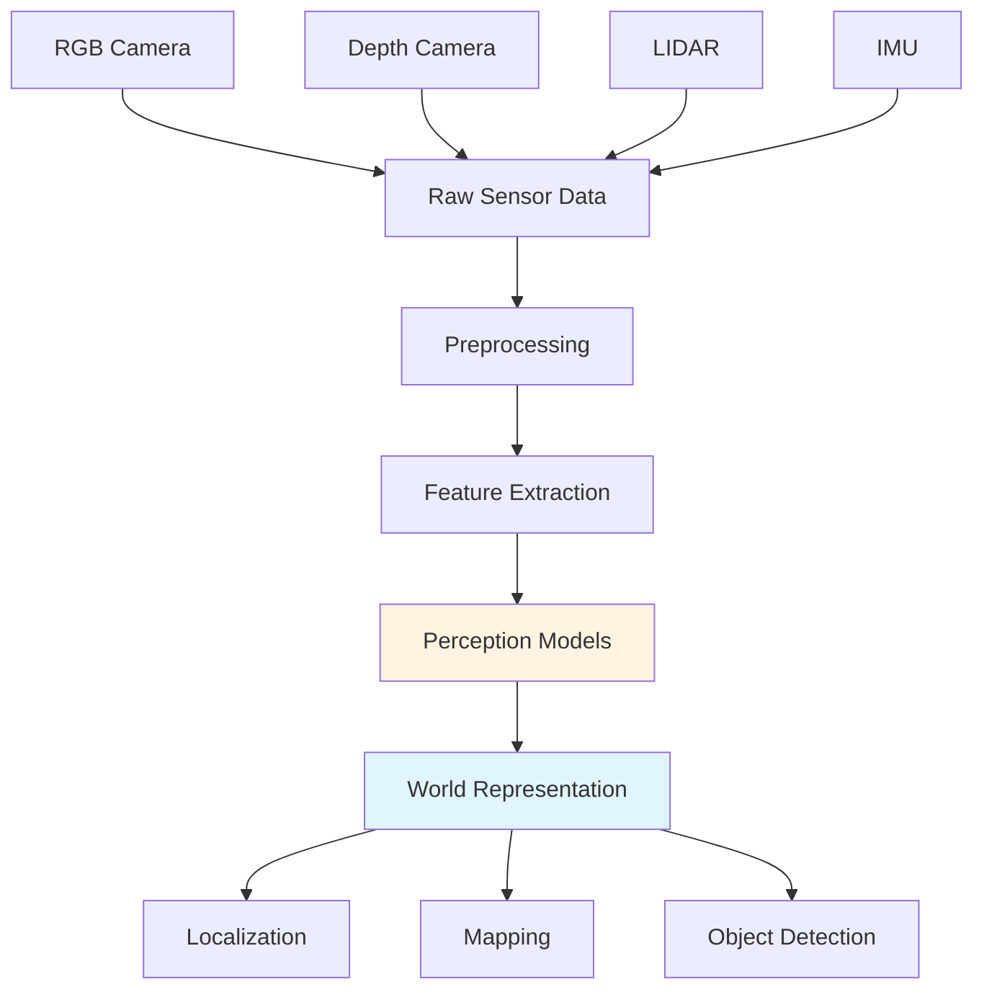
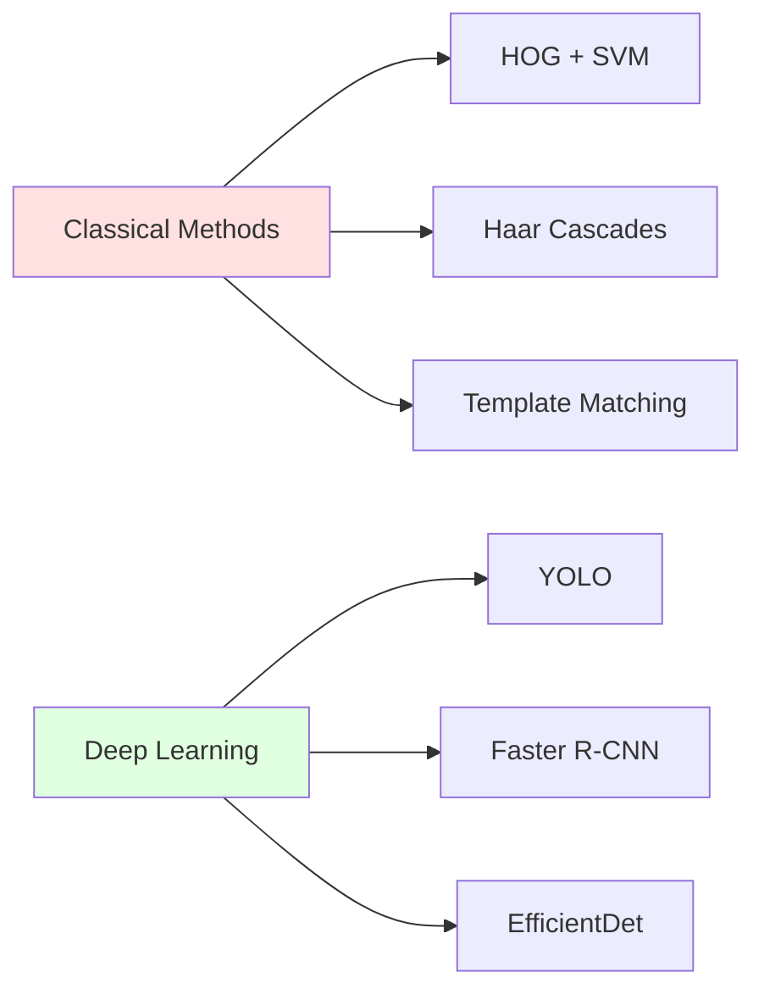
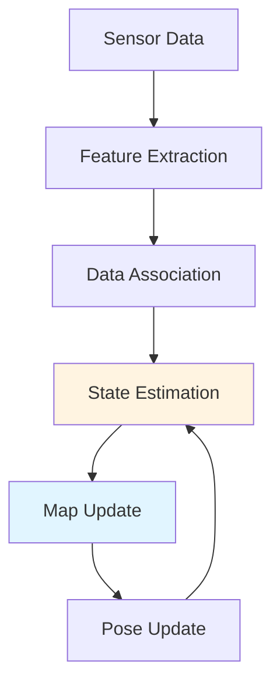

# Week 5-6: Perception Systems

## 📚 Learning Outcomes

By the end of this module, you will be able to:

- Understand computer vision pipelines for robotics
- Implement object detection using deep learning models
- Build SLAM systems for localization and mapping
- Process and filter sensor data effectively
- Fuse multiple sensor modalities for robust perception
- Integrate perception systems with ROS 2

## 🎯 Module Overview

**Perception** is how robots understand their environment. Without perception, robots are blind—unable to navigate, grasp objects, or interact safely with humans. This module covers the fundamental perception technologies used in humanoid robotics.

Modern perception systems combine:
- **Vision**: RGB cameras, depth sensors, thermal cameras
- **Range Finding**: LIDAR, ultrasonic, radar
- **Proprioception**: Joint encoders, IMUs, force sensors
- **AI Models**: Deep learning for object detection, scene understanding



## 👁️ The Perception Stack

A complete perception system for humanoid robots consists of multiple layers:

### 1. Sensor Interface Layer
- Camera drivers (RealSense, ZED, generic USB)
- LIDAR drivers (Velodyne, Ouster, SICK)
- IMU interface (MPU-6050, VectorNav)
- Synchronization across sensors

### 2. Preprocessing Layer
- Image rectification and undistortion
- Noise filtering
- Calibration application
- Sensor fusion

### 3. Perception Layer
- **Object Detection**: What objects are present?
- **Semantic Segmentation**: What category is each pixel?
- **Depth Estimation**: How far away are things?
- **Pose Estimation**: What is the orientation of objects?
- **Tracking**: How are objects moving over time?

### 4. World Modeling Layer
- **Localization**: Where is the robot?
- **Mapping**: What does the environment look like?
- **SLAM**: Simultaneous localization and mapping
- **Scene Graphs**: Relationships between objects

## 🖼️ Computer Vision Fundamentals

### Image Representation

Digital images are 2D/3D arrays of pixels:

```python
import cv2
import numpy as np

# Load RGB image (H x W x 3)
image = cv2.imread('robot_view.jpg')
height, width, channels = image.shape

# Access pixel at (row=100, col=200)
pixel = image[100, 200, :]  # Returns [B, G, R]

# Convert to grayscale (H x W)
gray = cv2.cvtColor(image, cv2.COLOR_BGR2GRAY)

# Apply Gaussian blur (noise reduction)
blurred = cv2.GaussianBlur(image, (5, 5), 0)
```

### Common Image Operations

**Edge Detection** (Canny)
```python
edges = cv2.Canny(gray, threshold1=50, threshold2=150)
```

**Contour Detection**
```python
contours, _ = cv2.findContours(edges, cv2.RETR_EXTERNAL, cv2.CHAIN_APPROX_SIMPLE)

for contour in contours:
    area = cv2.contourArea(contour)
    if area > 1000:  # Filter small contours
        x, y, w, h = cv2.boundingRect(contour)
        cv2.rectangle(image, (x, y), (x+w, y+h), (0, 255, 0), 2)
```

**Color Space Conversion**
```python
# Convert BGR to HSV (better for color-based detection)
hsv = cv2.cvtColor(image, cv2.COLOR_BGR2HSV)

# Detect red objects
lower_red = np.array([0, 100, 100])
upper_red = np.array([10, 255, 255])
mask = cv2.inRange(hsv, lower_red, upper_red)
```

## 🎯 Object Detection

### Classical Methods vs. Deep Learning



**Classical methods:**
- ✅ Fast, lightweight
- ✅ No training data needed
- ❌ Less accurate
- ❌ Require feature engineering

**Deep learning:**
- ✅ State-of-the-art accuracy
- ✅ Learn features automatically
- ❌ Require GPU and large datasets
- ❌ Slower inference

### YOLO (You Only Look Once)

YOLO is the most popular real-time object detector for robotics.

```python
from ultralytics import YOLO
import cv2

# Load pre-trained model
model = YOLO('yolov8n.pt')  # Nano model for speed

# Run inference on image
results = model('robot_view.jpg')

# Process results
for result in results:
    boxes = result.boxes  # Bounding boxes
    for box in boxes:
        # Get box coordinates
        x1, y1, x2, y2 = box.xyxy[0].cpu().numpy()
        confidence = box.conf[0].cpu().numpy()
        class_id = int(box.cls[0].cpu().numpy())
        class_name = model.names[class_id]

        # Draw on image
        cv2.rectangle(image, (int(x1), int(y1)), (int(x2), int(y2)), (0, 255, 0), 2)
        cv2.putText(image, f'{class_name} {confidence:.2f}',
                   (int(x1), int(y1) - 10),
                   cv2.FONT_HERSHEY_SIMPLEX, 0.5, (0, 255, 0), 2)
```

### Integrating with ROS 2

```python
import rclpy
from rclpy.node import Node
from sensor_msgs.msg import Image
from vision_msgs.msg import Detection2DArray, Detection2D
from cv_bridge import CvBridge
from ultralytics import YOLO

class ObjectDetectorNode(Node):
    def __init__(self):
        super().__init__('object_detector')

        # Load model
        self.model = YOLO('yolov8n.pt')
        self.bridge = CvBridge()

        # Subscriber
        self.image_sub = self.create_subscription(
            Image,
            '/camera/image_raw',
            self.image_callback,
            10
        )

        # Publisher
        self.detection_pub = self.create_publisher(
            Detection2DArray,
            '/detections',
            10
        )

    def image_callback(self, msg):
        # Convert ROS Image to OpenCV
        cv_image = self.bridge.imgmsg_to_cv2(msg, desired_encoding='bgr8')

        # Run detection
        results = self.model(cv_image)

        # Create detection message
        detection_array = Detection2DArray()
        detection_array.header = msg.header

        for result in results:
            for box in result.boxes:
                detection = Detection2D()
                detection.bbox.center.x = float((box.xyxy[0][0] + box.xyxy[0][2]) / 2)
                detection.bbox.center.y = float((box.xyxy[0][1] + box.xyxy[0][3]) / 2)
                detection.bbox.size_x = float(box.xyxy[0][2] - box.xyxy[0][0])
                detection.bbox.size_y = float(box.xyxy[0][3] - box.xyxy[0][1])

                detection_array.detections.append(detection)

        self.detection_pub.publish(detection_array)
        self.get_logger().info(f'Detected {len(detection_array.detections)} objects')
```

## 🗺️ SLAM (Simultaneous Localization and Mapping)

**SLAM** solves two problems simultaneously:
1. **Localization**: Where am I?
2. **Mapping**: What does the environment look like?



### SLAM Approaches

**Visual SLAM** (ORB-SLAM, RTAB-Map)
- Uses camera features (corners, blobs)
- Dense or sparse mapping
- Pros: Rich information, affordable sensors
- Cons: Affected by lighting, texture-less surfaces

**LIDAR SLAM** (Cartographer, LOAM)
- Uses laser range measurements
- 2D or 3D mapping
- Pros: Accurate, works in dark, long range
- Cons: Expensive, sparse data

**Visual-Inertial SLAM** (VINS-Mono, OKVIS)
- Fuses camera + IMU
- More robust than vision-only
- Handles fast motion better

### Using SLAM Toolbox in ROS 2

```bash
# Install SLAM Toolbox
sudo apt install ros-humble-slam-toolbox

# Launch SLAM
ros2 launch slam_toolbox online_async_launch.py
```

**Configuration (`mapper_params_online_async.yaml`):**
```yaml
slam_toolbox:
  ros__parameters:
    # Solver params
    solver_plugin: solver_plugins::CeresSolver
    ceres_linear_solver: SPARSE_NORMAL_CHOLESKY
    ceres_preconditioner: SCHUR_JACOBI

    # ROS Parameters
    odom_frame: odom
    map_frame: map
    base_frame: base_footprint
    scan_topic: /scan

    # Mode
    mode: mapping  # or localization

    # Resolution
    resolution: 0.05  # meters per pixel

    # Update params
    minimum_travel_distance: 0.5  # meters
    minimum_travel_heading: 0.5   # radians

    # Loop closure
    loop_search_maximum_distance: 3.0
```

## 📊 Depth Perception

### Stereo Vision

Two cameras separated by a baseline estimate depth via disparity:

```python
import cv2
import numpy as np

# Load stereo pair
left_img = cv2.imread('left.jpg', cv2.IMREAD_GRAYSCALE)
right_img = cv2.imread('right.jpg', cv2.IMREAD_GRAYSCALE)

# Create stereo matcher
stereo = cv2.StereoBM_create(numDisparities=16*10, blockSize=15)

# Compute disparity
disparity = stereo.compute(left_img, right_img)

# Convert to depth
# depth = (focal_length * baseline) / disparity
focal_length = 700  # pixels
baseline = 0.12  # meters (12 cm)
depth = (focal_length * baseline) / (disparity + 1e-6)

# Visualize
disparity_normalized = cv2.normalize(disparity, None, 0, 255, cv2.NORM_MINMAX, cv2.CV_8U)
cv2.imshow('Disparity', disparity_normalized)
```

### Depth from Learning

Monocular depth estimation using neural networks:

```python
import torch
from transformers import DPTForDepthEstimation, DPTFeatureExtractor

# Load pre-trained model
model = DPTForDepthEstimation.from_pretrained("Intel/dpt-large")
feature_extractor = DPTFeatureExtractor.from_pretrained("Intel/dpt-large")

# Prepare image
image = cv2.imread('scene.jpg')
inputs = feature_extractor(images=image, return_tensors="pt")

# Predict depth
with torch.no_grad():
    outputs = model(**inputs)
    predicted_depth = outputs.predicted_depth

# Visualize
depth = predicted_depth.squeeze().cpu().numpy()
depth_normalized = (depth - depth.min()) / (depth.max() - depth.min()) * 255
cv2.imshow('Predicted Depth', depth_normalized.astype(np.uint8))
```

## 🎯 What's Next?

In the following sections, we'll explore:

1. **Object Detection and Tracking**: YOLO, DeepSORT, multi-object tracking
2. **SLAM in Practice**: Building maps with SLAM Toolbox and Cartographer
3. **Sensor Fusion**: Kalman filters, particle filters, multi-sensor integration
4. **3D Perception**: Point cloud processing, 3D object detection
5. **Practical Example**: Complete perception pipeline for a humanoid robot

## 🎯 Self-Assessment Questions

1. What are the main differences between classical and deep learning-based object detection?
2. Explain the SLAM problem and why it's challenging.
3. How does stereo vision compute depth? What are its limitations?
4. When would you use LIDAR SLAM instead of visual SLAM?
5. What is sensor fusion and why is it necessary for robust perception?

## 📚 Additional Resources

- [OpenCV Documentation](https://docs.opencv.org/)
- [YOLO Official Site](https://docs.ultralytics.com/)
- [SLAM Toolbox](https://github.com/SteveMacenski/slam_toolbox)
- [ROS 2 Perception Stack](https://github.com/ros-perception)

---

**Previous**: [← ROS 2 Practical Example](../02-ros2-architecture/practical-example.mdx) | **Next**: [Object Detection and Tracking →](./object-detection.mdx)
