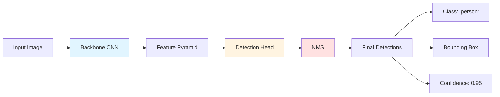
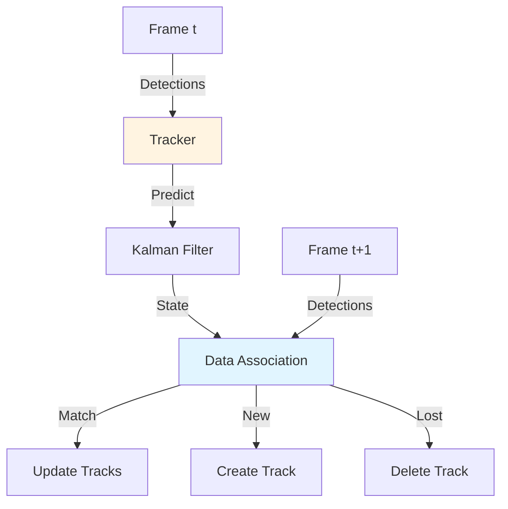

# Object Detection and Tracking

## 🎯 Object Detection Pipeline

Object detection identifies **what** objects are in an image and **where** they are located.



**Key components:**
1. **Backbone**: Extract features (ResNet, EfficientNet, MobileNet)
2. **Neck**: Feature fusion across scales (FPN, PANet)
3. **Head**: Predict boxes and classes
4. **Post-processing**: Non-Maximum Suppression (NMS)

## 🚀 YOLO Family

**YOLO (You Only Look Once)** treats detection as a regression problem, predicting boxes and classes in a single forward pass.

### YOLOv8 Architecture

```python
from ultralytics import YOLO

# Load model (choose size vs. speed trade-off)
models = {
    'yolov8n.pt': 'Nano - Fastest, least accurate',
    'yolov8s.pt': 'Small - Good balance',
    'yolov8m.pt': 'Medium - Better accuracy',
    'yolov8l.pt': 'Large - High accuracy',
    'yolov8x.pt': 'Extra Large - Best accuracy, slowest'
}

model = YOLO('yolov8n.pt')  # 3.2M parameters, ~45 FPS on GPU

# Inference
results = model('image.jpg')

# Access predictions
for result in results:
    boxes = result.boxes.xyxy  # Bounding boxes
    confidences = result.boxes.conf  # Confidence scores
    class_ids = result.boxes.cls  # Class IDs
    class_names = [model.names[int(c)] for c in class_ids]

    print(f'Detected {len(boxes)} objects')
    for name, conf in zip(class_names, confidences):
        print(f'  {name}: {conf:.2f}')
```

### Training Custom YOLOv8

```python
from ultralytics import YOLO

# Load pre-trained model
model = YOLO('yolov8n.pt')

# Train on custom dataset (COCO format)
results = model.train(
    data='robot_objects.yaml',  # Dataset config
    epochs=100,
    imgsz=640,
    batch=16,
    device=0,  # GPU ID
    project='robot_detector',
    name='yolov8n_custom'
)

# Validate
metrics = model.val()
print(f'mAP50: {metrics.box.map50:.3f}')
print(f'mAP50-95: {metrics.box.map:.3f}')

# Export to ONNX for deployment
model.export(format='onnx')
```

**Dataset format (`robot_objects.yaml`):**
```yaml
# Paths
train: /path/to/train/images
val: /path/to/val/images

# Classes
names:
  0: cup
  1: bottle
  2: book
  3: phone
  4: keyboard
  5: mouse
```

## 🎨 Semantic Segmentation

While object detection gives bounding boxes, **semantic segmentation** classifies every pixel.

### SegFormer for Real-Time Segmentation

```python
from transformers import SegformerForSemanticSegmentation, SegformerFeatureExtractor
import torch
from PIL import Image

# Load model
model = SegformerForSemanticSegmentation.from_pretrained(
    "nvidia/segformer-b0-finetuned-ade-512-512"
)
feature_extractor = SegformerFeatureExtractor.from_pretrained(
    "nvidia/segformer-b0-finetuned-ade-512-512"
)

# Prepare image
image = Image.open('scene.jpg')
inputs = feature_extractor(images=image, return_tensors="pt")

# Predict
with torch.no_grad():
    outputs = model(**inputs)
    logits = outputs.logits

# Get segmentation mask
segmentation = logits.argmax(dim=1).squeeze().cpu().numpy()

# Visualize
import matplotlib.pyplot as plt
plt.imshow(segmentation)
plt.show()
```

## 🎯 Instance Segmentation

**Instance segmentation** combines detection + segmentation: separate each object instance.

### YOLOv8-Seg

```python
from ultralytics import YOLO

# Load segmentation model
model = YOLO('yolov8n-seg.pt')

# Inference
results = model('image.jpg')

for result in results:
    # Bounding boxes
    boxes = result.boxes.xyxy

    # Segmentation masks
    if result.masks is not None:
        masks = result.masks.data  # [N, H, W] binary masks

        # Draw masks on image
        for i, mask in enumerate(masks):
            mask_img = mask.cpu().numpy() * 255
            cv2.imshow(f'Mask {i}', mask_img)
```

## 🏃 Multi-Object Tracking

**Tracking** associates detections across frames to maintain object identities.



### DeepSORT Tracker

```python
from deep_sort_realtime.deepsort_tracker import DeepSort

# Initialize tracker
tracker = DeepSort(
    max_age=30,  # Frames to keep track without detection
    n_init=3,     # Frames needed to confirm track
    nms_max_overlap=1.0,
    max_cosine_distance=0.3,
    nn_budget=None,
    gating_only_position=False,
    embedder="mobilenet",
    half=False
)

# Tracking loop
video = cv2.VideoCapture('robot_view.mp4')

while True:
    ret, frame = video.read()
    if not ret:
        break

    # Get detections from YOLO
    results = model(frame)
    detections = []

    for result in results:
        for box, conf, cls in zip(result.boxes.xyxy, result.boxes.conf, result.boxes.cls):
            x1, y1, x2, y2 = box.cpu().numpy()
            confidence = conf.cpu().numpy()
            class_id = int(cls.cpu().numpy())

            # DeepSORT format: [x1, y1, w, h, confidence, class_id]
            w, h = x2 - x1, y2 - y1
            detections.append(([x1, y1, w, h], confidence, class_id))

    # Update tracker
    tracks = tracker.update_tracks(detections, frame=frame)

    # Draw tracks
    for track in tracks:
        if not track.is_confirmed():
            continue

        track_id = track.track_id
        bbox = track.to_ltrb()  # [left, top, right, bottom]

        x1, y1, x2, y2 = map(int, bbox)
        cv2.rectangle(frame, (x1, y1), (x2, y2), (0, 255, 0), 2)
        cv2.putText(frame, f'ID: {track_id}', (x1, y1 - 10),
                   cv2.FONT_HERSHEY_SIMPLEX, 0.5, (0, 255, 0), 2)

    cv2.imshow('Tracking', frame)
    if cv2.waitKey(1) & 0xFF == ord('q'):
        break

video.release()
cv2.destroyAllWindows()
```

## 🔗 ROS 2 Integration

### Complete Detection + Tracking Node

```python
import rclpy
from rclpy.node import Node
from sensor_msgs.msg import Image
from vision_msgs.msg import Detection2DArray, Detection2D, ObjectHypothesisWithPose
from cv_bridge import CvBridge
from ultralytics import YOLO
from deep_sort_realtime.deepsort_tracker import DeepSort
import cv2

class ObjectTrackerNode(Node):
    def __init__(self):
        super().__init__('object_tracker')

        # Parameters
        self.declare_parameter('model_path', 'yolov8n.pt')
        self.declare_parameter('confidence_threshold', 0.5)
        self.declare_parameter('publish_visualization', True)

        model_path = self.get_parameter('model_path').value
        self.conf_threshold = self.get_parameter('confidence_threshold').value
        self.visualize = self.get_parameter('publish_visualization').value

        # Initialize detector and tracker
        self.model = YOLO(model_path)
        self.tracker = DeepSort(max_age=30, n_init=3)
        self.bridge = CvBridge()

        # Subscribers
        self.image_sub = self.create_subscription(
            Image,
            '/camera/image_raw',
            self.image_callback,
            10
        )

        # Publishers
        self.detection_pub = self.create_publisher(
            Detection2DArray,
            '/detections',
            10
        )

        if self.visualize:
            self.viz_pub = self.create_publisher(
                Image,
                '/detections/image',
                10
            )

        self.get_logger().info('Object Tracker Node started')

    def image_callback(self, msg):
        # Convert to OpenCV
        cv_image = self.bridge.imgmsg_to_cv2(msg, desired_encoding='bgr8')

        # Detect objects
        results = self.model(cv_image, conf=self.conf_threshold)

        # Prepare detections for tracker
        detections = []
        for result in results:
            for box, conf, cls in zip(result.boxes.xyxy, result.boxes.conf, result.boxes.cls):
                x1, y1, x2, y2 = box.cpu().numpy()
                confidence = float(conf.cpu().numpy())
                class_id = int(cls.cpu().numpy())

                w, h = x2 - x1, y2 - y1
                detections.append(([x1, y1, w, h], confidence, class_id))

        # Update tracker
        tracks = self.tracker.update_tracks(detections, frame=cv_image)

        # Create detection message
        detection_array = Detection2DArray()
        detection_array.header = msg.header

        for track in tracks:
            if not track.is_confirmed():
                continue

            bbox = track.to_ltrb()
            x1, y1, x2, y2 = bbox

            detection = Detection2D()
            detection.header = msg.header

            # Bounding box
            detection.bbox.center.x = float((x1 + x2) / 2)
            detection.bbox.center.y = float((y1 + y2) / 2)
            detection.bbox.size_x = float(x2 - x1)
            detection.bbox.size_y = float(y2 - y1)

            # Hypothesis (class and confidence)
            hypothesis = ObjectHypothesisWithPose()
            hypothesis.id = str(track.track_id)
            hypothesis.score = float(track.get_det_conf())
            detection.results.append(hypothesis)

            detection_array.detections.append(detection)

            # Draw on image for visualization
            if self.visualize:
                x1, y1, x2, y2 = map(int, bbox)
                cv2.rectangle(cv_image, (x1, y1), (x2, y2), (0, 255, 0), 2)
                label = f'ID {track.track_id}: {track.get_det_class()}'
                cv2.putText(cv_image, label, (x1, y1 - 10),
                           cv2.FONT_HERSHEY_SIMPLEX, 0.5, (0, 255, 0), 2)

        # Publish detections
        self.detection_pub.publish(detection_array)

        # Publish visualization
        if self.visualize:
            viz_msg = self.bridge.cv2_to_imgmsg(cv_image, encoding='bgr8')
            viz_msg.header = msg.header
            self.viz_pub.publish(viz_msg)

        self.get_logger().info(
            f'Tracked {len(detection_array.detections)} objects',
            throttle_duration_sec=1.0
        )

def main(args=None):
    rclpy.init(args=args)
    node = ObjectTrackerNode()
    rclpy.spin(node)
    node.destroy_node()
    rclpy.shutdown()
```

## 📊 Performance Optimization

### 1. Model Quantization

Reduce model size and increase speed:

```python
from ultralytics import YOLO

model = YOLO('yolov8n.pt')

# Export to TensorRT for NVIDIA GPUs (4-8x speedup)
model.export(format='engine', half=True)

# Export to ONNX with dynamic shapes
model.export(format='onnx', dynamic=True, simplify=True)

# Load optimized model
model_trt = YOLO('yolov8n.engine')
```

### 2. Input Resolution Trade-offs

| Resolution | Speed | Accuracy | Use Case |
|------------|-------|----------|----------|
| 320x320 | 100+ FPS | Low | Simple scenes, far objects |
| 640x640 | 50-70 FPS | Medium | General purpose |
| 1280x1280 | 15-25 FPS | High | Small objects, details |

```python
# Adjust input size for speed/accuracy trade-off
results = model('image.jpg', imgsz=320)  # Fast
results = model('image.jpg', imgsz=640)  # Balanced
results = model('image.jpg', imgsz=1280) # Accurate
```

### 3. Batch Processing

Process multiple images simultaneously:

```python
import glob

# Load all images
image_paths = glob.glob('images/*.jpg')

# Batch inference (faster than one-by-one)
results = model(image_paths, stream=True)

for result in results:
    # Process each result
    boxes = result.boxes
    # ...
```

## 🎯 Evaluation Metrics

### mAP (mean Average Precision)

**mAP@0.5**: Average precision at IoU threshold 0.5
**mAP@0.5:0.95**: Average precision across IoU 0.5 to 0.95

```python
from ultralytics import YOLO

model = YOLO('yolov8n.pt')

# Validate on test set
metrics = model.val(data='robot_objects.yaml')

print(f'mAP@0.5: {metrics.box.map50:.3f}')
print(f'mAP@0.5:0.95: {metrics.box.map:.3f}')
print(f'Precision: {metrics.box.p:.3f}')
print(f'Recall: {metrics.box.r:.3f}')
```

### Tracking Metrics

**MOTA (Multi-Object Tracking Accuracy)**
**MOTP (Multi-Object Tracking Precision)**
**IDF1 (ID F1 Score)**

```python
import motmetrics as mm

# Ground truth and predictions
gt = mm.MOTAccumulator(auto_id=True)

for frame in range(num_frames):
    gt.update(
        ground_truth_ids,
        predicted_ids,
        distances  # IoU or Euclidean distance
    )

# Compute metrics
mh = mm.metrics.create()
summary = mh.compute(gt, metrics=['mota', 'motp', 'idf1'])
print(summary)
```

## 🎯 Self-Assessment Questions

1. What is the difference between object detection and instance segmentation?
2. Why is YOLOv8 faster than Faster R-CNN?
3. Explain how multi-object tracking maintains object identities across frames.
4. What is Non-Maximum Suppression (NMS) and why is it needed?
5. How would you optimize a detection model for real-time performance on a robot?

## 📚 Additional Resources

- [YOLOv8 Documentation](https://docs.ultralytics.com/)
- [DeepSORT Paper](https://arxiv.org/abs/1703.07402)
- [vision_msgs ROS 2 Package](https://github.com/ros-perception/vision_msgs)
- [ROS 2 Image Pipeline](https://github.com/ros-perception/image_pipeline)

---

**Previous**: [← Perception Systems](./index.mdx) | **Next**: [SLAM in Practice →](./slam-practice.mdx)
