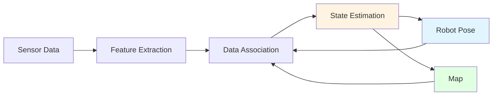

# SLAM in Practice

## 🗺️ What is SLAM?

**SLAM (Simultaneous Localization and Mapping)** solves the chicken-and-egg problem:
- To localize, you need a map
- To build a map, you need to know your location

SLAM does both simultaneously by maintaining probabilistic estimates of both the robot pose and the map.



## 🎯 SLAM Approaches

### 1. Filter-Based SLAM
- **EKF-SLAM**: Extended Kalman Filter
- **FastSLAM**: Particle filter
- **Pros**: Online, low memory
- **Cons**: Linearization errors, drift over time

### 2. Graph-Based SLAM
- **Pose graph optimization**: Nodes = poses, Edges = constraints
- **Examples**: SLAM Toolbox, Cartographer, GTSAM
- **Pros**: Global optimization, loop closure
- **Cons**: Requires more computation

### 3. Visual SLAM
- **Feature-based**: ORB-SLAM3, VINS-Mono
- **Direct**: LSD-SLAM, DSO
- **Pros**: Rich information from cameras
- **Cons**: Sensitive to lighting, texture

## 🛠️ SLAM Toolbox (2D LIDAR SLAM)

**SLAM Toolbox** is the recommended 2D SLAM solution for ROS 2.

### Installation

```bash
sudo apt install ros-humble-slam-toolbox
```

### Basic Usage

**Launch SLAM Toolbox:**

```bash
# Online async SLAM (mapping mode)
ros2 launch slam_toolbox online_async_launch.py

# Localization mode (use existing map)
ros2 launch slam_toolbox localization_launch.py
```

**Start your robot and teleoperate:**

```bash
# Publish laser scans to /scan
ros2 run my_robot lidar_node

# Teleoperate to explore
ros2 run teleop_twist_keyboard teleop_twist_keyboard
```

### Configuration

**`mapper_params_online_async.yaml`:**

```yaml
slam_toolbox:
  ros__parameters:
    # Plugin params
    solver_plugin: solver_plugins::CeresSolver
    ceres_linear_solver: SPARSE_NORMAL_CHOLESKY
    ceres_preconditioner: SCHUR_JACOBI
    ceres_trust_strategy: LEVENBERG_MARQUARDT
    ceres_dogleg_type: TRADITIONAL_DOGLEG
    ceres_loss_function: None

    # ROS Parameters
    odom_frame: odom
    map_frame: map
    base_frame: base_footprint
    scan_topic: /scan
    mode: mapping  # or localization

    # Map resolution
    resolution: 0.05  # meters (5cm per pixel)

    # Update thresholds
    minimum_travel_distance: 0.5  # meters
    minimum_travel_heading: 0.5   # radians (~29 degrees)
    minimum_time_interval: 0.5    # seconds

    # Scan matching
    scan_buffer_size: 10
    scan_buffer_maximum_scan_distance: 10.0

    # Loop closure
    loop_search_maximum_distance: 3.0
    do_loop_closing: true
    loop_match_minimum_chain_size: 10
    loop_match_maximum_variance_coarse: 3.0
    loop_match_minimum_response_coarse: 0.35

    # Correlation
    correlation_search_space_dimension: 0.5
    correlation_search_space_resolution: 0.01
    correlation_search_space_smear_deviation: 0.1

    # Scan matcher
    use_scan_matching: true
    use_scan_barycenter: true
    minimum_angle_penalty: 0.9
    minimum_distance_penalty: 0.5

    # Map limits
    max_laser_range: 20.0  # meters (ignore longer ranges)
    minimum_time_interval: 0.5

    # Transform parameters
    transform_publish_period: 0.02  # 50 Hz
    tf_buffer_duration: 30.0

    # Storage
    map_file_name: my_map
    map_start_pose: [0.0, 0.0, 0.0]  # [x, y, yaw]
```

### Custom Launch File

**`my_slam.launch.py`:**

```python
import os
from ament_index_python.packages import get_package_share_directory
from launch import LaunchDescription
from launch.actions import DeclareLaunchArgument
from launch.substitutions import LaunchConfiguration
from launch_ros.actions import Node

def generate_launch_description():
    # Get config file
    slam_params_file = os.path.join(
        get_package_share_directory('my_robot'),
        'config',
        'mapper_params_online_async.yaml'
    )

    # Launch configuration
    use_sim_time = LaunchConfiguration('use_sim_time')

    return LaunchDescription([
        DeclareLaunchArgument(
            'use_sim_time',
            default_value='false',
            description='Use simulation time'
        ),

        Node(
            package='slam_toolbox',
            executable='async_slam_toolbox_node',
            name='slam_toolbox',
            output='screen',
            parameters=[
                slam_params_file,
                {'use_sim_time': use_sim_time}
            ]
        )
    ])
```

### Saving and Loading Maps

**Save map:**

```bash
ros2 service call /slam_toolbox/save_map slam_toolbox/srv/SaveMap "{name: {data: '/path/to/my_map'}}"
```

**Load map for localization:**

```yaml
# In localization params
slam_toolbox:
  ros__parameters:
    mode: localization
    map_file_name: /path/to/my_map
    map_start_pose: [0.0, 0.0, 0.0]
```

## 🌍 Cartographer (2D/3D SLAM)

**Cartographer** is Google's SLAM solution, supporting both 2D and 3D mapping.

### Installation

```bash
sudo apt install ros-humble-cartographer ros-humble-cartographer-ros
```

### 2D LIDAR SLAM

**Configuration (`cartographer_2d.lua`):**

```lua
include "map_builder.lua"
include "trajectory_builder.lua"

options = {
  map_builder = MAP_BUILDER,
  trajectory_builder = TRAJECTORY_BUILDER,
  map_frame = "map",
  tracking_frame = "base_footprint",
  published_frame = "odom",
  odom_frame = "odom",
  provide_odom_frame = false,
  publish_frame_projected_to_2d = true,
  use_odometry = true,
  use_nav_sat = false,
  use_landmarks = false,
  num_laser_scans = 1,
  num_multi_echo_laser_scans = 0,
  num_subdivisions_per_laser_scan = 1,
  num_point_clouds = 0,
  lookup_transform_timeout_sec = 0.2,
  submap_publish_period_sec = 0.3,
  pose_publish_period_sec = 5e-3,  # 200 Hz
  trajectory_publish_period_sec = 30e-3,
  rangefinder_sampling_ratio = 1.,
  odometry_sampling_ratio = 1.,
  fixed_frame_pose_sampling_ratio = 1.,
  imu_sampling_ratio = 1.,
  landmarks_sampling_ratio = 1.,
}

MAP_BUILDER.use_trajectory_builder_2d = true

TRAJECTORY_BUILDER_2D.min_range = 0.3
TRAJECTORY_BUILDER_2D.max_range = 20.
TRAJECTORY_BUILDER_2D.missing_data_ray_length = 5.
TRAJECTORY_BUILDER_2D.use_imu_data = false
TRAJECTORY_BUILDER_2D.use_online_correlative_scan_matching = true
TRAJECTORY_BUILDER_2D.motion_filter.max_angle_radians = math.rad(0.1)

POSE_GRAPH.constraint_builder.min_score = 0.65
POSE_GRAPH.constraint_builder.global_localization_min_score = 0.7

return options
```

**Launch file:**

```python
from launch import LaunchDescription
from launch.actions import DeclareLaunchArgument
from launch.substitutions import LaunchConfiguration
from launch_ros.actions import Node

def generate_launch_description():
    return LaunchDescription([
        DeclareLaunchArgument(
            'use_sim_time',
            default_value='false'
        ),

        Node(
            package='cartographer_ros',
            executable='cartographer_node',
            name='cartographer_node',
            output='screen',
            parameters=[{'use_sim_time': LaunchConfiguration('use_sim_time')}],
            arguments=[
                '-configuration_directory', '/path/to/config',
                '-configuration_basename', 'cartographer_2d.lua'
            ]
        ),

        Node(
            package='cartographer_ros',
            executable='occupancy_grid_node',
            name='occupancy_grid_node',
            output='screen',
            parameters=[{'use_sim_time': LaunchConfiguration('use_sim_time')}],
            arguments=['-resolution', '0.05']
        )
    ])
```

## 📊 Visual SLAM with ORB-SLAM3

**ORB-SLAM3** is state-of-the-art visual and visual-inertial SLAM.

### Building ORB-SLAM3

```bash
# Install dependencies
sudo apt install libeigen3-dev libopencv-dev libboost-all-dev

# Clone ORB-SLAM3
cd ~/
git clone https://github.com/UZ-SLAMLab/ORB_SLAM3.git
cd ORB_SLAM3

# Build Pangolin (visualization)
cd Thirdparty/Pangolin
mkdir build && cd build
cmake ..
make -j4
cd ../../..

# Build DBoW2 and g2o
cd Thirdparty/DBoW2
mkdir build && cd build
cmake ..
make -j4
cd ../../g2o
mkdir build && cd build
cmake ..
make -j4

# Build ORB-SLAM3
cd ../../..
mkdir build && cd build
cmake ..
make -j4
```

### Running ORB-SLAM3 with ROS 2

```bash
# Monocular mode
ros2 run orb_slam3_ros mono \
  /path/to/ORBvoc.txt \
  /path/to/monocular.yaml

# Stereo mode
ros2 run orb_slam3_ros stereo \
  /path/to/ORBvoc.txt \
  /path/to/stereo.yaml

# RGB-D mode
ros2 run orb_slam3_ros rgbd \
  /path/to/ORBvoc.txt \
  /path/to/rgbd.yaml
```

**Configuration (`monocular.yaml`):**

```yaml
%YAML:1.0

Camera.type: "PinHole"

# Camera calibration
Camera.fx: 718.856
Camera.fy: 718.856
Camera.cx: 607.1928
Camera.cy: 185.2157

Camera.k1: 0.0
Camera.k2: 0.0
Camera.p1: 0.0
Camera.p2: 0.0

Camera.width: 1241
Camera.height: 376

# Camera frames per second
Camera.fps: 30.0

# Color order (0: RGB, 1: BGR)
Camera.RGB: 1

# ORB Parameters
ORBextractor.nFeatures: 1000
ORBextractor.scaleFactor: 1.2
ORBextractor.nLevels: 8
ORBextractor.iniThFAST: 20
ORBextractor.minThFAST: 7

# Viewer Parameters
Viewer.KeyFrameSize: 0.05
Viewer.KeyFrameLineWidth: 1
Viewer.GraphLineWidth: 0.9
Viewer.PointSize: 2
Viewer.CameraSize: 0.08
Viewer.CameraLineWidth: 3
Viewer.ViewpointX: 0
Viewer.ViewpointY: -0.7
Viewer.ViewpointZ: -1.8
Viewer.ViewpointF: 500
```

## 🔄 Multi-Session SLAM

Build a map across multiple robot runs:

```bash
# Session 1: Initial mapping
ros2 launch slam_toolbox online_async_launch.py

# Save map
ros2 service call /slam_toolbox/save_map slam_toolbox/srv/SaveMap "{name: {data: '/path/to/session1_map'}}"

# Session 2: Continue mapping
ros2 launch slam_toolbox online_async_launch.py

# Load previous map
ros2 service call /slam_toolbox/deserialize_map slam_toolbox/srv/DeserializePoseGraph "{filename: {data: '/path/to/session1_map.posegraph'}}"

# Explore new areas...

# Save updated map
ros2 service call /slam_toolbox/save_map slam_toolbox/srv/SaveMap "{name: {data: '/path/to/session2_map'}}"
```

## 📍 Localization with AMCL

Once you have a map, use **AMCL (Adaptive Monte Carlo Localization)** for localization:

```bash
sudo apt install ros-humble-navigation2 ros-humble-nav2-bringup
```

**AMCL parameters:**

```yaml
amcl:
  ros__parameters:
    use_sim_time: false

    # Overall filter parameters
    min_particles: 500
    max_particles: 2000
    kld_err: 0.05
    kld_z: 0.99
    update_min_d: 0.2  # 20cm
    update_min_a: 0.5  # ~29 degrees
    resample_interval: 1

    # Laser model parameters
    laser_max_range: 20.0
    laser_min_range: 0.0
    laser_max_beams: 60
    laser_z_hit: 0.5
    laser_z_short: 0.05
    laser_z_max: 0.05
    laser_z_rand: 0.5
    laser_sigma_hit: 0.2

    # Odometry model parameters
    odom_model_type: "diff"  # or "omni"
    odom_alpha1: 0.2  # Rotation noise from rotation
    odom_alpha2: 0.2  # Rotation noise from translation
    odom_alpha3: 0.2  # Translation noise from translation
    odom_alpha4: 0.2  # Translation noise from rotation
```

**Launch AMCL:**

```python
Node(
    package='nav2_amcl',
    executable='amcl',
    name='amcl',
    parameters=[amcl_params_file]
)
```

## 🎯 SLAM Best Practices

1. **Good Sensor Coverage**: 270° LIDAR better than 180°
2. **Odometry Quality**: Better odometry = better SLAM
3. **Loop Closure**: Revisit areas to correct drift
4. **Feature-Rich Environment**: Walls, corners, objects (avoid empty halls)
5. **Slow Movement**: Faster movement = more errors
6. **Parameter Tuning**: Adjust for your robot and environment
7. **Multi-Modal**: Combine LIDAR + Visual SLAM for robustness

## 🎯 Self-Assessment Questions

1. What is the SLAM problem and why is it difficult?
2. Compare filter-based and graph-based SLAM approaches.
3. When would you use SLAM Toolbox vs. Cartographer vs. ORB-SLAM3?
4. Explain loop closure and why it's important for long-term mapping.
5. What is AMCL and how does it differ from SLAM?

## 📚 Additional Resources

- [SLAM Toolbox Documentation](https://github.com/SteveMacenski/slam_toolbox)
- [Cartographer Documentation](https://google-cartographer-ros.readthedocs.io/)
- [ORB-SLAM3 Paper](https://arxiv.org/abs/2007.11898)
- [Nav2 Localization](https://navigation.ros.org/configuration/packages/configuring-amcl.html)

---

**Previous**: [← Object Detection](./object-detection.mdx) | **Next**: [Sensor Fusion →](./sensor-fusion.mdx)
