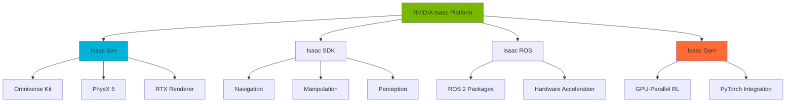
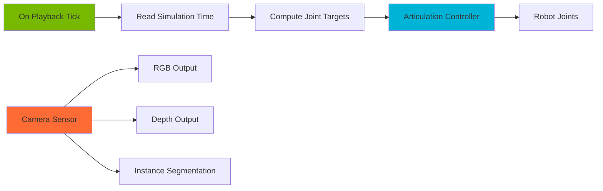
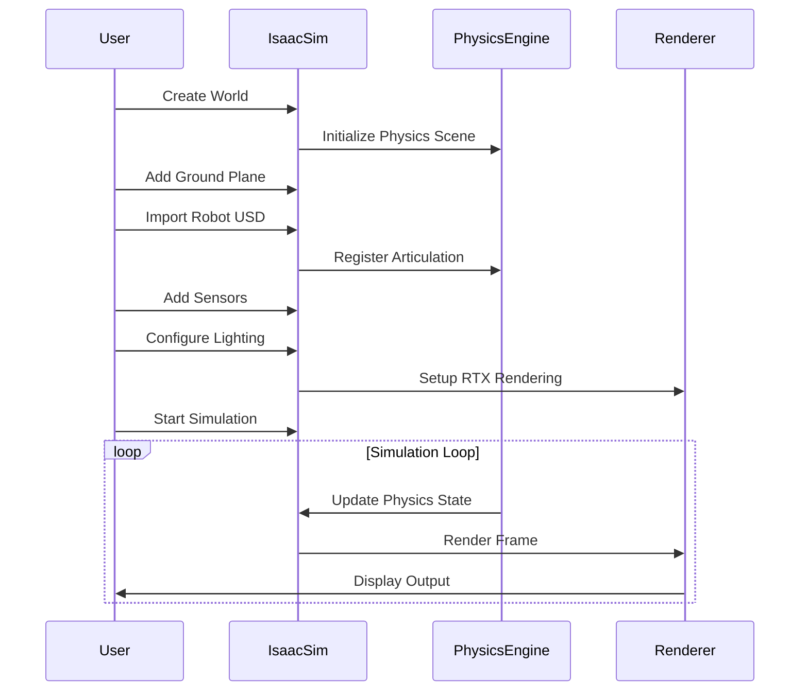

# NVIDIA Isaac SDK & Isaac Sim

## Introduction

NVIDIA Isaac is a comprehensive platform for developing, testing, and deploying AI-powered robots. The Isaac platform consists of several key components that work together to provide a complete robotics development workflow.

In this module, we'll explore Isaac Sim (NVIDIA's photorealistic robotics simulator built on Omniverse) and the Isaac SDK ecosystem, learning how to create sophisticated simulations and integrate them with real-world robotics systems.

## Isaac Platform Overview

### Platform Components

The NVIDIA Isaac platform consists of several integrated tools:



### Isaac Sim vs Isaac SDK

**Isaac Sim** is NVIDIA's flagship robotics simulator:
- Built on NVIDIA Omniverse platform
- Photorealistic RTX rendering
- Accurate PhysX 5 physics simulation
- Python and C++ APIs
- Extensible through OmniGraph and extensions

**Isaac SDK** (now largely integrated into Isaac ROS):
- Modular robotics framework
- Optimized algorithms for perception, navigation, manipulation
- Hardware-accelerated compute
- ROS/ROS 2 integration

For modern robotics development, most developers use **Isaac Sim** for simulation combined with **Isaac ROS** packages for real robot deployment.

## System Requirements

### Hardware Requirements

Isaac Sim requires significant GPU resources for optimal performance:

```yaml
Minimum Requirements:
  GPU: NVIDIA RTX 2070 or higher
  VRAM: 8GB minimum (16GB recommended)
  CPU: Intel Core i7 or AMD Ryzen 7
  RAM: 32GB minimum (64GB recommended)
  Storage: 50GB SSD space

Recommended Requirements:
  GPU: NVIDIA RTX 3090, RTX 4090, or A5000/A6000
  VRAM: 24GB or more
  CPU: Intel Core i9 or AMD Ryzen 9
  RAM: 64GB or more
  Storage: 100GB NVMe SSD
```

### Software Prerequisites

- Ubuntu 22.04 LTS (native or WSL2)
- NVIDIA GPU Driver 525.60.11 or higher
- Docker (optional but recommended)
- Python 3.10

## Installing Isaac Sim

### Method 1: Omniverse Launcher (Recommended for Beginners)

```bash
# Download and install Omniverse Launcher
# Visit: https://www.nvidia.com/en-us/omniverse/download/

# After launcher installation, search for "Isaac Sim" in the Exchange tab
# Click Install (approximately 30GB download)

# Launch Isaac Sim from the Launcher
# First launch will download additional assets
```

### Method 2: Docker Installation (Recommended for Development)

```bash
# Pull the Isaac Sim Docker image
docker pull nvcr.io/nvidia/isaac-sim:2023.1.1

# Run Isaac Sim container with GPU support
docker run --name isaac-sim --entrypoint bash -it --gpus all \
  -e "ACCEPT_EULA=Y" \
  --rm --network=host \
  -v ~/docker/isaac-sim/cache/kit:/isaac-sim/kit/cache:rw \
  -v ~/docker/isaac-sim/cache/ov:/root/.cache/ov:rw \
  -v ~/docker/isaac-sim/cache/pip:/root/.cache/pip:rw \
  -v ~/docker/isaac-sim/cache/glcache:/root/.cache/nvidia/GLCache:rw \
  -v ~/docker/isaac-sim/cache/computecache:/root/.nv/ComputeCache:rw \
  -v ~/docker/isaac-sim/logs:/root/.nvidia-omniverse/logs:rw \
  -v ~/docker/isaac-sim/data:/root/.local/share/ov/data:rw \
  -v ~/docker/isaac-sim/documents:/root/Documents:rw \
  nvcr.io/nvidia/isaac-sim:2023.1.1

# Inside container, run Isaac Sim
./runheadless.native.sh
```

### Method 3: Python Standalone Installation

```bash
# Create conda environment
conda create -n isaac-sim python=3.10
conda activate isaac-sim

# Install Isaac Sim Python package
pip install isaacsim --extra-index-url https://pypi.nvidia.com

# Verify installation
python -c "from isaacsim import SimulationApp; print('Isaac Sim installed successfully')"
```

### Verifying Installation

```python
# test_installation.py
from isaacsim import SimulationApp

# Initialize simulation
simulation_app = SimulationApp({"headless": False})

from omni.isaac.core import World
from omni.isaac.core.objects import DynamicCuboid

# Create world
world = World()

# Add a cube
cube = DynamicCuboid(
    prim_path="/World/Cube",
    name="test_cube",
    position=[0, 0, 1.0],
    scale=[0.2, 0.2, 0.2],
    color=[0.8, 0.2, 0.2]
)

# Run simulation
world.reset()
for i in range(500):
    world.step(render=True)
    if i % 50 == 0:
        print(f"Step {i}: Cube position = {cube.get_world_pose()[0]}")

simulation_app.close()
```

## Core Concepts

### OmniGraph: Visual Scripting

OmniGraph is Isaac Sim's visual scripting system for creating simulation logic without writing code.



### Action Graph: Robot Behaviors

Action Graphs define robot behaviors and control loops:

```python
# Example: Creating an Action Graph programmatically
import omni.graph.core as og

# Create action graph
keys = og.Controller.Keys
graph_path = "/World/ActionGraph"
(graph, nodes, _, _) = og.Controller.edit(
    {"graph_path": graph_path, "evaluator_name": "execution"},
    {
        keys.CREATE_NODES: [
            ("OnPlaybackTick", "omni.graph.action.OnPlaybackTick"),
            ("ReadSimTime", "omni.isaac.core_nodes.IsaacReadSimulationTime"),
            ("ArticulationController", "omni.isaac.core_nodes.IsaacArticulationController"),
        ],
        keys.CONNECT: [
            ("OnPlaybackTick.outputs:tick", "ReadSimTime.inputs:execIn"),
            ("ReadSimTime.outputs:execOut", "ArticulationController.inputs:execIn"),
        ],
        keys.SET_VALUES: [
            ("ArticulationController.inputs:robotPath", "/World/Robot"),
        ],
    },
)
```

### Robot Engine Bridge

The Robot Engine Bridge connects Isaac Sim with external applications:

```python
# bridge_example.py
from isaacsim import SimulationApp
simulation_app = SimulationApp({"headless": False})

from omni.isaac.core import World
from omni.isaac.core.utils.stage import add_reference_to_stage
from omni.isaac.core.robots import Robot
import numpy as np

# Create world
world = World()

# Add robot from USD
robot_usd_path = "omniverse://localhost/Isaac/Robots/Franka/franka.usd"
add_reference_to_stage(usd_path=robot_usd_path, prim_path="/World/Franka")

# Get robot
robot = world.scene.add(Robot(prim_path="/World/Franka", name="franka_robot"))

# Reset world
world.reset()

# Control loop
for i in range(1000):
    # Get robot state
    joint_positions = robot.get_joint_positions()

    # Compute control
    target_positions = joint_positions + np.random.randn(len(joint_positions)) * 0.01

    # Apply control
    robot.set_joint_positions(target_positions)

    # Step simulation
    world.step(render=True)

simulation_app.close()
```

## Creating Your First Isaac Sim Scene

### Scene Setup Workflow



### Complete Scene Example

```python
# first_scene.py
from isaacsim import SimulationApp

# Configure simulation
simulation_config = {
    "headless": False,
    "width": 1920,
    "height": 1080,
}
simulation_app = SimulationApp(simulation_config)

from omni.isaac.core import World
from omni.isaac.core.utils.stage import add_reference_to_stage
from omni.isaac.core.robots import Robot
from omni.isaac.core.utils.prims import create_prim
from omni.isaac.core.utils.rotations import euler_angles_to_quat
import numpy as np

# Create world with physics settings
world = World(
    stage_units_in_meters=1.0,
    physics_dt=1.0/60.0,  # 60 Hz physics
    rendering_dt=1.0/60.0  # 60 Hz rendering
)

# Add ground plane
world.scene.add_default_ground_plane()

# Add lighting
create_prim(
    prim_path="/World/DomeLight",
    prim_type="DomeLight",
    attributes={"intensity": 1000}
)

# Import robot (UR10)
ur10_usd = "omniverse://localhost/Isaac/Robots/UniversalRobots/ur10/ur10.usd"
robot_prim_path = "/World/UR10"
add_reference_to_stage(usd_path=ur10_usd, prim_path=robot_prim_path)

# Create robot instance
robot = world.scene.add(
    Robot(
        prim_path=robot_prim_path,
        name="ur10_robot",
        position=np.array([0, 0, 0]),
        orientation=euler_angles_to_quat([0, 0, 0])
    )
)

# Add a target object (cube)
from omni.isaac.core.objects import DynamicCuboid
target_cube = world.scene.add(
    DynamicCuboid(
        prim_path="/World/Target",
        name="target",
        position=np.array([0.5, 0.3, 0.2]),
        scale=np.array([0.05, 0.05, 0.05]),
        color=np.array([1.0, 0.0, 0.0])
    )
)

# Reset world (initialize physics)
world.reset()

print(f"Robot DOF: {robot.num_dof}")
print(f"Joint names: {robot.dof_names}")

# Simple control loop - wave motion
simulation_steps = 1000
for i in range(simulation_steps):
    # Get current joint positions
    current_positions = robot.get_joint_positions()

    # Create sinusoidal motion for first 3 joints
    t = i * world.get_physics_dt()
    target_positions = current_positions.copy()
    target_positions[0] = 0.5 * np.sin(2 * np.pi * 0.2 * t)
    target_positions[1] = -1.0 + 0.3 * np.sin(2 * np.pi * 0.3 * t)
    target_positions[2] = 0.3 * np.sin(2 * np.pi * 0.25 * t)

    # Apply position targets
    robot.set_joint_positions(target_positions)

    # Step simulation
    world.step(render=True)

    if i % 100 == 0:
        print(f"Step {i}/{simulation_steps}")

simulation_app.close()
```

## Python Standalone API

### Key API Modules

```python
# Core imports for standalone scripts
from isaacsim import SimulationApp  # Must be first

# After SimulationApp initialization:
from omni.isaac.core import World  # Main world container
from omni.isaac.core.robots import Robot  # Robot wrapper
from omni.isaac.core.objects import DynamicCuboid, VisualCuboid  # Basic objects
from omni.isaac.core.prims import XFormPrim  # Transform primitives
from omni.isaac.core.utils.stage import add_reference_to_stage  # USD import
from omni.isaac.core.utils.numpy.rotations import euler_angles_to_quat  # Math utils
from omni.isaac.core.articulations import Articulation  # Joint control
from omni.isaac.core.controllers import BaseController  # Controller base class
```

### Advanced Robot Control

```python
# advanced_control.py
from isaacsim import SimulationApp
simulation_app = SimulationApp({"headless": False})

from omni.isaac.core import World
from omni.isaac.core.utils.stage import add_reference_to_stage
from omni.isaac.core.articulations import Articulation
from omni.isaac.core.utils.types import ArticulationAction
import numpy as np

world = World()
world.scene.add_default_ground_plane()

# Add Franka robot
franka_usd = "omniverse://localhost/Isaac/Robots/Franka/franka.usd"
add_reference_to_stage(usd_path=franka_usd, prim_path="/World/Franka")

# Create articulation with full control
franka = world.scene.add(
    Articulation(
        prim_path="/World/Franka",
        name="franka"
    )
)

world.reset()

# Get articulation properties
print(f"DOF: {franka.num_dof}")
print(f"DOF names: {franka.dof_names}")
print(f"DOF limits: {franka.dof_properties}")

# Control modes demonstration
for i in range(500):
    if i < 100:
        # Position control
        target_positions = np.array([0.0, -0.5, 0.0, -2.0, 0.0, 1.5, 0.785])
        franka.apply_action(
            ArticulationAction(joint_positions=target_positions)
        )
    elif i < 200:
        # Velocity control
        target_velocities = np.array([0.5, -0.5, 0.3, -0.3, 0.2, -0.2, 0.1])
        franka.apply_action(
            ArticulationAction(joint_velocities=target_velocities)
        )
    else:
        # Effort (torque) control
        target_efforts = np.array([10.0, -10.0, 5.0, -5.0, 2.0, -2.0, 1.0])
        franka.apply_action(
            ArticulationAction(joint_efforts=target_efforts)
        )

    world.step(render=True)

    # Read state
    if i % 50 == 0:
        positions = franka.get_joint_positions()
        velocities = franka.get_joint_velocities()
        print(f"Step {i}: Pos={positions[0]:.3f}, Vel={velocities[0]:.3f}")

simulation_app.close()
```

## Complete Workflow: Import, Sense, Simulate

### Full Pipeline Example

```python
# complete_workflow.py
"""
Complete Isaac Sim workflow:
1. Import custom robot
2. Add multiple sensors (camera, lidar)
3. Run simulation with data collection
4. Export sensor data
"""

from isaacsim import SimulationApp
simulation_app = SimulationApp({"headless": False})

from omni.isaac.core import World
from omni.isaac.core.utils.stage import add_reference_to_stage
from omni.isaac.core.robots import Robot
from omni.isaac.sensor import Camera
from omni.isaac.range_sensor import _range_sensor
import omni.replicator.core as rep
import numpy as np
import os

# Setup output directory
output_dir = os.path.expanduser("~/isaac_sim_output")
os.makedirs(output_dir, exist_ok=True)

# Create world
world = World()
world.scene.add_default_ground_plane()

# Import robot
robot_usd = "omniverse://localhost/Isaac/Robots/Carter/carter_v1.usd"
add_reference_to_stage(usd_path=robot_usd, prim_path="/World/Carter")

robot = world.scene.add(
    Robot(
        prim_path="/World/Carter",
        name="carter_robot",
        position=np.array([0, 0, 0])
    )
)

# Add RGB-D Camera
camera = Camera(
    prim_path="/World/Carter/chassis_link/camera",
    position=np.array([0.3, 0, 0.5]),
    frequency=20,
    resolution=(640, 480),
)
camera.initialize()
camera.add_distance_to_image_plane_to_frame()  # Depth
camera.add_normals_to_frame()  # Surface normals

# Add 2D Lidar
_, lidar = omni.kit.commands.execute(
    "RangeSensorCreateLidar",
    path="/World/Carter/chassis_link/lidar",
    parent="/World/Carter/chassis_link",
    min_range=0.4,
    max_range=100.0,
    draw_points=True,
    draw_lines=False,
    horizontal_fov=270.0,
    vertical_fov=0.0,
    horizontal_resolution=0.4,
    vertical_resolution=1.0,
    rotation_rate=0.0,
    high_lod=False,
    yaw_offset=0.0,
    enable_semantics=True
)

# Reset world
world.reset()

# Simulation loop with data collection
frame_count = 0
max_frames = 200

for i in range(max_frames):
    # Simple motion command (forward + rotation)
    linear_velocity = 0.5  # m/s
    angular_velocity = 0.2  # rad/s

    # Apply velocity (simplified, assumes differential drive)
    current_pos, current_rot = robot.get_world_pose()

    # Step simulation
    world.step(render=True)

    # Capture sensor data every 10 frames
    if i % 10 == 0:
        # Get camera data
        camera_data = camera.get_current_frame()
        rgb = camera_data["rgba"][:, :, :3]  # Drop alpha
        depth = camera_data["distance_to_image_plane"]

        # Get lidar data
        lidar_data = _range_sensor.get_linear_depth_data("/World/Carter/chassis_link/lidar")

        # Save data
        np.save(f"{output_dir}/rgb_frame_{frame_count:04d}.npy", rgb)
        np.save(f"{output_dir}/depth_frame_{frame_count:04d}.npy", depth)
        np.save(f"{output_dir}/lidar_frame_{frame_count:04d}.npy", lidar_data)

        print(f"Saved frame {frame_count}")
        frame_count += 1

print(f"Data collection complete. {frame_count} frames saved to {output_dir}")

simulation_app.close()
```

## Integration with ROS 2

### Isaac ROS Bridge Setup

```python
# ros2_bridge.py
from isaacsim import SimulationApp
simulation_app = SimulationApp({"headless": False})

# Enable ROS2 extension
from omni.isaac.core.utils.extensions import enable_extension
enable_extension("omni.isaac.ros2_bridge")

from omni.isaac.core import World
from omni.isaac.core.utils.stage import add_reference_to_stage
import omni.graph.core as og

# Create world and robot
world = World()
world.scene.add_default_ground_plane()

robot_usd = "omniverse://localhost/Isaac/Robots/Turtlebot/turtlebot3_burger.usd"
add_reference_to_stage(usd_path=robot_usd, prim_path="/World/Turtlebot")

# Create ROS2 Action Graph
try:
    og.Controller.edit(
        {"graph_path": "/World/ActionGraph", "evaluator_name": "execution"},
        {
            og.Controller.Keys.CREATE_NODES: [
                ("OnPlaybackTick", "omni.graph.action.OnPlaybackTick"),
                ("PublishTF", "omni.isaac.ros2_bridge.ROS2PublishTransformTree"),
                ("PublishClock", "omni.isaac.ros2_bridge.ROS2PublishClock"),
                ("SubscribeTwist", "omni.isaac.ros2_bridge.ROS2SubscribeTwist"),
                ("DifferentialController", "omni.isaac.wheeled_robots.DifferentialController"),
            ],
            og.Controller.Keys.CONNECT: [
                ("OnPlaybackTick.outputs:tick", "PublishTF.inputs:execIn"),
                ("OnPlaybackTick.outputs:tick", "PublishClock.inputs:execIn"),
                ("OnPlaybackTick.outputs:tick", "SubscribeTwist.inputs:execIn"),
                ("SubscribeTwist.outputs:execOut", "DifferentialController.inputs:execIn"),
                ("SubscribeTwist.outputs:linearVelocity", "DifferentialController.inputs:linearVelocity"),
                ("SubscribeTwist.outputs:angularVelocity", "DifferentialController.inputs:angularVelocity"),
            ],
            og.Controller.Keys.SET_VALUES: [
                ("PublishTF.inputs:topicName", "tf"),
                ("PublishClock.inputs:topicName", "clock"),
                ("SubscribeTwist.inputs:topicName", "cmd_vel"),
                ("DifferentialController.inputs:maxLinearSpeed", 1.0),
                ("DifferentialController.inputs:maxAngularSpeed", 3.14),
                ("DifferentialController.inputs:wheelDistance", 0.16),
                ("DifferentialController.inputs:wheelRadius", 0.033),
            ],
        },
    )
except Exception as e:
    print(f"Error creating ROS2 graph: {e}")

world.reset()

print("ROS2 bridge active. Robot listening on /cmd_vel topic")
print("Test with: ros2 topic pub /cmd_vel geometry_msgs/Twist ...")

# Run simulation
for i in range(10000):
    world.step(render=True)

simulation_app.close()
```

### ROS 2 Camera Publisher

```python
# ros2_camera_pub.py
from isaacsim import SimulationApp
simulation_app = SimulationApp({"headless": False})

from omni.isaac.core.utils.extensions import enable_extension
enable_extension("omni.isaac.ros2_bridge")

from omni.isaac.core import World
from omni.isaac.sensor import Camera
import omni.graph.core as og

world = World()

# Create camera
camera = Camera(
    prim_path="/World/Camera",
    position=[2, 2, 2],
    resolution=(1280, 720),
    frequency=30
)
camera.initialize()

# Create ROS2 camera publisher graph
og.Controller.edit(
    {"graph_path": "/World/CameraGraph", "evaluator_name": "execution"},
    {
        og.Controller.Keys.CREATE_NODES: [
            ("OnPlaybackTick", "omni.graph.action.OnPlaybackTick"),
            ("CameraHelper", "omni.isaac.ros2_bridge.ROS2CameraHelper"),
        ],
        og.Controller.Keys.CONNECT: [
            ("OnPlaybackTick.outputs:tick", "CameraHelper.inputs:execIn"),
        ],
        og.Controller.Keys.SET_VALUES: [
            ("CameraHelper.inputs:frameId", "camera_frame"),
            ("CameraHelper.inputs:topicName", "rgb"),
            ("CameraHelper.inputs:type", "rgb"),
            ("CameraHelper.inputs:renderProductPath", "/World/Camera"),
        ],
    },
)

world.reset()

print("Publishing camera on /rgb topic")
for i in range(1000):
    world.step(render=True)

simulation_app.close()
```

## Key Takeaways

1. **Isaac Sim** is built on NVIDIA Omniverse, providing photorealistic rendering and accurate physics simulation
2. **OmniGraph** enables visual scripting for complex robot behaviors without coding
3. **Python Standalone API** provides full programmatic control for automation and testing
4. **ROS 2 integration** is seamless through the Isaac ROS bridge extension
5. **GPU requirements** are significant - RTX GPUs are essential for good performance
6. **USD format** is the foundation for all assets, enabling interoperability with other Omniverse applications

## Hands-On Exercises

### Exercise 1: Multi-Robot Scene

Create a scene with 3 different robots (your choice) that:
- Move in coordinated patterns
- Avoid collisions with each other
- Have different colored markers to distinguish them
- Save their trajectories to CSV files

### Exercise 2: Sensor Fusion

Build a simulation that:
- Uses both camera and lidar on a mobile robot
- Publishes data to ROS 2 topics
- Includes obstacles and dynamic objects
- Implements basic obstacle detection logic

### Exercise 3: Custom Action Graph

Create an Action Graph that:
- Reads joint states from a robot arm
- Computes inverse kinematics (use existing IK nodes)
- Moves end-effector in a circle
- Publishes end-effector pose to ROS 2

### Exercise 4: Data Collection Pipeline

Develop a script that:
- Loads 5 different environments
- Spawns a robot in random poses in each
- Collects 100 RGB-D images per environment
- Saves images with metadata (pose, timestamp)
- Creates a dataset index file

## Additional Resources

### Official Documentation
- [Isaac Sim Documentation](https://docs.omniverse.nvidia.com/isaacsim/latest/index.html)
- [Isaac ROS Documentation](https://nvidia-isaac-ros.github.io/index.html)
- [Omniverse USD Documentation](https://docs.omniverse.nvidia.com/usd/latest/index.html)

### Tutorials and Examples
- [Isaac Sim Tutorials](https://docs.omniverse.nvidia.com/isaacsim/latest/tutorials/index.html)
- [Isaac ROS Tutorials](https://nvidia-isaac-ros.github.io/tutorials/index.html)
- [OmniGraph Documentation](https://docs.omniverse.nvidia.com/extensions/latest/ext_omnigraph.html)

### Community Resources
- [NVIDIA Omniverse Forums](https://forums.developer.nvidia.com/c/omniverse/)
- [Isaac Sim GitHub Examples](https://github.com/NVIDIA-Omniverse/IsaacSimExamples)
- [Isaac ROS GitHub](https://github.com/NVIDIA-Isaac-ROS)

### Video Tutorials
- [Isaac Sim YouTube Playlist](https://www.youtube.com/playlist?list=PL3jK4xNnlCVf1SzxjCm7ZxDBNl9QYyV8X)
- [NVIDIA Developer YouTube Channel](https://www.youtube.com/c/NVIDIADeveloper)

---

**Next**: [Perception and Manipulation](./perception-manipulation) - Learn advanced sensor simulation and manipulation with Isaac Cortex

**Previous**: [Module Overview](./) - Return to NVIDIA Isaac Platform introduction
