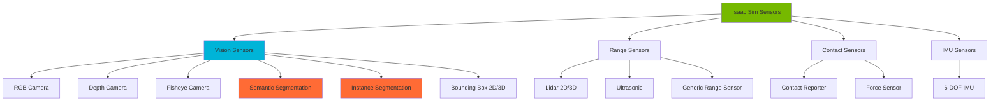
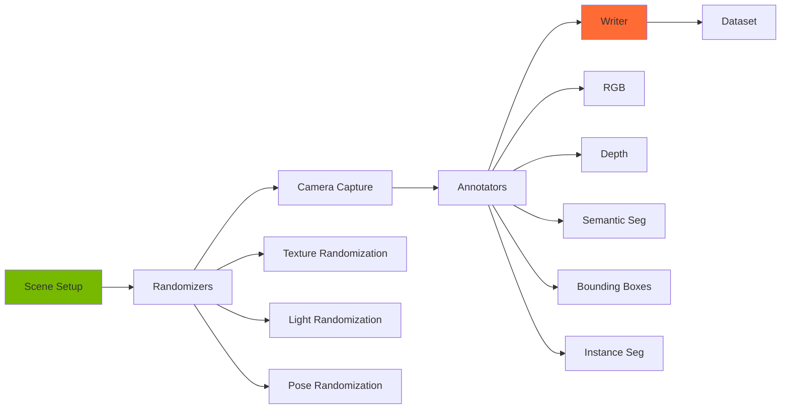
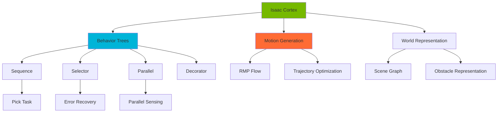

# Perception & Manipulation

## Introduction

Perception and manipulation are fundamental capabilities for intelligent robots. In this module, we'll explore how to use Isaac Sim's advanced sensor suite to perceive the environment and leverage Isaac Cortex for sophisticated manipulation tasks.

We'll cover synthetic data generation for training AI models, physics-based grasping simulation, and integration with MoveIt 2 for motion planning.

## Isaac Sim Perception Sensors

### Sensor Types Overview



### RGB Camera Setup

```python
# rgb_camera.py
from isaacsim import SimulationApp
simulation_app = SimulationApp({"headless": False})

from omni.isaac.core import World
from omni.isaac.sensor import Camera
from omni.isaac.core.utils.stage import add_reference_to_stage
import numpy as np
import matplotlib.pyplot as plt

world = World()
world.scene.add_default_ground_plane()

# Add objects to scene
from omni.isaac.core.objects import DynamicCuboid, DynamicSphere

for i in range(5):
    DynamicCuboid(
        prim_path=f"/World/Cube_{i}",
        position=np.array([np.random.uniform(-1, 1), np.random.uniform(-1, 1), 0.5]),
        scale=np.array([0.1, 0.1, 0.1]),
        color=np.random.rand(3)
    )

for i in range(3):
    DynamicSphere(
        prim_path=f"/World/Sphere_{i}",
        position=np.array([np.random.uniform(-1, 1), np.random.uniform(-1, 1), 0.3]),
        radius=0.05,
        color=np.random.rand(3)
    )

# Create RGB camera
camera = Camera(
    prim_path="/World/Camera",
    position=np.array([2.0, 2.0, 2.0]),
    frequency=30,
    resolution=(1280, 720),
    orientation=np.array([0.5, -0.5, 0.5, -0.5])  # Look at origin
)

world.reset()
camera.initialize()

# Capture and display image
for i in range(100):
    world.step(render=True)

    if i == 50:
        # Get current frame
        frame = camera.get_current_frame()
        rgb_data = frame["rgba"][:, :, :3]  # Drop alpha channel

        # Display using matplotlib
        plt.figure(figsize=(12, 6))
        plt.imshow(rgb_data)
        plt.title("RGB Camera Output")
        plt.axis('off')
        plt.savefig("rgb_output.png")
        print("Saved RGB image to rgb_output.png")

simulation_app.close()
```

### Depth Camera

```python
# depth_camera.py
from isaacsim import SimulationApp
simulation_app = SimulationApp({"headless": False})

from omni.isaac.core import World
from omni.isaac.sensor import Camera
from omni.isaac.core.objects import DynamicCuboid
import numpy as np
import matplotlib.pyplot as plt

world = World()
world.scene.add_default_ground_plane()

# Add objects at different depths
for i in range(5):
    distance = 0.5 + i * 0.3
    DynamicCuboid(
        prim_path=f"/World/Cube_{i}",
        position=np.array([distance, 0, 0.5]),
        scale=np.array([0.2, 0.2, 0.2]),
        color=np.array([1.0, 0.5, 0.0])
    )

# Create camera with depth
camera = Camera(
    prim_path="/World/DepthCamera",
    position=np.array([0, 0, 1.0]),
    frequency=30,
    resolution=(640, 480)
)

world.reset()
camera.initialize()

# Enable depth output
camera.add_distance_to_image_plane_to_frame()
camera.add_distance_to_camera_to_frame()

# Capture depth data
for i in range(100):
    world.step(render=True)

    if i == 50:
        frame = camera.get_current_frame()

        rgb = frame["rgba"][:, :, :3]
        depth_plane = frame["distance_to_image_plane"]
        depth_camera = frame["distance_to_camera"]

        # Visualize depth maps
        fig, axes = plt.subplots(1, 3, figsize=(18, 5))

        axes[0].imshow(rgb)
        axes[0].set_title("RGB")
        axes[0].axis('off')

        im1 = axes[1].imshow(depth_plane, cmap='viridis')
        axes[1].set_title("Distance to Image Plane")
        axes[1].axis('off')
        plt.colorbar(im1, ax=axes[1])

        im2 = axes[2].imshow(depth_camera, cmap='plasma')
        axes[2].set_title("Distance to Camera")
        axes[2].axis('off')
        plt.colorbar(im2, ax=axes[2])

        plt.tight_layout()
        plt.savefig("depth_output.png")
        print("Saved depth visualization to depth_output.png")

        # Print depth statistics
        print(f"Depth range: {depth_plane.min():.2f}m to {depth_plane.max():.2f}m")

simulation_app.close()
```

### Semantic Segmentation

```python
# semantic_segmentation.py
from isaacsim import SimulationApp
simulation_app = SimulationApp({"headless": False})

from omni.isaac.core import World
from omni.isaac.core.utils.stage import add_reference_to_stage
from omni.isaac.sensor import Camera
import omni.replicator.core as rep
import numpy as np
import matplotlib.pyplot as plt

world = World()
world.scene.add_default_ground_plane()

# Add robot (will be one semantic class)
robot_usd = "omniverse://localhost/Isaac/Robots/Franka/franka.usd"
add_reference_to_stage(usd_path=robot_usd, prim_path="/World/Franka")

# Add objects (different semantic classes)
from omni.isaac.core.objects import DynamicCuboid, DynamicSphere

cube = DynamicCuboid(
    prim_path="/World/Cube",
    position=np.array([0.5, 0.3, 0.5]),
    scale=np.array([0.1, 0.1, 0.1]),
    color=np.array([1.0, 0.0, 0.0])
)

sphere = DynamicSphere(
    prim_path="/World/Sphere",
    position=np.array([0.5, -0.3, 0.3]),
    radius=0.05,
    color=np.array([0.0, 1.0, 0.0])
)

# Apply semantic labels
import omni.usd
from pxr import Semantics

stage = omni.usd.get_context().get_stage()

# Label robot as "robot"
robot_prim = stage.GetPrimAtPath("/World/Franka")
sem = Semantics.SemanticsAPI.Apply(robot_prim, "Semantics")
sem.CreateSemanticTypeAttr()
sem.CreateSemanticDataAttr()
sem.GetSemanticTypeAttr().Set("class")
sem.GetSemanticDataAttr().Set("robot")

# Label cube as "obstacle"
cube_prim = stage.GetPrimAtPath("/World/Cube")
sem = Semantics.SemanticsAPI.Apply(cube_prim, "Semantics")
sem.GetSemanticTypeAttr().Set("class")
sem.GetSemanticDataAttr().Set("obstacle")

# Label sphere as "target"
sphere_prim = stage.GetPrimAtPath("/World/Sphere")
sem = Semantics.SemanticsAPI.Apply(sphere_prim, "Semantics")
sem.GetSemanticTypeAttr().Set("class")
sem.GetSemanticDataAttr().Set("target")

# Create camera
camera = Camera(
    prim_path="/World/Camera",
    position=np.array([1.5, 0, 1.0]),
    frequency=30,
    resolution=(1280, 720)
)

world.reset()
camera.initialize()
camera.add_semantic_segmentation_to_frame()

# Capture semantic segmentation
for i in range(100):
    world.step(render=True)

    if i == 50:
        frame = camera.get_current_frame()
        rgb = frame["rgba"][:, :, :3]
        semantic = frame["semantic_segmentation"]

        # Get unique semantic IDs
        unique_ids = np.unique(semantic)
        print(f"Semantic IDs in scene: {unique_ids}")

        # Visualize
        fig, axes = plt.subplots(1, 2, figsize=(12, 5))

        axes[0].imshow(rgb)
        axes[0].set_title("RGB")
        axes[0].axis('off')

        im = axes[1].imshow(semantic, cmap='tab20')
        axes[1].set_title("Semantic Segmentation")
        axes[1].axis('off')
        plt.colorbar(im, ax=axes[1])

        plt.tight_layout()
        plt.savefig("semantic_output.png")
        print("Saved semantic segmentation to semantic_output.png")

simulation_app.close()
```

### Instance Segmentation

```python
# instance_segmentation.py
from isaacsim import SimulationApp
simulation_app = SimulationApp({"headless": False})

from omni.isaac.core import World
from omni.isaac.sensor import Camera
from omni.isaac.core.objects import DynamicCuboid
import numpy as np
import matplotlib.pyplot as plt

world = World()
world.scene.add_default_ground_plane()

# Add multiple instances of the same class
cubes = []
for i in range(10):
    cube = DynamicCuboid(
        prim_path=f"/World/Cube_{i}",
        position=np.array([
            np.random.uniform(-1, 1),
            np.random.uniform(-1, 1),
            0.3
        ]),
        scale=np.array([0.1, 0.1, 0.1]),
        color=np.random.rand(3)
    )
    cubes.append(cube)

# Create camera with instance segmentation
camera = Camera(
    prim_path="/World/Camera",
    position=np.array([0, 0, 3.0]),
    frequency=30,
    resolution=(1280, 720)
)

world.reset()
camera.initialize()
camera.add_instance_segmentation_to_frame()

# Capture instance segmentation
for i in range(100):
    world.step(render=True)

    if i == 50:
        frame = camera.get_current_frame()
        rgb = frame["rgba"][:, :, :3]
        instance = frame["instance_segmentation"]

        # Count instances
        unique_instances = np.unique(instance)
        print(f"Number of instances detected: {len(unique_instances)}")
        print(f"Instance IDs: {unique_instances}")

        # Visualize
        fig, axes = plt.subplots(1, 2, figsize=(12, 5))

        axes[0].imshow(rgb)
        axes[0].set_title("RGB")
        axes[0].axis('off')

        im = axes[1].imshow(instance, cmap='nipy_spectral')
        axes[1].set_title(f"Instance Segmentation ({len(unique_instances)} instances)")
        axes[1].axis('off')
        plt.colorbar(im, ax=axes[1])

        plt.tight_layout()
        plt.savefig("instance_output.png")

simulation_app.close()
```

## Replicator for Synthetic Data Generation

### Replicator Overview

Replicator is NVIDIA's SDK for generating synthetic data with domain randomization.



### Basic Replicator Example

```python
# replicator_basic.py
from isaacsim import SimulationApp
simulation_app = SimulationApp({"headless": False})

import omni.replicator.core as rep
from omni.isaac.core import World
from omni.isaac.core.objects import DynamicCuboid
import numpy as np

world = World()
world.scene.add_default_ground_plane()

# Create objects
cube = DynamicCuboid(
    prim_path="/World/Cube",
    position=np.array([0, 0, 0.5]),
    scale=np.array([0.2, 0.2, 0.2])
)

world.reset()

# Setup replicator
with rep.new_layer():
    # Create camera
    camera = rep.create.camera(position=(2, 2, 2), look_at="/World/Cube")

    # Create render product
    render_product = rep.create.render_product(camera, (512, 512))

    # Define randomization function
    def randomize_cube():
        cubes = rep.get.prims(path_pattern="/World/Cube")
        with cubes:
            rep.modify.pose(
                position=rep.distribution.uniform((-1, -1, 0.5), (1, 1, 1.5)),
                rotation=rep.distribution.uniform((0, 0, 0), (360, 360, 360))
            )
            rep.randomizer.color(
                colors=rep.distribution.uniform((0, 0, 0), (1, 1, 1))
            )
        return cubes.node

    # Register randomizer
    rep.randomizer.register(randomize_cube)

    # Setup trigger (randomize every frame)
    with rep.trigger.on_frame(num_frames=100):
        rep.randomizer.randomize_cube()

    # Setup writer for RGB data
    writer = rep.WriterRegistry.get("BasicWriter")
    writer.initialize(
        output_dir="~/replicator_output",
        rgb=True,
        semantic_segmentation=True
    )
    writer.attach([render_product])

# Run replicator
rep.orchestrator.run()

# Step simulation
for i in range(100):
    world.step(render=True)
    rep.orchestrator.step(rt_subframes=4)
    if i % 10 == 0:
        print(f"Generated {i+1}/100 frames")

rep.orchestrator.stop()

print("Dataset generation complete!")
simulation_app.close()
```

### Advanced Domain Randomization

```python
# domain_randomization.py
from isaacsim import SimulationApp
simulation_app = SimulationApp({"headless": False})

import omni.replicator.core as rep
from omni.isaac.core import World
from omni.isaac.core.utils.stage import add_reference_to_stage
import numpy as np

world = World()
world.scene.add_default_ground_plane()

# Add robot
robot_usd = "omniverse://localhost/Isaac/Robots/Franka/franka.usd"
add_reference_to_stage(usd_path=robot_usd, prim_path="/World/Franka")

world.reset()

with rep.new_layer():
    # Create camera
    camera = rep.create.camera()

    # Randomize camera pose
    with camera:
        rep.modify.pose(
            position=rep.distribution.uniform((1.5, -1, 0.5), (2.5, 1, 2)),
            look_at="/World/Franka"
        )

    render_product = rep.create.render_product(camera, (1024, 1024))

    # Create randomization function
    def randomize_scene():
        # Randomize robot joint positions
        robot = rep.get.prims(path_pattern="/World/Franka")
        with robot:
            # Note: This is simplified; actual joint randomization requires USD API
            pass

        # Randomize lighting
        lights = rep.create.light(
            light_type="Dome",
            intensity=rep.distribution.uniform(500, 3000),
            temperature=rep.distribution.uniform(3000, 6500)
        )

        # Randomize ground plane material
        ground = rep.get.prims(path_pattern="/World/defaultGroundPlane")
        with ground:
            rep.randomizer.color(
                colors=rep.distribution.uniform((0.5, 0.5, 0.5), (1, 1, 1))
            )

        return robot.node

    rep.randomizer.register(randomize_scene)

    # Trigger randomization
    with rep.trigger.on_frame(num_frames=500):
        rep.randomizer.randomize_scene()

    # Multi-modal writer
    writer = rep.WriterRegistry.get("BasicWriter")
    writer.initialize(
        output_dir="~/domain_rand_output",
        rgb=True,
        depth=True,
        semantic_segmentation=True,
        instance_segmentation=True,
        bounding_box_2d_tight=True,
        bounding_box_3d=True
    )
    writer.attach([render_product])

rep.orchestrator.run()

for i in range(500):
    world.step(render=True)
    rep.orchestrator.step(rt_subframes=4)
    if i % 50 == 0:
        print(f"Progress: {i+1}/500 frames")

rep.orchestrator.stop()
print("Advanced domain randomization complete!")

simulation_app.close()
```

## Training Object Detection with Synthetic Data

### Dataset Generation for YOLOv8

```python
# generate_yolo_dataset.py
from isaacsim import SimulationApp
simulation_app = SimulationApp({"headless": False})

import omni.replicator.core as rep
from omni.isaac.core import World
from omni.isaac.core.objects import DynamicCuboid, DynamicSphere, DynamicCylinder
import numpy as np
import json
import os

world = World()
world.scene.add_default_ground_plane()

# Create objects for detection (3 classes)
objects = {
    "cube": [],
    "sphere": [],
    "cylinder": []
}

for i in range(5):
    objects["cube"].append(DynamicCuboid(
        prim_path=f"/World/Cube_{i}",
        position=np.array([0, 0, 10]),  # Start off-screen
        scale=np.array([0.1, 0.1, 0.1])
    ))

world.reset()

output_dir = os.path.expanduser("~/yolo_dataset")
os.makedirs(f"{output_dir}/images", exist_ok=True)
os.makedirs(f"{output_dir}/labels", exist_ok=True)

with rep.new_layer():
    camera = rep.create.camera(position=(2, 2, 2))
    render_product = rep.create.render_product(camera, (640, 640))

    def randomize_objects():
        # Randomize cube positions
        cubes = rep.get.prims(path_pattern="/World/Cube_*")
        with cubes:
            rep.modify.pose(
                position=rep.distribution.uniform((-0.5, -0.5, 0.2), (0.5, 0.5, 0.8)),
                rotation=rep.distribution.uniform((0, 0, 0), (360, 360, 360))
            )
            rep.randomizer.color(colors=rep.distribution.uniform((0, 0, 0), (1, 1, 1)))

        # Randomize lighting
        rep.create.light(
            light_type="Dome",
            intensity=rep.distribution.uniform(800, 2000),
            temperature=rep.distribution.uniform(4000, 6500)
        )

        return cubes.node

    rep.randomizer.register(randomize_objects)

    with rep.trigger.on_frame(num_frames=1000):
        rep.randomizer.randomize_objects()

    # Custom writer for YOLO format
    class YOLOWriter(rep.Writer):
        def __init__(self, output_dir):
            self.output_dir = output_dir
            self.frame_id = 0
            self.class_names = ["cube", "sphere", "cylinder"]

        def write(self, data):
            # Save image
            rgb = data["rgb"]
            image_path = f"{self.output_dir}/images/frame_{self.frame_id:06d}.png"
            # Save using appropriate image library

            # Save YOLO annotations
            if "bounding_box_2d_tight" in data:
                bboxes = data["bounding_box_2d_tight"]
                label_path = f"{self.output_dir}/labels/frame_{self.frame_id:06d}.txt"

                with open(label_path, 'w') as f:
                    for bbox in bboxes:
                        # Convert to YOLO format: class x_center y_center width height
                        # All normalized to [0, 1]
                        class_id = 0  # Simplified; extract from bbox data
                        x_center = (bbox['x_min'] + bbox['x_max']) / 2
                        y_center = (bbox['y_min'] + bbox['y_max']) / 2
                        width = bbox['x_max'] - bbox['x_min']
                        height = bbox['y_max'] - bbox['y_min']
                        f.write(f"{class_id} {x_center} {y_center} {width} {height}\n")

            self.frame_id += 1

    writer = rep.WriterRegistry.get("BasicWriter")
    writer.initialize(
        output_dir=output_dir,
        rgb=True,
        bounding_box_2d_tight=True
    )
    writer.attach([render_product])

rep.orchestrator.run()

for i in range(1000):
    world.step(render=True)
    rep.orchestrator.step(rt_subframes=4)
    if i % 100 == 0:
        print(f"Generated {i+1}/1000 training examples")

rep.orchestrator.stop()

# Create dataset.yaml for YOLOv8
dataset_config = {
    "path": output_dir,
    "train": "images",
    "val": "images",
    "names": {0: "cube", 1: "sphere", 2: "cylinder"}
}

with open(f"{output_dir}/dataset.yaml", 'w') as f:
    json.dump(dataset_config, f, indent=2)

print(f"Dataset ready at {output_dir}")
print("Train with: yolo detect train data=dataset.yaml model=yolov8n.pt epochs=100")

simulation_app.close()
```

## Isaac ROS Perception Packages

### DNN Inference with Isaac ROS

```python
# isaac_ros_dnn.py
from isaacsim import SimulationApp
simulation_app = SimulationApp({"headless": False})

from omni.isaac.core.utils.extensions import enable_extension
enable_extension("omni.isaac.ros2_bridge")

from omni.isaac.core import World
from omni.isaac.sensor import Camera
import omni.graph.core as og

world = World()
world.scene.add_default_ground_plane()

# Create camera
camera = Camera(
    prim_path="/World/Camera",
    position=[2, 0, 1],
    resolution=(640, 480),
    frequency=30
)

world.reset()
camera.initialize()

# Create ROS2 graph for DNN inference
# This assumes Isaac ROS DNN Inference package is installed
og.Controller.edit(
    {"graph_path": "/World/InferenceGraph", "evaluator_name": "execution"},
    {
        og.Controller.Keys.CREATE_NODES: [
            ("OnPlaybackTick", "omni.graph.action.OnPlaybackTick"),
            ("CameraHelper", "omni.isaac.ros2_bridge.ROS2CameraHelper"),
            # Isaac ROS DNN nodes would be added here in actual deployment
        ],
        og.Controller.Keys.CONNECT: [
            ("OnPlaybackTick.outputs:tick", "CameraHelper.inputs:execIn"),
        ],
        og.Controller.Keys.SET_VALUES: [
            ("CameraHelper.inputs:frameId", "camera"),
            ("CameraHelper.inputs:topicName", "image_raw"),
            ("CameraHelper.inputs:renderProductPath", camera.prim_path),
        ],
    },
)

print("Publishing camera to /image_raw")
print("Isaac ROS DNN inference listens on this topic")
print("Example: ros2 launch isaac_ros_dnn_inference isaac_ros_dnn_inference.launch.py")

for i in range(1000):
    world.step(render=True)

simulation_app.close()
```

## Manipulation with Isaac Cortex

### Isaac Cortex Architecture

Isaac Cortex is a behavior-tree-based framework for manipulation tasks.



### Pick and Place with Cortex

```python
# cortex_pick_place.py
from isaacsim import SimulationApp
simulation_app = SimulationApp({"headless": False})

from omni.isaac.core import World
from omni.isaac.core.utils.stage import add_reference_to_stage
from omni.isaac.franka import Franka
from omni.isaac.core.objects import DynamicCuboid
from omni.isaac.core.utils.types import ArticulationAction
import numpy as np

world = World()
world.scene.add_default_ground_plane()

# Add Franka robot
franka = world.scene.add(
    Franka(
        prim_path="/World/Franka",
        name="franka",
        position=np.array([0, 0, 0])
    )
)

# Add target object
target = world.scene.add(
    DynamicCuboid(
        prim_path="/World/Target",
        name="target",
        position=np.array([0.4, 0.2, 0.02]),
        scale=np.array([0.04, 0.04, 0.04]),
        color=np.array([1, 0, 0])
    )
)

# Add goal location marker
goal = world.scene.add(
    DynamicCuboid(
        prim_path="/World/Goal",
        name="goal",
        position=np.array([0.0, 0.4, 0.02]),
        scale=np.array([0.04, 0.04, 0.04]),
        color=np.array([0, 1, 0])
    )
)

world.reset()

# Initialize gripper
gripper = franka.gripper

# Define pick and place states
class PickPlaceState:
    MOVE_TO_PRE_GRASP = 0
    MOVE_TO_GRASP = 1
    CLOSE_GRIPPER = 2
    LIFT = 3
    MOVE_TO_PLACE = 4
    PLACE = 5
    OPEN_GRIPPER = 6
    RETREAT = 7
    DONE = 8

state = PickPlaceState.MOVE_TO_PRE_GRASP
state_counter = 0

# Simple state machine for pick and place
for i in range(2000):
    # Get current state
    ee_pos, ee_rot = franka.end_effector.get_world_pose()
    target_pos, _ = target.get_world_pose()
    goal_pos, _ = goal.get_world_pose()

    # State machine logic
    if state == PickPlaceState.MOVE_TO_PRE_GRASP:
        # Move above target
        pre_grasp_pos = target_pos + np.array([0, 0, 0.2])
        if np.linalg.norm(ee_pos - pre_grasp_pos) < 0.02:
            state = PickPlaceState.MOVE_TO_GRASP
            state_counter = 0
        state_counter += 1

    elif state == PickPlaceState.MOVE_TO_GRASP:
        # Move down to grasp
        grasp_pos = target_pos + np.array([0, 0, 0.05])
        if np.linalg.norm(ee_pos - grasp_pos) < 0.02 or state_counter > 200:
            state = PickPlaceState.CLOSE_GRIPPER
            state_counter = 0
        state_counter += 1

    elif state == PickPlaceState.CLOSE_GRIPPER:
        # Close gripper
        gripper.apply_action(ArticulationAction(joint_positions=np.array([0.0, 0.0])))
        if state_counter > 50:
            state = PickPlaceState.LIFT
            state_counter = 0
        state_counter += 1

    elif state == PickPlaceState.LIFT:
        # Lift object
        lift_pos = target_pos + np.array([0, 0, 0.3])
        if np.linalg.norm(ee_pos - lift_pos) < 0.02 or state_counter > 200:
            state = PickPlaceState.MOVE_TO_PLACE
            state_counter = 0
        state_counter += 1

    elif state == PickPlaceState.MOVE_TO_PLACE:
        # Move to goal location
        place_pos = goal_pos + np.array([0, 0, 0.3])
        if np.linalg.norm(ee_pos - place_pos) < 0.02 or state_counter > 300:
            state = PickPlaceState.PLACE
            state_counter = 0
        state_counter += 1

    elif state == PickPlaceState.PLACE:
        # Lower to place
        final_pos = goal_pos + np.array([0, 0, 0.05])
        if np.linalg.norm(ee_pos - final_pos) < 0.02 or state_counter > 200:
            state = PickPlaceState.OPEN_GRIPPER
            state_counter = 0
        state_counter += 1

    elif state == PickPlaceState.OPEN_GRIPPER:
        # Open gripper
        gripper.apply_action(ArticulationAction(joint_positions=np.array([0.04, 0.04])))
        if state_counter > 50:
            state = PickPlaceState.RETREAT
            state_counter = 0
        state_counter += 1

    elif state == PickPlaceState.RETREAT:
        # Move up
        retreat_pos = goal_pos + np.array([0, 0, 0.3])
        if state_counter > 100:
            state = PickPlaceState.DONE
        state_counter += 1

    elif state == PickPlaceState.DONE:
        print("Pick and place complete!")
        break

    world.step(render=True)

    if i % 100 == 0:
        print(f"State: {state}, EE pos: {ee_pos}")

simulation_app.close()
```

## Integration with MoveIt 2

### MoveIt 2 Bridge Setup

```python
# moveit2_integration.py
from isaacsim import SimulationApp
simulation_app = SimulationApp({"headless": False})

from omni.isaac.core.utils.extensions import enable_extension
enable_extension("omni.isaac.ros2_bridge")

from omni.isaac.core import World
from omni.isaac.franka import Franka
import omni.graph.core as og
import numpy as np

world = World()
world.scene.add_default_ground_plane()

# Add Franka
franka = world.scene.add(
    Franka(
        prim_path="/World/Franka",
        name="franka"
    )
)

world.reset()

# Create ROS2 bridge for MoveIt 2
og.Controller.edit(
    {"graph_path": "/World/MoveItGraph", "evaluator_name": "execution"},
    {
        og.Controller.Keys.CREATE_NODES: [
            ("OnPlaybackTick", "omni.graph.action.OnPlaybackTick"),
            ("PublishJointState", "omni.isaac.ros2_bridge.ROS2PublishJointState"),
            ("SubscribeJointState", "omni.isaac.ros2_bridge.ROS2SubscribeJointState"),
            ("ArticulationController", "omni.isaac.core_nodes.IsaacArticulationController"),
            ("PublishTF", "omni.isaac.ros2_bridge.ROS2PublishTransformTree"),
            ("PublishClock", "omni.isaac.ros2_bridge.ROS2PublishClock"),
        ],
        og.Controller.Keys.CONNECT: [
            ("OnPlaybackTick.outputs:tick", "PublishJointState.inputs:execIn"),
            ("OnPlaybackTick.outputs:tick", "SubscribeJointState.inputs:execIn"),
            ("OnPlaybackTick.outputs:tick", "PublishTF.inputs:execIn"),
            ("OnPlaybackTick.outputs:tick", "PublishClock.inputs:execIn"),
            ("SubscribeJointState.outputs:execOut", "ArticulationController.inputs:execIn"),
            ("SubscribeJointState.outputs:jointNames", "ArticulationController.inputs:jointNames"),
            ("SubscribeJointState.outputs:positionCommand", "ArticulationController.inputs:positionCommand"),
            ("SubscribeJointState.outputs:velocityCommand", "ArticulationController.inputs:velocityCommand"),
            ("SubscribeJointState.outputs:effortCommand", "ArticulationController.inputs:effortCommand"),
        ],
        og.Controller.Keys.SET_VALUES: [
            ("PublishJointState.inputs:topicName", "joint_states"),
            ("SubscribeJointState.inputs:topicName", "joint_command"),
            ("ArticulationController.inputs:robotPath", "/World/Franka"),
            ("PublishTF.inputs:topicName", "tf"),
            ("PublishClock.inputs:topicName", "clock"),
        ],
    },
)

print("Isaac Sim ready for MoveIt 2 integration")
print("Publishing joint states to: /joint_states")
print("Listening for commands on: /joint_command")
print("Start MoveIt 2: ros2 launch franka_moveit_config demo.launch.py")

for i in range(10000):
    world.step(render=True)

simulation_app.close()
```

## Key Takeaways

1. **Isaac Sim sensors** provide photorealistic RGB, accurate depth, and perfect semantic/instance segmentation
2. **Replicator** enables massive-scale synthetic data generation with domain randomization
3. **Isaac Cortex** provides behavior trees for complex manipulation tasks
4. **MoveIt 2 integration** allows using proven motion planning with Isaac Sim
5. **Physics-based grasping** in Isaac Sim captures real-world contact dynamics
6. **Multi-modal sensing** combines vision, depth, and proprioception for robust perception

## Hands-On Exercises

### Exercise 1: Multi-Sensor Fusion

Create a scene with:
- RGB-D camera
- 2D Lidar
- IMU sensor
- Synchronize all sensors at 30 Hz
- Save synchronized data to HDF5 file

### Exercise 2: Synthetic Dataset Generation

Generate a dataset for training a segmentation model:
- 5000 images with random objects
- Domain randomization (lighting, textures, poses)
- Ground truth masks for 5 object classes
- Train a simple U-Net model on the data

### Exercise 3: Robotic Bin Picking

Implement bin picking with:
- Franka robot
- 20 randomly placed objects in a bin
- Depth-based pose estimation
- Grasp planning
- Success rate measurement

### Exercise 4: MoveIt 2 + Perception

Create a pick-and-place system:
- Use camera to detect object pose
- Publish pose to ROS 2
- Plan grasp with MoveIt 2
- Execute in Isaac Sim
- Close the loop with visual servoing

## Additional Resources

### Documentation
- [Isaac Sim Sensors](https://docs.omniverse.nvidia.com/isaacsim/latest/features/sensors_simulation/index.html)
- [Replicator Documentation](https://docs.omniverse.nvidia.com/extensions/latest/ext_replicator.html)
- [Isaac Cortex](https://docs.omniverse.nvidia.com/isaacsim/latest/isaac_cortex/index.html)
- [Isaac ROS](https://nvidia-isaac-ros.github.io/)

### Tutorials
- [Synthetic Data Generation Tutorial](https://docs.omniverse.nvidia.com/isaacsim/latest/replicator_tutorials/index.html)
- [Manipulation Tutorial](https://docs.omniverse.nvidia.com/isaacsim/latest/manipulation_tutorial/index.html)

### Papers
- "Training Deep Networks with Synthetic Data" (CVPR 2016)
- "Domain Randomization for Transferring Deep Neural Networks from Simulation to the Real World" (IROS 2017)

---

**Next**: [Reinforcement Learning](./reinforcement-learning.mdx) - Train policies with Isaac Gym

**Previous**: [Isaac SDK & Sim](./isaac-sdk.mdx) - Introduction to Isaac platform
