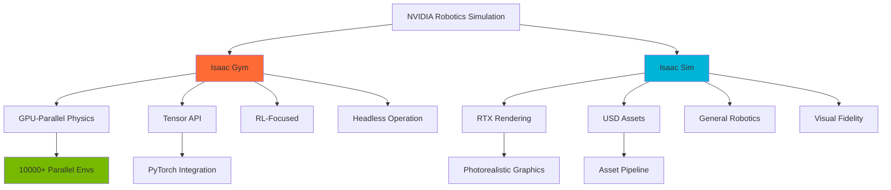
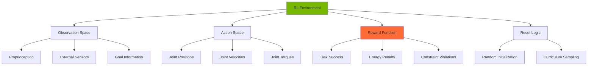

# Reinforcement Learning with Isaac Gym

## Introduction

Isaac Gym is NVIDIA's physics simulation environment for reinforcement learning research, designed to leverage GPU acceleration for massively parallel simulation. Unlike traditional RL frameworks that run simulations on CPU, Isaac Gym runs thousands of environment instances simultaneously on GPU, enabling training times that are orders of magnitude faster.

In this module, we'll explore how to create custom RL environments, train policies using modern algorithms, and deploy learned behaviors to simulated and real robots.

## Isaac Gym vs Isaac Sim

### Key Differences



**Isaac Gym**:
- Designed specifically for RL training
- Runs entirely on GPU (physics + rendering)
- Supports 1000s of parallel environments
- PyTorch tensor interface
- Minimal rendering (for speed)
- Best for: Policy learning, sim-to-real transfer

**Isaac Sim**:
- General-purpose robotics simulator
- Photorealistic RTX rendering
- Full USD asset support
- OmniGraph scripting
- Best for: Synthetic data, perception, visualization

### When to Use Each

| Use Case | Isaac Gym | Isaac Sim |
|----------|-----------|-----------|
| Training RL policies | ✓ | |
| Perception training data | | ✓ |
| Visualization | | ✓ |
| Massive parallelization (10k+ envs) | ✓ | |
| Physics-accurate simulation | ✓ | ✓ |
| Integration with ROS | | ✓ |

## Setting Up Isaac Gym

### Installation

```bash
# Clone Isaac Gym (requires NVIDIA registration)
# Download from: https://developer.nvidia.com/isaac-gym

# Extract the downloaded file
cd ~/Downloads
tar -xvf IsaacGym_Preview_4_Package.tar.gz

# Navigate to Isaac Gym directory
cd isaacgym

# Create conda environment
conda create -n isaacgym python=3.8
conda activate isaacgym

# Install dependencies
cd python
pip install -e .

# Verify installation
cd examples
python 1080_balls_of_solitude.py
```

### System Requirements

```yaml
Hardware:
  GPU: NVIDIA RTX 2070 or better (RTX 30/40 series recommended)
  VRAM: 8GB minimum (24GB for large-scale training)
  CPU: Modern multi-core processor
  RAM: 32GB minimum

Software:
  OS: Ubuntu 20.04/22.04 or Windows 10/11
  CUDA: 11.3 or later
  Python: 3.8
  PyTorch: 1.13.0 or later (with CUDA support)
```

### Verification Script

```python
# test_isaac_gym.py
from isaacgym import gymapi
from isaacgym import gymutil
import torch

# Create gym instance
gym = gymapi.acquire_gym()

# Get GPU device count
num_gpus = torch.cuda.device_count()
print(f"Number of GPUs available: {num_gpus}")

# Create simulation params
sim_params = gymapi.SimParams()
sim_params.dt = 1.0 / 60.0
sim_params.substeps = 2
sim_params.up_axis = gymapi.UP_AXIS_Z
sim_params.gravity = gymapi.Vec3(0.0, 0.0, -9.81)

# Physics engine settings
sim_params.physx.num_position_iterations = 4
sim_params.physx.num_velocity_iterations = 1
sim_params.physx.contact_offset = 0.01
sim_params.physx.rest_offset = 0.0

# Create sim
sim = gym.create_sim(0, 0, gymapi.SIM_PHYSX, sim_params)

if sim is None:
    print("Failed to create sim")
    exit()

print("Isaac Gym successfully initialized!")

# Cleanup
gym.destroy_sim(sim)
```

## Creating Custom RL Environments

### Environment Structure



### Basic Cartpole Environment

```python
# cartpole_env.py
import numpy as np
import torch
from isaacgym import gymapi
from isaacgym import gymtorch
from isaacgym.torch_utils import *

class CartpoleEnv:
    def __init__(self, num_envs=256, device="cuda:0"):
        self.num_envs = num_envs
        self.device = device

        # Create gym instance
        self.gym = gymapi.acquire_gym()

        # Simulation parameters
        self.sim_params = gymapi.SimParams()
        self.sim_params.dt = 1.0 / 60.0
        self.sim_params.substeps = 2
        self.sim_params.up_axis = gymapi.UP_AXIS_Z
        self.sim_params.gravity = gymapi.Vec3(0.0, 0.0, -9.81)

        # PhysX-specific parameters
        self.sim_params.physx.num_position_iterations = 4
        self.sim_params.physx.num_velocity_iterations = 1
        self.sim_params.physx.contact_offset = 0.01
        self.sim_params.physx.rest_offset = 0.0

        # Create sim
        self.sim = self.gym.create_sim(0, 0, gymapi.SIM_PHYSX, self.sim_params)

        # Define observation and action spaces
        self.num_obs = 4  # cart pos, cart vel, pole angle, pole angular vel
        self.num_actions = 1  # force applied to cart

        # Create ground plane
        plane_params = gymapi.PlaneParams()
        plane_params.normal = gymapi.Vec3(0, 0, 1)
        self.gym.add_ground(self.sim, plane_params)

        # Load cartpole asset
        asset_root = "../../assets"
        asset_file = "urdf/cartpole.urdf"

        asset_options = gymapi.AssetOptions()
        asset_options.fix_base_link = True
        cartpole_asset = self.gym.load_asset(self.sim, asset_root, asset_file, asset_options)

        # Create environments
        num_per_row = int(np.sqrt(num_envs))
        env_lower = gymapi.Vec3(-4.0, 0.0, 0.0)
        env_upper = gymapi.Vec3(4.0, 4.0, 4.0)

        self.envs = []
        self.cartpole_handles = []

        for i in range(num_envs):
            # Create env
            env = self.gym.create_env(self.sim, env_lower, env_upper, num_per_row)
            self.envs.append(env)

            # Add cartpole
            pose = gymapi.Transform()
            pose.p = gymapi.Vec3(0.0, 0.0, 2.0)
            pose.r = gymapi.Quat(0.0, 0.0, 0.0, 1.0)

            cartpole_handle = self.gym.create_actor(env, cartpole_asset, pose, "cartpole", i, 1)
            self.cartpole_handles.append(cartpole_handle)

        # Prepare sim
        self.gym.prepare_sim(self.sim)

        # Get gym GPU state tensors
        actor_root_state_tensor = self.gym.acquire_actor_root_state_tensor(self.sim)
        dof_state_tensor = self.gym.acquire_dof_state_tensor(self.sim)

        self.gym.refresh_actor_root_state_tensor(self.sim)
        self.gym.refresh_dof_state_tensor(self.sim)

        # Create tensor views
        self.root_states = gymtorch.wrap_tensor(actor_root_state_tensor)
        self.dof_states = gymtorch.wrap_tensor(dof_state_tensor)

        self.dof_pos = self.dof_states[:, 0].view(num_envs, 2)  # 2 DOFs: cart, pole
        self.dof_vel = self.dof_states[:, 1].view(num_envs, 2)

        # Initialize buffers
        self.reset_buf = torch.ones(num_envs, device=self.device, dtype=torch.long)
        self.progress_buf = torch.zeros(num_envs, device=self.device, dtype=torch.long)
        self.max_episode_length = 500

    def reset(self, env_ids=None):
        if env_ids is None:
            env_ids = torch.arange(self.num_envs, device=self.device, dtype=torch.long)

        num_resets = len(env_ids)

        # Randomize DOF positions
        self.dof_pos[env_ids, 0] = torch_rand_float(-1.0, 1.0, (num_resets, 1), device=self.device).squeeze()
        self.dof_pos[env_ids, 1] = torch_rand_float(-0.2, 0.2, (num_resets, 1), device=self.device).squeeze()

        # Randomize DOF velocities
        self.dof_vel[env_ids, :] = torch_rand_float(-0.5, 0.5, (num_resets, 2), device=self.device)

        # Set new states
        self.gym.set_dof_state_tensor(self.sim, gymtorch.unwrap_tensor(self.dof_states))

        # Reset buffers
        self.reset_buf[env_ids] = 0
        self.progress_buf[env_ids] = 0

    def step(self, actions):
        # Apply actions
        forces = torch.zeros((self.num_envs, 2), device=self.device, dtype=torch.float)
        forces[:, 0] = actions.squeeze() * 10.0  # Scale action

        self.gym.apply_dof_force_tensor(self.sim, gymtorch.unwrap_tensor(forces))

        # Step physics
        self.gym.simulate(self.sim)
        self.gym.fetch_results(self.sim, True)

        # Update tensors
        self.gym.refresh_actor_root_state_tensor(self.sim)
        self.gym.refresh_dof_state_tensor(self.sim)

        # Compute observations
        obs = self.compute_observations()

        # Compute rewards
        rewards = self.compute_rewards()

        # Check for resets
        self.progress_buf += 1

        # Reset if pole angle too large or cart too far
        pole_angle = self.dof_pos[:, 1]
        cart_pos = self.dof_pos[:, 0]

        resets = torch.where(torch.abs(pole_angle) > 0.5, 1, 0)
        resets = torch.where(torch.abs(cart_pos) > 3.0, 1, resets)
        resets = torch.where(self.progress_buf >= self.max_episode_length, 1, resets)

        reset_env_ids = resets.nonzero(as_tuple=False).squeeze(-1)
        if len(reset_env_ids) > 0:
            self.reset(reset_env_ids)

        return obs, rewards, resets, {}

    def compute_observations(self):
        obs = torch.cat([
            self.dof_pos[:, 0].unsqueeze(1),  # cart position
            self.dof_vel[:, 0].unsqueeze(1),  # cart velocity
            self.dof_pos[:, 1].unsqueeze(1),  # pole angle
            self.dof_vel[:, 1].unsqueeze(1),  # pole angular velocity
        ], dim=1)
        return obs

    def compute_rewards(self):
        # Reward for keeping pole upright
        pole_angle = self.dof_pos[:, 1]
        cart_pos = self.dof_pos[:, 0]

        reward = 1.0 - torch.abs(pole_angle) / 0.5
        reward -= torch.abs(cart_pos) / 3.0

        return reward
```

### Quadruped Locomotion Environment

```python
# quadruped_env.py
import torch
from isaacgym import gymapi
from isaacgym import gymtorch
from isaacgym.torch_utils import *
import numpy as np

class QuadrupedEnv:
    def __init__(self, num_envs=4096, device="cuda:0"):
        self.num_envs = num_envs
        self.device = device

        self.gym = gymapi.acquire_gym()

        # Simulation params
        self.sim_params = gymapi.SimParams()
        self.sim_params.dt = 0.005  # 200 Hz
        self.sim_params.substeps = 1
        self.sim_params.up_axis = gymapi.UP_AXIS_Z
        self.sim_params.gravity = gymapi.Vec3(0.0, 0.0, -9.81)

        # PhysX params
        self.sim_params.physx.solver_type = 1
        self.sim_params.physx.num_position_iterations = 4
        self.sim_params.physx.num_velocity_iterations = 1
        self.sim_params.physx.num_threads = 4
        self.sim_params.physx.use_gpu = True

        self.sim = self.gym.create_sim(0, 0, gymapi.SIM_PHYSX, self.sim_params)

        # Create ground
        plane_params = gymapi.PlaneParams()
        plane_params.normal = gymapi.Vec3(0, 0, 1)
        plane_params.static_friction = 1.0
        plane_params.dynamic_friction = 1.0
        plane_params.restitution = 0.0
        self.gym.add_ground(self.sim, plane_params)

        # Load quadruped asset (e.g., ANYmal)
        asset_root = "../../assets"
        asset_file = "urdf/anymal_c/urdf/anymal.urdf"

        asset_options = gymapi.AssetOptions()
        asset_options.default_dof_drive_mode = gymapi.DOF_MODE_EFFORT
        asset_options.collapse_fixed_joints = True
        asset_options.replace_cylinder_with_capsule = True
        asset_options.flip_visual_attachments = False
        asset_options.fix_base_link = False
        asset_options.density = 0.001
        asset_options.angular_damping = 0.0
        asset_options.linear_damping = 0.0
        asset_options.max_angular_velocity = 1000.0
        asset_options.max_linear_velocity = 1000.0
        asset_options.armature = 0.0
        asset_options.thickness = 0.01

        robot_asset = self.gym.load_asset(self.sim, asset_root, asset_file, asset_options)

        # Get asset info
        self.num_dof = self.gym.get_asset_dof_count(robot_asset)
        self.num_bodies = self.gym.get_asset_rigid_body_count(robot_asset)

        # Define spaces
        self.num_obs = 48  # Simplified: base lin/ang vel, projected gravity, commands, dof pos, dof vel
        self.num_actions = 12  # 12 joint torques (3 per leg)

        # Create environments
        num_per_row = int(np.sqrt(num_envs))
        spacing = 2.0
        env_lower = gymapi.Vec3(-spacing, -spacing, 0.0)
        env_upper = gymapi.Vec3(spacing, spacing, spacing)

        self.envs = []
        self.actor_handles = []

        for i in range(num_envs):
            env = self.gym.create_env(self.sim, env_lower, env_upper, num_per_row)
            self.envs.append(env)

            # Spawn robot
            start_pose = gymapi.Transform()
            start_pose.p = gymapi.Vec3(0.0, 0.0, 0.6)
            start_pose.r = gymapi.Quat(0.0, 0.0, 0.0, 1.0)

            actor_handle = self.gym.create_actor(env, robot_asset, start_pose, "quadruped", i, 1, 0)
            self.actor_handles.append(actor_handle)

            # Set DOF properties
            dof_props = self.gym.get_actor_dof_properties(env, actor_handle)
            dof_props['driveMode'].fill(gymapi.DOF_MODE_EFFORT)
            dof_props['stiffness'].fill(0.0)
            dof_props['damping'].fill(0.0)
            self.gym.set_actor_dof_properties(env, actor_handle, dof_props)

        self.gym.prepare_sim(self.sim)

        # Acquire tensors
        _actor_root_state = self.gym.acquire_actor_root_state_tensor(self.sim)
        _dof_state = self.gym.acquire_dof_state_tensor(self.sim)
        _rigid_body_state = self.gym.acquire_rigid_body_state_tensor(self.sim)

        self.root_states = gymtorch.wrap_tensor(_actor_root_state)
        self.dof_state = gymtorch.wrap_tensor(_dof_state)
        self.rigid_body_state = gymtorch.wrap_tensor(_rigid_body_state)

        # Create views
        self.base_pos = self.root_states[:, 0:3]
        self.base_quat = self.root_states[:, 3:7]
        self.base_lin_vel = self.root_states[:, 7:10]
        self.base_ang_vel = self.root_states[:, 10:13]

        self.dof_pos = self.dof_state.view(num_envs, self.num_dof, 2)[:, :, 0]
        self.dof_vel = self.dof_state.view(num_envs, self.num_dof, 2)[:, :, 1]

        # Control buffers
        self.actions = torch.zeros(num_envs, self.num_actions, device=self.device)
        self.torques = torch.zeros(num_envs, self.num_dof, device=self.device)

        # Reset buffers
        self.reset_buf = torch.ones(num_envs, device=self.device, dtype=torch.long)
        self.progress_buf = torch.zeros(num_envs, device=self.device, dtype=torch.long)

        # Commands (desired velocities)
        self.commands = torch.zeros(num_envs, 3, device=self.device)  # [vx, vy, yaw_rate]

        # Constants
        self.max_episode_length = 1000
        self.default_dof_pos = torch.zeros(self.num_dof, device=self.device)

        # Initialize
        self.reset(torch.arange(num_envs, device=self.device))

    def reset(self, env_ids):
        # Reset robot states
        positions = self.default_dof_pos.unsqueeze(0) + torch_rand_float(-0.1, 0.1, (len(env_ids), self.num_dof), device=self.device)
        velocities = torch_rand_float(-0.1, 0.1, (len(env_ids), self.num_dof), device=self.device)

        self.dof_pos[env_ids] = positions
        self.dof_vel[env_ids] = velocities

        self.base_pos[env_ids] = torch.tensor([0.0, 0.0, 0.6], device=self.device)
        self.base_quat[env_ids] = torch.tensor([0.0, 0.0, 0.0, 1.0], device=self.device)
        self.base_lin_vel[env_ids] = 0.0
        self.base_ang_vel[env_ids] = 0.0

        # Sample new commands
        self.commands[env_ids, 0] = torch_rand_float(0.5, 1.5, (len(env_ids), 1), device=self.device).squeeze()  # vx
        self.commands[env_ids, 1] = torch_rand_float(-0.5, 0.5, (len(env_ids), 1), device=self.device).squeeze()  # vy
        self.commands[env_ids, 2] = torch_rand_float(-1.0, 1.0, (len(env_ids), 1), device=self.device).squeeze()  # yaw rate

        # Reset buffers
        self.reset_buf[env_ids] = 0
        self.progress_buf[env_ids] = 0

        # Apply states
        env_ids_int32 = env_ids.to(dtype=torch.int32)
        self.gym.set_actor_root_state_tensor_indexed(
            self.sim,
            gymtorch.unwrap_tensor(self.root_states),
            gymtorch.unwrap_tensor(env_ids_int32),
            len(env_ids_int32)
        )
        self.gym.set_dof_state_tensor_indexed(
            self.sim,
            gymtorch.unwrap_tensor(self.dof_state),
            gymtorch.unwrap_tensor(env_ids_int32),
            len(env_ids_int32)
        )

    def step(self, actions):
        self.actions = actions.clone()

        # Apply actions as torques (with PD control)
        target_positions = self.default_dof_pos + self.actions * 0.25
        self.torques = 80.0 * (target_positions - self.dof_pos) - 2.0 * self.dof_vel

        self.gym.set_dof_actuation_force_tensor(self.sim, gymtorch.unwrap_tensor(self.torques))

        # Simulate
        self.gym.simulate(self.sim)
        self.gym.fetch_results(self.sim, True)

        # Update buffers
        self.gym.refresh_actor_root_state_tensor(self.sim)
        self.gym.refresh_dof_state_tensor(self.sim)
        self.gym.refresh_rigid_body_state_tensor(self.sim)

        # Compute observations and rewards
        obs = self.compute_observations()
        rewards = self.compute_rewards()

        # Check termination
        self.progress_buf += 1

        # Reset if fallen or timeout
        base_height = self.base_pos[:, 2]
        self.reset_buf = torch.where(base_height < 0.3, 1, 0)
        self.reset_buf = torch.where(self.progress_buf >= self.max_episode_length, 1, self.reset_buf)

        reset_env_ids = self.reset_buf.nonzero(as_tuple=False).squeeze(-1)
        if len(reset_env_ids) > 0:
            self.reset(reset_env_ids)

        return obs, rewards, self.reset_buf, {}

    def compute_observations(self):
        # Compute projected gravity
        gravity_vec = torch.tensor([0.0, 0.0, -1.0], device=self.device).repeat(self.num_envs, 1)
        # Rotate gravity to body frame (simplified, should use quaternion rotation)

        obs = torch.cat([
            self.base_ang_vel,  # 3
            gravity_vec,  # 3
            self.commands,  # 3
            self.dof_pos,  # 12
            self.dof_vel,  # 12
            self.actions  # 12
        ], dim=1)  # Total: 45 (close to 48 with padding)

        return obs

    def compute_rewards(self):
        # Reward for following velocity commands
        lin_vel_error = torch.sum(torch.square(self.commands[:, :2] - self.base_lin_vel[:, :2]), dim=1)
        ang_vel_error = torch.square(self.commands[:, 2] - self.base_ang_vel[:, 2])

        # Reward for staying upright
        base_height = self.base_pos[:, 2]
        upright_reward = torch.where(base_height > 0.5, 1.0, 0.0)

        # Energy penalty
        energy_penalty = torch.sum(torch.square(self.torques), dim=1) * 0.00001

        reward = upright_reward - 0.5 * lin_vel_error - 0.5 * ang_vel_error - energy_penalty

        return reward
```

## Training with RL Algorithms

### PPO Training Loop

```python
# train_ppo.py
import torch
import torch.nn as nn
import torch.optim as optim
from torch.distributions import Normal
import numpy as np
from quadruped_env import QuadrupedEnv

class ActorCritic(nn.Module):
    def __init__(self, num_obs, num_actions):
        super().__init__()

        # Actor (policy)
        self.actor = nn.Sequential(
            nn.Linear(num_obs, 256),
            nn.ELU(),
            nn.Linear(256, 128),
            nn.ELU(),
            nn.Linear(128, num_actions)
        )

        # Critic (value function)
        self.critic = nn.Sequential(
            nn.Linear(num_obs, 256),
            nn.ELU(),
            nn.Linear(256, 128),
            nn.ELU(),
            nn.Linear(128, 1)
        )

        # Action std
        self.log_std = nn.Parameter(torch.zeros(num_actions))

    def forward(self, obs):
        return self.actor(obs), self.critic(obs)

    def act(self, obs):
        action_mean, value = self(obs)
        action_std = self.log_std.exp()

        dist = Normal(action_mean, action_std)
        action = dist.sample()
        log_prob = dist.log_prob(action).sum(dim=-1)

        return action, log_prob, value

    def evaluate(self, obs, actions):
        action_mean, value = self(obs)
        action_std = self.log_std.exp()

        dist = Normal(action_mean, action_std)
        log_prob = dist.log_prob(actions).sum(dim=-1)
        entropy = dist.entropy().sum(dim=-1)

        return log_prob, value, entropy

def train_ppo():
    # Hyperparameters
    num_envs = 4096
    num_steps = 24
    num_epochs = 10
    mini_batch_size = 4096
    learning_rate = 3e-4
    gamma = 0.99
    lam = 0.95
    clip_param = 0.2
    value_loss_coef = 1.0
    entropy_coef = 0.01
    max_iterations = 5000

    device = "cuda:0"

    # Create environment
    env = QuadrupedEnv(num_envs=num_envs, device=device)

    # Create policy
    policy = ActorCritic(env.num_obs, env.num_actions).to(device)
    optimizer = optim.Adam(policy.parameters(), lr=learning_rate)

    # Storage
    obs_buf = torch.zeros(num_steps, num_envs, env.num_obs, device=device)
    actions_buf = torch.zeros(num_steps, num_envs, env.num_actions, device=device)
    rewards_buf = torch.zeros(num_steps, num_envs, device=device)
    values_buf = torch.zeros(num_steps, num_envs, device=device)
    log_probs_buf = torch.zeros(num_steps, num_envs, device=device)
    dones_buf = torch.zeros(num_steps, num_envs, device=device)

    # Training loop
    obs = env.compute_observations()

    for iteration in range(max_iterations):
        # Collect rollouts
        for step in range(num_steps):
            with torch.no_grad():
                actions, log_probs, values = policy.act(obs)

            obs_buf[step] = obs
            actions_buf[step] = actions
            log_probs_buf[step] = log_probs
            values_buf[step] = values.squeeze()

            obs, rewards, dones, _ = env.step(actions)

            rewards_buf[step] = rewards
            dones_buf[step] = dones.float()

        # Compute returns and advantages
        with torch.no_grad():
            _, last_value = policy(obs)
            last_value = last_value.squeeze()

        returns = torch.zeros(num_steps, num_envs, device=device)
        advantages = torch.zeros(num_steps, num_envs, device=device)

        gae = 0
        for step in reversed(range(num_steps)):
            if step == num_steps - 1:
                next_value = last_value
                next_non_terminal = 1.0 - dones_buf[step]
            else:
                next_value = values_buf[step + 1]
                next_non_terminal = 1.0 - dones_buf[step]

            delta = rewards_buf[step] + gamma * next_value * next_non_terminal - values_buf[step]
            gae = delta + gamma * lam * next_non_terminal * gae
            advantages[step] = gae
            returns[step] = advantages[step] + values_buf[step]

        # Flatten buffers
        obs_flat = obs_buf.view(-1, env.num_obs)
        actions_flat = actions_buf.view(-1, env.num_actions)
        log_probs_flat = log_probs_buf.view(-1)
        returns_flat = returns.view(-1)
        advantages_flat = advantages.view(-1)

        # Normalize advantages
        advantages_flat = (advantages_flat - advantages_flat.mean()) / (advantages_flat.std() + 1e-8)

        # PPO update
        for epoch in range(num_epochs):
            indices = torch.randperm(num_envs * num_steps, device=device)

            for start in range(0, num_envs * num_steps, mini_batch_size):
                end = start + mini_batch_size
                mb_indices = indices[start:end]

                mb_obs = obs_flat[mb_indices]
                mb_actions = actions_flat[mb_indices]
                mb_old_log_probs = log_probs_flat[mb_indices]
                mb_returns = returns_flat[mb_indices]
                mb_advantages = advantages_flat[mb_indices]

                # Evaluate actions
                log_probs, values, entropy = policy.evaluate(mb_obs, mb_actions)
                values = values.squeeze()

                # Policy loss
                ratio = (log_probs - mb_old_log_probs).exp()
                surr1 = ratio * mb_advantages
                surr2 = torch.clamp(ratio, 1.0 - clip_param, 1.0 + clip_param) * mb_advantages
                policy_loss = -torch.min(surr1, surr2).mean()

                # Value loss
                value_loss = nn.MSELoss()(values, mb_returns)

                # Entropy loss
                entropy_loss = -entropy.mean()

                # Total loss
                loss = policy_loss + value_loss_coef * value_loss + entropy_coef * entropy_loss

                # Update
                optimizer.zero_grad()
                loss.backward()
                nn.utils.clip_grad_norm_(policy.parameters(), 1.0)
                optimizer.step()

        # Logging
        mean_reward = rewards_buf.mean().item()
        print(f"Iteration {iteration}: Mean Reward = {mean_reward:.2f}")

        # Save checkpoint
        if iteration % 100 == 0:
            torch.save(policy.state_dict(), f"policy_iter_{iteration}.pth")

    print("Training complete!")

if __name__ == "__main__":
    train_ppo()
```

### Integration with Stable Baselines3

```python
# train_sb3.py
import gym
import torch
from stable_baselines3 import PPO
from stable_baselines3.common.vec_env import VecEnv
from stable_baselines3.common.callbacks import CheckpointCallback
import numpy as np
from quadruped_env import QuadrupedEnv

class IsaacGymVecEnv(VecEnv):
    """Wrapper to make Isaac Gym env compatible with Stable Baselines3"""

    def __init__(self, isaac_env):
        self.isaac_env = isaac_env
        self.num_envs = isaac_env.num_envs

        observation_space = gym.spaces.Box(
            low=-np.inf,
            high=np.inf,
            shape=(isaac_env.num_obs,),
            dtype=np.float32
        )

        action_space = gym.spaces.Box(
            low=-1.0,
            high=1.0,
            shape=(isaac_env.num_actions,),
            dtype=np.float32
        )

        super().__init__(self.num_envs, observation_space, action_space)

    def reset(self):
        env_ids = torch.arange(self.num_envs, device=self.isaac_env.device)
        self.isaac_env.reset(env_ids)
        obs = self.isaac_env.compute_observations()
        return obs.cpu().numpy()

    def step_async(self, actions):
        self.actions = torch.from_numpy(actions).to(self.isaac_env.device)

    def step_wait(self):
        obs, rewards, dones, info = self.isaac_env.step(self.actions)
        return (
            obs.cpu().numpy(),
            rewards.cpu().numpy(),
            dones.cpu().numpy(),
            [{}] * self.num_envs
        )

    def close(self):
        pass

    def get_attr(self, attr_name, indices=None):
        return [getattr(self.isaac_env, attr_name)] * self.num_envs

    def set_attr(self, attr_name, value, indices=None):
        setattr(self.isaac_env, attr_name, value)

    def env_method(self, method_name, *method_args, indices=None, **method_kwargs):
        return [getattr(self.isaac_env, method_name)(*method_args, **method_kwargs)] * self.num_envs

def train_with_sb3():
    # Create Isaac Gym environment
    isaac_env = QuadrupedEnv(num_envs=4096, device="cuda:0")

    # Wrap for SB3
    env = IsaacGymVecEnv(isaac_env)

    # Create PPO model
    model = PPO(
        "MlpPolicy",
        env,
        learning_rate=3e-4,
        n_steps=24,
        batch_size=4096,
        n_epochs=10,
        gamma=0.99,
        gae_lambda=0.95,
        clip_range=0.2,
        ent_coef=0.01,
        vf_coef=1.0,
        max_grad_norm=1.0,
        verbose=1,
        tensorboard_log="./tensorboard_logs/"
    )

    # Checkpoint callback
    checkpoint_callback = CheckpointCallback(
        save_freq=10000,
        save_path="./checkpoints/",
        name_prefix="quadruped_ppo"
    )

    # Train
    model.learn(
        total_timesteps=10_000_000,
        callback=checkpoint_callback
    )

    # Save final model
    model.save("quadruped_final")

if __name__ == "__main__":
    train_with_sb3()
```

## Curriculum Learning

### Progressive Difficulty

```python
# curriculum_learning.py
import torch
from quadruped_env import QuadrupedEnv

class CurriculumQuadrupedEnv(QuadrupedEnv):
    def __init__(self, *args, **kwargs):
        super().__init__(*args, **kwargs)

        # Curriculum parameters
        self.curriculum_level = 0
        self.max_curriculum_level = 5
        self.success_threshold = 0.8
        self.recent_success_rate = 0.0

        # Difficulty parameters
        self.terrain_roughness = 0.0
        self.command_range = [0.5, 1.0]  # [min, max] for vx command
        self.disturbance_force = 0.0

    def update_curriculum(self, success_rate):
        """Update curriculum based on success rate"""
        self.recent_success_rate = success_rate

        if success_rate > self.success_threshold and self.curriculum_level < self.max_curriculum_level:
            self.curriculum_level += 1
            print(f"Curriculum advanced to level {self.curriculum_level}")
            self._update_difficulty()

    def _update_difficulty(self):
        """Adjust task difficulty based on curriculum level"""
        if self.curriculum_level == 0:
            # Level 0: Flat terrain, slow speed
            self.terrain_roughness = 0.0
            self.command_range = [0.3, 0.6]
            self.disturbance_force = 0.0

        elif self.curriculum_level == 1:
            # Level 1: Flat terrain, medium speed
            self.terrain_roughness = 0.0
            self.command_range = [0.5, 1.0]
            self.disturbance_force = 0.0

        elif self.curriculum_level == 2:
            # Level 2: Slight roughness, medium speed
            self.terrain_roughness = 0.02
            self.command_range = [0.5, 1.2]
            self.disturbance_force = 0.0

        elif self.curriculum_level == 3:
            # Level 3: Moderate roughness, higher speed
            self.terrain_roughness = 0.05
            self.command_range = [0.5, 1.5]
            self.disturbance_force = 50.0

        elif self.curriculum_level == 4:
            # Level 4: Rough terrain, high speed
            self.terrain_roughness = 0.1
            self.command_range = [0.5, 2.0]
            self.disturbance_force = 100.0

        elif self.curriculum_level == 5:
            # Level 5: Very rough terrain, maximum difficulty
            self.terrain_roughness = 0.15
            self.command_range = [0.3, 2.5]
            self.disturbance_force = 150.0

    def reset(self, env_ids):
        super().reset(env_ids)

        # Sample commands based on curriculum
        min_vel, max_vel = self.command_range
        self.commands[env_ids, 0] = torch_rand_float(min_vel, max_vel, (len(env_ids), 1), device=self.device).squeeze()

        # Apply terrain randomization (simplified)
        # In practice, you would modify the ground plane mesh here

    def step(self, actions):
        # Apply random disturbances based on curriculum
        if self.disturbance_force > 0:
            if torch.rand(1).item() < 0.01:  # 1% chance each step
                disturbance = torch_rand_float(-self.disturbance_force, self.disturbance_force, (self.num_envs, 3), device=self.device)
                # Apply disturbance to base (would use actual force API)

        return super().step(actions)
```

## Monitoring Training with TensorBoard

```python
# train_with_logging.py
import torch
from torch.utils.tensorboard import SummaryWriter
from quadruped_env import QuadrupedEnv
from train_ppo import ActorCritic, train_ppo

def train_with_logging():
    writer = SummaryWriter('runs/quadruped_experiment')

    num_envs = 4096
    device = "cuda:0"

    env = QuadrupedEnv(num_envs=num_envs, device=device)
    policy = ActorCritic(env.num_obs, env.num_actions).to(device)

    # Training loop (simplified)
    for iteration in range(5000):
        # ... PPO training code ...

        # Log metrics
        if iteration % 10 == 0:
            writer.add_scalar('Reward/Mean', mean_reward, iteration)
            writer.add_scalar('Reward/Std', rewards_std, iteration)
            writer.add_scalar('Policy/Entropy', mean_entropy, iteration)
            writer.add_scalar('Loss/Policy', policy_loss, iteration)
            writer.add_scalar('Loss/Value', value_loss, iteration)

            # Log learning rate
            for param_group in optimizer.param_groups:
                writer.add_scalar('Learning_Rate', param_group['lr'], iteration)

        # Log distributions
        if iteration % 100 == 0:
            writer.add_histogram('Actions', actions_buf, iteration)
            writer.add_histogram('Observations', obs_buf, iteration)

    writer.close()

# View with: tensorboard --logdir=runs
```

## Policy Deployment

### Export to ONNX

```python
# export_policy.py
import torch
import torch.onnx
from train_ppo import ActorCritic

def export_to_onnx():
    num_obs = 48
    num_actions = 12

    # Load trained policy
    policy = ActorCritic(num_obs, num_actions)
    policy.load_state_dict(torch.load("policy_final.pth"))
    policy.eval()

    # Create dummy input
    dummy_input = torch.randn(1, num_obs)

    # Export
    torch.onnx.export(
        policy.actor,  # Export only actor (not critic)
        dummy_input,
        "quadruped_policy.onnx",
        export_params=True,
        opset_version=11,
        do_constant_folding=True,
        input_names=['observation'],
        output_names=['action'],
        dynamic_axes={
            'observation': {0: 'batch_size'},
            'action': {0: 'batch_size'}
        }
    )

    print("Policy exported to quadruped_policy.onnx")

if __name__ == "__main__":
    export_to_onnx()
```

### Deploy to Real Robot (ROS 2)

```python
# deploy_policy_ros2.py
import rclpy
from rclpy.node import Node
from sensor_msgs.msg import JointState
from std_msgs.msg import Float64MultiArray
import torch
import numpy as np

class PolicyNode(Node):
    def __init__(self):
        super().__init__('policy_node')

        # Load policy
        self.policy = ActorCritic(48, 12)
        self.policy.load_state_dict(torch.load("policy_final.pth"))
        self.policy.eval()

        # Subscribers
        self.joint_state_sub = self.create_subscription(
            JointState,
            '/joint_states',
            self.joint_state_callback,
            10
        )

        # Publishers
        self.command_pub = self.create_publisher(
            Float64MultiArray,
            '/joint_commands',
            10
        )

        # State
        self.current_joint_pos = np.zeros(12)
        self.current_joint_vel = np.zeros(12)

        # Timer for inference
        self.timer = self.create_timer(0.01, self.inference_callback)  # 100 Hz

    def joint_state_callback(self, msg):
        self.current_joint_pos = np.array(msg.position)
        self.current_joint_vel = np.array(msg.velocity)

    def inference_callback(self):
        # Construct observation (simplified)
        obs = np.concatenate([
            np.zeros(9),  # base velocity + gravity (from IMU)
            self.current_joint_pos,
            self.current_joint_vel,
            np.zeros(12)  # last action
        ])

        # Run policy
        with torch.no_grad():
            obs_tensor = torch.from_numpy(obs).float().unsqueeze(0)
            action, _, _ = self.policy.act(obs_tensor)
            action = action.squeeze().numpy()

        # Publish action
        msg = Float64MultiArray()
        msg.data = action.tolist()
        self.command_pub.publish(msg)

def main():
    rclpy.init()
    node = PolicyNode()
    rclpy.spin(node)
    node.destroy_node()
    rclpy.shutdown()

if __name__ == '__main__':
    main()
```

## Key Takeaways

1. **Isaac Gym** enables massively parallel RL training with 1000s of environments on GPU
2. **PPO** is the most commonly used algorithm for robotics due to stability
3. **Curriculum learning** significantly improves training efficiency for complex tasks
4. **TensorBoard** provides essential insights into training dynamics
5. **ONNX export** enables deployment to various platforms including real robots
6. **Sim-to-real transfer** requires careful observation design and domain randomization

## Hands-On Exercises

### Exercise 1: Cartpole Variants

Modify the cartpole environment to:
- Add wind disturbances
- Use image observations instead of state
- Train with different RL algorithms (SAC, TD3)
- Compare sample efficiency

### Exercise 2: Humanoid Balancing

Create a humanoid balancing environment:
- Use a humanoid URDF (e.g., Atlas, NAO)
- Design reward for standing upright
- Handle balance recovery from pushes
- Implement curriculum learning

### Exercise 3: Dexterous Manipulation

Build a hand manipulation task:
- In-hand object rotation
- 16+ DOF dexterous hand
- Vision-based object pose estimation
- Sparse rewards (task success only)

### Exercise 4: Multi-Agent RL

Implement a multi-agent scenario:
- Soccer with 2v2 quadrupeds
- Cooperative box pushing
- Competitive tag game
- Emergent behaviors analysis

## Additional Resources

### Documentation
- [Isaac Gym Documentation](https://developer.nvidia.com/isaac-gym)
- [Isaac Gym Examples](https://github.com/NVIDIA-Omniverse/IsaacGymEnvs)
- [PPO Paper](https://arxiv.org/abs/1707.06347)

### Repositories
- [Isaac Gym Envs](https://github.com/NVIDIA-Omniverse/IsaacGymEnvs)
- [Stable Baselines3](https://github.com/DLR-RM/stable-baselines3)
- [Legged Gym](https://github.com/leggedrobotics/legged_gym)

### Papers
- "Learning Agile Robotic Locomotion Skills by Imitating Animals" (RSS 2020)
- "Learning Quadrupedal Locomotion over Challenging Terrain" (Science Robotics 2020)
- "Rapid Motor Adaptation for Legged Robots" (RSS 2021)

### Videos
- [Isaac Gym Training Demos](https://www.youtube.com/watch?v=nleDq-oJjGk)
- [Learning Dexterous Manipulation](https://www.youtube.com/watch?v=jwSbzNHGflM)

---

**Next**: [Sim-to-Real Transfer](./sim-to-real) - Bridge the simulation-to-reality gap

**Previous**: [Perception & Manipulation](./perception-manipulation) - Advanced sensing and manipulation
