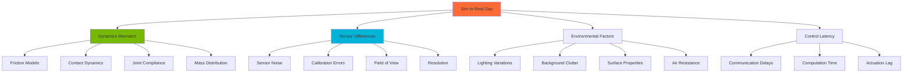

# Sim-to-Real Transfer

## Introduction

The sim-to-real gap is one of the most challenging problems in robotics. Policies trained in simulation often fail when deployed to real robots due to discrepancies in dynamics, sensing, and environmental conditions. This module explores techniques to minimize this gap and achieve successful transfer of learned behaviors from simulation to reality.

We'll cover domain randomization, system identification, transfer learning strategies, and evaluation metrics for sim-to-real transfer.

## The Sim-to-Real Gap

### Sources of Reality Gap



### Common Failure Modes

| Sim Assumption | Real World Reality | Impact |
|----------------|-------------------|---------|
| Perfect actuators | Torque limits, backlash | Reduced performance |
| Noise-free sensors | Sensor noise, drift | Unstable control |
| Known dynamics | Model uncertainties | Poor generalization |
| Infinite compute | Limited onboard CPU | Latency issues |
| Static environment | Dynamic obstacles | Collisions |
| Perfect calibration | Calibration errors | Systematic bias |

### Measuring the Gap

```python
# measure_reality_gap.py
import numpy as np
import matplotlib.pyplot as plt

class RealityGapAnalyzer:
    def __init__(self):
        self.sim_data = []
        self.real_data = []

    def add_sim_trajectory(self, states, actions, rewards):
        """Record simulation trajectory"""
        self.sim_data.append({
            'states': states,
            'actions': actions,
            'rewards': rewards
        })

    def add_real_trajectory(self, states, actions, rewards):
        """Record real robot trajectory"""
        self.real_data.append({
            'states': states,
            'actions': actions,
            'rewards': rewards
        })

    def compute_state_distribution_shift(self):
        """Measure distribution shift in state space"""
        if not self.sim_data or not self.real_data:
            return None

        # Concatenate all states
        sim_states = np.vstack([traj['states'] for traj in self.sim_data])
        real_states = np.vstack([traj['states'] for traj in self.real_data])

        # Compute means and covariances
        sim_mean = np.mean(sim_states, axis=0)
        real_mean = np.mean(real_states, axis=0)

        sim_cov = np.cov(sim_states.T)
        real_cov = np.cov(real_states.T)

        # Wasserstein distance (simplified for Gaussian)
        mean_diff = np.linalg.norm(sim_mean - real_mean)

        return {
            'mean_difference': mean_diff,
            'sim_mean': sim_mean,
            'real_mean': real_mean,
            'sim_std': np.sqrt(np.diag(sim_cov)),
            'real_std': np.sqrt(np.diag(real_cov))
        }

    def compute_performance_gap(self):
        """Measure performance difference"""
        sim_rewards = [np.sum(traj['rewards']) for traj in self.sim_data]
        real_rewards = [np.sum(traj['rewards']) for traj in self.real_data]

        return {
            'sim_mean_return': np.mean(sim_rewards),
            'real_mean_return': np.mean(real_rewards),
            'gap': np.mean(sim_rewards) - np.mean(real_rewards),
            'gap_percentage': (np.mean(sim_rewards) - np.mean(real_rewards)) / np.mean(sim_rewards) * 100
        }

    def visualize_gap(self):
        """Create visualization of reality gap"""
        gap_metrics = self.compute_state_distribution_shift()
        perf_metrics = self.compute_performance_gap()

        fig, axes = plt.subplots(2, 2, figsize=(14, 10))

        # Plot 1: State mean comparison
        state_dim = len(gap_metrics['sim_mean'])
        axes[0, 0].bar(np.arange(state_dim) - 0.2, gap_metrics['sim_mean'], 0.4, label='Sim', alpha=0.7)
        axes[0, 0].bar(np.arange(state_dim) + 0.2, gap_metrics['real_mean'], 0.4, label='Real', alpha=0.7)
        axes[0, 0].set_xlabel('State Dimension')
        axes[0, 0].set_ylabel('Mean Value')
        axes[0, 0].set_title('State Mean Comparison')
        axes[0, 0].legend()
        axes[0, 0].grid(True, alpha=0.3)

        # Plot 2: State std comparison
        axes[0, 1].bar(np.arange(state_dim) - 0.2, gap_metrics['sim_std'], 0.4, label='Sim', alpha=0.7)
        axes[0, 1].bar(np.arange(state_dim) + 0.2, gap_metrics['real_std'], 0.4, label='Real', alpha=0.7)
        axes[0, 1].set_xlabel('State Dimension')
        axes[0, 1].set_ylabel('Standard Deviation')
        axes[0, 1].set_title('State Std Comparison')
        axes[0, 1].legend()
        axes[0, 1].grid(True, alpha=0.3)

        # Plot 3: Return distribution
        sim_returns = [np.sum(traj['rewards']) for traj in self.sim_data]
        real_returns = [np.sum(traj['rewards']) for traj in self.real_data]

        axes[1, 0].hist(sim_returns, bins=20, alpha=0.5, label='Sim')
        axes[1, 0].hist(real_returns, bins=20, alpha=0.5, label='Real')
        axes[1, 0].axvline(perf_metrics['sim_mean_return'], color='blue', linestyle='--', label='Sim Mean')
        axes[1, 0].axvline(perf_metrics['real_mean_return'], color='orange', linestyle='--', label='Real Mean')
        axes[1, 0].set_xlabel('Episode Return')
        axes[1, 0].set_ylabel('Frequency')
        axes[1, 0].set_title('Return Distribution')
        axes[1, 0].legend()
        axes[1, 0].grid(True, alpha=0.3)

        # Plot 4: Summary metrics
        axes[1, 1].axis('off')
        summary_text = f"""
        Reality Gap Analysis
        ═══════════════════════════════════

        Performance Metrics:
        • Sim Mean Return: {perf_metrics['sim_mean_return']:.2f}
        • Real Mean Return: {perf_metrics['real_mean_return']:.2f}
        • Performance Gap: {perf_metrics['gap']:.2f}
        • Gap Percentage: {perf_metrics['gap_percentage']:.1f}%

        State Distribution:
        • Mean Difference: {gap_metrics['mean_difference']:.4f}
        • Trajectories (Sim): {len(self.sim_data)}
        • Trajectories (Real): {len(self.real_data)}
        """

        axes[1, 1].text(0.1, 0.5, summary_text, fontsize=10, family='monospace',
                       verticalalignment='center')

        plt.tight_layout()
        plt.savefig('reality_gap_analysis.png', dpi=150)
        plt.show()

        return gap_metrics, perf_metrics
```

## Domain Randomization

### Visual Domain Randomization

```python
# visual_domain_randomization.py
from isaacsim import SimulationApp
simulation_app = SimulationApp({"headless": False})

import omni.replicator.core as rep
from omni.isaac.core import World
from omni.isaac.core.utils.stage import add_reference_to_stage
import numpy as np

world = World()
world.scene.add_default_ground_plane()

# Add robot
robot_usd = "omniverse://localhost/Isaac/Robots/Franka/franka.usd"
add_reference_to_stage(usd_path=robot_usd, prim_path="/World/Franka")

world.reset()

with rep.new_layer():
    # Camera setup
    camera = rep.create.camera(position=(1.5, 1.5, 1.5), look_at="/World/Franka")
    render_product = rep.create.render_product(camera, (640, 480))

    def randomize_visual_domain():
        # 1. Lighting randomization
        light = rep.create.light(
            light_type=rep.distribution.choice(["Dome", "Sphere", "Disk"]),
            intensity=rep.distribution.uniform(500, 3000),
            temperature=rep.distribution.uniform(3000, 7000),
            position=rep.distribution.uniform((-5, -5, 3), (5, 5, 10))
        )

        # 2. Background randomization
        ground = rep.get.prims(path_pattern="/World/defaultGroundPlane")
        with ground:
            rep.randomizer.color(
                colors=rep.distribution.uniform((0.3, 0.3, 0.3), (0.9, 0.9, 0.9))
            )

        # 3. Robot appearance randomization
        robot = rep.get.prims(path_pattern="/World/Franka")
        with robot:
            rep.randomizer.color(
                colors=rep.distribution.uniform((0.5, 0.5, 0.5), (1.0, 1.0, 1.0))
            )

        # 4. Camera randomization
        with camera:
            rep.modify.pose(
                position=rep.distribution.uniform((1.0, 1.0, 1.0), (2.0, 2.0, 2.0)),
                look_at="/World/Franka"
            )

        return robot.node

    rep.randomizer.register(randomize_visual_domain)

    # Trigger randomization
    with rep.trigger.on_frame(num_frames=1000):
        rep.randomizer.randomize_visual_domain()

    # Setup writer
    writer = rep.WriterRegistry.get("BasicWriter")
    writer.initialize(output_dir="~/visual_dr_output", rgb=True)
    writer.attach([render_product])

rep.orchestrator.run()

for i in range(1000):
    world.step(render=True)
    rep.orchestrator.step(rt_subframes=4)
    if i % 100 == 0:
        print(f"Generated {i}/1000 randomized frames")

rep.orchestrator.stop()
simulation_app.close()
```

### Dynamics Domain Randomization

```python
# dynamics_domain_randomization.py
import torch
from isaacgym import gymapi
from isaacgym import gymtorch
import numpy as np

class DynamicsRandomizer:
    def __init__(self, gym, sim, env_handles, actor_handles):
        self.gym = gym
        self.sim = sim
        self.env_handles = env_handles
        self.actor_handles = actor_handles
        self.num_envs = len(env_handles)

    def randomize_mass(self, mass_range=(0.8, 1.2)):
        """Randomize link masses"""
        for env_idx, (env, actor) in enumerate(zip(self.env_handles, self.actor_handles)):
            # Get rigid body properties
            props = self.gym.get_actor_rigid_body_properties(env, actor)

            # Randomize mass for each body
            for prop in props:
                scale = np.random.uniform(*mass_range)
                prop.mass *= scale

            # Set updated properties
            self.gym.set_actor_rigid_body_properties(env, actor, props)

    def randomize_friction(self, friction_range=(0.5, 1.5)):
        """Randomize surface friction"""
        for env_idx, (env, actor) in enumerate(zip(self.env_handles, self.actor_handles)):
            # Get rigid shape properties
            props = self.gym.get_actor_rigid_shape_properties(env, actor)

            # Randomize friction
            for prop in props:
                prop.friction = np.random.uniform(*friction_range)

            # Set updated properties
            self.gym.set_actor_rigid_shape_properties(env, actor, props)

    def randomize_motor_properties(self, torque_range=(0.9, 1.1), damping_range=(0.5, 2.0)):
        """Randomize motor torque limits and damping"""
        for env_idx, (env, actor) in enumerate(zip(self.env_handles, self.actor_handles)):
            # Get DOF properties
            props = self.gym.get_actor_dof_properties(env, actor)

            # Randomize each DOF
            for i in range(len(props)):
                # Torque limits
                torque_scale = np.random.uniform(*torque_range)
                props['effort'][i] *= torque_scale

                # Damping
                damping_scale = np.random.uniform(*damping_range)
                props['damping'][i] *= damping_scale

            # Set updated properties
            self.gym.set_actor_dof_properties(env, actor, props)

    def randomize_center_of_mass(self, offset_range=0.02):
        """Randomize center of mass offset"""
        for env_idx, (env, actor) in enumerate(zip(self.env_handles, self.actor_handles)):
            props = self.gym.get_actor_rigid_body_properties(env, actor)

            for prop in props:
                # Add random offset to COM
                prop.com.x += np.random.uniform(-offset_range, offset_range)
                prop.com.y += np.random.uniform(-offset_range, offset_range)
                prop.com.z += np.random.uniform(-offset_range, offset_range)

            self.gym.set_actor_rigid_body_properties(env, actor, props)

    def randomize_all(self):
        """Apply all randomizations"""
        self.randomize_mass()
        self.randomize_friction()
        self.randomize_motor_properties()
        self.randomize_center_of_mass()

# Example usage in environment
class DRQuadrupedEnv:
    def __init__(self, num_envs=4096, device="cuda:0"):
        # ... (environment setup from previous examples) ...

        # Create dynamics randomizer
        self.dr = DynamicsRandomizer(
            self.gym,
            self.sim,
            self.envs,
            self.actor_handles
        )

    def reset(self, env_ids):
        # Apply domain randomization on reset
        if len(env_ids) > 0:
            self.dr.randomize_all()

        # ... (rest of reset logic) ...
```

### Sensor Noise Randomization

```python
# sensor_noise_randomization.py
import torch
import numpy as np

class SensorNoiseModel:
    def __init__(self, device="cuda:0"):
        self.device = device

    def add_camera_noise(self, rgb_image, depth_image):
        """Add realistic camera noise"""
        # RGB noise
        # 1. Shot noise (Poisson)
        rgb_noisy = rgb_image + torch.randn_like(rgb_image) * 0.02

        # 2. Dark current noise
        rgb_noisy += torch.randn_like(rgb_image) * 0.01

        # 3. Quantization
        rgb_noisy = torch.clamp(rgb_noisy, 0, 1)
        rgb_noisy = (rgb_noisy * 255).to(torch.uint8).to(torch.float32) / 255.0

        # Depth noise
        # 1. Distance-dependent noise
        depth_std = 0.01 + 0.03 * (depth_image / depth_image.max())
        depth_noisy = depth_image + torch.randn_like(depth_image) * depth_std

        # 2. Missing data (holes)
        dropout_mask = torch.rand_like(depth_image) > 0.05
        depth_noisy = depth_noisy * dropout_mask

        # 3. Temporal noise (flickering)
        depth_noisy += torch.randn_like(depth_image) * 0.005

        return rgb_noisy, torch.clamp(depth_noisy, 0, float('inf'))

    def add_imu_noise(self, linear_acc, angular_vel):
        """Add IMU noise (bias, white noise, random walk)"""
        # Accelerometer
        acc_bias = torch.randn(3, device=self.device) * 0.01
        acc_white_noise = torch.randn_like(linear_acc) * 0.05
        acc_noisy = linear_acc + acc_bias + acc_white_noise

        # Gyroscope
        gyro_bias = torch.randn(3, device=self.device) * 0.001
        gyro_white_noise = torch.randn_like(angular_vel) * 0.01
        gyro_noisy = angular_vel + gyro_bias + gyro_white_noise

        return acc_noisy, gyro_noisy

    def add_joint_encoder_noise(self, joint_positions, joint_velocities):
        """Add encoder noise and quantization"""
        # Position noise
        pos_resolution = 0.001  # 0.001 rad resolution
        pos_noisy = torch.round(joint_positions / pos_resolution) * pos_resolution
        pos_noisy += torch.randn_like(joint_positions) * 0.0005

        # Velocity noise (from finite differences)
        vel_noise = torch.randn_like(joint_velocities) * 0.01
        vel_noisy = joint_velocities + vel_noise

        # Occasional outliers
        outlier_mask = torch.rand_like(joint_velocities) < 0.01
        vel_noisy = torch.where(outlier_mask, vel_noisy * 10, vel_noisy)

        return pos_noisy, vel_noisy

    def add_force_torque_noise(self, forces):
        """Add force/torque sensor noise"""
        # Bias drift
        bias = torch.randn_like(forces) * 0.5

        # White noise
        white_noise = torch.randn_like(forces) * 1.0

        # Calibration error
        scale_error = torch.randn_like(forces) * 0.02 + 1.0

        return (forces * scale_error) + bias + white_noise

# Integration with environment
class NoisyObservationEnv:
    def __init__(self):
        self.sensor_noise = SensorNoiseModel()

    def get_observations(self):
        # Get clean observations from simulator
        clean_joint_pos = self.get_joint_positions()
        clean_joint_vel = self.get_joint_velocities()
        clean_imu_acc = self.get_linear_acceleration()
        clean_imu_gyro = self.get_angular_velocity()

        # Add noise
        noisy_joint_pos, noisy_joint_vel = self.sensor_noise.add_joint_encoder_noise(
            clean_joint_pos, clean_joint_vel
        )
        noisy_imu_acc, noisy_imu_gyro = self.sensor_noise.add_imu_noise(
            clean_imu_acc, clean_imu_gyro
        )

        # Construct observation
        obs = torch.cat([
            noisy_imu_acc,
            noisy_imu_gyro,
            noisy_joint_pos,
            noisy_joint_vel
        ], dim=-1)

        return obs
```

## System Identification

### Physics Parameter Identification

```python
# system_identification.py
import torch
import torch.nn as nn
import torch.optim as optim
import numpy as np
from scipy.optimize import minimize

class RobotDynamicsModel(nn.Module):
    """Neural network model of robot dynamics"""

    def __init__(self, state_dim, action_dim, hidden_dim=128):
        super().__init__()

        self.network = nn.Sequential(
            nn.Linear(state_dim + action_dim, hidden_dim),
            nn.ReLU(),
            nn.Linear(hidden_dim, hidden_dim),
            nn.ReLU(),
            nn.Linear(hidden_dim, state_dim)
        )

    def forward(self, state, action):
        x = torch.cat([state, action], dim=-1)
        delta_state = self.network(x)
        return state + delta_state

class SystemIdentifier:
    def __init__(self, state_dim, action_dim):
        self.state_dim = state_dim
        self.action_dim = action_dim
        self.model = RobotDynamicsModel(state_dim, action_dim)
        self.optimizer = optim.Adam(self.model.parameters(), lr=1e-3)

        # Collected data
        self.states = []
        self.actions = []
        self.next_states = []

    def collect_data(self, state, action, next_state):
        """Collect real robot trajectory data"""
        self.states.append(state)
        self.actions.append(action)
        self.next_states.append(next_state)

    def train(self, num_epochs=1000):
        """Train dynamics model on collected data"""
        states = torch.FloatTensor(np.array(self.states))
        actions = torch.FloatTensor(np.array(self.actions))
        next_states = torch.FloatTensor(np.array(self.next_states))

        dataset = torch.utils.data.TensorDataset(states, actions, next_states)
        loader = torch.utils.data.DataLoader(dataset, batch_size=256, shuffle=True)

        for epoch in range(num_epochs):
            total_loss = 0
            for batch_states, batch_actions, batch_next_states in loader:
                # Predict next state
                pred_next_states = self.model(batch_states, batch_actions)

                # Compute loss
                loss = nn.MSELoss()(pred_next_states, batch_next_states)

                # Update
                self.optimizer.zero_grad()
                loss.backward()
                self.optimizer.step()

                total_loss += loss.item()

            if epoch % 100 == 0:
                print(f"Epoch {epoch}: Loss = {total_loss / len(loader):.6f}")

    def optimize_sim_parameters(self, sim_env):
        """Optimize simulation parameters to match learned model"""

        def objective(params):
            # Set simulation parameters
            sim_env.set_mass(params[0])
            sim_env.set_friction(params[1])
            sim_env.set_damping(params[2])

            # Collect simulation data
            sim_states = []
            sim_next_states = []

            for state, action in zip(self.states[:100], self.actions[:100]):
                sim_env.set_state(state)
                next_state = sim_env.step(action)
                sim_states.append(state)
                sim_next_states.append(next_state)

            # Compare with real data
            sim_states = torch.FloatTensor(sim_states)
            sim_next_states = torch.FloatTensor(sim_next_states)
            real_next_states = torch.FloatTensor(self.next_states[:100])

            error = torch.mean((sim_next_states - real_next_states) ** 2).item()
            return error

        # Initial guess
        initial_params = [1.0, 1.0, 1.0]  # [mass_scale, friction, damping]

        # Optimize
        result = minimize(objective, initial_params, method='Nelder-Mead',
                         options={'maxiter': 100})

        print(f"Optimized parameters: {result.x}")
        print(f"Final error: {result.fun}")

        return result.x
```

### Contact Model Calibration

```python
# contact_calibration.py
import numpy as np
from scipy.optimize import least_squares

class ContactModelCalibrator:
    def __init__(self):
        self.contact_data = []

    def collect_contact_data(self, normal_force, tangential_force, normal_velocity, tangential_velocity):
        """Collect contact force data from real robot"""
        self.contact_data.append({
            'f_normal': normal_force,
            'f_tangential': tangential_force,
            'v_normal': normal_velocity,
            'v_tangential': tangential_velocity
        })

    def calibrate_friction_model(self):
        """Calibrate friction coefficient and contact stiffness"""

        def residual(params):
            mu_s, mu_d, k_contact, damping = params

            errors = []
            for data in self.contact_data:
                f_n = data['f_normal']
                f_t = data['f_tangential']
                v_t = data['v_tangential']

                # Coulomb friction model with viscous damping
                if abs(v_t) < 1e-3:
                    f_friction = mu_s * abs(f_n)
                else:
                    f_friction = mu_d * abs(f_n) + damping * abs(v_t)

                # Contact force model
                f_contact_predicted = f_friction

                error = abs(f_t) - f_contact_predicted
                errors.append(error)

            return np.array(errors)

        # Initial guess: [mu_static, mu_dynamic, k_contact, damping]
        x0 = [0.8, 0.6, 1000.0, 10.0]

        result = least_squares(residual, x0, bounds=([0, 0, 0, 0], [2, 2, 10000, 1000]))

        mu_s, mu_d, k_contact, damping = result.x

        print("Calibrated Contact Model:")
        print(f"  Static friction: {mu_s:.3f}")
        print(f"  Dynamic friction: {mu_d:.3f}")
        print(f"  Contact stiffness: {k_contact:.1f}")
        print(f"  Damping: {damping:.1f}")

        return {
            'mu_static': mu_s,
            'mu_dynamic': mu_d,
            'k_contact': k_contact,
            'damping': damping
        }
```

## Reality Gap Mitigation Techniques

### Adversarial Domain Randomization

```python
# adversarial_domain_randomization.py
import torch
import torch.nn as nn
import torch.optim as optim

class DomainParameterGenerator(nn.Module):
    """Adversarial network that generates challenging domain parameters"""

    def __init__(self, param_dim):
        super().__init__()

        self.network = nn.Sequential(
            nn.Linear(param_dim, 64),
            nn.Tanh(),
            nn.Linear(64, 64),
            nn.Tanh(),
            nn.Linear(64, param_dim),
            nn.Sigmoid()  # Output in [0, 1]
        )

    def forward(self, z):
        return self.network(z)

class AdversarialDR:
    def __init__(self, policy, param_dim):
        self.policy = policy
        self.param_generator = DomainParameterGenerator(param_dim)
        self.generator_optimizer = optim.Adam(self.param_generator.parameters(), lr=1e-4)

    def train_step(self, env):
        """Train policy and adversarial parameter generator"""

        # Sample random noise
        z = torch.randn(1, param_dim)

        # Generate domain parameters
        params = self.param_generator(z)

        # Apply parameters to environment
        env.set_domain_parameters(params)

        # Collect policy rollout
        obs = env.reset()
        total_reward = 0

        for _ in range(100):
            action = self.policy(obs)
            obs, reward, done, _ = env.step(action)
            total_reward += reward

            if done:
                break

        # Update parameter generator to minimize policy performance
        # (generate harder scenarios)
        generator_loss = total_reward  # Adversarial objective
        self.generator_optimizer.zero_grad()
        generator_loss.backward()
        self.generator_optimizer.step()

        # Update policy to maximize performance despite hard parameters
        # (standard RL update)
        policy_loss = -total_reward
        # ... policy update code ...

        return total_reward
```

### Robust Policy Training

```python
# robust_policy_training.py
import torch
import torch.nn as nn

class RobustPolicy(nn.Module):
    """Policy with explicit uncertainty estimation"""

    def __init__(self, obs_dim, action_dim, hidden_dim=256):
        super().__init__()

        # Shared encoder
        self.encoder = nn.Sequential(
            nn.Linear(obs_dim, hidden_dim),
            nn.ReLU(),
            nn.Linear(hidden_dim, hidden_dim),
            nn.ReLU()
        )

        # Action mean and log std
        self.action_mean = nn.Linear(hidden_dim, action_dim)
        self.action_log_std = nn.Linear(hidden_dim, action_dim)

        # Uncertainty estimation
        self.uncertainty_estimator = nn.Linear(hidden_dim, 1)

    def forward(self, obs):
        features = self.encoder(obs)

        action_mean = self.action_mean(features)
        action_log_std = self.action_log_std(features)
        uncertainty = torch.sigmoid(self.uncertainty_estimator(features))

        return action_mean, action_log_std, uncertainty

    def act(self, obs, exploit=False):
        action_mean, action_log_std, uncertainty = self(obs)

        if exploit:
            # At deployment, reduce exploration in uncertain states
            action_std = torch.exp(action_log_std) * (1 - uncertainty)
        else:
            action_std = torch.exp(action_log_std)

        dist = torch.distributions.Normal(action_mean, action_std)
        action = dist.sample()

        return action, uncertainty

class UncertaintyAwareTraining:
    """Training procedure that emphasizes uncertain regions"""

    def __init__(self, policy):
        self.policy = policy

    def compute_loss(self, obs, actions, rewards, uncertainties):
        # Standard policy gradient loss
        action_mean, action_log_std, pred_uncertainty = self.policy(obs)
        dist = torch.distributions.Normal(action_mean, torch.exp(action_log_std))
        log_probs = dist.log_prob(actions).sum(dim=-1)

        pg_loss = -(log_probs * rewards).mean()

        # Uncertainty prediction loss (supervise with variance of returns)
        uncertainty_loss = nn.MSELoss()(pred_uncertainty.squeeze(), uncertainties)

        # Combined loss
        total_loss = pg_loss + 0.1 * uncertainty_loss

        return total_loss
```

## Transfer Learning Strategies

### Progressive Transfer

```python
# progressive_transfer.py
class ProgressiveTransfer:
    """Gradually shift from sim to real during training"""

    def __init__(self, sim_env, real_env, policy):
        self.sim_env = sim_env
        self.real_env = real_env
        self.policy = policy

        self.real_data_buffer = []
        self.phase = 0  # 0: pure sim, 1: mixed, 2: pure real

    def train_phase_0(self, num_iterations=1000):
        """Phase 0: Train entirely in simulation"""
        print("Phase 0: Training in simulation...")

        for i in range(num_iterations):
            # Collect sim data
            obs = self.sim_env.reset()
            trajectory = []

            for _ in range(100):
                action = self.policy(obs)
                next_obs, reward, done, _ = self.sim_env.step(action)
                trajectory.append((obs, action, reward, next_obs))
                obs = next_obs
                if done:
                    break

            # Update policy on sim data
            self.update_policy(trajectory)

            if i % 100 == 0:
                print(f"  Iteration {i}: Sim training")

    def train_phase_1(self, num_iterations=500, real_ratio=0.2):
        """Phase 1: Mix sim and real data"""
        print(f"Phase 1: Mixed training (real ratio={real_ratio})...")

        for i in range(num_iterations):
            trajectories = []

            # Collect some real data
            if np.random.rand() < real_ratio:
                obs = self.real_env.reset()
                traj = []
                for _ in range(50):  # Shorter episodes on real robot
                    action = self.policy(obs)
                    next_obs, reward, done, _ = self.real_env.step(action)
                    traj.append((obs, action, reward, next_obs))
                    obs = next_obs
                    if done:
                        break
                trajectories.append(('real', traj))
                self.real_data_buffer.append(traj)

            # Collect sim data
            else:
                obs = self.sim_env.reset()
                traj = []
                for _ in range(100):
                    action = self.policy(obs)
                    next_obs, reward, done, _ = self.sim_env.step(action)
                    traj.append((obs, action, reward, next_obs))
                    obs = next_obs
                    if done:
                        break
                trajectories.append(('sim', traj))

            # Update policy
            for source, traj in trajectories:
                # Weight real data higher
                weight = 2.0 if source == 'real' else 1.0
                self.update_policy(traj, weight=weight)

            if i % 50 == 0:
                print(f"  Iteration {i}: Mixed training")

    def train_phase_2(self, num_iterations=200):
        """Phase 2: Fine-tune on real robot only"""
        print("Phase 2: Fine-tuning on real robot...")

        for i in range(num_iterations):
            obs = self.real_env.reset()
            trajectory = []

            for _ in range(50):
                action = self.policy(obs)
                next_obs, reward, done, _ = self.real_env.step(action)
                trajectory.append((obs, action, reward, next_obs))
                obs = next_obs
                if done:
                    break

            self.update_policy(trajectory)

            if i % 20 == 0:
                print(f"  Iteration {i}: Real robot fine-tuning")

    def update_policy(self, trajectory, weight=1.0):
        # Standard policy update (PPO, SAC, etc.)
        pass

    def execute_transfer(self):
        """Execute full progressive transfer"""
        self.train_phase_0(num_iterations=1000)
        self.train_phase_1(num_iterations=500, real_ratio=0.2)
        self.train_phase_2(num_iterations=200)
        print("Progressive transfer complete!")
```

## Complete Sim-to-Real Example

### Navigation Policy Transfer

```python
# navigation_sim_to_real.py
"""
Complete example: Train navigation policy in Isaac Sim,
deploy to real TurtleBot
"""

import torch
import torch.nn as nn
from isaacsim import SimulationApp

# Training phase (in simulation)
def train_navigation_policy():
    simulation_app = SimulationApp({"headless": True})

    from omni.isaac.core import World
    from omni.isaac.core.utils.stage import add_reference_to_stage
    import omni.replicator.core as rep

    world = World()
    world.scene.add_default_ground_plane()

    # Add TurtleBot
    robot_usd = "omniverse://localhost/Isaac/Robots/Turtlebot/turtlebot3_burger.usd"
    add_reference_to_stage(usd_path=robot_usd, prim_path="/World/Turtlebot")

    # Add obstacles with domain randomization
    with rep.new_layer():
        def randomize_obstacles():
            # Create random obstacles
            for i in range(10):
                obstacle = rep.create.cube(
                    position=rep.distribution.uniform((-3, -3, 0.25), (3, 3, 0.25)),
                    scale=rep.distribution.uniform((0.1, 0.1, 0.5), (0.3, 0.3, 1.0))
                )

            # Randomize lighting
            rep.create.light(
                light_type="Dome",
                intensity=rep.distribution.uniform(500, 2000)
            )

        rep.randomizer.register(randomize_obstacles)

        with rep.trigger.on_frame():
            rep.randomizer.randomize_obstacles()

    # Define policy
    class NavigationPolicy(nn.Module):
        def __init__(self):
            super().__init__()
            self.network = nn.Sequential(
                nn.Linear(360 + 2, 256),  # Lidar (360) + goal (2)
                nn.ReLU(),
                nn.Linear(256, 128),
                nn.ReLU(),
                nn.Linear(128, 2)  # Linear and angular velocity
            )

        def forward(self, lidar, goal):
            x = torch.cat([lidar, goal], dim=-1)
            return self.network(x)

    policy = NavigationPolicy()

    # Train policy (simplified)
    # ... (training loop with PPO/SAC) ...

    # Save policy
    torch.save(policy.state_dict(), "navigation_policy.pth")

    simulation_app.close()

# Deployment phase (on real robot)
def deploy_to_real_robot():
    import rclpy
    from rclpy.node import Node
    from sensor_msgs.msg import LaserScan
    from geometry_msgs.msg import Twist, PoseStamped
    import torch

    class NavigationNode(Node):
        def __init__(self):
            super().__init__('navigation_node')

            # Load policy
            self.policy = NavigationPolicy()
            self.policy.load_state_dict(torch.load("navigation_policy.pth"))
            self.policy.eval()

            # Subscribers
            self.scan_sub = self.create_subscription(
                LaserScan, '/scan', self.scan_callback, 10
            )
            self.goal_sub = self.create_subscription(
                PoseStamped, '/goal', self.goal_callback, 10
            )

            # Publisher
            self.cmd_pub = self.create_publisher(Twist, '/cmd_vel', 10)

            # State
            self.latest_scan = None
            self.goal = torch.tensor([0.0, 0.0])

            # Control loop
            self.timer = self.create_timer(0.1, self.control_callback)

        def scan_callback(self, msg):
            # Process lidar scan
            ranges = torch.tensor(msg.ranges)
            # Normalize ranges
            ranges = torch.clamp(ranges / 10.0, 0, 1)
            self.latest_scan = ranges

        def goal_callback(self, msg):
            # Update goal
            self.goal = torch.tensor([
                msg.pose.position.x,
                msg.pose.position.y
            ])

        def control_callback(self):
            if self.latest_scan is None:
                return

            # Run policy
            with torch.no_grad():
                velocities = self.policy(
                    self.latest_scan.unsqueeze(0),
                    self.goal.unsqueeze(0)
                )
                linear_vel, angular_vel = velocities.squeeze()

            # Publish command
            cmd = Twist()
            cmd.linear.x = float(linear_vel)
            cmd.angular.z = float(angular_vel)
            self.cmd_pub.publish(cmd)

    rclpy.init()
    node = NavigationNode()
    rclpy.spin(node)
    rclpy.shutdown()

if __name__ == "__main__":
    # Training
    train_navigation_policy()

    # Deployment
    deploy_to_real_robot()
```

## Evaluation Metrics

### Sim-to-Real Performance Metrics

```python
# evaluation_metrics.py
import numpy as np
from scipy import stats

class SimToRealEvaluator:
    def __init__(self):
        self.sim_performance = []
        self.real_performance = []

    def evaluate(self, policy, sim_env, real_env, num_episodes=10):
        """Evaluate policy in both sim and real"""

        # Simulate
        for _ in range(num_episodes):
            obs = sim_env.reset()
            episode_reward = 0
            for _ in range(100):
                action = policy(obs)
                obs, reward, done, _ = sim_env.step(action)
                episode_reward += reward
                if done:
                    break
            self.sim_performance.append(episode_reward)

        # Real robot
        for _ in range(num_episodes):
            obs = real_env.reset()
            episode_reward = 0
            for _ in range(100):
                action = policy(obs)
                obs, reward, done, _ = real_env.step(action)
                episode_reward += reward
                if done:
                    break
            self.real_performance.append(episode_reward)

    def compute_metrics(self):
        """Compute comprehensive metrics"""

        sim_perf = np.array(self.sim_performance)
        real_perf = np.array(self.real_performance)

        metrics = {
            # Performance metrics
            'sim_mean': np.mean(sim_perf),
            'sim_std': np.std(sim_perf),
            'real_mean': np.mean(real_perf),
            'real_std': np.std(real_perf),

            # Gap metrics
            'absolute_gap': np.mean(sim_perf) - np.mean(real_perf),
            'relative_gap': (np.mean(sim_perf) - np.mean(real_perf)) / np.mean(sim_perf) * 100,

            # Success rates (assuming reward > threshold means success)
            'sim_success_rate': np.mean(sim_perf > 50),
            'real_success_rate': np.mean(real_perf > 50),

            # Statistical tests
            'ttest_pvalue': stats.ttest_ind(sim_perf, real_perf).pvalue,
            'effect_size': (np.mean(sim_perf) - np.mean(real_perf)) / np.sqrt(
                (np.std(sim_perf)**2 + np.std(real_perf)**2) / 2
            )
        }

        return metrics

    def print_report(self):
        """Print evaluation report"""
        metrics = self.compute_metrics()

        print("=" * 50)
        print("SIM-TO-REAL EVALUATION REPORT")
        print("=" * 50)
        print(f"\nSimulation Performance:")
        print(f"  Mean: {metrics['sim_mean']:.2f}")
        print(f"  Std:  {metrics['sim_std']:.2f}")
        print(f"  Success Rate: {metrics['sim_success_rate']*100:.1f}%")

        print(f"\nReal Robot Performance:")
        print(f"  Mean: {metrics['real_mean']:.2f}")
        print(f"  Std:  {metrics['real_std']:.2f}")
        print(f"  Success Rate: {metrics['real_success_rate']*100:.1f}%")

        print(f"\nSim-to-Real Gap:")
        print(f"  Absolute: {metrics['absolute_gap']:.2f}")
        print(f"  Relative: {metrics['relative_gap']:.1f}%")
        print(f"  Effect Size (Cohen's d): {metrics['effect_size']:.3f}")

        print(f"\nStatistical Significance:")
        print(f"  T-test p-value: {metrics['ttest_pvalue']:.4f}")

        if metrics['ttest_pvalue'] < 0.05:
            print("  Result: Significant difference between sim and real")
        else:
            print("  Result: No significant difference (good transfer!)")

        print("=" * 50)
```

## Key Takeaways

1. **Domain randomization** is essential for robust sim-to-real transfer
2. **System identification** helps calibrate simulation to match reality
3. **Sensor noise modeling** prevents overfitting to perfect simulated sensors
4. **Progressive transfer** from sim to real improves sample efficiency
5. **Evaluation metrics** quantify the reality gap and transfer success
6. **Uncertainty-aware policies** perform better in uncertain real-world scenarios

## Hands-On Exercises

### Exercise 1: Domain Randomization Study

Compare policies trained with and without domain randomization:
- Train two policies (with/without DR)
- Evaluate on real robot (or heavily randomized sim)
- Measure performance gap
- Analyze failure modes

### Exercise 2: System ID Pipeline

Build a complete system identification pipeline:
- Collect real robot data
- Learn dynamics model
- Optimize simulation parameters
- Validate improved sim accuracy

### Exercise 3: Adversarial DR

Implement adversarial domain randomization:
- Train domain parameter generator
- Evaluate policy robustness
- Compare with standard DR
- Visualize generated parameter distributions

### Exercise 4: Complete Transfer

Execute full sim-to-real transfer:
- Choose a task (navigation, manipulation, etc.)
- Train in Isaac Sim with DR
- Deploy to real robot (or Isaac Sim with noise)
- Measure and report metrics

## Additional Resources

### Papers
- "Sim-to-Real: Learning Agile Locomotion For Quadruped Robots" (RSS 2019)
- "Learning Dexterous In-Hand Manipulation" (IJRR 2020)
- "Domain Randomization for Transferring Deep Neural Networks from Simulation to the Real World" (IROS 2017)
- "Closing the Sim-to-Real Loop: Adapting Simulation Randomization with Real World Experience" (ICRA 2019)

### Tutorials
- [NVIDIA Isaac Sim-to-Real Guide](https://docs.omniverse.nvidia.com/isaacsim/latest/sim_to_real/index.html)
- [Domain Randomization Tutorial](https://lilianweng.github.io/posts/2019-05-05-domain-randomization/)

### Tools
- [Isaac Sim Domain Randomization](https://docs.omniverse.nvidia.com/isaacsim/latest/replicator_tutorials/index.html)
- [System Identification Toolbox](https://pytorch.org/tutorials/beginner/basics/optimization_tutorial.html)

---

**Previous**: [Reinforcement Learning](./reinforcement-learning) - GPU-accelerated RL training

**Module Complete** - Continue to next module for advanced topics
