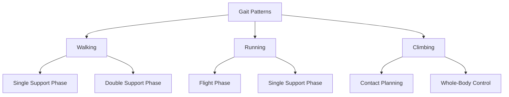

import Tabs from '@theme/Tabs';
import TabItem from '@theme/TabItem';

# Bipedal Locomotion

Bipedal locomotion is one of the most challenging aspects of humanoid robotics, requiring coordination of multiple degrees of freedom while maintaining balance. This chapter covers walking controllers, trajectory optimization, and whole-body control strategies.

## Gait Patterns

Humanoid robots can execute various gait patterns, each with different stability and efficiency characteristics.



### Gait Phases

```python
from enum import Enum
from typing import List, Tuple, Optional
import numpy as np
from dataclasses import dataclass

class GaitPhase(Enum):
    """Gait phase enumeration."""
    DOUBLE_SUPPORT = 0
    LEFT_SUPPORT = 1
    RIGHT_SUPPORT = 2
    FLIGHT = 3

@dataclass
class FootstepPlan:
    """Single footstep in a walking plan."""
    foot: str  # 'left' or 'right'
    position: np.ndarray  # 3D position
    orientation: float  # Yaw angle
    timing: float  # Time to reach this footstep
    phase: GaitPhase

class GaitGenerator:
    """Generate basic gait patterns for bipedal walking."""

    def __init__(self, step_length: float = 0.2, step_width: float = 0.15,
                 step_height: float = 0.05, step_duration: float = 0.8):
        """
        Initialize gait generator.

        Args:
            step_length: Forward step length (m)
            step_width: Lateral distance between feet (m)
            step_height: Maximum foot clearance (m)
            step_duration: Duration of each step (s)
        """
        self.step_length = step_length
        self.step_width = step_width
        self.step_height = step_height
        self.step_duration = step_duration
        self.double_support_ratio = 0.2  # Fraction of time in double support

    def generate_walking_pattern(self, n_steps: int, direction: np.ndarray = None) -> List[FootstepPlan]:
        """
        Generate straight-line walking pattern.

        Args:
            n_steps: Number of steps
            direction: Walking direction vector (default: forward)

        Returns:
            List of footstep plans
        """
        if direction is None:
            direction = np.array([1.0, 0.0, 0.0])

        direction = direction / np.linalg.norm(direction[:2])  # Normalize in XY

        footsteps = []
        current_pos = np.array([0.0, self.step_width/2, 0.0])  # Start with left foot
        current_time = 0.0

        for i in range(n_steps):
            # Alternate feet
            foot = 'right' if i % 2 == 0 else 'left'
            lateral_offset = -self.step_width/2 if foot == 'right' else self.step_width/2

            # Compute step position
            step_pos = current_pos.copy()
            step_pos[:2] += direction[:2] * self.step_length
            step_pos[1] = lateral_offset

            # Phase determination
            if i == 0:
                phase = GaitPhase.DOUBLE_SUPPORT
            else:
                phase = GaitPhase.RIGHT_SUPPORT if foot == 'left' else GaitPhase.LEFT_SUPPORT

            footstep = FootstepPlan(
                foot=foot,
                position=step_pos,
                orientation=np.arctan2(direction[1], direction[0]),
                timing=current_time + self.step_duration,
                phase=phase
            )

            footsteps.append(footstep)
            current_pos = step_pos
            current_time += self.step_duration

        return footsteps

    def generate_swing_trajectory(self, start_pos: np.ndarray, end_pos: np.ndarray,
                                  duration: float, t: float) -> Tuple[np.ndarray, np.ndarray]:
        """
        Generate swing foot trajectory using cycloid.

        Args:
            start_pos: Starting foot position
            end_pos: Ending foot position
            duration: Swing duration
            t: Current time in swing phase

        Returns:
            position, velocity
        """
        if t < 0 or t > duration:
            raise ValueError(f"Time {t} outside swing duration [0, {duration}]")

        # Normalized time
        s = t / duration

        # Cycloid trajectory for smooth motion with zero velocity at endpoints
        # x(s) = s - sin(2πs)/(2π)
        # z(s) = (1 - cos(2πs))/2
        s_pos = s - np.sin(2 * np.pi * s) / (2 * np.pi)
        z_scale = (1 - np.cos(2 * np.pi * s)) / 2

        s_vel = 1 - np.cos(2 * np.pi * s)
        z_vel = np.pi * np.sin(2 * np.pi * s)

        # Position
        pos = start_pos + s_pos * (end_pos - start_pos)
        pos[2] = start_pos[2] + z_scale * self.step_height

        # Velocity
        vel = s_vel * (end_pos - start_pos) / duration
        vel[2] = z_vel * self.step_height / duration

        return pos, vel

    def generate_turning_pattern(self, n_steps: int, turn_angle: float) -> List[FootstepPlan]:
        """
        Generate in-place turning pattern.

        Args:
            n_steps: Number of steps
            turn_angle: Total turn angle (radians)

        Returns:
            List of footstep plans
        """
        angle_per_step = turn_angle / n_steps
        footsteps = []

        current_angle = 0.0
        current_time = 0.0

        for i in range(n_steps):
            foot = 'right' if i % 2 == 0 else 'left'
            lateral_offset = -self.step_width/2 if foot == 'right' else self.step_width/2

            # Rotate position around origin
            current_angle += angle_per_step
            pos = np.array([
                0.0,
                lateral_offset * np.cos(current_angle),
                0.0
            ])

            phase = GaitPhase.RIGHT_SUPPORT if foot == 'left' else GaitPhase.LEFT_SUPPORT

            footstep = FootstepPlan(
                foot=foot,
                position=pos,
                orientation=current_angle,
                timing=current_time + self.step_duration,
                phase=phase
            )

            footsteps.append(footstep)
            current_time += self.step_duration

        return footsteps
```

## Linear Inverted Pendulum Model (LIPM)

The LIPM simplifies the humanoid dynamics to a point mass at the center of mass (CoM) with a massless leg. This allows analytical solutions for walking trajectories.

### LIPM Dynamics

The LIPM dynamics in the sagittal plane:

```
ẍ = ω²(x - x_ZMP)
```

where ω = √(g/z_c) and z_c is the constant CoM height.

```python
class LinearInvertedPendulum:
    """Linear Inverted Pendulum Model for walking."""

    def __init__(self, com_height: float = 0.8, gravity: float = 9.81):
        """
        Initialize LIPM.

        Args:
            com_height: Center of mass height (m)
            gravity: Gravitational acceleration (m/s²)
        """
        self.z_c = com_height
        self.g = gravity
        self.omega = np.sqrt(gravity / com_height)

    def compute_com_trajectory(self, zmp_trajectory: np.ndarray,
                               time: np.ndarray,
                               x0: float = 0.0, v0: float = 0.0) -> Tuple[np.ndarray, np.ndarray]:
        """
        Compute CoM trajectory from ZMP trajectory.

        Args:
            zmp_trajectory: ZMP positions over time
            time: Time array
            x0: Initial CoM position
            v0: Initial CoM velocity

        Returns:
            com_position, com_velocity arrays
        """
        dt = time[1] - time[0]
        n = len(time)

        x_com = np.zeros(n)
        v_com = np.zeros(n)

        x_com[0] = x0
        v_com[0] = v0

        # Integrate LIPM dynamics using Euler method
        for i in range(n - 1):
            # ddot{x} = omega^2 * (x - x_zmp)
            a_com = self.omega**2 * (x_com[i] - zmp_trajectory[i])

            v_com[i + 1] = v_com[i] + a_com * dt
            x_com[i + 1] = x_com[i] + v_com[i] * dt

        return x_com, v_com

    def compute_zmp_from_com(self, com_pos: float, com_vel: float, com_acc: float) -> float:
        """
        Compute ZMP position from CoM state.

        Args:
            com_pos: CoM position
            com_vel: CoM velocity
            com_acc: CoM acceleration

        Returns:
            ZMP position
        """
        # From LIPM: x_zmp = x - ddot{x}/omega^2
        return com_pos - com_acc / (self.omega**2)

    def analytical_solution(self, t: float, x0: float, v0: float, x_zmp: float) -> Tuple[float, float]:
        """
        Analytical solution for constant ZMP.

        Args:
            t: Time
            x0: Initial position
            v0: Initial velocity
            x_zmp: Constant ZMP position

        Returns:
            position, velocity at time t
        """
        C1 = (x0 - x_zmp) / 2 + v0 / (2 * self.omega)
        C2 = (x0 - x_zmp) / 2 - v0 / (2 * self.omega)

        x = x_zmp + C1 * np.exp(self.omega * t) + C2 * np.exp(-self.omega * t)
        v = self.omega * (C1 * np.exp(self.omega * t) - C2 * np.exp(-self.omega * t))

        return x, v

class LIPMWalkingController:
    """Walking controller based on LIPM."""

    def __init__(self, com_height: float = 0.8):
        """
        Initialize LIPM walking controller.

        Args:
            com_height: Center of mass height (m)
        """
        self.lipm = LinearInvertedPendulum(com_height)
        self.footstep_duration = 0.8
        self.double_support_duration = 0.1

    def plan_zmp_trajectory(self, footsteps: List[FootstepPlan]) -> Tuple[np.ndarray, np.ndarray]:
        """
        Plan ZMP trajectory from footsteps.

        Args:
            footsteps: List of footstep plans

        Returns:
            time_array, zmp_trajectory
        """
        total_time = footsteps[-1].timing
        dt = 0.01
        time = np.arange(0, total_time, dt)
        zmp = np.zeros(len(time))

        current_support_pos = 0.0

        for i, step in enumerate(footsteps):
            # Time indices for this step
            if i == 0:
                start_time = 0
            else:
                start_time = footsteps[i-1].timing

            start_idx = int(start_time / dt)
            end_idx = int(step.timing / dt)

            # During double support, transition ZMP
            ds_samples = int(self.double_support_duration / dt)

            if i > 0:
                # Transition from previous support to new support
                prev_pos = footsteps[i-1].position[0]
                new_pos = step.position[0]

                for j in range(start_idx, min(start_idx + ds_samples, end_idx)):
                    # Linear interpolation
                    alpha = (j - start_idx) / ds_samples
                    zmp[j] = prev_pos + alpha * (new_pos - prev_pos)

                # Single support: ZMP at support foot
                for j in range(start_idx + ds_samples, end_idx):
                    zmp[j] = new_pos

            current_support_pos = step.position[0]

        return time, zmp

    def generate_com_trajectory(self, footsteps: List[FootstepPlan],
                                x0: float = 0.0, v0: float = 0.0) -> dict:
        """
        Generate full CoM trajectory for walking.

        Args:
            footsteps: List of footstep plans
            x0: Initial CoM position
            v0: Initial CoM velocity

        Returns:
            Dictionary with time, com_pos, com_vel, zmp
        """
        time, zmp = self.plan_zmp_trajectory(footsteps)
        com_pos, com_vel = self.lipm.compute_com_trajectory(zmp, time, x0, v0)

        return {
            'time': time,
            'com_pos': com_pos,
            'com_vel': com_vel,
            'zmp': zmp
        }
```

## Model Predictive Control (MPC) for Locomotion

MPC enables walking on uneven terrain and handling disturbances by optimizing future trajectories.

```python
import cvxpy as cp

class MPCWalkingController:
    """Model Predictive Control for LIPM-based walking."""

    def __init__(self, com_height: float = 0.8, horizon: int = 20, dt: float = 0.1):
        """
        Initialize MPC controller.

        Args:
            com_height: Center of mass height (m)
            horizon: Prediction horizon steps
            dt: Time step (s)
        """
        self.lipm = LinearInvertedPendulum(com_height)
        self.N = horizon
        self.dt = dt

        # State: [x, v_x]
        # Control: ZMP position
        self._setup_dynamics()

    def _setup_dynamics(self):
        """Setup discrete-time LIPM dynamics matrices."""
        omega = self.lipm.omega
        dt = self.dt

        # Discretize continuous dynamics
        # x_k+1 = A * x_k + B * u_k
        # where x = [pos, vel], u = zmp

        self.A = np.array([
            [1, dt],
            [omega**2 * dt, 1]
        ])

        self.B = np.array([
            [0],
            [-omega**2 * dt]
        ])

    def solve_qp(self, x_current: np.ndarray, x_ref: np.ndarray,
                 u_ref: np.ndarray, Q: np.ndarray, R: np.ndarray) -> np.ndarray:
        """
        Solve MPC optimization problem.

        Args:
            x_current: Current state [position, velocity]
            x_ref: Reference trajectory (N+1 x 2)
            u_ref: Reference control (N x 1)
            Q: State cost matrix (2 x 2)
            R: Control cost matrix (1 x 1)

        Returns:
            Optimal control sequence (N x 1)
        """
        # Decision variables
        x = cp.Variable((self.N + 1, 2))  # States
        u = cp.Variable((self.N, 1))      # Controls (ZMP positions)

        # Cost function
        cost = 0
        constraints = []

        # Initial condition
        constraints.append(x[0, :] == x_current)

        for k in range(self.N):
            # State cost
            state_error = x[k, :] - x_ref[k, :]
            cost += cp.quad_form(state_error, Q)

            # Control cost
            control_error = u[k, :] - u_ref[k, :]
            cost += cp.quad_form(control_error, R)

            # Dynamics constraint
            x_next = self.A @ x[k, :] + (self.B @ u[k, :]).flatten()
            constraints.append(x[k + 1, :] == x_next)

        # Terminal cost
        state_error = x[self.N, :] - x_ref[self.N, :]
        cost += cp.quad_form(state_error, Q)

        # Solve
        problem = cp.Problem(cp.Minimize(cost), constraints)
        problem.solve(solver=cp.OSQP)

        if problem.status != cp.OPTIMAL:
            raise ValueError(f"MPC optimization failed: {problem.status}")

        return u.value

    def compute_control(self, current_state: np.ndarray,
                       footstep_plan: List[FootstepPlan],
                       current_time: float) -> float:
        """
        Compute ZMP control command.

        Args:
            current_state: Current CoM state [position, velocity]
            footstep_plan: Future footsteps
            current_time: Current time

        Returns:
            Optimal ZMP position
        """
        # Generate reference trajectory from footsteps
        x_ref = np.zeros((self.N + 1, 2))
        u_ref = np.zeros((self.N, 1))

        for k in range(self.N):
            t = current_time + k * self.dt

            # Find active footstep
            active_step = None
            for step in footstep_plan:
                if step.timing >= t:
                    active_step = step
                    break

            if active_step is not None:
                # Reference: track footstep position
                x_ref[k, 0] = active_step.position[0]
                x_ref[k, 1] = 0.0  # Desired velocity

                # ZMP reference: at support foot
                u_ref[k, 0] = active_step.position[0]

        x_ref[self.N, :] = x_ref[self.N - 1, :]

        # Cost matrices
        Q = np.diag([100.0, 10.0])  # Position and velocity weights
        R = np.array([[1.0]])       # ZMP control weight

        # Solve MPC
        u_optimal = self.solve_qp(current_state, x_ref, u_ref, Q, R)

        return u_optimal[0, 0]  # Return first control command
```

## Whole-Body Control with QP

Whole-body controllers coordinate all joints while satisfying constraints (balance, joint limits, collision avoidance).

```python
class WholeBodyController:
    """Whole-body controller using quadratic programming."""

    def __init__(self, n_joints: int, com_height: float = 0.8):
        """
        Initialize whole-body controller.

        Args:
            n_joints: Number of robot joints
            com_height: Center of mass height (m)
        """
        self.n_joints = n_joints
        self.com_height = com_height

    def compute_torques(self, q: np.ndarray, dq: np.ndarray,
                       com_desired: np.ndarray, com_vel_desired: np.ndarray,
                       contact_jacobians: List[np.ndarray],
                       task_jacobians: dict,
                       task_targets: dict) -> Tuple[np.ndarray, np.ndarray]:
        """
        Compute joint torques and contact forces.

        Args:
            q: Current joint positions
            dq: Current joint velocities
            com_desired: Desired CoM position
            com_vel_desired: Desired CoM velocity
            contact_jacobians: List of contact Jacobians
            task_jacobians: Dictionary of task Jacobians
            task_targets: Dictionary of task targets (accelerations)

        Returns:
            joint_torques, contact_forces
        """
        n = self.n_joints
        n_contacts = len(contact_jacobians)

        # Decision variables: [ddq (n), lambda (n_contacts*3), tau (n)]
        ddq = cp.Variable(n)
        contact_forces = cp.Variable(n_contacts * 3)
        tau = cp.Variable(n)

        # Cost: minimize control effort and contact forces
        cost = cp.sum_squares(tau) + 0.01 * cp.sum_squares(contact_forces)

        constraints = []

        # Dynamics constraint (simplified): M*ddq + h = tau + J^T * lambda
        # For simplicity, assume unit mass matrix
        M = np.eye(n)
        h = np.zeros(n)  # Gravity and Coriolis (simplified)

        # Contact constraints
        J_contact_full = np.zeros((n_contacts * 3, n))
        for i, J_c in enumerate(contact_jacobians):
            J_contact_full[i*3:(i+1)*3, :] = J_c

        # Dynamics equation
        lhs = M @ ddq + h
        rhs = tau + J_contact_full.T @ contact_forces
        constraints.append(lhs == rhs)

        # Task constraints (equality for high-priority tasks)
        for task_name, J_task in task_jacobians.items():
            if task_name in task_targets:
                target_acc = task_targets[task_name]
                # J * ddq = target_acc
                constraints.append(J_task @ ddq == target_acc)

        # Contact force constraints (friction cone, no pulling)
        mu = 0.7  # Friction coefficient
        for i in range(n_contacts):
            f_z = contact_forces[i*3 + 2]
            f_x = contact_forces[i*3]
            f_y = contact_forces[i*3 + 1]

            # Normal force must be positive
            constraints.append(f_z >= 0)

            # Friction cone (linearized)
            constraints.append(f_x <= mu * f_z)
            constraints.append(f_x >= -mu * f_z)
            constraints.append(f_y <= mu * f_z)
            constraints.append(f_y >= -mu * f_z)

        # Joint torque limits
        tau_max = 100.0  # N⋅m
        constraints.append(tau <= tau_max)
        constraints.append(tau >= -tau_max)

        # Solve QP
        problem = cp.Problem(cp.Minimize(cost), constraints)
        problem.solve(solver=cp.OSQP, verbose=False)

        if problem.status not in [cp.OPTIMAL, cp.OPTIMAL_INACCURATE]:
            print(f"Warning: QP solver status = {problem.status}")
            return np.zeros(n), np.zeros(n_contacts * 3)

        return tau.value, contact_forces.value

    def compute_task_jacobian_com(self, joint_positions: np.ndarray,
                                   link_masses: np.ndarray,
                                   link_com_positions: np.ndarray) -> np.ndarray:
        """
        Compute CoM Jacobian.

        Args:
            joint_positions: Current joint positions
            link_masses: Mass of each link
            link_com_positions: CoM position of each link (n_links x 3)

        Returns:
            CoM Jacobian (3 x n_joints)
        """
        total_mass = np.sum(link_masses)
        n_links = len(link_masses)

        # Simplified: assume each joint affects links sequentially
        J_com = np.zeros((3, self.n_joints))

        for i in range(n_links):
            # Contribution of link i to CoM
            weight = link_masses[i] / total_mass

            # Approximate Jacobian for link i (would normally compute from FK)
            for j in range(min(i + 1, self.n_joints)):
                # Cross product for angular velocity contribution
                J_com[:, j] += weight * np.array([1.0, 0.0, 0.0])  # Simplified

        return J_com
```

## Integration with Pinocchio

Pinocchio is a fast library for rigid body dynamics, ideal for whole-body control.

```python
"""
Example using Pinocchio for dynamics and kinematics.
Install: pip install pin
"""

try:
    import pinocchio as pin
    PINOCCHIO_AVAILABLE = True
except ImportError:
    PINOCCHIO_AVAILABLE = False
    print("Pinocchio not available. Install with: pip install pin")

class PinocchioRobot:
    """Wrapper for Pinocchio robot model."""

    def __init__(self, urdf_path: str):
        """
        Load robot from URDF.

        Args:
            urdf_path: Path to URDF file
        """
        if not PINOCCHIO_AVAILABLE:
            raise ImportError("Pinocchio is required")

        self.model = pin.buildModelFromUrdf(urdf_path)
        self.data = self.model.createData()

    def compute_forward_kinematics(self, q: np.ndarray) -> dict:
        """
        Compute forward kinematics for all frames.

        Args:
            q: Joint configuration

        Returns:
            Dictionary of frame poses
        """
        pin.forwardKinematics(self.model, self.data, q)
        pin.updateFramePlacements(self.model, self.data)

        poses = {}
        for frame in self.model.frames:
            poses[frame.name] = self.data.oMf[frame.parent]

        return poses

    def compute_com(self, q: np.ndarray) -> np.ndarray:
        """
        Compute center of mass position.

        Args:
            q: Joint configuration

        Returns:
            CoM position (3D)
        """
        pin.centerOfMass(self.model, self.data, q)
        return self.data.com[0]

    def compute_com_jacobian(self, q: np.ndarray) -> np.ndarray:
        """
        Compute CoM Jacobian.

        Args:
            q: Joint configuration

        Returns:
            CoM Jacobian (3 x nv)
        """
        pin.jacobianCenterOfMass(self.model, self.data, q)
        return self.data.Jcom

    def compute_inverse_dynamics(self, q: np.ndarray, v: np.ndarray, a: np.ndarray) -> np.ndarray:
        """
        Compute inverse dynamics (RNEA).

        Args:
            q: Joint positions
            v: Joint velocities
            a: Joint accelerations

        Returns:
            Joint torques
        """
        return pin.rnea(self.model, self.data, q, v, a)

    def compute_mass_matrix(self, q: np.ndarray) -> np.ndarray:
        """
        Compute joint-space mass matrix.

        Args:
            q: Joint configuration

        Returns:
            Mass matrix M(q)
        """
        return pin.crba(self.model, self.data, q)

    def get_frame_jacobian(self, q: np.ndarray, frame_name: str) -> np.ndarray:
        """
        Compute frame Jacobian.

        Args:
            q: Joint configuration
            frame_name: Name of the frame

        Returns:
            Frame Jacobian (6 x nv)
        """
        frame_id = self.model.getFrameId(frame_name)
        pin.computeFrameJacobian(self.model, self.data, q, frame_id)

        return pin.getFrameJacobian(
            self.model, self.data, frame_id, pin.ReferenceFrame.LOCAL_WORLD_ALIGNED
        )
```

## Terrain Adaptation

Adapting to uneven terrain requires contact sensing and replanning.

```python
class TerrainAdaptiveController:
    """Controller for walking on uneven terrain."""

    def __init__(self, nominal_com_height: float = 0.8):
        """
        Initialize terrain-adaptive controller.

        Args:
            nominal_com_height: Nominal CoM height (m)
        """
        self.nominal_height = nominal_com_height
        self.terrain_map = {}  # Store known terrain heights

    def update_terrain_map(self, position: np.ndarray, height: float):
        """
        Update terrain height map.

        Args:
            position: 2D position
            height: Terrain height at position
        """
        key = (round(position[0], 2), round(position[1], 2))
        self.terrain_map[key] = height

    def get_terrain_height(self, position: np.ndarray) -> float:
        """
        Query terrain height at position.

        Args:
            position: 2D position

        Returns:
            Terrain height (0 if unknown)
        """
        key = (round(position[0], 2), round(position[1], 2))
        return self.terrain_map.get(key, 0.0)

    def adapt_footstep_plan(self, nominal_plan: List[FootstepPlan]) -> List[FootstepPlan]:
        """
        Adapt footstep plan to terrain.

        Args:
            nominal_plan: Nominal footstep plan

        Returns:
            Adapted footstep plan
        """
        adapted_plan = []

        for step in nominal_plan:
            # Query terrain height at footstep location
            terrain_height = self.get_terrain_height(step.position[:2])

            # Create adapted footstep
            adapted_pos = step.position.copy()
            adapted_pos[2] = terrain_height

            adapted_step = FootstepPlan(
                foot=step.foot,
                position=adapted_pos,
                orientation=step.orientation,
                timing=step.timing,
                phase=step.phase
            )

            adapted_plan.append(adapted_step)

        return adapted_plan

    def compute_adaptive_com_height(self, left_foot_height: float,
                                    right_foot_height: float) -> float:
        """
        Compute adaptive CoM height based on foot terrain.

        Args:
            left_foot_height: Left foot terrain height
            right_foot_height: Right foot terrain height

        Returns:
            Desired CoM height
        """
        # CoM height above average foot height
        avg_foot_height = (left_foot_height + right_foot_height) / 2
        return avg_foot_height + self.nominal_height
```

## Push Recovery

Handling external disturbances through reactive stepping.

```python
class PushRecoveryController:
    """Stepping controller for push recovery."""

    def __init__(self, capture_point_gain: float = 1.0):
        """
        Initialize push recovery controller.

        Args:
            capture_point_gain: Gain for capture point regulation
        """
        self.gain = capture_point_gain

    def compute_capture_point(self, com_pos: np.ndarray, com_vel: np.ndarray,
                             omega: float) -> np.ndarray:
        """
        Compute instantaneous capture point.

        The capture point is where the robot must step to come to rest.

        Args:
            com_pos: CoM position
            com_vel: CoM velocity
            omega: Natural frequency (sqrt(g/h))

        Returns:
            Capture point position
        """
        return com_pos + com_vel / omega

    def compute_recovery_step(self, com_pos: np.ndarray, com_vel: np.ndarray,
                             omega: float, current_support: np.ndarray) -> np.ndarray:
        """
        Compute recovery step location.

        Args:
            com_pos: Current CoM position
            com_vel: Current CoM velocity
            omega: Natural frequency
            current_support: Current support foot position

        Returns:
            Recovery step location
        """
        # Compute capture point
        cp = self.compute_capture_point(com_pos, com_vel, omega)

        # Step location: between current support and capture point
        recovery_step = current_support + self.gain * (cp - current_support)

        return recovery_step

    def check_stability(self, capture_point: np.ndarray,
                       support_polygon: np.ndarray, margin: float = 0.05) -> bool:
        """
        Check if capture point is within support polygon.

        Args:
            capture_point: Capture point position (2D)
            support_polygon: Support polygon vertices
            margin: Safety margin

        Returns:
            True if stable
        """
        from shapely.geometry import Point, Polygon

        poly = Polygon(support_polygon).buffer(-margin)
        point = Point(capture_point[:2])

        return poly.contains(point)
```

## Complete Walking Simulation

```python
#!/usr/bin/env python3
"""
Complete bipedal walking simulation with MPC.
"""

import numpy as np
import matplotlib.pyplot as plt
from matplotlib.animation import FuncAnimation

class WalkingSimulation:
    """Complete walking simulation."""

    def __init__(self):
        self.gait_gen = GaitGenerator(
            step_length=0.2,
            step_width=0.15,
            step_duration=0.8
        )

        self.mpc = MPCWalkingController(com_height=0.8, horizon=20, dt=0.1)
        self.lipm = LinearInvertedPendulum(com_height=0.8)

        # Simulation state
        self.time = 0.0
        self.dt = 0.01
        self.state = np.array([0.0, 0.0])  # [position, velocity]

        # History
        self.history = {
            'time': [],
            'com_pos': [],
            'com_vel': [],
            'zmp': [],
            'left_foot': [],
            'right_foot': []
        }

    def run_simulation(self, n_steps: int = 6, duration: float = 6.0):
        """
        Run walking simulation.

        Args:
            n_steps: Number of steps
            duration: Simulation duration
        """
        # Generate footstep plan
        footsteps = self.gait_gen.generate_walking_pattern(n_steps)

        # Simulation loop
        n_iterations = int(duration / self.dt)

        for i in range(n_iterations):
            # Compute MPC control
            try:
                zmp_cmd = self.mpc.compute_control(
                    self.state, footsteps, self.time
                )
            except:
                # Fallback to simple ZMP
                zmp_cmd = 0.0
                for step in footsteps:
                    if step.timing >= self.time:
                        zmp_cmd = step.position[0]
                        break

            # Compute CoM acceleration from LIPM
            com_acc = self.lipm.omega**2 * (self.state[0] - zmp_cmd)

            # Integrate
            self.state[1] += com_acc * self.dt  # Velocity
            self.state[0] += self.state[1] * self.dt  # Position

            # Record history
            self.history['time'].append(self.time)
            self.history['com_pos'].append(self.state[0])
            self.history['com_vel'].append(self.state[1])
            self.history['zmp'].append(zmp_cmd)

            # Record foot positions
            left_pos = None
            right_pos = None
            for step in footsteps:
                if step.timing >= self.time:
                    if step.foot == 'left':
                        left_pos = step.position[0]
                    else:
                        right_pos = step.position[0]
                    break

            self.history['left_foot'].append(left_pos if left_pos else 0.0)
            self.history['right_foot'].append(right_pos if right_pos else 0.0)

            self.time += self.dt

        return self.history

    def plot_results(self):
        """Plot simulation results."""
        fig, axes = plt.subplots(3, 1, figsize=(12, 10))

        time = np.array(self.history['time'])

        # CoM position
        axes[0].plot(time, self.history['com_pos'], 'b-', linewidth=2, label='CoM Position')
        axes[0].plot(time, self.history['left_foot'], 'g--', label='Left Foot')
        axes[0].plot(time, self.history['right_foot'], 'r--', label='Right Foot')
        axes[0].set_ylabel('Position (m)')
        axes[0].set_title('Center of Mass Trajectory')
        axes[0].legend()
        axes[0].grid(True)

        # CoM velocity
        axes[1].plot(time, self.history['com_vel'], 'b-', linewidth=2)
        axes[1].set_ylabel('Velocity (m/s)')
        axes[1].set_title('CoM Velocity')
        axes[1].grid(True)

        # ZMP
        axes[2].plot(time, self.history['zmp'], 'r-', linewidth=2, label='ZMP')
        axes[2].plot(time, self.history['com_pos'], 'b--', alpha=0.5, label='CoM')
        axes[2].set_xlabel('Time (s)')
        axes[2].set_ylabel('Position (m)')
        axes[2].set_title('Zero Moment Point')
        axes[2].legend()
        axes[2].grid(True)

        plt.tight_layout()
        plt.show()

def main():
    """Run walking simulation example."""
    sim = WalkingSimulation()
    print("Running walking simulation...")

    history = sim.run_simulation(n_steps=6, duration=6.0)
    print(f"Simulation complete: {len(history['time'])} steps")

    sim.plot_results()

if __name__ == "__main__":
    main()
```

## ROS 2 Walking Controller Node

```python
#!/usr/bin/env python3
"""
ROS 2 node for bipedal walking control.
"""

import rclpy
from rclpy.node import Node
from geometry_msgs.msg import Twist, PoseStamped
from sensor_msgs.msg import JointState, Imu
from nav_msgs.msg import Odometry
import numpy as np

class BipedalWalkingNode(Node):
    """ROS 2 node for bipedal walking."""

    def __init__(self):
        super().__init__('bipedal_walking_controller')

        # Initialize controllers
        self.gait_gen = GaitGenerator()
        self.mpc = MPCWalkingController()

        # Publishers
        self.joint_cmd_pub = self.create_publisher(
            JointState, 'joint_commands', 10
        )

        # Subscribers
        self.cmd_vel_sub = self.create_subscription(
            Twist, 'cmd_vel', self.cmd_vel_callback, 10
        )

        self.imu_sub = self.create_subscription(
            Imu, 'imu', self.imu_callback, 10
        )

        self.joint_state_sub = self.create_subscription(
            JointState, 'joint_states', self.joint_state_callback, 10
        )

        # Control loop timer (100 Hz)
        self.control_timer = self.create_timer(0.01, self.control_loop)

        # State
        self.current_velocity_cmd = np.array([0.0, 0.0, 0.0])  # [vx, vy, omega]
        self.current_joint_state = None
        self.current_orientation = np.array([0.0, 0.0, 0.0, 1.0])  # Quaternion

        self.get_logger().info('Bipedal walking controller initialized')

    def cmd_vel_callback(self, msg: Twist):
        """Handle velocity commands."""
        self.current_velocity_cmd = np.array([
            msg.linear.x,
            msg.linear.y,
            msg.angular.z
        ])

    def imu_callback(self, msg: Imu):
        """Handle IMU data."""
        self.current_orientation = np.array([
            msg.orientation.x,
            msg.orientation.y,
            msg.orientation.z,
            msg.orientation.w
        ])

    def joint_state_callback(self, msg: JointState):
        """Handle joint state feedback."""
        self.current_joint_state = {
            'names': msg.name,
            'positions': np.array(msg.position),
            'velocities': np.array(msg.velocity)
        }

    def control_loop(self):
        """Main control loop."""
        if self.current_joint_state is None:
            return

        # Generate footsteps based on velocity command
        # (Simplified - would normally maintain a rolling plan)

        # Compute desired joint commands using IK and whole-body control
        # (Simplified example)

        joint_cmd = JointState()
        joint_cmd.header.stamp = self.get_clock().now().to_msg()
        joint_cmd.name = self.current_joint_state['names']
        joint_cmd.position = self.current_joint_state['positions'].tolist()

        self.joint_cmd_pub.publish(joint_cmd)

def main():
    rclpy.init()
    node = BipedalWalkingNode()
    rclpy.spin(node)
    node.destroy_node()
    rclpy.shutdown()

if __name__ == '__main__':
    main()
```

## Key Takeaways

1. **Gait Patterns**: Walking involves coordinated single and double support phases
2. **LIPM**: Simplifies dynamics for analytical trajectory planning
3. **MPC**: Enables robust walking with disturbance rejection and terrain adaptation
4. **Whole-Body Control**: QP-based control coordinates all joints while satisfying constraints
5. **Pinocchio**: Production-ready library for efficient dynamics computation
6. **Capture Point**: Key concept for balance and push recovery
7. **Terrain Adaptation**: Footstep replanning and adaptive CoM height enable uneven terrain walking

## Hands-On Exercises

### Exercise 1: LIPM Walking
Implement a complete LIPM-based walking controller. Generate CoM trajectory for 10 steps and visualize with matplotlib.

### Exercise 2: MPC Tuning
Tune the MPC controller (horizon, cost weights) for different objectives: energy efficiency, tracking accuracy, robustness.

### Exercise 3: Push Recovery
Simulate external pushes and implement capture point-based recovery stepping. Measure maximum recoverable disturbance.

### Exercise 4: Terrain Walking
Create a simulated uneven terrain (random heights). Adapt footstep planner and verify ZMP stays in support polygon.

### Exercise 5: Whole-Body Control
Implement QP-based whole-body controller with multiple tasks: CoM tracking, swing foot trajectory, posture regulation. Test task priorities.

### Exercise 6: Gazebo Simulation
Use Gazebo with a humanoid robot (e.g., Atlas, Talos). Implement your walking controller and test in simulation.

### Exercise 7: Gait Transitions
Implement smooth transitions between standing, walking, and running. Handle gait phase switching.

## Additional Resources

- **Books**:
  - "Humanoid Robotics: A Reference" by Goswami & Vadakkepat
  - "Biped Locomotion: Concepts, Models and Applications" by Vukobratović
  - "Springer Handbook of Robotics" (Humanoid chapter)

- **Software**:
  - [Pinocchio](https://stack-of-tasks.github.io/pinocchio/) - Fast rigid body dynamics
  - [hpp-fcl](https://github.com/humanoid-path-planner/hpp-fcl) - Collision detection
  - [crocoddyl](https://github.com/loco-3d/crocoddyl) - Contact-implicit optimization

- **Papers**:
  - Kajita et al. (2003) - "Biped walking pattern generation using preview control of ZMP"
  - Wieber (2006) - "Trajectory-free linear model predictive control for walking"
  - Herzog et al. (2016) - "Momentum control with hierarchical inverse dynamics on a torque-controlled humanoid"

- **Simulators**:
  - [Gazebo](http://gazebosim.org/) - General-purpose robot simulator
  - [NVIDIA Isaac Sim](https://developer.nvidia.com/isaac-sim) - GPU-accelerated simulation
  - [MuJoCo](https://mujoco.org/) - Physics engine optimized for robotics

---

**Next**: [Manipulation and Grasping](./manipulation-grasping.mdx) - Learn about dexterous manipulation and vision-based grasping.

**Previous**: [Kinematics and Dynamics](./kinematics-dynamics.mdx)
