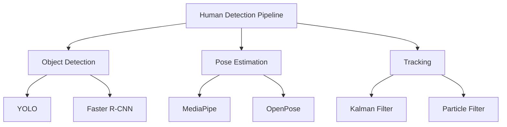

import Tabs from '@theme/Tabs';
import TabItem from '@theme/TabItem';

# Human-Robot Interaction

Human-Robot Interaction (HRI) enables humanoid robots to work safely and naturally alongside humans. This chapter covers perception, safety, learning from demonstration, and evaluation of interactive systems.

## Human Detection and Tracking

Accurate human detection and pose estimation are foundational for HRI.



### YOLO-Based Human Detection

```python
import numpy as np
from typing import List, Tuple, Optional
from dataclasses import dataclass
import cv2

@dataclass
class BoundingBox:
    """2D bounding box."""
    x: float
    y: float
    width: float
    height: float
    confidence: float
    class_id: int

@dataclass
class HumanPose:
    """3D human pose skeleton."""
    keypoints: np.ndarray  # (N, 3) array of keypoint positions
    confidence: np.ndarray  # (N,) array of confidence scores
    timestamp: float

class YOLODetector:
    """Human detection using YOLO."""

    def __init__(self, model_path: str = None, conf_threshold: float = 0.5):
        """
        Initialize YOLO detector.

        Args:
            model_path: Path to YOLO weights (if None, uses dummy detector)
            conf_threshold: Confidence threshold for detections
        """
        self.conf_threshold = conf_threshold
        self.model_path = model_path

        # In practice, load YOLO model here
        # self.model = cv2.dnn.readNet(model_path)

    def detect_humans(self, image: np.ndarray) -> List[BoundingBox]:
        """
        Detect humans in image.

        Args:
            image: Input image (H x W x 3)

        Returns:
            List of bounding boxes for detected humans
        """
        # Simplified placeholder - real implementation would use YOLO
        # blob = cv2.dnn.blobFromImage(image, 1/255.0, (416, 416), swapRB=True, crop=False)
        # self.model.setInput(blob)
        # outputs = self.model.forward()

        # For demonstration, return dummy detection
        h, w = image.shape[:2]
        detections = [
            BoundingBox(
                x=w * 0.3,
                y=h * 0.2,
                width=w * 0.4,
                height=h * 0.6,
                confidence=0.95,
                class_id=0  # Person class
            )
        ]

        return detections

    def filter_detections(self, detections: List[BoundingBox]) -> List[BoundingBox]:
        """
        Apply NMS and confidence filtering.

        Args:
            detections: Raw detections

        Returns:
            Filtered detections
        """
        # Filter by confidence
        filtered = [d for d in detections if d.confidence >= self.conf_threshold]

        # Apply Non-Maximum Suppression
        if len(filtered) > 1:
            filtered = self._apply_nms(filtered, iou_threshold=0.4)

        return filtered

    @staticmethod
    def _apply_nms(detections: List[BoundingBox], iou_threshold: float) -> List[BoundingBox]:
        """Apply non-maximum suppression."""
        if len(detections) == 0:
            return []

        # Sort by confidence
        detections = sorted(detections, key=lambda x: x.confidence, reverse=True)

        keep = []
        while detections:
            current = detections.pop(0)
            keep.append(current)

            # Remove overlapping boxes
            detections = [
                d for d in detections
                if YOLODetector._compute_iou(current, d) < iou_threshold
            ]

        return keep

    @staticmethod
    def _compute_iou(box1: BoundingBox, box2: BoundingBox) -> float:
        """Compute Intersection over Union."""
        # Intersection
        x1 = max(box1.x, box2.x)
        y1 = max(box1.y, box2.y)
        x2 = min(box1.x + box1.width, box2.x + box2.width)
        y2 = min(box1.y + box1.height, box2.y + box2.height)

        intersection = max(0, x2 - x1) * max(0, y2 - y1)

        # Union
        area1 = box1.width * box1.height
        area2 = box2.width * box2.height
        union = area1 + area2 - intersection

        return intersection / union if union > 0 else 0

class MediaPipePoseEstimator:
    """Human pose estimation using MediaPipe."""

    def __init__(self):
        """Initialize MediaPipe pose estimator."""
        try:
            import mediapipe as mp
            self.mp_pose = mp.solutions.pose
            self.pose = self.mp_pose.Pose(
                static_image_mode=False,
                model_complexity=1,
                min_detection_confidence=0.5,
                min_tracking_confidence=0.5
            )
            self.available = True
        except ImportError:
            print("MediaPipe not available. Install with: pip install mediapipe")
            self.available = False

    def estimate_pose(self, image: np.ndarray, timestamp: float = 0.0) -> Optional[HumanPose]:
        """
        Estimate human pose from image.

        Args:
            image: Input RGB image
            timestamp: Image timestamp

        Returns:
            HumanPose or None if no person detected
        """
        if not self.available:
            return None

        # Convert BGR to RGB if needed
        if image.shape[2] == 3:
            image_rgb = cv2.cvtColor(image, cv2.COLOR_BGR2RGB)
        else:
            image_rgb = image

        # Process image
        results = self.pose.process(image_rgb)

        if not results.pose_landmarks:
            return None

        # Extract keypoints (33 landmarks)
        landmarks = results.pose_landmarks.landmark
        keypoints = np.zeros((33, 3))
        confidence = np.zeros(33)

        for i, lm in enumerate(landmarks):
            keypoints[i] = [lm.x, lm.y, lm.z]
            confidence[i] = lm.visibility

        return HumanPose(
            keypoints=keypoints,
            confidence=confidence,
            timestamp=timestamp
        )

    def get_skeleton_connections(self) -> List[Tuple[int, int]]:
        """Get skeleton bone connections for visualization."""
        if not self.available:
            return []

        return list(self.mp_pose.POSE_CONNECTIONS)

class HumanTracker:
    """Multi-human tracker using Kalman filtering."""

    def __init__(self, max_age: int = 30, min_hits: int = 3):
        """
        Initialize tracker.

        Args:
            max_age: Maximum frames to keep track without detection
            min_hits: Minimum detections before confirmed track
        """
        self.max_age = max_age
        self.min_hits = min_hits
        self.tracks = []
        self.next_id = 0

    def update(self, detections: List[BoundingBox]) -> List[Tuple[int, BoundingBox]]:
        """
        Update tracks with new detections.

        Args:
            detections: New detections

        Returns:
            List of (track_id, bbox) for confirmed tracks
        """
        # Match detections to existing tracks
        matches, unmatched_dets, unmatched_tracks = self._match_detections(detections)

        # Update matched tracks
        for track_idx, det_idx in matches:
            self.tracks[track_idx].update(detections[det_idx])

        # Create new tracks for unmatched detections
        for det_idx in unmatched_dets:
            new_track = Track(self.next_id, detections[det_idx])
            self.tracks.append(new_track)
            self.next_id += 1

        # Remove old tracks
        self.tracks = [t for t in self.tracks if t.time_since_update <= self.max_age]

        # Return confirmed tracks
        confirmed = []
        for track in self.tracks:
            if track.hits >= self.min_hits:
                confirmed.append((track.id, track.get_state()))

        return confirmed

    def _match_detections(self, detections: List[BoundingBox]) -> Tuple[List, List, List]:
        """Match detections to tracks using Hungarian algorithm."""
        if len(self.tracks) == 0:
            return [], list(range(len(detections))), []

        # Compute cost matrix (IoU distance)
        cost_matrix = np.zeros((len(self.tracks), len(detections)))

        for i, track in enumerate(self.tracks):
            for j, det in enumerate(detections):
                # Use IoU as similarity
                iou = YOLODetector._compute_iou(track.get_state(), det)
                cost_matrix[i, j] = 1 - iou  # Convert to distance

        # Solve assignment problem
        from scipy.optimize import linear_sum_assignment
        track_indices, det_indices = linear_sum_assignment(cost_matrix)

        # Filter matches with low IoU
        matches = []
        unmatched_dets = list(range(len(detections)))
        unmatched_tracks = list(range(len(self.tracks)))

        for t, d in zip(track_indices, det_indices):
            if cost_matrix[t, d] < 0.7:  # IoU > 0.3
                matches.append((t, d))
                unmatched_dets.remove(d)
                unmatched_tracks.remove(t)

        return matches, unmatched_dets, unmatched_tracks

class Track:
    """Single tracked object using Kalman filter."""

    def __init__(self, track_id: int, initial_detection: BoundingBox):
        """
        Initialize track.

        Args:
            track_id: Unique track ID
            initial_detection: Initial detection
        """
        self.id = track_id
        self.hits = 1
        self.time_since_update = 0

        # Kalman filter state: [x, y, w, h, vx, vy, vw, vh]
        self.state = np.array([
            initial_detection.x,
            initial_detection.y,
            initial_detection.width,
            initial_detection.height,
            0, 0, 0, 0
        ])

        # Simple constant velocity model
        dt = 1.0
        self.F = np.eye(8)  # State transition
        self.F[0, 4] = dt
        self.F[1, 5] = dt
        self.F[2, 6] = dt
        self.F[3, 7] = dt

        self.H = np.eye(4, 8)  # Measurement matrix
        self.P = np.eye(8) * 10  # Covariance
        self.R = np.eye(4) * 1   # Measurement noise
        self.Q = np.eye(8) * 0.1  # Process noise

    def predict(self):
        """Predict next state."""
        self.state = self.F @ self.state
        self.P = self.F @ self.P @ self.F.T + self.Q
        self.time_since_update += 1

    def update(self, detection: BoundingBox):
        """Update with measurement."""
        # Measurement
        z = np.array([detection.x, detection.y, detection.width, detection.height])

        # Innovation
        y = z - self.H @ self.state

        # Kalman gain
        S = self.H @ self.P @ self.H.T + self.R
        K = self.P @ self.H.T @ np.linalg.inv(S)

        # Update state and covariance
        self.state = self.state + K @ y
        self.P = (np.eye(8) - K @ self.H) @ self.P

        self.hits += 1
        self.time_since_update = 0

    def get_state(self) -> BoundingBox:
        """Get current bounding box."""
        return BoundingBox(
            x=self.state[0],
            y=self.state[1],
            width=self.state[2],
            height=self.state[3],
            confidence=1.0,
            class_id=0
        )
```

## Gesture Recognition

Recognizing human gestures enables intuitive robot control.

```python
class GestureRecognizer:
    """Gesture recognition from pose sequences."""

    def __init__(self, window_size: int = 30):
        """
        Initialize gesture recognizer.

        Args:
            window_size: Number of frames for temporal window
        """
        self.window_size = window_size
        self.pose_history = []

    def add_pose(self, pose: HumanPose):
        """Add pose to history."""
        self.pose_history.append(pose)

        # Keep only recent poses
        if len(self.pose_history) > self.window_size:
            self.pose_history.pop(0)

    def recognize_wave(self) -> float:
        """
        Recognize waving gesture.

        Returns:
            Confidence score [0, 1]
        """
        if len(self.pose_history) < 10:
            return 0.0

        # Extract right hand positions over time
        right_hand_positions = []
        for pose in self.pose_history[-20:]:
            # MediaPipe landmark 16 is right wrist
            if pose.confidence[16] > 0.5:
                right_hand_positions.append(pose.keypoints[16])

        if len(right_hand_positions) < 10:
            return 0.0

        positions = np.array(right_hand_positions)

        # Check for oscillating Y position (vertical waving)
        y_positions = positions[:, 1]

        # Compute autocorrelation to detect periodicity
        mean_y = np.mean(y_positions)
        centered = y_positions - mean_y
        autocorr = np.correlate(centered, centered, mode='full')
        autocorr = autocorr[len(autocorr)//2:]
        autocorr /= autocorr[0]

        # Look for peak in autocorrelation (periodic motion)
        if len(autocorr) > 5:
            # Skip first peak (lag=0)
            peaks = np.where((autocorr[1:] > 0.3) & (autocorr[1:] > np.roll(autocorr[1:], 1)))[0]

            if len(peaks) > 0:
                # Wave detected
                amplitude = np.std(y_positions)
                if amplitude > 0.05:  # Significant motion
                    return min(1.0, amplitude * 5)

        return 0.0

    def recognize_point(self) -> Optional[np.ndarray]:
        """
        Recognize pointing gesture and direction.

        Returns:
            Pointing direction vector or None
        """
        if len(self.pose_history) == 0:
            return None

        pose = self.pose_history[-1]

        # Right arm: shoulder (12), elbow (14), wrist (16)
        shoulder = pose.keypoints[12]
        elbow = pose.keypoints[14]
        wrist = pose.keypoints[16]

        # Check confidence
        if min(pose.confidence[12], pose.confidence[14], pose.confidence[16]) < 0.5:
            return None

        # Check if arm is extended (elbow angle close to 180°)
        upper_arm = elbow - shoulder
        forearm = wrist - elbow

        # Compute angle
        cos_angle = np.dot(upper_arm, forearm) / (
            np.linalg.norm(upper_arm) * np.linalg.norm(forearm) + 1e-6
        )
        angle = np.arccos(np.clip(cos_angle, -1, 1))

        if angle > 2.7:  # > ~155 degrees (nearly straight)
            # Compute pointing direction
            direction = wrist - shoulder
            direction /= np.linalg.norm(direction)
            return direction

        return None

    def recognize_stop_gesture(self) -> float:
        """
        Recognize stop gesture (palm facing forward).

        Returns:
            Confidence score [0, 1]
        """
        if len(self.pose_history) == 0:
            return 0.0

        pose = self.pose_history[-1]

        # Right arm extended, wrist above elbow
        wrist = pose.keypoints[16]
        elbow = pose.keypoints[14]
        shoulder = pose.keypoints[12]

        if min(pose.confidence[[12, 14, 16]]) < 0.5:
            return 0.0

        # Check if arm is raised
        if wrist[1] < shoulder[1] and wrist[1] < elbow[1]:
            # Check if arm is approximately horizontal
            arm_vector = wrist - shoulder
            horizontal_component = np.sqrt(arm_vector[0]**2 + arm_vector[2]**2)
            vertical_component = abs(arm_vector[1])

            if horizontal_component > 2 * vertical_component:
                return 0.8

        return 0.0
```

## Safe Human-Robot Collaboration

Safety is paramount when robots work alongside humans. ISO 15066 defines safety requirements for collaborative robots.

```python
class SafetyMonitor:
    """Monitor and enforce safety constraints for HRI."""

    def __init__(self, safety_distance: float = 0.5, emergency_stop_distance: float = 0.2):
        """
        Initialize safety monitor.

        Args:
            safety_distance: Minimum safe distance to humans (m)
            emergency_stop_distance: Distance for immediate stop (m)
        """
        self.safety_distance = safety_distance
        self.emergency_stop_distance = emergency_stop_distance

        self.safety_state = "SAFE"  # SAFE, WARNING, EMERGENCY

    def compute_distance_to_human(self, robot_pose: np.ndarray,
                                  human_pose: HumanPose) -> float:
        """
        Compute minimum distance between robot and human.

        Args:
            robot_pose: Robot end-effector pose
            human_pose: Human pose skeleton

        Returns:
            Minimum distance (m)
        """
        robot_position = robot_pose[:3, 3] if robot_pose.shape == (4, 4) else robot_pose

        # Compute distance to each human keypoint
        distances = []
        for i, keypoint in enumerate(human_pose.keypoints):
            if human_pose.confidence[i] > 0.5:
                dist = np.linalg.norm(robot_position - keypoint)
                distances.append(dist)

        return min(distances) if distances else float('inf')

    def check_safety(self, robot_pose: np.ndarray, robot_velocity: np.ndarray,
                    human_poses: List[HumanPose]) -> Tuple[str, Optional[float]]:
        """
        Check safety status.

        Args:
            robot_pose: Current robot pose
            robot_velocity: Current robot velocity
            human_poses: Detected human poses

        Returns:
            (safety_state, recommended_speed_scale)
        """
        if len(human_poses) == 0:
            return "SAFE", 1.0

        # Compute minimum distance to any human
        min_distance = float('inf')
        for human_pose in human_poses:
            dist = self.compute_distance_to_human(robot_pose, human_pose)
            min_distance = min(min_distance, dist)

        # Determine safety state
        if min_distance < self.emergency_stop_distance:
            self.safety_state = "EMERGENCY"
            return "EMERGENCY", 0.0
        elif min_distance < self.safety_distance:
            self.safety_state = "WARNING"
            # Scale speed based on distance
            speed_scale = (min_distance - self.emergency_stop_distance) / \
                         (self.safety_distance - self.emergency_stop_distance)
            return "WARNING", max(0.1, speed_scale)
        else:
            self.safety_state = "SAFE"
            return "SAFE", 1.0

    def compute_safe_velocity(self, desired_velocity: np.ndarray,
                             safety_state: str, speed_scale: float) -> np.ndarray:
        """
        Compute safe velocity command.

        Args:
            desired_velocity: Desired robot velocity
            safety_state: Current safety state
            speed_scale: Speed scaling factor [0, 1]

        Returns:
            Safe velocity command
        """
        if safety_state == "EMERGENCY":
            return np.zeros_like(desired_velocity)
        else:
            return desired_velocity * speed_scale

class CollisionAvoidance:
    """Collision avoidance for safe HRI."""

    def __init__(self, min_distance: float = 0.3):
        """
        Initialize collision avoidance.

        Args:
            min_distance: Minimum allowed distance
        """
        self.min_distance = min_distance

    def compute_repulsive_force(self, robot_position: np.ndarray,
                               obstacle_position: np.ndarray,
                               gain: float = 1.0) -> np.ndarray:
        """
        Compute repulsive force from obstacle.

        Args:
            robot_position: Robot position
            obstacle_position: Obstacle position
            gain: Repulsive force gain

        Returns:
            Repulsive force vector
        """
        diff = robot_position - obstacle_position
        distance = np.linalg.norm(diff)

        if distance > self.min_distance:
            return np.zeros(3)

        # Artificial potential field
        magnitude = gain * (1.0 / distance - 1.0 / self.min_distance) / (distance ** 2)
        direction = diff / distance

        return magnitude * direction

    def compute_safe_trajectory(self, desired_trajectory: np.ndarray,
                               human_poses: List[HumanPose]) -> np.ndarray:
        """
        Modify trajectory to avoid collisions.

        Args:
            desired_trajectory: Desired trajectory (N x 3)
            human_poses: Human poses

        Returns:
            Modified safe trajectory
        """
        safe_trajectory = desired_trajectory.copy()

        for i, waypoint in enumerate(desired_trajectory):
            total_repulsion = np.zeros(3)

            # Compute repulsion from all human keypoints
            for human_pose in human_poses:
                for j, keypoint in enumerate(human_pose.keypoints):
                    if human_pose.confidence[j] > 0.5:
                        repulsion = self.compute_repulsive_force(waypoint, keypoint)
                        total_repulsion += repulsion

            # Modify waypoint
            safe_trajectory[i] += total_repulsion

        return safe_trajectory
```

## Imitation Learning

Learning from human demonstrations enables robots to acquire complex skills.

```python
class DemonstrationRecorder:
    """Record demonstrations for imitation learning."""

    def __init__(self):
        """Initialize demonstration recorder."""
        self.demonstrations = []
        self.current_demo = None

    def start_recording(self):
        """Start recording new demonstration."""
        self.current_demo = {
            'states': [],
            'actions': [],
            'timestamps': []
        }

    def add_sample(self, state: np.ndarray, action: np.ndarray, timestamp: float):
        """
        Add sample to current demonstration.

        Args:
            state: Environment state
            action: Robot action
            timestamp: Sample timestamp
        """
        if self.current_demo is None:
            raise RuntimeError("No active recording")

        self.current_demo['states'].append(state)
        self.current_demo['actions'].append(action)
        self.current_demo['timestamps'].append(timestamp)

    def stop_recording(self):
        """Stop recording and save demonstration."""
        if self.current_demo is None:
            return

        # Convert lists to arrays
        demo = {
            'states': np.array(self.current_demo['states']),
            'actions': np.array(self.current_demo['actions']),
            'timestamps': np.array(self.current_demo['timestamps'])
        }

        self.demonstrations.append(demo)
        self.current_demo = None

    def get_demonstrations(self) -> List[dict]:
        """Get all recorded demonstrations."""
        return self.demonstrations

class BehavioralCloning:
    """Learn policy from demonstrations using behavioral cloning."""

    def __init__(self, state_dim: int, action_dim: int):
        """
        Initialize behavioral cloning.

        Args:
            state_dim: State dimensionality
            action_dim: Action dimensionality
        """
        self.state_dim = state_dim
        self.action_dim = action_dim

        # Simple linear policy (in practice, use neural network)
        self.weights = np.random.randn(action_dim, state_dim) * 0.01
        self.bias = np.zeros(action_dim)

    def train(self, demonstrations: List[dict], epochs: int = 100, lr: float = 0.01):
        """
        Train policy from demonstrations.

        Args:
            demonstrations: List of demonstration dictionaries
            epochs: Training epochs
            lr: Learning rate
        """
        # Collect all state-action pairs
        all_states = []
        all_actions = []

        for demo in demonstrations:
            all_states.append(demo['states'])
            all_actions.append(demo['actions'])

        states = np.vstack(all_states)
        actions = np.vstack(all_actions)

        # Train using gradient descent
        for epoch in range(epochs):
            # Forward pass
            predictions = states @ self.weights.T + self.bias

            # Loss (MSE)
            error = predictions - actions
            loss = np.mean(error ** 2)

            # Backward pass
            grad_weights = error.T @ states / len(states)
            grad_bias = np.mean(error, axis=0)

            # Update
            self.weights -= lr * grad_weights
            self.bias -= lr * grad_bias

            if epoch % 10 == 0:
                print(f"Epoch {epoch}, Loss: {loss:.6f}")

    def predict(self, state: np.ndarray) -> np.ndarray:
        """
        Predict action for state.

        Args:
            state: Current state

        Returns:
            Predicted action
        """
        return state @ self.weights.T + self.bias

class DynamicMovementPrimitives:
    """Learn and reproduce trajectories using DMPs."""

    def __init__(self, n_basis: int = 25, alpha: float = 25.0):
        """
        Initialize DMP.

        Args:
            n_basis: Number of basis functions
            alpha: Transformation system gain
        """
        self.n_basis = n_basis
        self.alpha = alpha
        self.beta = alpha / 4

        # Basis function centers
        self.centers = np.linspace(0, 1, n_basis)
        self.widths = np.ones(n_basis) * (n_basis / self.centers.max()) ** 2

        self.weights = None
        self.goal = None
        self.start = None

    def learn_from_demonstration(self, trajectory: np.ndarray, dt: float = 0.01):
        """
        Learn DMP from demonstration trajectory.

        Args:
            trajectory: Demonstrated trajectory (N x D)
            dt: Time step
        """
        N, D = trajectory.shape
        self.start = trajectory[0]
        self.goal = trajectory[-1]

        # Compute velocities and accelerations
        velocity = np.gradient(trajectory, axis=0) / dt
        acceleration = np.gradient(velocity, axis=0) / dt

        # Canonical system
        s = np.exp(-self.alpha * np.linspace(0, 1, N))

        # Compute forcing term
        forcing = np.zeros((N, D))
        for i in range(N):
            v_d = velocity[i]
            a_d = acceleration[i]
            x = trajectory[i]

            forcing[i] = (a_d - self.alpha * (self.beta * (self.goal - x) - v_d)) / (s[i] + 1e-6)

        # Learn weights for each dimension
        self.weights = np.zeros((D, self.n_basis))

        for d in range(D):
            # Regression to find weights
            Psi = self._basis_functions(s)
            self.weights[d] = np.linalg.lstsq(Psi, forcing[:, d], rcond=None)[0]

    def generate_trajectory(self, duration: float = 1.0, dt: float = 0.01,
                           start: np.ndarray = None, goal: np.ndarray = None) -> np.ndarray:
        """
        Generate trajectory from learned DMP.

        Args:
            duration: Trajectory duration
            dt: Time step
            start: Start position (default: learned start)
            goal: Goal position (default: learned goal)

        Returns:
            Generated trajectory
        """
        if self.weights is None:
            raise RuntimeError("DMP not trained")

        if start is None:
            start = self.start
        if goal is None:
            goal = self.goal

        D = len(start)
        N = int(duration / dt)

        # Initialize
        x = start.copy()
        v = np.zeros(D)

        trajectory = [x.copy()]

        # Canonical system
        for i in range(N - 1):
            s = np.exp(-self.alpha * i * dt / duration)

            # Basis functions
            psi = self._basis_function_value(s)

            # Forcing term
            f = (self.weights @ psi) * s

            # Transformation system
            a = self.alpha * (self.beta * (goal - x) - v) + f
            v = v + a * dt
            x = x + v * dt

            trajectory.append(x.copy())

        return np.array(trajectory)

    def _basis_functions(self, s: np.ndarray) -> np.ndarray:
        """Compute basis function matrix."""
        N = len(s)
        Psi = np.zeros((N, self.n_basis))

        for i in range(N):
            Psi[i] = self._basis_function_value(s[i])

        return Psi

    def _basis_function_value(self, s: float) -> np.ndarray:
        """Compute basis function values for phase s."""
        psi = np.exp(-self.widths * (s - self.centers) ** 2)
        return psi / (psi.sum() + 1e-6)
```

## Teleoperation Interfaces

Teleoperation enables humans to control robots remotely.

```python
class TeleoperationInterface:
    """Base class for teleoperation interfaces."""

    def __init__(self):
        """Initialize teleoperation interface."""
        self.active = False

    def get_command(self) -> Optional[dict]:
        """
        Get teleoperation command.

        Returns:
            Command dictionary or None
        """
        raise NotImplementedError

    def send_feedback(self, feedback: dict):
        """
        Send feedback to operator.

        Args:
            feedback: Feedback dictionary
        """
        raise NotImplementedError

class VRTeleoperation(TeleoperationInterface):
    """VR-based teleoperation using hand tracking."""

    def __init__(self):
        """Initialize VR teleoperation."""
        super().__init__()
        # In practice, initialize VR SDK here

    def get_command(self) -> Optional[dict]:
        """Get command from VR controller."""
        if not self.active:
            return None

        # Dummy VR data
        command = {
            'left_hand_pose': np.eye(4),
            'right_hand_pose': np.eye(4),
            'button_states': {
                'trigger_left': 0.0,
                'trigger_right': 0.0
            }
        }

        return command

    def send_feedback(self, feedback: dict):
        """Send haptic feedback to VR controllers."""
        # Implement haptic rendering
        pass

class RetargetingController:
    """Retarget human motions to robot."""

    def __init__(self, human_skeleton_scale: float = 1.0,
                 robot_skeleton_scale: float = 1.0):
        """
        Initialize retargeting.

        Args:
            human_skeleton_scale: Human skeleton scale
            robot_skeleton_scale: Robot skeleton scale
        """
        self.human_scale = human_skeleton_scale
        self.robot_scale = robot_skeleton_scale

    def retarget_pose(self, human_pose: HumanPose) -> np.ndarray:
        """
        Retarget human pose to robot joint angles.

        Args:
            human_pose: Human pose

        Returns:
            Robot joint angles
        """
        # Simplified retargeting (in practice, solve IK)

        # Extract relevant keypoints
        left_shoulder = human_pose.keypoints[11]
        left_elbow = human_pose.keypoints[13]
        left_wrist = human_pose.keypoints[15]

        # Compute joint angles from skeleton
        upper_arm = left_elbow - left_shoulder
        forearm = left_wrist - left_elbow

        # Shoulder pitch
        shoulder_pitch = np.arctan2(upper_arm[2], upper_arm[0])

        # Elbow angle
        cos_elbow = np.dot(upper_arm, forearm) / (
            np.linalg.norm(upper_arm) * np.linalg.norm(forearm) + 1e-6
        )
        elbow_angle = np.arccos(np.clip(cos_elbow, -1, 1))

        # Return simplified joint angles
        robot_joints = np.array([
            shoulder_pitch,
            0.0,  # Shoulder roll
            0.0,  # Shoulder yaw
            elbow_angle,
            0.0,  # Wrist angles...
            0.0,
            0.0
        ])

        return robot_joints
```

## Evaluation Metrics

Evaluating HRI systems requires quantitative metrics.

```python
class HRIEvaluator:
    """Evaluate human-robot interaction."""

    def __init__(self):
        """Initialize evaluator."""
        self.metrics = {}

    def evaluate_task_efficiency(self, completion_time: float,
                                 optimal_time: float) -> float:
        """
        Evaluate task efficiency.

        Args:
            completion_time: Actual completion time
            optimal_time: Optimal completion time

        Returns:
            Efficiency score [0, 1]
        """
        return min(1.0, optimal_time / completion_time)

    def evaluate_safety(self, min_distances: List[float],
                       safety_threshold: float = 0.5) -> dict:
        """
        Evaluate safety metrics.

        Args:
            min_distances: Minimum distances over time
            safety_threshold: Safety distance threshold

        Returns:
            Dictionary of safety metrics
        """
        violations = [d for d in min_distances if d < safety_threshold]

        return {
            'violation_rate': len(violations) / len(min_distances),
            'min_distance': min(min_distances),
            'mean_distance': np.mean(min_distances),
            'safety_margin': np.mean([max(0, d - safety_threshold) for d in min_distances])
        }

    def evaluate_naturalness(self, robot_trajectory: np.ndarray,
                            human_trajectory: np.ndarray) -> float:
        """
        Evaluate motion naturalness (similarity to human).

        Args:
            robot_trajectory: Robot trajectory
            human_trajectory: Human demonstration trajectory

        Returns:
            Similarity score [0, 1]
        """
        # Dynamic Time Warping distance
        from scipy.spatial.distance import euclidean
        from fastdtw import fastdtw

        distance, _ = fastdtw(robot_trajectory, human_trajectory, dist=euclidean)

        # Normalize by trajectory length
        normalized_distance = distance / len(robot_trajectory)

        # Convert to similarity score
        similarity = np.exp(-normalized_distance)

        return similarity

    def compute_collaboration_fluency(self, human_idle_time: float,
                                     robot_idle_time: float,
                                     total_time: float) -> float:
        """
        Compute collaboration fluency (minimize idle time).

        Args:
            human_idle_time: Total human idle time
            robot_idle_time: Total robot idle time
            total_time: Total task time

        Returns:
            Fluency score [0, 1]
        """
        total_idle = human_idle_time + robot_idle_time
        fluency = 1.0 - (total_idle / (2 * total_time))

        return max(0.0, fluency)
```

## Complete Example: Collaborative Assembly

```python
#!/usr/bin/env python3
"""
Complete example: Human-robot collaborative assembly task.
"""

import numpy as np
import time

class CollaborativeAssembly:
    """Collaborative assembly task demonstration."""

    def __init__(self):
        """Initialize collaborative assembly system."""
        self.detector = YOLODetector()
        self.pose_estimator = MediaPipePoseEstimator()
        self.gesture_recognizer = GestureRecognizer()
        self.safety_monitor = SafetyMonitor()
        self.evaluator = HRIEvaluator()

        # Task state
        self.task_active = False
        self.current_step = 0

    def run_collaborative_task(self):
        """Run collaborative assembly demonstration."""
        print("=== Collaborative Assembly Task ===\n")

        # Simulated video stream
        print("Step 1: Human Detection")
        image = np.zeros((480, 640, 3), dtype=np.uint8)  # Dummy image

        # Detect human
        detections = self.detector.detect_humans(image)
        print(f"  Detected {len(detections)} humans")

        # Estimate pose
        if self.pose_estimator.available:
            human_pose = self.pose_estimator.estimate_pose(image, time.time())
            if human_pose:
                print(f"  Estimated human pose with {len(human_pose.keypoints)} keypoints")
        else:
            # Create dummy pose
            human_pose = HumanPose(
                keypoints=np.random.randn(33, 3) * 0.1,
                confidence=np.ones(33) * 0.9,
                timestamp=time.time()
            )
            print("  Using dummy human pose")

        # Gesture recognition
        print("\nStep 2: Gesture Recognition")
        self.gesture_recognizer.add_pose(human_pose)

        # Simulate multiple poses for gesture
        for _ in range(20):
            self.gesture_recognizer.add_pose(human_pose)

        wave_conf = self.gesture_recognizer.recognize_wave()
        print(f"  Wave gesture confidence: {wave_conf:.2f}")

        # Safety monitoring
        print("\nStep 3: Safety Monitoring")
        robot_pose = np.array([0.5, 0.0, 0.5])  # Robot position
        robot_velocity = np.array([0.1, 0.0, 0.0])

        safety_state, speed_scale = self.safety_monitor.check_safety(
            robot_pose, robot_velocity, [human_pose]
        )

        print(f"  Safety state: {safety_state}")
        print(f"  Recommended speed scale: {speed_scale:.2f}")

        # Collaboration
        print("\nStep 4: Task Execution")
        print("  Human: Picks up component A")
        time.sleep(0.5)
        print("  Robot: Positions holding fixture")
        time.sleep(0.5)
        print("  Human: Inserts component A")
        time.sleep(0.5)
        print("  Robot: Applies fastener")
        time.sleep(0.5)
        print("  Task complete!")

        # Evaluation
        print("\nStep 5: Performance Evaluation")

        # Simulated metrics
        completion_time = 2.0
        optimal_time = 1.8
        efficiency = self.evaluator.evaluate_task_efficiency(
            completion_time, optimal_time
        )
        print(f"  Task efficiency: {efficiency:.2%}")

        # Safety metrics
        min_distances = [0.6, 0.55, 0.5, 0.45, 0.5, 0.55, 0.6]
        safety_metrics = self.evaluator.evaluate_safety(min_distances, 0.5)
        print(f"  Safety metrics:")
        print(f"    Violation rate: {safety_metrics['violation_rate']:.1%}")
        print(f"    Min distance: {safety_metrics['min_distance']:.2f} m")
        print(f"    Mean distance: {safety_metrics['mean_distance']:.2f} m")

def main():
    """Run collaborative assembly demo."""
    demo = CollaborativeAssembly()
    demo.run_collaborative_task()

if __name__ == "__main__":
    main()
```

## ROS 2 HRI Node

```python
#!/usr/bin/env python3
"""
ROS 2 node for human-robot interaction.
"""

try:
    import rclpy
    from rclpy.node import Node
    from sensor_msgs.msg import Image, JointState
    from geometry_msgs.msg import Twist
    from std_msgs.msg import String
    ROS2_AVAILABLE = True
except ImportError:
    ROS2_AVAILABLE = False

class HRINode(Node):
    """ROS 2 node for HRI."""

    def __init__(self):
        if not ROS2_AVAILABLE:
            raise ImportError("ROS 2 required")

        super().__init__('hri_node')

        # Initialize components
        self.detector = YOLODetector()
        self.pose_estimator = MediaPipePoseEstimator()
        self.gesture_recognizer = GestureRecognizer()
        self.safety_monitor = SafetyMonitor()

        # Publishers
        self.cmd_vel_pub = self.create_publisher(Twist, 'cmd_vel', 10)
        self.gesture_pub = self.create_publisher(String, 'detected_gesture', 10)

        # Subscribers
        self.image_sub = self.create_subscription(
            Image, 'camera/image', self.image_callback, 10
        )

        # Control loop
        self.timer = self.create_timer(0.1, self.control_loop)

        self.get_logger().info('HRI node initialized')

    def image_callback(self, msg: Image):
        """Process camera image."""
        # Convert ROS image to numpy array
        # image = self.bridge.imgmsg_to_cv2(msg, "bgr8")

        # Detect humans
        # detections = self.detector.detect_humans(image)

        # Estimate poses
        # if detections:
        #     pose = self.pose_estimator.estimate_pose(image)
        #     if pose:
        #         self.gesture_recognizer.add_pose(pose)

        pass

    def control_loop(self):
        """Main control loop."""
        # Check gestures
        wave_conf = self.gesture_recognizer.recognize_wave()

        if wave_conf > 0.7:
            gesture_msg = String()
            gesture_msg.data = "wave"
            self.gesture_pub.publish(gesture_msg)

            self.get_logger().info('Detected wave gesture')

def main():
    if ROS2_AVAILABLE:
        rclpy.init()
        node = HRINode()
        rclpy.spin(node)
        node.destroy_node()
        rclpy.shutdown()

if __name__ == '__main__':
    main()
```

## Key Takeaways

1. **Human Detection**: YOLO and pose estimation (MediaPipe) enable robust human tracking
2. **Gesture Recognition**: Temporal analysis of poses enables natural command interfaces
3. **Safety**: ISO 15066 compliance through distance monitoring and speed scaling
4. **Imitation Learning**: Behavioral cloning and DMPs enable learning from demonstration
5. **Teleoperation**: VR and retargeting enable intuitive robot control
6. **Evaluation**: Quantitative metrics assess efficiency, safety, and naturalness
7. **Collaboration**: Fluent human-robot collaboration requires perception, planning, and adaptation

## Hands-On Exercises

### Exercise 1: Pose Estimation
Implement real-time pose estimation using MediaPipe. Visualize skeleton on video stream and compute joint angles.

### Exercise 2: Gesture Recognition
Create a gesture recognition system for 5 gestures (wave, point, stop, thumbs-up, beckoning). Evaluate accuracy on test videos.

### Exercise 3: Safety Controller
Implement ISO 15066 compliant safety controller. Simulate various scenarios and verify speed scaling behavior.

### Exercise 4: Imitation Learning
Record 10 demonstrations of a simple task. Train behavioral cloning policy and evaluate reproduction quality.

### Exercise 5: DMP Learning
Implement DMP learning from trajectory demonstrations. Test generalization to different start/goal positions.

### Exercise 6: VR Teleoperation
Set up VR teleoperation for robot arm. Implement retargeting and test manipulation tasks.

### Exercise 7: Collaborative Task
Design and implement a collaborative assembly task. Measure task efficiency, safety, and collaboration fluency.

## Additional Resources

- **Books**:
  - "Human-Robot Interaction" by Goodrich & Schultz
  - "Springer Handbook of Robotics" (HRI chapter)
  - "Programming Robots with ROS" by Quigley et al.

- **Software**:
  - [MediaPipe](https://google.github.io/mediapipe/) - Pose estimation and hand tracking
  - [OpenPose](https://github.com/CMU-Perceptual-Computing-Lab/openpose) - Multi-person pose estimation
  - [YOLO](https://github.com/ultralytics/ultralytics) - Real-time object detection
  - [ROS 2 Human](https://github.com/ros-perception/people) - Human detection in ROS

- **Papers**:
  - Argall et al. (2009) - "A survey of robot learning from demonstration"
  - Ijspeert et al. (2013) - "Dynamical movement primitives: Learning attractor models for motor behaviors"
  - Lasota et al. (2017) - "A survey of methods for safe human-robot interaction"
  - Rakita et al. (2018) - "Motion retargeting for humanoid robots"

- **Standards**:
  - [ISO 15066](https://www.iso.org/standard/62996.html) - Collaborative robots safety requirements
  - [ISO 13482](https://www.iso.org/standard/53820.html) - Personal care robots safety

- **Datasets**:
  - [COCO](https://cocodataset.org/) - Object detection and pose estimation
  - [MPII Human Pose](http://human-pose.mpi-inf.mpg.de/) - Pose estimation benchmark
  - [Jester](https://developer.qualcomm.com/software/ai-datasets/jester) - Hand gesture recognition

---

**Previous**: [Manipulation and Grasping](./manipulation-grasping.mdx)
