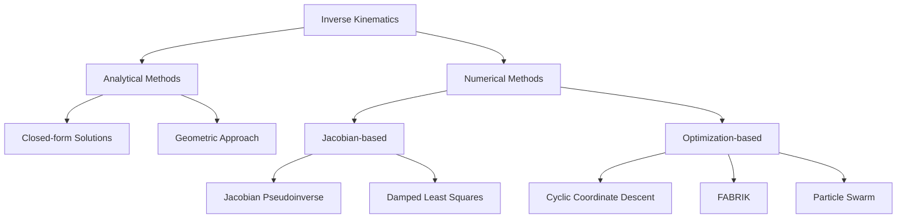

import Tabs from '@theme/Tabs';
import TabItem from '@theme/TabItem';

# Kinematics and Dynamics

This chapter covers the mathematical foundations and practical implementation of kinematics and dynamics for humanoid robots, including motion planning, balance control, and real-time trajectory generation.

## Forward Kinematics

Forward kinematics computes the position and orientation of the end-effector (hand, foot) given joint angles. For humanoid robots, we typically use the **Denavit-Hartenberg (DH)** convention to systematically describe kinematic chains.

### Denavit-Hartenberg Convention

The DH parameters define the transformation between consecutive joint frames using four parameters:

- **θᵢ**: Joint angle (variable for revolute joints)
- **dᵢ**: Link offset along previous z-axis
- **aᵢ**: Link length along x-axis
- **αᵢ**: Link twist (rotation about x-axis)

The transformation matrix between frames is a 4x4 homogeneous transformation matrix:

```
T_i = [cosθ_i   -sinθ_i cosα_i   sinθ_i sinα_i   a_i cosθ_i  ]
      [sinθ_i    cosθ_i cosα_i  -cosθ_i sinα_i   a_i sinθ_i  ]
      [0         sinα_i          cosα_i           d_i         ]
      [0         0               0                1           ]
```

### Python Implementation

```python
import numpy as np
from typing import List, Tuple
from dataclasses import dataclass

@dataclass
class DHParameter:
    """Denavit-Hartenberg parameters for a single joint."""
    theta: float  # Joint angle (radians)
    d: float      # Link offset
    a: float      # Link length
    alpha: float  # Link twist

class ForwardKinematics:
    """Forward kinematics for serial manipulators using DH convention."""

    def __init__(self, dh_params: List[DHParameter]):
        """
        Initialize with DH parameters.

        Args:
            dh_params: List of DH parameters for each joint
        """
        self.dh_params = dh_params
        self.n_joints = len(dh_params)

    def dh_matrix(self, theta: float, d: float, a: float, alpha: float) -> np.ndarray:
        """
        Compute DH transformation matrix.

        Args:
            theta: Joint angle
            d: Link offset
            a: Link length
            alpha: Link twist

        Returns:
            4x4 homogeneous transformation matrix
        """
        ct, st = np.cos(theta), np.sin(theta)
        ca, sa = np.cos(alpha), np.sin(alpha)

        return np.array([
            [ct, -st*ca,  st*sa, a*ct],
            [st,  ct*ca, -ct*sa, a*st],
            [0,   sa,     ca,    d],
            [0,   0,      0,     1]
        ])

    def forward(self, joint_angles: np.ndarray) -> Tuple[np.ndarray, List[np.ndarray]]:
        """
        Compute forward kinematics.

        Args:
            joint_angles: Array of joint angles (radians)

        Returns:
            end_effector_pose: 4x4 transformation matrix
            transforms: List of intermediate transformations
        """
        if len(joint_angles) != self.n_joints:
            raise ValueError(f"Expected {self.n_joints} angles, got {len(joint_angles)}")

        T = np.eye(4)
        transforms = [T.copy()]

        for i, (angle, dh) in enumerate(zip(joint_angles, self.dh_params)):
            # Update theta for revolute joint
            theta = dh.theta + angle
            T_i = self.dh_matrix(theta, dh.d, dh.a, dh.alpha)
            T = T @ T_i
            transforms.append(T.copy())

        return T, transforms

    def get_position(self, joint_angles: np.ndarray) -> np.ndarray:
        """Get end-effector position only."""
        T, _ = self.forward(joint_angles)
        return T[:3, 3]

    def get_rotation(self, joint_angles: np.ndarray) -> np.ndarray:
        """Get end-effector rotation matrix."""
        T, _ = self.forward(joint_angles)
        return T[:3, :3]

# Example: 7-DOF humanoid arm
def create_7dof_arm() -> ForwardKinematics:
    """
    Create a 7-DOF arm similar to human arm configuration.
    Shoulder (3-DOF), Elbow (1-DOF), Wrist (3-DOF)
    """
    # Approximate human arm dimensions (meters)
    upper_arm_length = 0.30
    forearm_length = 0.25

    dh_params = [
        # Shoulder pitch
        DHParameter(theta=0, d=0, a=0, alpha=np.pi/2),
        # Shoulder roll
        DHParameter(theta=0, d=0, a=0, alpha=np.pi/2),
        # Shoulder yaw
        DHParameter(theta=0, d=upper_arm_length, a=0, alpha=np.pi/2),
        # Elbow pitch
        DHParameter(theta=0, d=0, a=0, alpha=np.pi/2),
        # Wrist yaw
        DHParameter(theta=0, d=forearm_length, a=0, alpha=np.pi/2),
        # Wrist pitch
        DHParameter(theta=0, d=0, a=0, alpha=np.pi/2),
        # Wrist roll
        DHParameter(theta=0, d=0.08, a=0, alpha=0),
    ]

    return ForwardKinematics(dh_params)

# Test forward kinematics
if __name__ == "__main__":
    fk = create_7dof_arm()

    # Home position (all zeros)
    q_home = np.zeros(7)
    pos_home = fk.get_position(q_home)
    print(f"Home position: {pos_home}")

    # Bent elbow configuration
    q_bent = np.array([0, 0, 0, np.pi/2, 0, 0, 0])
    pos_bent = fk.get_position(q_bent)
    print(f"Bent elbow position: {pos_bent}")
```

## Inverse Kinematics

Inverse kinematics (IK) solves for joint angles given a desired end-effector pose. This is more challenging than forward kinematics and often has multiple solutions (or no solution).

### Analytical vs Numerical Methods



### Jacobian-Based IK (Numerical)

The Jacobian matrix J(q) relates joint velocities to end-effector velocities:

```
ẋ = J(q) q̇
```

For IK, we iterate using:

```
Δq = J†(q) Δx
```

where J† is the pseudoinverse (Moore-Penrose inverse). For better numerical stability, use **Damped Least Squares (DLS)**:

```
Δq = J^T(JJ^T + λ²I)^-1 Δx
```

```python
class JacobianIK:
    """Inverse kinematics using Jacobian pseudoinverse method."""

    def __init__(self, fk: ForwardKinematics, damping: float = 0.01):
        """
        Initialize Jacobian-based IK solver.

        Args:
            fk: Forward kinematics object
            damping: Damping factor for DLS method
        """
        self.fk = fk
        self.damping = damping
        self.epsilon = 1e-4  # Position tolerance
        self.max_iterations = 100

    def compute_jacobian(self, joint_angles: np.ndarray, delta: float = 1e-6) -> np.ndarray:
        """
        Compute Jacobian matrix using numerical differentiation.

        Args:
            joint_angles: Current joint configuration
            delta: Finite difference step size

        Returns:
            6xN Jacobian matrix (3 position + 3 orientation)
        """
        n = len(joint_angles)
        J = np.zeros((6, n))

        # Current end-effector pose
        T_current, _ = self.fk.forward(joint_angles)
        pos_current = T_current[:3, 3]

        # Finite differences for each joint
        for i in range(n):
            q_delta = joint_angles.copy()
            q_delta[i] += delta

            T_delta, _ = self.fk.forward(q_delta)
            pos_delta = T_delta[:3, 3]

            # Position Jacobian
            J[:3, i] = (pos_delta - pos_current) / delta

            # Orientation Jacobian (simplified - use rotation vector)
            R_current = T_current[:3, :3]
            R_delta = T_delta[:3, :3]
            R_diff = R_delta @ R_current.T

            # Convert to axis-angle
            angle = np.arccos(np.clip((np.trace(R_diff) - 1) / 2, -1, 1))
            if angle > 1e-6:
                axis = np.array([
                    R_diff[2, 1] - R_diff[1, 2],
                    R_diff[0, 2] - R_diff[2, 0],
                    R_diff[1, 0] - R_diff[0, 1]
                ]) / (2 * np.sin(angle))
                J[3:6, i] = (axis * angle) / delta

        return J

    def solve(self, target_pos: np.ndarray, q_init: np.ndarray = None,
              target_orient: np.ndarray = None) -> Tuple[np.ndarray, bool]:
        """
        Solve IK for target position (and optionally orientation).

        Args:
            target_pos: Target 3D position
            q_init: Initial joint configuration (default: zeros)
            target_orient: Target 3x3 rotation matrix (optional)

        Returns:
            joint_angles: Solution joint angles
            success: Whether solution was found
        """
        if q_init is None:
            q_init = np.zeros(self.fk.n_joints)

        q = q_init.copy()
        use_orientation = target_orient is not None

        for iteration in range(self.max_iterations):
            # Current end-effector pose
            T_current, _ = self.fk.forward(q)
            pos_current = T_current[:3, 3]

            # Position error
            pos_error = target_pos - pos_current

            if use_orientation:
                # Orientation error
                R_current = T_current[:3, :3]
                R_error = target_orient @ R_current.T
                angle = np.arccos(np.clip((np.trace(R_error) - 1) / 2, -1, 1))

                if angle > 1e-6:
                    axis = np.array([
                        R_error[2, 1] - R_error[1, 2],
                        R_error[0, 2] - R_error[2, 0],
                        R_error[1, 0] - R_error[0, 1]
                    ]) / (2 * np.sin(angle))
                    orient_error = axis * angle
                else:
                    orient_error = np.zeros(3)

                error = np.concatenate([pos_error, orient_error])
            else:
                error = pos_error

            # Check convergence
            if np.linalg.norm(pos_error) < self.epsilon:
                return q, True

            # Compute Jacobian
            J = self.compute_jacobian(q)

            if not use_orientation:
                J = J[:3, :]  # Use only position part

            # Damped Least Squares
            JJT = J @ J.T
            lambda_sq = self.damping ** 2
            delta_q = J.T @ np.linalg.solve(JJT + lambda_sq * np.eye(JJT.shape[0]), error)

            # Update with step size control
            step_size = 0.5
            q = q + step_size * delta_q

        return q, False

# Test IK solver
if __name__ == "__main__":
    fk = create_7dof_arm()
    ik = JacobianIK(fk, damping=0.01)

    # Target position
    target = np.array([0.3, 0.2, 0.4])

    # Solve IK
    q_solution, success = ik.solve(target)

    if success:
        print(f"IK Solution: {q_solution}")
        pos_reached = fk.get_position(q_solution)
        print(f"Reached position: {pos_reached}")
        print(f"Error: {np.linalg.norm(target - pos_reached):.6f} m")
    else:
        print("IK failed to converge")
```

### FABRIK Algorithm

**Forward And Backward Reaching Inverse Kinematics (FABRIK)** is a fast heuristic method that iteratively adjusts joint positions.

```python
class FABRIK:
    """FABRIK IK solver for serial chains."""

    def __init__(self, link_lengths: List[float], tolerance: float = 1e-3):
        """
        Initialize FABRIK solver.

        Args:
            link_lengths: Length of each link
            tolerance: Position tolerance for convergence
        """
        self.link_lengths = np.array(link_lengths)
        self.n_joints = len(link_lengths) + 1
        self.tolerance = tolerance
        self.max_iterations = 100

    def solve(self, target: np.ndarray, base: np.ndarray = None) -> np.ndarray:
        """
        Solve IK using FABRIK algorithm.

        Args:
            target: Target 3D position
            base: Base position (default: origin)

        Returns:
            Joint positions (n_joints x 3)
        """
        if base is None:
            base = np.zeros(3)

        # Initialize joint positions (straight line from base)
        total_length = np.sum(self.link_lengths)
        direction = (target - base) / np.linalg.norm(target - base)

        positions = np.zeros((self.n_joints, 3))
        positions[0] = base
        for i in range(len(self.link_lengths)):
            positions[i + 1] = positions[i] + direction * self.link_lengths[i]

        # Check if target is reachable
        dist_to_target = np.linalg.norm(target - base)
        if dist_to_target > total_length:
            # Target unreachable - stretch toward target
            positions[-1] = base + direction * total_length
            return positions

        # FABRIK iterations
        for _ in range(self.max_iterations):
            # Check convergence
            if np.linalg.norm(positions[-1] - target) < self.tolerance:
                break

            # Forward reaching: set end-effector to target
            positions[-1] = target
            for i in range(self.n_joints - 2, -1, -1):
                # Find position that maintains link length
                direction = (positions[i] - positions[i + 1])
                direction = direction / np.linalg.norm(direction)
                positions[i] = positions[i + 1] + direction * self.link_lengths[i]

            # Backward reaching: restore base position
            positions[0] = base
            for i in range(self.n_joints - 1):
                direction = (positions[i + 1] - positions[i])
                direction = direction / np.linalg.norm(direction)
                positions[i + 1] = positions[i] + direction * self.link_lengths[i]

        return positions

    def positions_to_angles(self, positions: np.ndarray) -> np.ndarray:
        """
        Convert joint positions to joint angles (for 2D case).

        Args:
            positions: Joint positions

        Returns:
            Joint angles
        """
        angles = np.zeros(len(self.link_lengths))

        for i in range(len(self.link_lengths)):
            v1 = positions[i + 1] - positions[i]
            if i == 0:
                # First joint angle relative to x-axis
                angles[i] = np.arctan2(v1[1], v1[0])
            else:
                v0 = positions[i] - positions[i - 1]
                # Relative angle between links
                angles[i] = np.arctan2(v1[1], v1[0]) - np.arctan2(v0[1], v0[0])

        return angles

# Test FABRIK
if __name__ == "__main__":
    # 3-link arm
    fabrik = FABRIK(link_lengths=[0.3, 0.25, 0.15])

    target = np.array([0.5, 0.3, 0.0])
    positions = fabrik.solve(target)

    print("Joint positions:")
    for i, pos in enumerate(positions):
        print(f"  Joint {i}: {pos}")
```

## Jacobian Analysis

The Jacobian is crucial for velocity control, force mapping, and singularity analysis.

### Velocity Kinematics

```python
class JacobianAnalysis:
    """Tools for Jacobian analysis and manipulation."""

    @staticmethod
    def manipulability(J: np.ndarray) -> float:
        """
        Compute Yoshikawa's manipulability measure.

        Args:
            J: Jacobian matrix

        Returns:
            Manipulability index (0 = singular, higher = better)
        """
        return np.sqrt(np.linalg.det(J @ J.T))

    @staticmethod
    def condition_number(J: np.ndarray) -> float:
        """
        Compute condition number of Jacobian.

        Args:
            J: Jacobian matrix

        Returns:
            Condition number (1 = best, inf = singular)
        """
        return np.linalg.cond(J)

    @staticmethod
    def singularity_robust_inverse(J: np.ndarray, lambda_max: float = 0.1) -> np.ndarray:
        """
        Compute singularity-robust inverse using variable damping.

        Args:
            J: Jacobian matrix
            lambda_max: Maximum damping factor

        Returns:
            Damped pseudoinverse
        """
        manipulability = JacobianAnalysis.manipulability(J)

        # Adaptive damping based on manipulability
        if manipulability < 0.01:
            lambda_sq = lambda_max ** 2
        else:
            lambda_sq = 0.0

        JJT = J @ J.T
        return J.T @ np.linalg.inv(JJT + lambda_sq * np.eye(JJT.shape[0]))

    @staticmethod
    def null_space_projection(J: np.ndarray) -> np.ndarray:
        """
        Compute null space projection matrix.
        Useful for secondary objectives without affecting primary task.

        Args:
            J: Jacobian matrix

        Returns:
            Null space projection matrix
        """
        J_pinv = np.linalg.pinv(J)
        n = J.shape[1]
        return np.eye(n) - J_pinv @ J
```

## Robot Dynamics

Robot dynamics describes the relationship between forces/torques and motion.

### Lagrangian Formulation

The equations of motion are:

```
M(q)q̈ + C(q, q̇)q̇ + G(q) = τ
```

where:
- M(q): Mass/inertia matrix
- C(q, q̇): Coriolis and centrifugal terms
- G(q): Gravity terms
- τ: Joint torques

```python
class RobotDynamics:
    """Robot dynamics using simplified Lagrangian formulation."""

    def __init__(self, link_masses: List[float], link_lengths: List[float],
                 link_com: List[float], gravity: float = 9.81):
        """
        Initialize dynamics model.

        Args:
            link_masses: Mass of each link (kg)
            link_lengths: Length of each link (m)
            link_com: Center of mass position along each link (m)
            gravity: Gravitational acceleration (m/s²)
        """
        self.m = np.array(link_masses)
        self.l = np.array(link_lengths)
        self.lc = np.array(link_com)
        self.g = gravity
        self.n = len(link_masses)

        # Simplified inertias (point mass approximation)
        self.I = self.m * self.lc ** 2

    def mass_matrix(self, q: np.ndarray) -> np.ndarray:
        """
        Compute mass/inertia matrix M(q).

        Args:
            q: Joint angles

        Returns:
            Mass matrix (n x n)
        """
        n = len(q)
        M = np.zeros((n, n))

        for i in range(n):
            for j in range(n):
                # Diagonal terms
                if i == j:
                    M[i, j] = self.I[i]
                    for k in range(i + 1, n):
                        M[i, j] += self.m[k] * self.l[i] ** 2
                # Off-diagonal terms (simplified)
                elif j > i:
                    M[i, j] = self.m[j] * self.l[i] * self.lc[j] * np.cos(q[j] - q[i])
                    M[j, i] = M[i, j]

        return M

    def coriolis_matrix(self, q: np.ndarray, qd: np.ndarray) -> np.ndarray:
        """
        Compute Coriolis and centrifugal matrix C(q, qd).

        Args:
            q: Joint angles
            qd: Joint velocities

        Returns:
            Coriolis matrix (n x n)
        """
        n = len(q)
        C = np.zeros((n, n))

        # Simplified Coriolis terms
        for i in range(n):
            for j in range(n):
                for k in range(n):
                    if j > i and k > i:
                        h = -self.m[j] * self.l[i] * self.lc[j] * np.sin(q[j] - q[i])
                        C[i, k] += h * qd[j]

        return C

    def gravity_vector(self, q: np.ndarray) -> np.ndarray:
        """
        Compute gravity torque vector G(q).

        Args:
            q: Joint angles

        Returns:
            Gravity vector (n,)
        """
        n = len(q)
        G = np.zeros(n)

        for i in range(n):
            # Sum contributions from this link and all subsequent links
            total_mass = self.m[i]
            com_pos = self.lc[i]

            for j in range(i + 1, n):
                total_mass += self.m[j]
                com_pos += self.l[j]

            G[i] = total_mass * self.g * com_pos * np.cos(np.sum(q[:i+1]))

        return G

    def forward_dynamics(self, q: np.ndarray, qd: np.ndarray, tau: np.ndarray) -> np.ndarray:
        """
        Compute joint accelerations from torques (forward dynamics).

        Args:
            q: Joint angles
            qd: Joint velocities
            tau: Joint torques

        Returns:
            Joint accelerations qdd
        """
        M = self.mass_matrix(q)
        C = self.coriolis_matrix(q, qd)
        G = self.gravity_vector(q)

        # M * qdd = tau - C * qd - G
        qdd = np.linalg.solve(M, tau - C @ qd - G)
        return qdd

    def inverse_dynamics(self, q: np.ndarray, qd: np.ndarray, qdd: np.ndarray) -> np.ndarray:
        """
        Compute required torques from desired motion (inverse dynamics).

        Args:
            q: Joint angles
            qd: Joint velocities
            qdd: Desired joint accelerations

        Returns:
            Required joint torques
        """
        M = self.mass_matrix(q)
        C = self.coriolis_matrix(q, qd)
        G = self.gravity_vector(q)

        tau = M @ qdd + C @ qd + G
        return tau
```

## Zero Moment Point (ZMP)

The ZMP is a critical concept for humanoid balance. It's the point on the ground where the total moment from ground reaction forces equals zero.

### ZMP Calculation

For a humanoid robot, the ZMP position is calculated as:

```
p = Σᵢ mᵢ (p̈ᵢ + g) × pᵢ / Σᵢ mᵢ (z̈ᵢ + g)
```

where p is the ZMP position, m is mass at each link, p̈ and z̈ are accelerations, and g is gravity.

```python
class ZMPCalculator:
    """Calculate and analyze Zero Moment Point for balance."""

    def __init__(self, gravity: float = 9.81):
        """
        Initialize ZMP calculator.

        Args:
            gravity: Gravitational acceleration (m/s²)
        """
        self.g = gravity

    def compute_zmp(self, masses: np.ndarray, positions: np.ndarray,
                    accelerations: np.ndarray) -> np.ndarray:
        """
        Compute ZMP position.

        Args:
            masses: Mass of each link (n,)
            positions: 3D positions of each link COM (n x 3)
            accelerations: 3D accelerations of each link COM (n x 3)

        Returns:
            ZMP position in x-y plane
        """
        # Total moment about ZMP should be zero
        total_mass = np.sum(masses)

        # Vertical forces
        fz = masses * (accelerations[:, 2] + self.g)
        total_fz = np.sum(fz)

        if abs(total_fz) < 1e-6:
            return np.array([0.0, 0.0])

        # Moments
        mx = np.sum(masses * (accelerations[:, 2] + self.g) * positions[:, 0])
        my = np.sum(masses * (accelerations[:, 2] + self.g) * positions[:, 1])

        zmp_x = mx / total_fz
        zmp_y = my / total_fz

        return np.array([zmp_x, zmp_y])

    def is_stable(self, zmp: np.ndarray, support_polygon: np.ndarray,
                  margin: float = 0.01) -> bool:
        """
        Check if ZMP is inside support polygon (stable).

        Args:
            zmp: ZMP position (2D)
            support_polygon: Vertices of support polygon (n x 2)
            margin: Safety margin (meters)

        Returns:
            True if stable
        """
        from shapely.geometry import Point, Polygon

        # Create polygon with margin
        poly = Polygon(support_polygon).buffer(-margin)
        point = Point(zmp)

        return poly.contains(point)

    def compute_stability_margin(self, zmp: np.ndarray,
                                 support_polygon: np.ndarray) -> float:
        """
        Compute minimum distance from ZMP to support polygon boundary.

        Args:
            zmp: ZMP position (2D)
            support_polygon: Vertices of support polygon (n x 2)

        Returns:
            Minimum distance to boundary (negative if outside)
        """
        from shapely.geometry import Point, Polygon

        poly = Polygon(support_polygon)
        point = Point(zmp)

        if poly.contains(point):
            # Distance to boundary (positive = inside)
            return point.distance(poly.boundary)
        else:
            # Distance to boundary (negative = outside)
            return -point.distance(poly.boundary)
```

## ROS 2 Integration with MoveIt 2

MoveIt 2 provides advanced motion planning capabilities for ROS 2.

```python
# ros2_ik_server.py
import rclpy
from rclpy.node import Node
from geometry_msgs.msg import PoseStamped
from moveit_msgs.msg import RobotState
from moveit_msgs.srv import GetPositionIK
from sensor_msgs.msg import JointState

class IKServiceNode(Node):
    """ROS 2 node providing IK service using custom solver."""

    def __init__(self):
        super().__init__('ik_service_node')

        # Create IK solver
        self.fk = create_7dof_arm()
        self.ik = JacobianIK(self.fk)

        # Create service
        self.srv = self.create_service(
            GetPositionIK,
            'compute_ik',
            self.compute_ik_callback
        )

        self.get_logger().info('IK service ready')

    def compute_ik_callback(self, request, response):
        """Handle IK service request."""
        # Extract target pose
        pose = request.ik_request.pose_stamped.pose
        target_pos = np.array([
            pose.position.x,
            pose.position.y,
            pose.position.z
        ])

        # Extract seed state if provided
        if request.ik_request.robot_state.joint_state.position:
            q_init = np.array(request.ik_request.robot_state.joint_state.position)
        else:
            q_init = None

        # Solve IK
        q_solution, success = self.ik.solve(target_pos, q_init)

        # Fill response
        response.error_code.val = 1 if success else -1

        if success:
            response.solution.joint_state.name = [
                f'joint_{i}' for i in range(len(q_solution))
            ]
            response.solution.joint_state.position = q_solution.tolist()

        return response

def main():
    rclpy.init()
    node = IKServiceNode()
    rclpy.spin(node)
    node.destroy_node()
    rclpy.shutdown()

if __name__ == '__main__':
    main()
```

## Trajectory Generation

Smooth trajectory generation ensures safe and efficient motion.

```python
class TrajectoryGenerator:
    """Generate smooth joint trajectories."""

    @staticmethod
    def quintic_polynomial(t: float, t_total: float, q0: float, qf: float,
                          v0: float = 0, vf: float = 0,
                          a0: float = 0, af: float = 0) -> Tuple[float, float, float]:
        """
        Generate quintic (5th order) polynomial trajectory.

        Args:
            t: Current time
            t_total: Total trajectory duration
            q0: Initial position
            qf: Final position
            v0: Initial velocity
            vf: Final velocity
            a0: Initial acceleration
            af: Final acceleration

        Returns:
            position, velocity, acceleration at time t
        """
        # Normalize time
        s = t / t_total

        # Quintic polynomial coefficients
        a = np.array([
            [1, 0, 0, 0, 0, 0],
            [0, 1, 0, 0, 0, 0],
            [0, 0, 2, 0, 0, 0],
            [1, 1, 1, 1, 1, 1],
            [0, 1, 2, 3, 4, 5],
            [0, 0, 2, 6, 12, 20]
        ])

        b = np.array([q0, v0 * t_total, a0 * t_total**2, qf, vf * t_total, af * t_total**2])
        coeffs = np.linalg.solve(a, b)

        # Evaluate polynomial
        pos = sum(coeffs[i] * s**i for i in range(6))
        vel = sum(i * coeffs[i] * s**(i-1) for i in range(1, 6)) / t_total
        acc = sum(i * (i-1) * coeffs[i] * s**(i-2) for i in range(2, 6)) / t_total**2

        return pos, vel, acc

    @staticmethod
    def generate_trajectory(q_start: np.ndarray, q_end: np.ndarray,
                           duration: float, dt: float = 0.01) -> Tuple[np.ndarray, np.ndarray, np.ndarray]:
        """
        Generate smooth trajectory for all joints.

        Args:
            q_start: Starting joint angles
            q_end: Ending joint angles
            duration: Trajectory duration (seconds)
            dt: Time step (seconds)

        Returns:
            positions, velocities, accelerations arrays
        """
        n_steps = int(duration / dt)
        n_joints = len(q_start)

        positions = np.zeros((n_steps, n_joints))
        velocities = np.zeros((n_steps, n_joints))
        accelerations = np.zeros((n_steps, n_joints))

        for i in range(n_steps):
            t = i * dt
            for j in range(n_joints):
                pos, vel, acc = TrajectoryGenerator.quintic_polynomial(
                    t, duration, q_start[j], q_end[j]
                )
                positions[i, j] = pos
                velocities[i, j] = vel
                accelerations[i, j] = acc

        return positions, velocities, accelerations
```

## Complete Integration Example

```python
#!/usr/bin/env python3
"""
Complete example: IK-based reaching with trajectory execution.
"""

import numpy as np
import matplotlib.pyplot as plt
from mpl_toolkits.mplot3d import Axes3D

def visualize_trajectory(fk: ForwardKinematics, trajectory: np.ndarray):
    """Visualize arm trajectory in 3D."""
    fig = plt.figure(figsize=(12, 5))

    # 3D trajectory
    ax1 = fig.add_subplot(121, projection='3d')

    positions = []
    for q in trajectory:
        pos = fk.get_position(q)
        positions.append(pos)

    positions = np.array(positions)
    ax1.plot(positions[:, 0], positions[:, 1], positions[:, 2], 'b-', linewidth=2)
    ax1.scatter(positions[0, 0], positions[0, 1], positions[0, 2], c='g', s=100, marker='o', label='Start')
    ax1.scatter(positions[-1, 0], positions[-1, 1], positions[-1, 2], c='r', s=100, marker='*', label='End')

    ax1.set_xlabel('X (m)')
    ax1.set_ylabel('Y (m)')
    ax1.set_zlabel('Z (m)')
    ax1.legend()
    ax1.set_title('End-Effector Trajectory')

    # Joint angles over time
    ax2 = fig.add_subplot(122)
    time = np.arange(len(trajectory)) * 0.01

    for i in range(trajectory.shape[1]):
        ax2.plot(time, trajectory[:, i], label=f'Joint {i+1}')

    ax2.set_xlabel('Time (s)')
    ax2.set_ylabel('Joint Angle (rad)')
    ax2.legend()
    ax2.grid(True)
    ax2.set_title('Joint Trajectories')

    plt.tight_layout()
    plt.show()

def main():
    # Create robot
    fk = create_7dof_arm()
    ik = JacobianIK(fk)

    # Define waypoints
    waypoints = [
        np.array([0.4, 0.0, 0.3]),
        np.array([0.4, 0.2, 0.4]),
        np.array([0.3, 0.2, 0.5]),
        np.array([0.2, 0.0, 0.4])
    ]

    # Solve IK for each waypoint
    q_current = np.zeros(7)
    trajectory = [q_current.copy()]

    for target in waypoints:
        print(f"\nSolving IK for target: {target}")
        q_solution, success = ik.solve(target, q_current)

        if success:
            print(f"  Success! Solution: {np.round(q_solution, 3)}")

            # Generate smooth trajectory
            segment_positions, _, _ = TrajectoryGenerator.generate_trajectory(
                q_current, q_solution, duration=1.0, dt=0.01
            )

            trajectory.extend(segment_positions[1:])
            q_current = q_solution
        else:
            print(f"  Failed to reach target")

    # Convert to array
    trajectory = np.array(trajectory)

    # Visualize
    visualize_trajectory(fk, trajectory)

    print(f"\nGenerated trajectory with {len(trajectory)} waypoints")

if __name__ == "__main__":
    main()
```

## Key Takeaways

1. **Forward Kinematics**: DH parameters provide systematic representation of kinematic chains
2. **Inverse Kinematics**: Multiple methods exist (analytical, Jacobian-based, FABRIK) with different trade-offs
3. **Jacobian**: Essential for velocity control, force mapping, and singularity avoidance
4. **Dynamics**: Understanding mass matrix, Coriolis, and gravity terms enables accurate control
5. **ZMP**: Critical for humanoid balance - must remain inside support polygon
6. **Trajectory Generation**: Quintic polynomials ensure smooth, bounded motion
7. **Integration**: ROS 2 and MoveIt 2 provide production-ready frameworks

## Hands-On Exercises

### Exercise 1: DH Parameter Setup
Define DH parameters for a humanoid leg (6-DOF: hip pitch/roll/yaw, knee pitch, ankle pitch/roll) and implement forward kinematics.

### Exercise 2: IK Comparison
Implement and compare three IK methods (Jacobian pseudoinverse, DLS, FABRIK) for reaching accuracy and computation time.

### Exercise 3: Singularity Analysis
Compute manipulability index along a trajectory and identify singular configurations. Implement singularity avoidance using null-space optimization.

### Exercise 4: Dynamic Simulation
Simulate a 2-link arm with realistic dynamics. Apply joint torques and visualize the resulting motion. Compare with kinematic-only simulation.

### Exercise 5: ZMP Walking
Implement a simple ZMP-based walking controller. Generate footstep plan and CoM trajectory that maintains ZMP within support polygon.

### Exercise 6: ROS 2 Integration
Create a ROS 2 node that subscribes to target poses and publishes joint trajectories using your IK solver. Visualize in RViz2.

## Additional Resources

- **Books**:
  - "Modern Robotics" by Lynch & Park (comprehensive kinematics/dynamics treatment)
  - "Springer Handbook of Robotics" (Chapter on Humanoid Robots)
  - "Introduction to Humanoid Robotics" by Kajita et al.

- **Software**:
  - [Pinocchio](https://github.com/stack-of-tasks/pinocchio) - Fast rigid body dynamics
  - [MoveIt 2](https://moveit.ros.org/) - Motion planning framework
  - [Drake](https://drake.mit.edu/) - Model-based control and optimization

- **Papers**:
  - Aristidou & Lasenby (2011) - "FABRIK: A fast, iterative solver for the Inverse Kinematics problem"
  - Vukobratović & Borovac (2004) - "Zero-Moment Point — Thirty Five Years of its Life"
  - Siciliano & Khatib (2016) - "Springer Handbook of Robotics" (Kinematics chapter)

- **Online Resources**:
  - [Modern Robotics Course](http://modernrobotics.org) - Free textbook and videos
  - [Robotic Systems Book](https://motion.cs.illinois.edu/RoboticSystems/) - Comprehensive online resource

---

**Next**: [Bipedal Locomotion](./bipedal-locomotion.mdx) - Learn about walking, running, and dynamic balance control.
