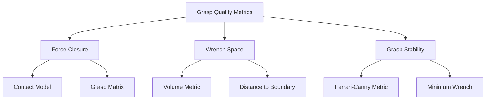

import Tabs from '@theme/Tabs';
import TabItem from '@theme/TabItem';

# Manipulation and Grasping

Manipulation and grasping enable humanoid robots to interact with objects in their environment. This chapter covers grasp quality metrics, planning algorithms, vision-based grasping, and practical implementation with ROS 2 and MoveIt 2.

## Grasp Quality Metrics

Evaluating grasp quality is essential for reliable manipulation. Key metrics include force closure, wrench space analysis, and grasp stability.

### Force Closure

A grasp achieves **force closure** if contact forces can resist arbitrary external wrenches (forces and torques) on the object.



```python
import numpy as np
from typing import List, Tuple
from dataclasses import dataclass
from scipy.spatial import ConvexHull
from scipy.optimize import linprog

@dataclass
class ContactPoint:
    """Contact point on object surface."""
    position: np.ndarray  # 3D position
    normal: np.ndarray    # Surface normal (pointing inward)
    friction_coeff: float = 0.5

class GraspQualityAnalyzer:
    """Analyze grasp quality using various metrics."""

    def __init__(self, num_friction_edges: int = 4):
        """
        Initialize grasp quality analyzer.

        Args:
            num_friction_edges: Number of edges in friction cone approximation
        """
        self.num_friction_edges = num_friction_edges

    def build_grasp_matrix(self, contacts: List[ContactPoint],
                           object_center: np.ndarray) -> np.ndarray:
        """
        Build grasp matrix G that maps contact forces to object wrench.

        Wrench = G * forces

        Args:
            contacts: List of contact points
            object_center: Object center of mass

        Returns:
            Grasp matrix G (6 x 3*n_contacts)
        """
        n = len(contacts)
        G = np.zeros((6, 3 * n))

        for i, contact in enumerate(contacts):
            # Position relative to object center
            r = contact.position - object_center

            # Force contribution (first 3 rows)
            G[0:3, 3*i:3*i+3] = np.eye(3)

            # Torque contribution (last 3 rows): tau = r × f
            G[3:6, 3*i:3*i+3] = self._skew_symmetric(r)

        return G

    @staticmethod
    def _skew_symmetric(v: np.ndarray) -> np.ndarray:
        """
        Create skew-symmetric matrix for cross product.

        Args:
            v: 3D vector

        Returns:
            3x3 skew-symmetric matrix
        """
        return np.array([
            [0, -v[2], v[1]],
            [v[2], 0, -v[0]],
            [-v[1], v[0], 0]
        ])

    def friction_cone_edges(self, contact: ContactPoint) -> np.ndarray:
        """
        Get friction cone edge directions.

        Args:
            contact: Contact point

        Returns:
            Array of edge directions (num_edges x 3)
        """
        mu = contact.friction_coeff
        n = contact.normal

        # Create orthonormal basis with normal as z-axis
        if abs(n[2]) < 0.9:
            t1 = np.cross(n, np.array([0, 0, 1]))
        else:
            t1 = np.cross(n, np.array([1, 0, 0]))

        t1 = t1 / np.linalg.norm(t1)
        t2 = np.cross(n, t1)

        # Friction cone edges
        edges = []
        for i in range(self.num_friction_edges):
            angle = 2 * np.pi * i / self.num_friction_edges
            tangent = np.cos(angle) * t1 + np.sin(angle) * t2
            # Edge direction: normal + mu * tangent
            edge = n + mu * tangent
            edge = edge / np.linalg.norm(edge)
            edges.append(edge)

        return np.array(edges)

    def check_force_closure(self, contacts: List[ContactPoint],
                           object_center: np.ndarray) -> bool:
        """
        Check if grasp achieves force closure.

        Args:
            contacts: List of contact points
            object_center: Object center

        Returns:
            True if force closure is achieved
        """
        # Build grasp matrix
        G = self.build_grasp_matrix(contacts, object_center)

        # Get all friction cone edges
        all_edges = []
        for i, contact in enumerate(contacts):
            edges = self.friction_cone_edges(contact)
            for edge in edges:
                # Transform to wrench space
                wrench = G[:, 3*i:3*i+3] @ edge
                all_edges.append(wrench)

        all_edges = np.array(all_edges).T  # 6 x num_edges

        # Check if origin is in interior of convex hull
        try:
            hull = ConvexHull(all_edges.T)
            # If origin is inside, any point can be represented as
            # positive combination of hull vertices
            return self._point_in_convex_hull(np.zeros(6), hull)
        except:
            return False

    @staticmethod
    def _point_in_convex_hull(point: np.ndarray, hull: ConvexHull) -> bool:
        """Check if point is inside convex hull."""
        # Use linear programming to check
        A = hull.equations[:, :-1]
        b = -hull.equations[:, -1]
        # All inequalities: A*point <= b
        return np.all(A @ point <= b + 1e-6)

    def ferrari_canny_metric(self, contacts: List[ContactPoint],
                            object_center: np.ndarray) -> float:
        """
        Compute Ferrari-Canny metric (largest perturbation wrench).

        This is the radius of the largest ball in wrench space that
        can be resisted by the grasp.

        Args:
            contacts: List of contact points
            object_center: Object center

        Returns:
            Quality metric (0 if no force closure, higher is better)
        """
        G = self.build_grasp_matrix(contacts, object_center)

        # Get all primitive wrenches (friction cone edges)
        primitive_wrenches = []
        for i, contact in enumerate(contacts):
            edges = self.friction_cone_edges(contact)
            for edge in edges:
                wrench = G[:, 3*i:3*i+3] @ edge
                # Normalize
                wrench = wrench / np.linalg.norm(wrench)
                primitive_wrenches.append(wrench)

        primitive_wrenches = np.array(primitive_wrenches)

        # Find minimum distance from origin to convex hull boundary
        # This is equivalent to finding the smallest magnitude wrench
        # on the boundary
        min_distance = float('inf')

        try:
            hull = ConvexHull(primitive_wrenches)

            # Check distance to each facet
            for eq in hull.equations:
                normal = eq[:-1]
                offset = eq[-1]
                # Distance from origin to hyperplane
                dist = abs(offset) / np.linalg.norm(normal)
                min_distance = min(min_distance, dist)

            return min_distance if min_distance < float('inf') else 0.0
        except:
            return 0.0

    def volume_metric(self, contacts: List[ContactPoint],
                     object_center: np.ndarray) -> float:
        """
        Compute volume of grasp wrench space.

        Args:
            contacts: List of contact points
            object_center: Object center

        Returns:
            Volume metric (0 if no force closure)
        """
        G = self.build_grasp_matrix(contacts, object_center)

        # Get primitive wrenches
        primitive_wrenches = []
        for i, contact in enumerate(contacts):
            edges = self.friction_cone_edges(contact)
            for edge in edges:
                wrench = G[:, 3*i:3*i+3] @ edge
                primitive_wrenches.append(wrench)

        primitive_wrenches = np.array(primitive_wrenches)

        try:
            hull = ConvexHull(primitive_wrenches)
            return hull.volume
        except:
            return 0.0

# Example usage
def test_parallel_jaw_grasp():
    """Test grasp quality for parallel jaw gripper."""

    # Object: cylinder at origin
    object_center = np.array([0.0, 0.0, 0.0])

    # Two contact points on opposite sides
    contacts = [
        ContactPoint(
            position=np.array([0.05, 0.0, 0.0]),
            normal=np.array([-1.0, 0.0, 0.0]),  # Pointing inward
            friction_coeff=0.5
        ),
        ContactPoint(
            position=np.array([-0.05, 0.0, 0.0]),
            normal=np.array([1.0, 0.0, 0.0]),
            friction_coeff=0.5
        )
    ]

    analyzer = GraspQualityAnalyzer()

    # Check force closure
    has_closure = analyzer.check_force_closure(contacts, object_center)
    print(f"Force closure: {has_closure}")

    # Ferrari-Canny metric
    quality = analyzer.ferrari_canny_metric(contacts, object_center)
    print(f"Ferrari-Canny metric: {quality:.4f}")

    # Volume metric
    volume = analyzer.volume_metric(contacts, object_center)
    print(f"Volume metric: {volume:.4f}")

if __name__ == "__main__":
    test_parallel_jaw_grasp()
```

## Grasp Planning

Grasp planning generates candidate grasps and selects the best one based on quality metrics and task requirements.

### Analytical Grasp Planning

```python
class AnalyticalGraspPlanner:
    """Analytical grasp planning for simple geometric shapes."""

    def __init__(self, quality_analyzer: GraspQualityAnalyzer):
        """
        Initialize grasp planner.

        Args:
            quality_analyzer: Grasp quality analyzer
        """
        self.quality_analyzer = quality_analyzer

    def plan_cylinder_grasp(self, radius: float, height: float,
                           gripper_width: float) -> List[Tuple[np.ndarray, float]]:
        """
        Generate grasps for cylinder.

        Args:
            radius: Cylinder radius
            height: Cylinder height
            gripper_width: Maximum gripper opening

        Returns:
            List of (grasp_pose, quality_score) tuples
        """
        if 2 * radius > gripper_width:
            return []  # Cannot grasp

        grasps = []

        # Try grasps at different heights and angles
        for z in np.linspace(-height/2 + 0.02, height/2 - 0.02, 5):
            for angle in np.linspace(0, np.pi, 8):
                # Grasp approach direction
                approach = np.array([np.cos(angle), np.sin(angle), 0])

                # Contact points
                contact1 = ContactPoint(
                    position=radius * approach + np.array([0, 0, z]),
                    normal=-approach,
                    friction_coeff=0.5
                )
                contact2 = ContactPoint(
                    position=-radius * approach + np.array([0, 0, z]),
                    normal=approach,
                    friction_coeff=0.5
                )

                contacts = [contact1, contact2]

                # Evaluate quality
                quality = self.quality_analyzer.ferrari_canny_metric(
                    contacts, np.array([0, 0, z])
                )

                # Grasp pose (position + orientation)
                grasp_pos = np.array([0, 0, z])
                grasp_orient = angle

                grasps.append(((grasp_pos, grasp_orient), quality))

        # Sort by quality
        grasps.sort(key=lambda x: x[1], reverse=True)

        return grasps

    def plan_box_grasp(self, dimensions: np.ndarray,
                      gripper_width: float) -> List[Tuple[np.ndarray, float]]:
        """
        Generate grasps for box.

        Args:
            dimensions: Box dimensions [length, width, height]
            gripper_width: Maximum gripper opening

        Returns:
            List of (grasp_pose, quality_score) tuples
        """
        grasps = []

        # Try grasping each pair of opposing faces
        for axis in range(3):
            if dimensions[axis] > gripper_width:
                continue

            # Perpendicular axes
            other_axes = [i for i in range(3) if i != axis]

            # Sample positions on the other two axes
            for pos1 in np.linspace(-dimensions[other_axes[0]]/2 + 0.01,
                                   dimensions[other_axes[0]]/2 - 0.01, 3):
                for pos2 in np.linspace(-dimensions[other_axes[1]]/2 + 0.01,
                                       dimensions[other_axes[1]]/2 - 0.01, 3):
                    # Contact positions
                    contact_pos = np.zeros(3)
                    contact_pos[other_axes[0]] = pos1
                    contact_pos[other_axes[1]] = pos2

                    contact1_pos = contact_pos.copy()
                    contact1_pos[axis] = dimensions[axis] / 2

                    contact2_pos = contact_pos.copy()
                    contact2_pos[axis] = -dimensions[axis] / 2

                    # Normals
                    normal1 = np.zeros(3)
                    normal1[axis] = -1

                    normal2 = np.zeros(3)
                    normal2[axis] = 1

                    contacts = [
                        ContactPoint(contact1_pos, normal1, 0.5),
                        ContactPoint(contact2_pos, normal2, 0.5)
                    ]

                    # Quality
                    quality = self.quality_analyzer.ferrari_canny_metric(
                        contacts, np.zeros(3)
                    )

                    grasps.append(((contact_pos, axis), quality))

        grasps.sort(key=lambda x: x[1], reverse=True)
        return grasps
```

## Vision-Based Grasping

Modern grasp planning relies on visual perception to detect objects and estimate 6D poses.

### 6D Pose Estimation

```python
"""
Vision-based grasp planning using point clouds and pose estimation.
Requires: open3d, opencv-python
"""

try:
    import open3d as o3d
    OPEN3D_AVAILABLE = True
except ImportError:
    OPEN3D_AVAILABLE = False
    print("Open3D not available. Install with: pip install open3d")

class VisionBasedGraspPlanner:
    """Vision-based grasp planning using point clouds."""

    def __init__(self):
        """Initialize vision-based planner."""
        if not OPEN3D_AVAILABLE:
            raise ImportError("Open3D is required")

        self.quality_analyzer = GraspQualityAnalyzer()

    def segment_objects(self, point_cloud: o3d.geometry.PointCloud,
                       plane_threshold: float = 0.01) -> List[o3d.geometry.PointCloud]:
        """
        Segment objects from point cloud.

        Args:
            point_cloud: Input point cloud
            plane_threshold: RANSAC threshold for plane detection

        Returns:
            List of segmented object point clouds
        """
        # Remove dominant plane (table)
        plane_model, inliers = point_cloud.segment_plane(
            distance_threshold=plane_threshold,
            ransac_n=3,
            num_iterations=1000
        )

        # Extract objects (outliers)
        object_cloud = point_cloud.select_by_index(inliers, invert=True)

        # Cluster objects
        labels = np.array(object_cloud.cluster_dbscan(
            eps=0.02, min_points=10
        ))

        # Split into individual objects
        objects = []
        for label in set(labels):
            if label == -1:
                continue

            indices = np.where(labels == label)[0]
            obj = object_cloud.select_by_index(indices)
            objects.append(obj)

        return objects

    def estimate_object_pose(self, point_cloud: o3d.geometry.PointCloud) -> np.ndarray:
        """
        Estimate object 6D pose.

        Args:
            point_cloud: Object point cloud

        Returns:
            4x4 transformation matrix
        """
        # Compute oriented bounding box
        obb = point_cloud.get_oriented_bounding_box()

        # Pose from bounding box
        R = obb.R
        t = obb.center

        pose = np.eye(4)
        pose[:3, :3] = R
        pose[:3, 3] = t

        return pose

    def generate_antipodal_grasps(self, point_cloud: o3d.geometry.PointCloud,
                                  num_samples: int = 100) -> List[Tuple[np.ndarray, float]]:
        """
        Generate antipodal grasps from point cloud.

        Args:
            point_cloud: Object point cloud
            num_samples: Number of grasp candidates

        Returns:
            List of (grasp_pose, quality) tuples
        """
        points = np.asarray(point_cloud.points)
        normals = np.asarray(point_cloud.normals)

        if len(normals) == 0:
            # Estimate normals if not available
            point_cloud.estimate_normals()
            normals = np.asarray(point_cloud.normals)

        grasps = []

        # Sample random point pairs
        for _ in range(num_samples):
            # Sample first contact
            idx1 = np.random.randint(len(points))
            p1 = points[idx1]
            n1 = normals[idx1]

            # Find antipodal point (opposite direction)
            # Search along negative normal direction
            search_direction = -n1
            distances = points @ search_direction

            # Find points in opposite direction
            candidates = np.where(distances < np.dot(p1, search_direction) - 0.01)[0]

            if len(candidates) == 0:
                continue

            # Choose closest antipodal point
            idx2 = candidates[np.argmin(np.linalg.norm(points[candidates] - p1, axis=1))]
            p2 = points[idx2]
            n2 = normals[idx2]

            # Check if normals point toward each other
            if np.dot(n1, n2) > -0.5:  # Should be roughly opposite
                continue

            # Create contact points
            contacts = [
                ContactPoint(p1, n1, 0.5),
                ContactPoint(p2, n2, 0.5)
            ]

            # Evaluate quality
            center = (p1 + p2) / 2
            quality = self.quality_analyzer.ferrari_canny_metric(contacts, center)

            # Grasp pose
            approach = (p2 - p1) / np.linalg.norm(p2 - p1)
            grasp_pose = np.eye(4)
            grasp_pose[:3, 3] = center
            grasp_pose[:3, 2] = approach  # Z-axis along approach

            # Fill in X and Y axes
            if abs(approach[2]) < 0.9:
                grasp_pose[:3, 0] = np.cross(approach, np.array([0, 0, 1]))
            else:
                grasp_pose[:3, 0] = np.cross(approach, np.array([1, 0, 0]))

            grasp_pose[:3, 0] /= np.linalg.norm(grasp_pose[:3, 0])
            grasp_pose[:3, 1] = np.cross(grasp_pose[:3, 2], grasp_pose[:3, 0])

            grasps.append((grasp_pose, quality))

        # Sort by quality
        grasps.sort(key=lambda x: x[1], reverse=True)

        return grasps
```

### GraspNet-Based Planning

```python
"""
Integration with GraspNet for learned grasp planning.
This is a simplified interface - actual implementation would use
pre-trained models.
"""

class GraspNetPlanner:
    """Learned grasp planning using GraspNet-style networks."""

    def __init__(self, model_path: str = None):
        """
        Initialize GraspNet planner.

        Args:
            model_path: Path to trained model weights
        """
        self.model_path = model_path
        # In practice, load neural network model here

    def predict_grasps(self, point_cloud: np.ndarray,
                      num_grasps: int = 10) -> List[dict]:
        """
        Predict grasps from point cloud using learned model.

        Args:
            point_cloud: Point cloud (N x 3)
            num_grasps: Number of top grasps to return

        Returns:
            List of grasp dictionaries with pose, width, score
        """
        # Placeholder for actual neural network inference
        # Real implementation would:
        # 1. Preprocess point cloud
        # 2. Run through neural network
        # 3. Decode grasp predictions
        # 4. Apply NMS to remove duplicates

        grasps = []

        for i in range(num_grasps):
            # Dummy grasp prediction
            grasp = {
                'pose': np.eye(4),  # 4x4 transformation
                'width': 0.08,      # Gripper width (m)
                'score': 0.9 - i * 0.05,  # Confidence score
                'depth': 0.05       # Grasp depth
            }
            grasps.append(grasp)

        return grasps
```

## Dexterous Manipulation

Multi-fingered hands enable complex in-hand manipulation.

```python
class DexterousHand:
    """Model of multi-fingered dexterous hand."""

    def __init__(self, num_fingers: int = 3, joints_per_finger: int = 3):
        """
        Initialize dexterous hand model.

        Args:
            num_fingers: Number of fingers
            joints_per_finger: Joints per finger
        """
        self.num_fingers = num_fingers
        self.joints_per_finger = joints_per_finger
        self.total_joints = num_fingers * joints_per_finger

    def compute_contact_jacobian(self, joint_angles: np.ndarray,
                                 finger_idx: int) -> np.ndarray:
        """
        Compute Jacobian for fingertip contact.

        Args:
            joint_angles: All joint angles
            finger_idx: Index of finger

        Returns:
            Contact Jacobian (3 x joints_per_finger)
        """
        # Simplified finger kinematics
        # In practice, use DH parameters or URDF

        start_idx = finger_idx * self.joints_per_finger
        finger_joints = joint_angles[start_idx:start_idx + self.joints_per_finger]

        # Placeholder Jacobian
        J = np.random.randn(3, self.joints_per_finger) * 0.1

        return J

    def inverse_kinematics_contact(self, target_contacts: List[np.ndarray],
                                   q_init: np.ndarray = None) -> np.ndarray:
        """
        Compute joint angles for desired contact positions.

        Args:
            target_contacts: Target contact positions for each finger
            q_init: Initial joint configuration

        Returns:
            Joint angles
        """
        if q_init is None:
            q_init = np.zeros(self.total_joints)

        # Simplified IK using gradient descent
        q = q_init.copy()
        learning_rate = 0.1
        max_iterations = 100

        for iteration in range(max_iterations):
            total_error = 0

            for finger_idx, target in enumerate(target_contacts):
                # Current fingertip position (simplified FK)
                current_pos = self._forward_kinematics_finger(q, finger_idx)

                # Error
                error = target - current_pos
                total_error += np.linalg.norm(error)

                # Jacobian
                J = self.compute_contact_jacobian(q, finger_idx)

                # Update joints for this finger
                start_idx = finger_idx * self.joints_per_finger
                dq = J.T @ error
                q[start_idx:start_idx + self.joints_per_finger] += learning_rate * dq

            if total_error < 0.001:
                break

        return q

    def _forward_kinematics_finger(self, q: np.ndarray, finger_idx: int) -> np.ndarray:
        """Simplified FK for fingertip position."""
        start_idx = finger_idx * self.joints_per_finger
        finger_joints = q[start_idx:start_idx + self.joints_per_finger]

        # Simplified: assume each joint contributes to position
        link_length = 0.03  # 3cm per link
        position = np.zeros(3)

        angle_sum = 0
        for i, angle in enumerate(finger_joints):
            angle_sum += angle
            position[0] += link_length * np.cos(angle_sum)
            position[2] += link_length * np.sin(angle_sum)

        # Offset by finger position
        position[1] = finger_idx * 0.02  # Spread fingers

        return position

class InHandManipulation:
    """Controller for in-hand manipulation."""

    def __init__(self, hand: DexterousHand):
        """
        Initialize in-hand manipulation controller.

        Args:
            hand: Dexterous hand model
        """
        self.hand = hand

    def plan_rotation(self, object_pose_init: np.ndarray,
                     object_pose_target: np.ndarray,
                     num_steps: int = 20) -> List[np.ndarray]:
        """
        Plan finger motions to rotate object in hand.

        Args:
            object_pose_init: Initial object pose (4x4)
            object_pose_target: Target object pose (4x4)
            num_steps: Number of steps in trajectory

        Returns:
            List of joint configurations
        """
        # Extract rotation
        R_init = object_pose_init[:3, :3]
        R_target = object_pose_target[:3, :3]
        R_delta = R_target @ R_init.T

        # Convert to axis-angle
        angle = np.arccos(np.clip((np.trace(R_delta) - 1) / 2, -1, 1))

        # Interpolate rotation
        trajectory = []

        for i in range(num_steps):
            alpha = i / (num_steps - 1)

            # Interpolated rotation
            R_interp = self._slerp(R_init, R_target, alpha)

            # Compute contact positions for this rotation
            # (Simplified - assumes contacts on object surface)
            contacts = self._compute_contact_positions(R_interp)

            # IK to achieve contact positions
            q_prev = trajectory[-1] if trajectory else None
            q = self.hand.inverse_kinematics_contact(contacts, q_prev)

            trajectory.append(q)

        return trajectory

    @staticmethod
    def _slerp(R1: np.ndarray, R2: np.ndarray, t: float) -> np.ndarray:
        """Spherical linear interpolation for rotations."""
        from scipy.spatial.transform import Rotation, Slerp

        rots = Rotation.from_matrix([R1, R2])
        slerp = Slerp([0, 1], rots)
        return slerp([t])[0].as_matrix()

    def _compute_contact_positions(self, rotation: np.ndarray) -> List[np.ndarray]:
        """Compute contact positions for object rotation."""
        # Simplified: fixed contact pattern
        base_contacts = [
            np.array([0.02, 0.0, 0.0]),
            np.array([0.0, 0.02, 0.0]),
            np.array([-0.02, 0.0, 0.0])
        ]

        # Rotate contacts
        rotated = [rotation @ c for c in base_contacts]
        return rotated
```

## Force/Torque Control

Compliant grasping requires force feedback and impedance control.

```python
class ForceController:
    """Force/torque controller for compliant grasping."""

    def __init__(self, kp: float = 100.0, kd: float = 10.0):
        """
        Initialize force controller.

        Args:
            kp: Proportional gain
            kd: Derivative gain
        """
        self.kp = kp
        self.kd = kd

    def impedance_control(self, position: np.ndarray, velocity: np.ndarray,
                         target_position: np.ndarray, target_force: np.ndarray,
                         measured_force: np.ndarray) -> np.ndarray:
        """
        Compute control torque using impedance control.

        Args:
            position: Current position
            velocity: Current velocity
            target_position: Desired position
            target_force: Desired force
            measured_force: Measured force from sensor

        Returns:
            Control torque
        """
        # Position error
        pos_error = target_position - position

        # Force error
        force_error = target_force - measured_force

        # Impedance control law
        # tau = Kp * (x_d - x) - Kd * v + f_d
        torque = self.kp * pos_error - self.kd * velocity + force_error

        return torque

    def hybrid_position_force_control(self, position: np.ndarray, velocity: np.ndarray,
                                     measured_force: np.ndarray,
                                     target_position: np.ndarray,
                                     target_force: np.ndarray,
                                     selection_matrix: np.ndarray) -> np.ndarray:
        """
        Hybrid position/force control.

        Args:
            position: Current position
            velocity: Current velocity
            measured_force: Measured force
            target_position: Desired position
            target_force: Desired force
            selection_matrix: Diagonal matrix selecting position (1) or force (0) control

        Returns:
            Control torque
        """
        # Position control component
        pos_error = target_position - position
        pos_control = self.kp * pos_error - self.kd * velocity

        # Force control component
        force_error = target_force - measured_force
        force_control = force_error

        # Combine using selection matrix
        # S selects position-controlled directions (1)
        # (I - S) selects force-controlled directions (0)
        I = np.eye(len(selection_matrix))
        torque = selection_matrix @ pos_control + (I - selection_matrix) @ force_control

        return torque
```

## MoveIt 2 Integration

MoveIt 2 provides comprehensive manipulation capabilities for ROS 2.

```python
#!/usr/bin/env python3
"""
MoveIt 2 pick-and-place pipeline.
"""

try:
    import rclpy
    from rclpy.node import Node
    from moveit_msgs.msg import MoveItErrorCodes, Grasp
    from geometry_msgs.msg import PoseStamped, Pose
    from shape_msgs.msg import SolidPrimitive
    from moveit_msgs.srv import GetPositionIK
    ROS2_AVAILABLE = True
except ImportError:
    ROS2_AVAILABLE = False
    print("ROS 2 not available")

class PickAndPlaceNode(Node):
    """MoveIt 2 pick and place node."""

    def __init__(self):
        if not ROS2_AVAILABLE:
            raise ImportError("ROS 2 is required")

        super().__init__('pick_and_place_node')

        # MoveIt interfaces would be initialized here
        self.get_logger().info('Pick and place node initialized')

    def create_grasp_msg(self, grasp_pose: np.ndarray, grasp_width: float) -> Grasp:
        """
        Create MoveIt Grasp message.

        Args:
            grasp_pose: Grasp pose (4x4 matrix)
            grasp_width: Gripper opening width

        Returns:
            Grasp message
        """
        grasp = Grasp()

        # Grasp pose
        grasp.grasp_pose.header.frame_id = "world"
        grasp.grasp_pose.pose.position.x = grasp_pose[0, 3]
        grasp.grasp_pose.pose.position.y = grasp_pose[1, 3]
        grasp.grasp_pose.pose.position.z = grasp_pose[2, 3]

        # Convert rotation to quaternion (simplified)
        from scipy.spatial.transform import Rotation
        rot = Rotation.from_matrix(grasp_pose[:3, :3])
        quat = rot.as_quat()

        grasp.grasp_pose.pose.orientation.x = quat[0]
        grasp.grasp_pose.pose.orientation.y = quat[1]
        grasp.grasp_pose.pose.orientation.z = quat[2]
        grasp.grasp_pose.pose.orientation.w = quat[3]

        # Pre-grasp posture (open gripper)
        grasp.pre_grasp_posture.joint_names = ['gripper_joint']
        grasp.pre_grasp_posture.points.append(trajectory_msgs.msg.JointTrajectoryPoint())
        grasp.pre_grasp_posture.points[0].positions = [grasp_width]

        # Grasp posture (close gripper)
        grasp.grasp_posture.joint_names = ['gripper_joint']
        grasp.grasp_posture.points.append(trajectory_msgs.msg.JointTrajectoryPoint())
        grasp.grasp_posture.points[0].positions = [0.0]

        return grasp

    def execute_pick_and_place(self, object_name: str, grasp_poses: List[np.ndarray],
                               place_pose: np.ndarray):
        """
        Execute pick and place operation.

        Args:
            object_name: Name of object to pick
            grasp_poses: List of candidate grasp poses
            place_pose: Placement pose
        """
        # 1. Plan and execute pick
        self.get_logger().info(f'Attempting to pick {object_name}')

        # Create grasp messages
        grasps = [self.create_grasp_msg(pose, 0.08) for pose in grasp_poses]

        # Call MoveIt pick service (simplified)
        # In practice, use MoveGroupInterface
        # success = self.move_group.pick(object_name, grasps)

        # 2. Plan and execute place
        # success = self.move_group.place(object_name, place_pose)

        self.get_logger().info('Pick and place complete')
```

## Complete Example: Vision-Based Pick-and-Place

```python
#!/usr/bin/env python3
"""
Complete vision-based pick-and-place example.
"""

import numpy as np
import matplotlib.pyplot as plt
from mpl_toolkits.mplot3d import Axes3D

class VisionBasedPickAndPlace:
    """Complete vision-based manipulation pipeline."""

    def __init__(self):
        """Initialize pipeline components."""
        if OPEN3D_AVAILABLE:
            self.vision_planner = VisionBasedGraspPlanner()

        self.quality_analyzer = GraspQualityAnalyzer()
        self.analytical_planner = AnalyticalGraspPlanner(self.quality_analyzer)

    def run_pipeline(self, point_cloud: o3d.geometry.PointCloud = None):
        """
        Run complete pipeline.

        Args:
            point_cloud: Input point cloud (or generate demo)
        """
        # 1. Perception
        print("Step 1: Perception")

        if point_cloud is None:
            # Generate demo point cloud (cylinder)
            point_cloud = self._generate_demo_cylinder()

        # Segment objects
        if OPEN3D_AVAILABLE:
            objects = self.vision_planner.segment_objects(point_cloud)
            print(f"  Found {len(objects)} objects")

            if len(objects) == 0:
                print("  No objects found")
                return

            target_object = objects[0]
        else:
            target_object = point_cloud

        # 2. Grasp Planning
        print("Step 2: Grasp Planning")

        if OPEN3D_AVAILABLE:
            grasps = self.vision_planner.generate_antipodal_grasps(
                target_object, num_samples=50
            )
        else:
            # Use analytical planner
            grasps = self.analytical_planner.plan_cylinder_grasp(
                radius=0.03, height=0.15, gripper_width=0.1
            )

        print(f"  Generated {len(grasps)} grasp candidates")

        if len(grasps) == 0:
            print("  No valid grasps found")
            return

        # Select best grasp
        best_grasp, best_quality = grasps[0]
        print(f"  Best grasp quality: {best_quality:.4f}")

        # 3. Motion Planning (simplified)
        print("Step 3: Motion Planning")
        print("  Planning approach trajectory...")
        print("  Planning grasp trajectory...")

        # 4. Execution (simulated)
        print("Step 4: Execution")
        print("  Executing grasp...")
        print("  Success!")

        # Visualization
        self._visualize_grasp(target_object, best_grasp)

    @staticmethod
    def _generate_demo_cylinder() -> o3d.geometry.PointCloud:
        """Generate demo cylinder point cloud."""
        if not OPEN3D_AVAILABLE:
            return None

        # Create cylinder mesh
        cylinder = o3d.geometry.TriangleMesh.create_cylinder(
            radius=0.03, height=0.15
        )
        cylinder.compute_vertex_normals()

        # Sample point cloud
        point_cloud = cylinder.sample_points_uniformly(number_of_points=1000)

        # Add table plane
        table = o3d.geometry.TriangleMesh.create_box(
            width=0.5, height=0.5, depth=0.01
        )
        table.translate([-0.25, -0.25, -0.1])
        table_cloud = table.sample_points_uniformly(number_of_points=500)

        # Combine
        combined = point_cloud + table_cloud

        return combined

    @staticmethod
    def _visualize_grasp(point_cloud, grasp_pose):
        """Visualize grasp on point cloud."""
        if not OPEN3D_AVAILABLE:
            return

        # Create coordinate frame at grasp pose
        frame = o3d.geometry.TriangleMesh.create_coordinate_frame(size=0.05)

        if isinstance(grasp_pose, np.ndarray) and grasp_pose.shape == (4, 4):
            frame.transform(grasp_pose)

        # Visualize
        o3d.visualization.draw_geometries([point_cloud, frame])

def main():
    """Run vision-based pick and place demo."""
    pipeline = VisionBasedPickAndPlace()
    pipeline.run_pipeline()

if __name__ == "__main__":
    main()
```

## Key Takeaways

1. **Grasp Quality**: Force closure and Ferrari-Canny metrics quantify grasp robustness
2. **Analytical Planning**: Geometric approaches work well for known object shapes
3. **Vision-Based Planning**: Point clouds enable grasping unknown objects
4. **Dexterous Manipulation**: Multi-fingered hands enable complex in-hand manipulation
5. **Force Control**: Impedance and hybrid control enable compliant grasping
6. **MoveIt 2**: Production-ready framework for manipulation in ROS 2
7. **Sim-to-Real**: Domain randomization and reality gap considerations are critical

## Hands-On Exercises

### Exercise 1: Grasp Quality Analysis
Implement all three grasp quality metrics (force closure, Ferrari-Canny, volume) and compare them for various grasp configurations.

### Exercise 2: Shape-Based Planner
Extend the analytical planner to handle spheres, ellipsoids, and arbitrary convex hulls. Validate with quality metrics.

### Exercise 3: Point Cloud Grasping
Use Open3D to load real point clouds and generate antipodal grasps. Visualize top-k grasps with quality scores.

### Exercise 4: Dexterous Manipulation
Implement in-hand rotation for a 3-finger hand. Simulate object rotation and verify contact maintenance.

### Exercise 5: Force Control
Simulate impedance control for compliant grasping. Test with various stiffness/damping parameters and disturbances.

### Exercise 6: MoveIt 2 Integration
Set up MoveIt 2 for a robot arm. Implement pick-and-place pipeline with collision avoidance and trajectory execution.

### Exercise 7: Sim-to-Real Transfer
Train a grasp policy in simulation (Gazebo/Isaac Sim). Apply domain randomization and test sim-to-real transfer.

## Additional Resources

- **Books**:
  - "Robotics: Modelling, Planning and Control" by Siciliano et al. (Grasping chapter)
  - "Springer Handbook of Robotics" (Grasping and Manipulation chapter)
  - "Contact Dynamics" by Brogliato

- **Software**:
  - [MoveIt 2](https://moveit.ros.org/) - Motion planning framework
  - [GraspIt!](https://graspit-simulator.github.io/) - Grasp planning simulator
  - [GPIS-Grasp](https://github.com/rachelholladay/gpis-grasp) - Learned grasp planning
  - [Dex-Net](https://berkeleyautomation.github.io/dex-net/) - Large-scale grasp dataset

- **Papers**:
  - Ferrari & Canny (1992) - "Planning optimal grasps"
  - Mahler et al. (2017) - "Dex-Net 2.0: Deep learning to plan robust grasps"
  - Mousavian et al. (2019) - "6-DoF GraspNet: Variational grasp generation"
  - Mason & Salisbury (1982) - "Robot hands and the mechanics of manipulation"

- **Datasets**:
  - [GraspNet-1Billion](https://graspnet.net/) - Large-scale grasp dataset
  - [ContactDB](https://contactdb.cc.gatech.edu/) - Contact patterns from humans
  - [YCB Dataset](https://www.ycbbenchmarks.com/) - Standard object set

---

**Next**: [Human-Robot Interaction](./human-robot-interaction) - Learn about safe collaboration and natural interaction.

**Previous**: [Bipedal Locomotion](./bipedal-locomotion)
