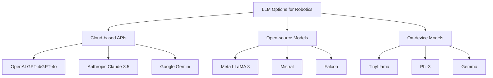

# GPT Integration for Robotics

Large Language Models (LLMs) are revolutionizing how robots understand and execute natural language commands. This guide explores integrating GPT-4, Claude, and other LLMs with ROS 2 to create conversational robots capable of task planning, reasoning, and adaptive behavior.

## Large Language Models for Robotics

### Why LLMs for Robotics?

LLMs bring several capabilities to robotics:

- **Natural Language Understanding**: Parse complex, ambiguous commands
- **Task Planning**: Break down high-level goals into executable steps
- **Common-sense Reasoning**: Apply world knowledge to robotic tasks
- **Adaptability**: Handle novel situations without explicit programming
- **Human-Robot Interaction**: Enable natural conversations with users

### Popular LLM Options



**Model Selection Criteria**:

| Model | Latency | Cost | Reasoning Quality | Privacy | Use Case |
|-------|---------|------|-------------------|---------|----------|
| GPT-4o | ~500ms | $$$ | Excellent | Cloud | Complex planning |
| Claude 3.5 | ~600ms | $$$ | Excellent | Cloud | Safety-critical |
| LLaMA 3 70B | ~2s | Free | Very Good | On-prem | Custom domains |
| Phi-3 | ~100ms | Free | Good | Edge | Real-time responses |

## OpenAI API Integration with ROS 2

### Setup and Installation

First, install the required dependencies:

```bash
# Install OpenAI Python client
pip3 install openai

# Install ROS 2 dependencies
sudo apt install ros-humble-rclpy python3-yaml

# Set your API key
export OPENAI_API_KEY='your-api-key-here'
```

### Basic ROS 2 LLM Service Node

Create a ROS 2 node that provides LLM inference as a service:

```python
# llm_service_node.py
import rclpy
from rclpy.node import Node
from std_msgs.msg import String
from robot_interfaces.srv import LLMQuery
import openai
import os
import json


class LLMServiceNode(Node):
    """ROS 2 node providing LLM inference services."""

    def __init__(self):
        super().__init__('llm_service_node')

        # Initialize OpenAI client
        self.client = openai.OpenAI(
            api_key=os.getenv('OPENAI_API_KEY')
        )

        # Service for LLM queries
        self.service = self.create_service(
            LLMQuery,
            'llm_query',
            self.handle_query
        )

        # Publisher for streamed responses
        self.response_pub = self.create_publisher(
            String,
            'llm_response_stream',
            10
        )

        # System prompt for robot context
        self.system_prompt = """You are an AI assistant for a humanoid robot.
You can help with:
- Understanding natural language commands
- Planning sequences of actions
- Answering questions about the environment
- Explaining your reasoning

Available robot capabilities:
- move_to(x, y, z): Move to a position
- grasp_object(object_id): Pick up an object
- place_object(x, y, z): Place held object
- navigate_to(location): Navigate to named location
- speak(text): Say something to the user
- get_camera_feed(): Get visual information
- detect_objects(): Detect nearby objects

Always respond with clear, concise instructions."""

        self.conversation_history = []

        self.get_logger().info('LLM Service Node initialized')

    def handle_query(self, request, response):
        """Handle incoming LLM query requests."""
        try:
            # Add user message to history
            self.conversation_history.append({
                "role": "user",
                "content": request.query
            })

            # Keep last 10 messages for context
            if len(self.conversation_history) > 10:
                self.conversation_history = self.conversation_history[-10:]

            # Call OpenAI API
            completion = self.client.chat.completions.create(
                model="gpt-4o",
                messages=[
                    {"role": "system", "content": self.system_prompt}
                ] + self.conversation_history,
                temperature=0.7,
                max_tokens=500
            )

            # Extract response
            assistant_message = completion.choices[0].message.content

            # Add to history
            self.conversation_history.append({
                "role": "assistant",
                "content": assistant_message
            })

            # Set response
            response.response = assistant_message
            response.success = True

            self.get_logger().info(f'Query: {request.query}')
            self.get_logger().info(f'Response: {assistant_message}')

            return response

        except Exception as e:
            self.get_logger().error(f'LLM query failed: {str(e)}')
            response.response = f"Error: {str(e)}"
            response.success = False
            return response

    def clear_history(self):
        """Clear conversation history."""
        self.conversation_history = []


def main(args=None):
    rclpy.init(args=args)
    node = LLMServiceNode()

    try:
        rclpy.spin(node)
    except KeyboardInterrupt:
        pass
    finally:
        node.destroy_node()
        rclpy.shutdown()


if __name__ == '__main__':
    main()
```

### Service Definition

Define the custom service message:

```python
# robot_interfaces/srv/LLMQuery.srv
string query
---
string response
bool success
```

## Prompt Engineering for Robot Task Planning

### Effective Prompt Structure

```python
class RobotPromptBuilder:
    """Build effective prompts for robot task planning."""

    @staticmethod
    def build_task_planning_prompt(user_command, robot_state, environment):
        """Create a structured prompt for task planning."""

        prompt = f"""# Task Planning Request

## User Command
{user_command}

## Current Robot State
- Position: ({robot_state['x']:.2f}, {robot_state['y']:.2f}, {robot_state['z']:.2f})
- Holding object: {robot_state.get('held_object', 'None')}
- Battery level: {robot_state['battery']}%
- Current location: {robot_state['location']}

## Environment Information
- Detected objects: {', '.join(environment['objects'])}
- Known locations: {', '.join(environment['locations'])}
- Obstacles: {', '.join(environment['obstacles'])}

## Instructions
1. Analyze the user command
2. Check if it's feasible given current state and environment
3. Break down into step-by-step actions using available robot functions
4. Consider safety and efficiency
5. Respond in JSON format with this structure:

{{
  "understood": true/false,
  "plan": [
    {{"action": "function_name", "params": {{}}, "reasoning": "why this step"}},
    ...
  ],
  "estimated_time": "time in seconds",
  "risks": ["potential risk 1", ...],
  "clarifications_needed": ["question 1", ...]
}}

If the command is unclear or impossible, explain why in the clarifications_needed field."""

        return prompt


# Example usage
robot_state = {
    'x': 1.5, 'y': 2.0, 'z': 0.0,
    'battery': 75,
    'location': 'kitchen',
    'held_object': None
}

environment = {
    'objects': ['red cup', 'blue bottle', 'apple', 'plate'],
    'locations': ['kitchen', 'living room', 'bedroom', 'dining room'],
    'obstacles': ['chair', 'table']
}

prompt = RobotPromptBuilder.build_task_planning_prompt(
    "Bring me the red cup from the kitchen table",
    robot_state,
    environment
)
```

### Chain-of-Thought Prompting

Enable step-by-step reasoning:

```python
def chain_of_thought_prompt(task):
    """Use chain-of-thought prompting for complex reasoning."""

    return f"""Think step by step to solve this robotics task:

Task: {task}

Let's break this down:

1. UNDERSTANDING: What is the user asking for?
   - Identify the goal
   - Identify the target objects
   - Identify constraints

2. PERCEPTION: What do I need to sense?
   - Visual information needed
   - Spatial information needed
   - Object properties to verify

3. PLANNING: What actions are needed?
   - List prerequisite actions
   - Sequence main actions
   - Plan error recovery

4. VALIDATION: Can this plan work?
   - Check physical constraints
   - Check safety requirements
   - Estimate success probability

5. EXECUTION PLAN: Final action sequence
   - Provide concrete function calls
   - Include verification steps
   - Specify success criteria

Think through each step carefully before providing the final plan."""
```

## Function Calling for Robot Actions

### Defining Robot Functions

Define available robot capabilities as OpenAI function schemas:

```python
ROBOT_FUNCTIONS = [
    {
        "name": "move_to_position",
        "description": "Move the robot to a specific 3D position in the workspace",
        "parameters": {
            "type": "object",
            "properties": {
                "x": {
                    "type": "number",
                    "description": "X coordinate in meters"
                },
                "y": {
                    "type": "number",
                    "description": "Y coordinate in meters"
                },
                "z": {
                    "type": "number",
                    "description": "Z coordinate in meters"
                },
                "speed": {
                    "type": "string",
                    "enum": ["slow", "normal", "fast"],
                    "description": "Movement speed"
                }
            },
            "required": ["x", "y", "z"]
        }
    },
    {
        "name": "grasp_object",
        "description": "Grasp an object with the robot gripper",
        "parameters": {
            "type": "object",
            "properties": {
                "object_name": {
                    "type": "string",
                    "description": "Name or description of the object to grasp"
                },
                "grasp_type": {
                    "type": "string",
                    "enum": ["precision", "power", "pinch"],
                    "description": "Type of grasp to use"
                },
                "force": {
                    "type": "number",
                    "description": "Gripping force in Newtons (0.5-20)",
                    "minimum": 0.5,
                    "maximum": 20
                }
            },
            "required": ["object_name"]
        }
    },
    {
        "name": "navigate_to_location",
        "description": "Navigate to a named location in the environment",
        "parameters": {
            "type": "object",
            "properties": {
                "location": {
                    "type": "string",
                    "description": "Name of the location (e.g., 'kitchen', 'bedroom')"
                },
                "avoid_obstacles": {
                    "type": "boolean",
                    "description": "Whether to use obstacle avoidance"
                }
            },
            "required": ["location"]
        }
    },
    {
        "name": "detect_objects",
        "description": "Detect and identify objects in the current field of view",
        "parameters": {
            "type": "object",
            "properties": {
                "object_types": {
                    "type": "array",
                    "items": {"type": "string"},
                    "description": "Specific object types to look for (empty for all)"
                },
                "confidence_threshold": {
                    "type": "number",
                    "description": "Minimum detection confidence (0-1)",
                    "minimum": 0,
                    "maximum": 1
                }
            }
        }
    },
    {
        "name": "speak",
        "description": "Make the robot speak text using text-to-speech",
        "parameters": {
            "type": "object",
            "properties": {
                "text": {
                    "type": "string",
                    "description": "Text to speak"
                },
                "emotion": {
                    "type": "string",
                    "enum": ["neutral", "happy", "concerned", "excited"],
                    "description": "Emotional tone for speech"
                }
            },
            "required": ["text"]
        }
    }
]
```

### Function Calling Implementation

```python
class RobotFunctionExecutor(Node):
    """Execute robot functions called by LLM."""

    def __init__(self):
        super().__init__('robot_function_executor')

        self.client = openai.OpenAI()

        # ROS 2 action clients for robot control
        self.move_client = ActionClient(self, MoveToPosition, 'move_to_position')
        self.grasp_client = ActionClient(self, Grasp, 'grasp_object')
        self.nav_client = ActionClient(self, NavigateToLocation, 'navigate')

        # Publishers
        self.speech_pub = self.create_publisher(String, 'speech_output', 10)

        # Subscribers
        self.objects_sub = self.create_subscription(
            DetectedObjects,
            'detected_objects',
            self.objects_callback,
            10
        )

        self.detected_objects = []

    def process_command(self, user_input):
        """Process natural language command using function calling."""

        messages = [
            {
                "role": "system",
                "content": "You are a helpful robot assistant. Use the available functions to help the user."
            },
            {
                "role": "user",
                "content": user_input
            }
        ]

        # Call LLM with function definitions
        response = self.client.chat.completions.create(
            model="gpt-4o",
            messages=messages,
            functions=ROBOT_FUNCTIONS,
            function_call="auto",
            temperature=0
        )

        message = response.choices[0].message

        # Check if LLM wants to call a function
        if message.function_call:
            function_name = message.function_call.name
            function_args = json.loads(message.function_call.arguments)

            self.get_logger().info(f'Calling function: {function_name}')
            self.get_logger().info(f'Arguments: {function_args}')

            # Execute the function
            result = self.execute_function(function_name, function_args)

            # Send result back to LLM
            messages.append(message)
            messages.append({
                "role": "function",
                "name": function_name,
                "content": json.dumps(result)
            })

            # Get final response
            second_response = self.client.chat.completions.create(
                model="gpt-4o",
                messages=messages
            )

            return second_response.choices[0].message.content

        else:
            return message.content

    def execute_function(self, name, args):
        """Execute a robot function and return result."""

        if name == "move_to_position":
            return self.execute_move(args)
        elif name == "grasp_object":
            return self.execute_grasp(args)
        elif name == "navigate_to_location":
            return self.execute_navigation(args)
        elif name == "detect_objects":
            return self.execute_detection(args)
        elif name == "speak":
            return self.execute_speech(args)
        else:
            return {"error": f"Unknown function: {name}"}

    def execute_move(self, args):
        """Execute movement to position."""
        goal = MoveToPosition.Goal()
        goal.x = args['x']
        goal.y = args['y']
        goal.z = args['z']
        goal.speed = args.get('speed', 'normal')

        self.move_client.wait_for_server()
        future = self.move_client.send_goal_async(goal)

        rclpy.spin_until_future_complete(self, future)

        if future.result().accepted:
            return {
                "success": True,
                "message": f"Moving to ({args['x']}, {args['y']}, {args['z']})"
            }
        else:
            return {"success": False, "error": "Movement rejected"}

    def execute_grasp(self, args):
        """Execute object grasping."""
        # Implementation would send goal to grasp action server
        return {
            "success": True,
            "message": f"Grasping {args['object_name']}"
        }

    def execute_navigation(self, args):
        """Execute navigation to location."""
        return {
            "success": True,
            "message": f"Navigating to {args['location']}"
        }

    def execute_detection(self, args):
        """Execute object detection."""
        return {
            "success": True,
            "detected": [obj.name for obj in self.detected_objects]
        }

    def execute_speech(self, args):
        """Execute speech output."""
        msg = String()
        msg.data = args['text']
        self.speech_pub.publish(msg)

        return {
            "success": True,
            "message": f"Speaking: {args['text']}"
        }

    def objects_callback(self, msg):
        """Update detected objects."""
        self.detected_objects = msg.objects
```

## Multi-Step Task Execution

### Sequential Task Planner

```python
class SequentialTaskPlanner(Node):
    """Plan and execute multi-step tasks using LLM reasoning."""

    def __init__(self):
        super().__init__('sequential_task_planner')

        self.client = openai.OpenAI()
        self.executor = RobotFunctionExecutor()

        self.current_plan = []
        self.execution_index = 0

    def plan_and_execute(self, high_level_goal):
        """Plan a sequence of actions and execute them."""

        # Get multi-step plan from LLM
        plan = self.generate_plan(high_level_goal)

        self.get_logger().info(f'Generated plan with {len(plan)} steps')

        # Execute each step
        for i, step in enumerate(plan):
            self.get_logger().info(f'Executing step {i+1}/{len(plan)}: {step["description"]}')

            success = self.execute_step(step)

            if not success:
                self.get_logger().error(f'Step {i+1} failed, attempting recovery')
                recovery_plan = self.replan(high_level_goal, i, step)

                if recovery_plan:
                    plan = recovery_plan
                else:
                    self.get_logger().error('Recovery failed, aborting task')
                    return False

        self.get_logger().info('Task completed successfully')
        return True

    def generate_plan(self, goal):
        """Generate step-by-step plan using LLM."""

        prompt = f"""Create a detailed step-by-step plan for this robotics task:

Goal: {goal}

Provide a JSON array of steps, where each step has:
- description: What to do
- function: The robot function to call
- parameters: Function parameters
- success_criteria: How to verify this step worked
- estimated_duration: Time in seconds

Example format:
[
  {{
    "description": "Navigate to the kitchen",
    "function": "navigate_to_location",
    "parameters": {{"location": "kitchen"}},
    "success_criteria": "Robot position is in kitchen zone",
    "estimated_duration": 10
  }},
  ...
]

Respond with only the JSON array."""

        response = self.client.chat.completions.create(
            model="gpt-4o",
            messages=[{"role": "user", "content": prompt}],
            temperature=0
        )

        plan_json = response.choices[0].message.content
        return json.loads(plan_json)

    def execute_step(self, step):
        """Execute a single step of the plan."""

        function_name = step['function']
        parameters = step['parameters']

        result = self.executor.execute_function(function_name, parameters)

        return result.get('success', False)

    def replan(self, original_goal, failed_step_index, failed_step):
        """Replan after a failure."""

        prompt = f"""A robotics task failed. Create a recovery plan.

Original Goal: {original_goal}
Failed Step: {failed_step['description']}
Step Index: {failed_step_index}

Suggest alternative steps to achieve the goal or recover from this failure.
Respond with a JSON array of new steps starting from the current state."""

        response = self.client.chat.completions.create(
            model="gpt-4o",
            messages=[{"role": "user", "content": prompt}],
            temperature=0.3
        )

        try:
            recovery_plan = json.loads(response.choices[0].message.content)
            return recovery_plan
        except:
            return None
```

## Memory and Context Management

### Conversation Memory Manager

```python
class ConversationMemoryManager:
    """Manage long-term conversation memory for robots."""

    def __init__(self, max_tokens=4000):
        self.max_tokens = max_tokens
        self.short_term_memory = []  # Recent messages
        self.long_term_memory = []   # Summarized past conversations
        self.semantic_memory = {}    # Facts about the world
        self.episodic_memory = []    # Past interactions

    def add_message(self, role, content):
        """Add a message to short-term memory."""
        self.short_term_memory.append({
            "role": role,
            "content": content,
            "timestamp": time.time()
        })

        # Manage memory size
        if self.estimate_tokens() > self.max_tokens:
            self.consolidate_memory()

    def estimate_tokens(self):
        """Estimate token count of current memory."""
        total_chars = sum(len(msg["content"]) for msg in self.short_term_memory)
        return total_chars // 4  # Rough estimation

    def consolidate_memory(self):
        """Consolidate old memories into summaries."""

        # Get messages to summarize (keep last 5)
        to_summarize = self.short_term_memory[:-5]

        if len(to_summarize) < 3:
            return

        # Create summary using LLM
        summary = self.create_summary(to_summarize)

        # Store in long-term memory
        self.long_term_memory.append({
            "summary": summary,
            "timestamp": time.time(),
            "message_count": len(to_summarize)
        })

        # Keep only recent messages
        self.short_term_memory = self.short_term_memory[-5:]

    def create_summary(self, messages):
        """Create a summary of conversation messages."""

        conversation_text = "\n".join([
            f"{msg['role']}: {msg['content']}" for msg in messages
        ])

        client = openai.OpenAI()
        response = client.chat.completions.create(
            model="gpt-4o-mini",
            messages=[{
                "role": "user",
                "content": f"""Summarize this robot conversation, focusing on:
- User preferences mentioned
- Tasks completed
- Objects discussed
- Locations mentioned
- Any important facts

Conversation:
{conversation_text}

Provide a concise summary in 2-3 sentences."""
            }],
            temperature=0
        )

        return response.choices[0].message.content

    def get_context_messages(self):
        """Get messages to send to LLM with context."""

        messages = []

        # Add long-term memory summary
        if self.long_term_memory:
            recent_summaries = self.long_term_memory[-3:]
            summary_text = "\n".join([s["summary"] for s in recent_summaries])

            messages.append({
                "role": "system",
                "content": f"Previous conversation context:\n{summary_text}"
            })

        # Add semantic facts
        if self.semantic_memory:
            facts = "\n".join([f"- {k}: {v}" for k, v in self.semantic_memory.items()])
            messages.append({
                "role": "system",
                "content": f"Known facts:\n{facts}"
            })

        # Add recent messages
        messages.extend(self.short_term_memory)

        return messages

    def add_semantic_fact(self, key, value):
        """Store a fact in semantic memory."""
        self.semantic_memory[key] = value

    def add_episodic_memory(self, event):
        """Store an episodic memory."""
        self.episodic_memory.append({
            "event": event,
            "timestamp": time.time()
        })
```

## Safety Constraints and Guardrails

### Safety Validation Layer

```python
class SafetyValidator:
    """Validate LLM outputs for robot safety."""

    def __init__(self):
        self.workspace_bounds = {
            'x': (-2.0, 2.0),
            'y': (-2.0, 2.0),
            'z': (0.0, 2.0)
        }

        self.max_speed = 1.0  # m/s
        self.max_force = 15.0  # N

        self.forbidden_zones = [
            {'x': (0.5, 1.0), 'y': (0.5, 1.0), 'z': (0.0, 2.0), 'name': 'human_zone'}
        ]

    def validate_action(self, action_name, parameters):
        """Validate if an action is safe to execute."""

        if action_name == "move_to_position":
            return self.validate_movement(parameters)
        elif action_name == "grasp_object":
            return self.validate_grasp(parameters)
        elif action_name == "navigate_to_location":
            return self.validate_navigation(parameters)

        return {"safe": True}

    def validate_movement(self, params):
        """Validate movement parameters."""

        x, y, z = params['x'], params['y'], params['z']

        # Check workspace bounds
        if not (self.workspace_bounds['x'][0] <= x <= self.workspace_bounds['x'][1]):
            return {
                "safe": False,
                "reason": f"X position {x} outside workspace bounds {self.workspace_bounds['x']}"
            }

        if not (self.workspace_bounds['y'][0] <= y <= self.workspace_bounds['y'][1]):
            return {
                "safe": False,
                "reason": f"Y position {y} outside workspace bounds {self.workspace_bounds['y']}"
            }

        if not (self.workspace_bounds['z'][0] <= z <= self.workspace_bounds['z'][1]):
            return {
                "safe": False,
                "reason": f"Z position {z} outside workspace bounds {self.workspace_bounds['z']}"
            }

        # Check forbidden zones
        for zone in self.forbidden_zones:
            if (zone['x'][0] <= x <= zone['x'][1] and
                zone['y'][0] <= y <= zone['y'][1] and
                zone['z'][0] <= z <= zone['z'][1]):

                return {
                    "safe": False,
                    "reason": f"Position in forbidden zone: {zone['name']}"
                }

        return {"safe": True}

    def validate_grasp(self, params):
        """Validate grasp parameters."""

        force = params.get('force', 5.0)

        if force > self.max_force:
            return {
                "safe": False,
                "reason": f"Force {force}N exceeds maximum {self.max_force}N"
            }

        return {"safe": True}

    def validate_navigation(self, params):
        """Validate navigation parameters."""

        # Check if location is known and safe
        dangerous_locations = ['stairs', 'elevator', 'outside']

        if params['location'] in dangerous_locations:
            return {
                "safe": False,
                "reason": f"Location {params['location']} is marked as dangerous"
            }

        return {"safe": True}


class SafeLLMExecutor(Node):
    """Execute LLM commands with safety validation."""

    def __init__(self):
        super().__init__('safe_llm_executor')

        self.validator = SafetyValidator()
        self.executor = RobotFunctionExecutor()

    def safe_execute(self, function_name, parameters):
        """Execute function only if safe."""

        # Validate safety
        validation = self.validator.validate_action(function_name, parameters)

        if not validation["safe"]:
            self.get_logger().warn(f'Action blocked: {validation["reason"]}')
            return {
                "success": False,
                "error": f"Safety violation: {validation['reason']}"
            }

        # Execute if safe
        return self.executor.execute_function(function_name, parameters)
```

## Complete Example: Natural Language Commanded Robot

### Full Integration

```python
#!/usr/bin/env python3
"""
Complete natural language commanded robot system.
Integrates LLM reasoning, function calling, safety validation, and ROS 2.
"""

import rclpy
from rclpy.node import Node
from std_msgs.msg import String
import openai
import json
import os


class NaturalLanguageRobot(Node):
    """Complete conversational robot system."""

    def __init__(self):
        super().__init__('natural_language_robot')

        # Initialize components
        self.client = openai.OpenAI(api_key=os.getenv('OPENAI_API_KEY'))
        self.memory = ConversationMemoryManager()
        self.validator = SafetyValidator()
        self.executor = RobotFunctionExecutor()

        # Subscribers
        self.command_sub = self.create_subscription(
            String,
            'voice_commands',
            self.command_callback,
            10
        )

        # Publishers
        self.response_pub = self.create_publisher(String, 'robot_responses', 10)
        self.status_pub = self.create_publisher(String, 'robot_status', 10)

        # System prompt
        self.system_prompt = """You are RoboAssist, an intelligent humanoid robot.

Your capabilities:
- Move to 3D positions in your workspace
- Grasp and manipulate objects
- Navigate to different rooms
- Detect and identify objects
- Speak to communicate

Your personality:
- Helpful and friendly
- Safety-conscious
- Clear communicator
- Proactive in asking clarifying questions

Always:
1. Confirm understanding before acting
2. Explain what you're doing
3. Ask for clarification if ambiguous
4. Report completion of tasks
5. Admit when you can't do something"""

        self.get_logger().info('Natural Language Robot initialized')

    def command_callback(self, msg):
        """Process incoming natural language command."""

        user_input = msg.data
        self.get_logger().info(f'Received command: {user_input}')

        # Update status
        self.publish_status("Processing command...")

        # Add to memory
        self.memory.add_message("user", user_input)

        # Get response from LLM with function calling
        response, actions = self.process_with_llm(user_input)

        # Validate and execute actions
        if actions:
            self.publish_status(f"Executing {len(actions)} action(s)...")

            for action in actions:
                safe = self.execute_safely(action)

                if not safe:
                    response = f"I cannot {action['function']} because it's not safe. {safe.get('reason', '')}"
                    break

        # Add response to memory
        self.memory.add_message("assistant", response)

        # Publish response
        response_msg = String()
        response_msg.data = response
        self.response_pub.publish(response_msg)

        self.publish_status("Ready")

    def process_with_llm(self, user_input):
        """Process input with LLM and extract actions."""

        # Get context from memory
        messages = self.memory.get_context_messages()

        messages.insert(0, {"role": "system", "content": self.system_prompt})
        messages.append({"role": "user", "content": user_input})

        # Call LLM with functions
        response = self.client.chat.completions.create(
            model="gpt-4o",
            messages=messages,
            functions=ROBOT_FUNCTIONS,
            function_call="auto",
            temperature=0.7
        )

        message = response.choices[0].message
        actions = []

        # Extract function calls
        if message.function_call:
            actions.append({
                "function": message.function_call.name,
                "parameters": json.loads(message.function_call.arguments)
            })

        response_text = message.content if message.content else "Executing your request..."

        return response_text, actions

    def execute_safely(self, action):
        """Execute action with safety validation."""

        # Validate
        validation = self.validator.validate_action(
            action['function'],
            action['parameters']
        )

        if not validation['safe']:
            self.get_logger().warn(f"Unsafe action blocked: {validation['reason']}")
            return validation

        # Execute
        result = self.executor.execute_function(
            action['function'],
            action['parameters']
        )

        return result

    def publish_status(self, status):
        """Publish status update."""
        msg = String()
        msg.data = status
        self.status_pub.publish(msg)


def main(args=None):
    rclpy.init(args=args)

    robot = NaturalLanguageRobot()

    try:
        rclpy.spin(robot)
    except KeyboardInterrupt:
        pass
    finally:
        robot.destroy_node()
        rclpy.shutdown()


if __name__ == '__main__':
    main()
```

### Launch File

```python
# natural_language_robot_launch.py
from launch import LaunchDescription
from launch_ros.actions import Node


def generate_launch_description():
    return LaunchDescription([
        Node(
            package='conversational_robotics',
            executable='llm_service_node',
            name='llm_service',
            output='screen',
            parameters=[{
                'model': 'gpt-4o',
                'max_tokens': 500,
                'temperature': 0.7
            }]
        ),
        Node(
            package='conversational_robotics',
            executable='natural_language_robot',
            name='nl_robot',
            output='screen'
        ),
        Node(
            package='conversational_robotics',
            executable='safety_monitor',
            name='safety_monitor',
            output='screen'
        )
    ])
```

## Error Handling and Fallback Strategies

### Robust Error Handling

```python
class RobustLLMClient:
    """LLM client with comprehensive error handling."""

    def __init__(self):
        self.client = openai.OpenAI()
        self.max_retries = 3
        self.retry_delay = 1.0

    def query_with_fallback(self, messages, functions=None):
        """Query LLM with automatic fallback and retry."""

        models = ['gpt-4o', 'gpt-4o-mini', 'gpt-3.5-turbo']

        for model in models:
            for attempt in range(self.max_retries):
                try:
                    response = self.client.chat.completions.create(
                        model=model,
                        messages=messages,
                        functions=functions,
                        timeout=30.0
                    )

                    return {
                        "success": True,
                        "response": response,
                        "model_used": model
                    }

                except openai.RateLimitError:
                    time.sleep(self.retry_delay * (attempt + 1))
                    continue

                except openai.APIError as e:
                    if attempt < self.max_retries - 1:
                        time.sleep(self.retry_delay)
                        continue
                    else:
                        break

                except openai.Timeout:
                    if attempt < self.max_retries - 1:
                        continue
                    else:
                        break

                except Exception as e:
                    return {
                        "success": False,
                        "error": str(e)
                    }

        return {
            "success": False,
            "error": "All models and retries exhausted"
        }


class FallbackCommandHandler:
    """Handle commands when LLM is unavailable."""

    def __init__(self):
        self.simple_commands = {
            "stop": self.stop_robot,
            "home": self.go_home,
            "status": self.get_status,
            "help": self.show_help
        }

    def handle_offline(self, command):
        """Handle command without LLM."""

        # Check for simple keyword matches
        command_lower = command.lower()

        for keyword, handler in self.simple_commands.items():
            if keyword in command_lower:
                return handler()

        # Try pattern matching
        if "go to" in command_lower or "navigate" in command_lower:
            return self.extract_navigation_command(command)

        if "pick" in command_lower or "grasp" in command_lower:
            return self.extract_grasp_command(command)

        return {
            "success": False,
            "message": "LLM unavailable and cannot parse command offline"
        }

    def stop_robot(self):
        return {"action": "stop", "success": True}

    def go_home(self):
        return {"action": "navigate", "location": "home", "success": True}

    def get_status(self):
        return {"action": "status", "success": True}

    def show_help(self):
        return {
            "action": "help",
            "message": "Available commands: stop, home, status, help",
            "success": True
        }

    def extract_navigation_command(self, command):
        """Extract navigation target from command."""
        # Simple keyword extraction
        locations = ["kitchen", "bedroom", "living room", "home"]

        for loc in locations:
            if loc in command.lower():
                return {"action": "navigate", "location": loc, "success": True}

        return {"success": False}

    def extract_grasp_command(self, command):
        """Extract grasp target from command."""
        # This is simplified - production would use NER
        words = command.lower().split()

        if "cup" in words:
            return {"action": "grasp", "object": "cup", "success": True}

        return {"success": False}
```

## Key Takeaways

1. **LLM Selection**: Choose models based on latency, cost, and reasoning requirements
2. **Prompt Engineering**: Structured prompts with context lead to better robot plans
3. **Function Calling**: Enable LLMs to directly control robot actions through defined interfaces
4. **Safety First**: Always validate LLM outputs before execution
5. **Memory Management**: Maintain conversation context while managing token limits
6. **Error Handling**: Implement fallbacks for API failures and ambiguous commands
7. **Chain-of-Thought**: Use step-by-step reasoning for complex tasks
8. **Semantic Understanding**: LLMs provide common-sense reasoning traditional robots lack

## Hands-On Exercises

### Exercise 1: Custom Function Definitions

Create function definitions for these robot capabilities:
- Opening/closing a gripper with variable width
- Adjusting camera tilt/pan angles
- Setting LED colors for status indication
- Querying battery level and charging status

Test with OpenAI function calling to ensure the LLM can properly invoke them.

### Exercise 2: Multi-Step Task Planner

Implement a task planner that can handle: "Make me a cup of coffee"

Required steps:
1. Navigate to kitchen
2. Detect coffee maker
3. Open cabinet and get coffee grounds
4. Fill coffee maker
5. Start brewing
6. Wait for completion
7. Pour coffee into cup
8. Deliver to user

Create the prompt, execute the plan, and handle potential failures.

### Exercise 3: Safety Constraint System

Extend the SafetyValidator class to include:
- Maximum velocity limits
- Acceleration constraints
- Collision prediction
- Human proximity detection
- Emergency stop integration

Test with various unsafe commands and verify they're blocked.

### Exercise 4: Context-Aware Conversations

Build a system that remembers:
- User preferences (e.g., "I like my coffee strong")
- Previous locations of objects
- Completed tasks
- Failed attempts and reasons

Enable commands like: "Do the same thing you did yesterday" or "Bring me my usual drink"

### Exercise 5: Hybrid LLM Approach

Implement a system that uses:
- GPT-4o for complex planning and reasoning
- GPT-3.5-turbo for simple command parsing
- Local model for privacy-sensitive queries

Route queries to the appropriate model based on complexity and sensitivity.

## Additional Resources

### Documentation
- [OpenAI Function Calling Guide](https://platform.openai.com/docs/guides/function-calling)
- [Anthropic Claude API Documentation](https://docs.anthropic.com/)
- [LangChain for Robotics](https://python.langchain.com/docs/use_cases/robotics)

### Research Papers
- "Language Models as Zero-Shot Planners" (Huang et al., 2022)
- "Do As I Can, Not As I Say: Grounding Language in Robotic Affordances" (SayCan, Google)
- "RT-2: Vision-Language-Action Models" (Google DeepMind, 2023)

### Tools and Libraries
- [LangChain](https://github.com/langchain-ai/langchain) - LLM application framework
- [Semantic Kernel](https://github.com/microsoft/semantic-kernel) - Microsoft's LLM SDK
- [Guidance](https://github.com/guidance-ai/guidance) - Structured prompt engineering

### Open Source Projects
- [ROS 2 LLM Bridge](https://github.com/ros-ai/ros2_llm_bridge)
- [Robot Navigation with LLMs](https://github.com/google-research/robotics_transformer)
- [ChatGPT ROS](https://github.com/koichirokato/chatgpt_ros)

---

**Next**: [Speech Recognition](./speech-recognition) - Implement voice interfaces for your conversational robot.

**Previous**: [Conversational Robotics Overview](./) - Overview of conversational robotics systems.
