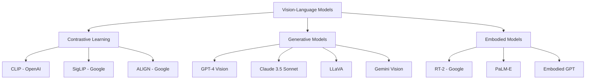

# Multimodal Interaction

Multimodal interaction combines vision, language, speech, gestures, and tactile feedback to enable natural, human-like robot communication. This guide covers vision-language models, embodied AI, and complete multimodal pipelines for advanced human-robot interaction.

## Vision-Language Models

### VLM Landscape



**Model Capabilities Comparison**:

| Model | Image Understanding | Grounding | Action Prediction | Real-time | Open Source |
|-------|-------------------|-----------|-------------------|-----------|-------------|
| CLIP | Basic | No | No | Yes | Yes |
| GPT-4V | Excellent | Limited | No | No | No |
| Claude 3.5 | Excellent | Limited | No | No | No |
| LLaVA | Very Good | Limited | No | Yes | Yes |
| RT-2 | Good | Yes | Yes | Moderate | No |
| PaLM-E | Excellent | Yes | Yes | No | No |

### CLIP for Object Understanding

```python
# clip_vision_node.py
import rclpy
from rclpy.node import Node
from sensor_msgs.msg import Image
from std_msgs.msg import String
from cv_bridge import CvBridge
import torch
import clip
from PIL import Image as PILImage
import numpy as np


class CLIPVisionNode(Node):
    """Use CLIP for zero-shot object classification and scene understanding."""

    def __init__(self):
        super().__init__('clip_vision_node')

        # Load CLIP model
        self.device = "cuda" if torch.cuda.is_available() else "cpu"
        self.model, self.preprocess = clip.load("ViT-B/32", device=self.device)

        self.bridge = CvBridge()

        # Predefined object categories
        self.object_categories = [
            "a cup", "a bottle", "a phone", "a book", "a laptop",
            "a keyboard", "a mouse", "a pen", "a remote control",
            "a chair", "a table", "a person", "a dog", "a cat"
        ]

        # Tokenize text prompts
        self.text_tokens = clip.tokenize(self.object_categories).to(self.device)

        # Subscribers
        self.image_sub = self.create_subscription(
            Image,
            'camera/image_raw',
            self.image_callback,
            10
        )

        self.query_sub = self.create_subscription(
            String,
            'vision_query',
            self.query_callback,
            10
        )

        # Publishers
        self.result_pub = self.create_publisher(
            String,
            'vision_result',
            10
        )

        self.current_image = None

        self.get_logger().info('CLIP Vision Node initialized')

    def image_callback(self, msg):
        """Store current image."""
        cv_image = self.bridge.imgmsg_to_cv2(msg, desired_encoding='rgb8')
        self.current_image = cv_image

    def query_callback(self, msg):
        """Answer vision query using CLIP."""
        if self.current_image is None:
            self.get_logger().warn('No image available')
            return

        query = msg.data

        # Check query type
        if query.startswith("find:"):
            # Object detection query
            object_name = query.split(":", 1)[1].strip()
            result = self.find_object(object_name)

        elif query.startswith("classify"):
            # Classification query
            result = self.classify_scene()

        elif query.startswith("compare:"):
            # Comparison query
            items = query.split(":", 1)[1].split(",")
            result = self.compare_items(items)

        else:
            # General description
            result = self.describe_scene()

        # Publish result
        result_msg = String()
        result_msg.data = result
        self.result_pub.publish(result_msg)

        self.get_logger().info(f'Query: {query}, Result: {result}')

    def find_object(self, object_name):
        """Check if specific object is in the image."""

        # Create prompts
        prompts = [
            f"a photo containing {object_name}",
            f"a photo without {object_name}"
        ]

        text = clip.tokenize(prompts).to(self.device)

        # Preprocess image
        pil_image = PILImage.fromarray(self.current_image)
        image = self.preprocess(pil_image).unsqueeze(0).to(self.device)

        # Compute features
        with torch.no_grad():
            image_features = self.model.encode_image(image)
            text_features = self.model.encode_text(text)

            # Compute similarity
            similarity = (100.0 * image_features @ text_features.T).softmax(dim=-1)

        contains_prob = similarity[0, 0].item()

        if contains_prob > 0.6:
            return f"Yes, I can see {object_name} (confidence: {contains_prob:.2f})"
        else:
            return f"No, I don't see {object_name} (confidence: {1-contains_prob:.2f})"

    def classify_scene(self):
        """Classify objects in the scene."""

        # Preprocess image
        pil_image = PILImage.fromarray(self.current_image)
        image = self.preprocess(pil_image).unsqueeze(0).to(self.device)

        # Compute features
        with torch.no_grad():
            image_features = self.model.encode_image(image)
            text_features = self.model.encode_text(self.text_tokens)

            # Compute similarity
            similarity = (100.0 * image_features @ text_features.T).softmax(dim=-1)

        # Get top predictions
        values, indices = similarity[0].topk(5)

        objects_found = []
        for value, index in zip(values, indices):
            if value.item() > 0.1:  # Threshold
                obj = self.object_categories[index].replace("a ", "")
                conf = value.item()
                objects_found.append(f"{obj} ({conf:.2f})")

        return f"I see: {', '.join(objects_found)}"

    def compare_items(self, items):
        """Compare which items are more prominent in the image."""

        prompts = [f"a photo of {item.strip()}" for item in items]
        text = clip.tokenize(prompts).to(self.device)

        # Preprocess image
        pil_image = PILImage.fromarray(self.current_image)
        image = self.preprocess(pil_image).unsqueeze(0).to(self.device)

        # Compute features
        with torch.no_grad():
            image_features = self.model.encode_image(image)
            text_features = self.model.encode_text(text)

            similarity = (100.0 * image_features @ text_features.T).softmax(dim=-1)

        # Find most similar
        max_idx = similarity[0].argmax().item()
        max_conf = similarity[0, max_idx].item()

        return f"Most likely: {items[max_idx].strip()} (confidence: {max_conf:.2f})"

    def describe_scene(self):
        """Provide general scene description."""

        scene_categories = [
            "an indoor scene", "an outdoor scene",
            "a kitchen", "a living room", "a bedroom", "an office",
            "a crowded space", "an empty space"
        ]

        text = clip.tokenize(scene_categories).to(self.device)

        pil_image = PILImage.fromarray(self.current_image)
        image = self.preprocess(pil_image).unsqueeze(0).to(self.device)

        with torch.no_grad():
            image_features = self.model.encode_image(image)
            text_features = self.model.encode_text(text)

            similarity = (100.0 * image_features @ text_features.T).softmax(dim=-1)

        max_idx = similarity[0].argmax().item()
        description = scene_categories[max_idx]

        return f"This appears to be {description}"


def main(args=None):
    rclpy.init(args=args)
    node = CLIPVisionNode()

    try:
        rclpy.spin(node)
    except KeyboardInterrupt:
        pass
    finally:
        node.destroy_node()
        rclpy.shutdown()


if __name__ == '__main__':
    main()
```

### GPT-4 Vision Integration

```python
# gpt4v_node.py
import rclpy
from rclpy.node import Node
from sensor_msgs.msg import Image
from std_msgs.msg import String
from cv_bridge import CvBridge
import openai
import base64
import cv2
import os


class GPT4VisionNode(Node):
    """Use GPT-4 Vision for advanced visual reasoning."""

    def __init__(self):
        super().__init__('gpt4_vision_node')

        self.client = openai.OpenAI(api_key=os.getenv('OPENAI_API_KEY'))
        self.bridge = CvBridge()

        self.current_image = None

        # Subscribers
        self.image_sub = self.create_subscription(
            Image,
            'camera/image_raw',
            self.image_callback,
            10
        )

        self.query_sub = self.create_subscription(
            String,
            'vision_query',
            self.query_callback,
            10
        )

        # Publishers
        self.result_pub = self.create_publisher(
            String,
            'vision_result',
            10
        )

        self.get_logger().info('GPT-4 Vision Node initialized')

    def image_callback(self, msg):
        """Store current image."""
        self.current_image = self.bridge.imgmsg_to_cv2(msg, desired_encoding='bgr8')

    def query_callback(self, msg):
        """Process vision query."""
        if self.current_image is None:
            self.get_logger().warn('No image available')
            return

        query = msg.data
        self.get_logger().info(f'Processing query: {query}')

        # Encode image to base64
        _, buffer = cv2.imencode('.jpg', self.current_image)
        image_base64 = base64.b64encode(buffer).decode('utf-8')

        # Query GPT-4 Vision
        try:
            response = self.client.chat.completions.create(
                model="gpt-4o",
                messages=[
                    {
                        "role": "user",
                        "content": [
                            {
                                "type": "text",
                                "text": query
                            },
                            {
                                "type": "image_url",
                                "image_url": {
                                    "url": f"data:image/jpeg;base64,{image_base64}"
                                }
                            }
                        ]
                    }
                ],
                max_tokens=300
            )

            result = response.choices[0].message.content

            # Publish result
            result_msg = String()
            result_msg.data = result
            self.result_pub.publish(result_msg)

            self.get_logger().info(f'Result: {result}')

        except Exception as e:
            self.get_logger().error(f'GPT-4V query failed: {str(e)}')


def main(args=None):
    rclpy.init(args=args)
    node = GPT4VisionNode()

    try:
        rclpy.spin(node)
    except KeyboardInterrupt:
        pass
    finally:
        node.destroy_node()
        rclpy.shutdown()


if __name__ == '__main__':
    main()
```

## Visual Question Answering

### LLaVA for VQA

```python
# llava_vqa_node.py
import rclpy
from rclpy.node import Node
from sensor_msgs.msg import Image
from std_msgs.msg import String
from cv_bridge import CvBridge
import torch
from transformers import LlavaNextProcessor, LlavaNextForConditionalGeneration
from PIL import Image as PILImage


class LLaVAVQANode(Node):
    """Visual Question Answering using LLaVA."""

    def __init__(self):
        super().__init__('llava_vqa_node')

        # Load LLaVA model
        model_id = "llava-hf/llava-v1.6-mistral-7b-hf"

        self.get_logger().info('Loading LLaVA model...')
        self.processor = LlavaNextProcessor.from_pretrained(model_id)
        self.model = LlavaNextForConditionalGeneration.from_pretrained(
            model_id,
            torch_dtype=torch.float16,
            device_map="auto"
        )
        self.get_logger().info('LLaVA model loaded')

        self.bridge = CvBridge()
        self.current_image = None

        # Subscribers
        self.image_sub = self.create_subscription(
            Image,
            'camera/image_raw',
            self.image_callback,
            10
        )

        self.question_sub = self.create_subscription(
            String,
            'vqa_question',
            self.question_callback,
            10
        )

        # Publishers
        self.answer_pub = self.create_publisher(
            String,
            'vqa_answer',
            10
        )

        self.get_logger().info('LLaVA VQA Node initialized')

    def image_callback(self, msg):
        """Store current image."""
        cv_image = self.bridge.imgmsg_to_cv2(msg, desired_encoding='rgb8')
        self.current_image = PILImage.fromarray(cv_image)

    def question_callback(self, msg):
        """Answer visual question."""
        if self.current_image is None:
            self.get_logger().warn('No image available')
            return

        question = msg.data
        self.get_logger().info(f'Question: {question}')

        # Prepare prompt
        conversation = [
            {
                "role": "user",
                "content": [
                    {"type": "image"},
                    {"type": "text", "text": question}
                ]
            }
        ]

        prompt = self.processor.apply_chat_template(conversation, add_generation_prompt=True)

        # Prepare inputs
        inputs = self.processor(
            prompt,
            self.current_image,
            return_tensors="pt"
        ).to(self.model.device)

        # Generate answer
        with torch.no_grad():
            output = self.model.generate(
                **inputs,
                max_new_tokens=100,
                do_sample=False
            )

        # Decode answer
        answer = self.processor.decode(output[0], skip_special_tokens=True)

        # Extract just the answer part
        answer = answer.split("ASSISTANT:")[-1].strip()

        self.get_logger().info(f'Answer: {answer}')

        # Publish
        answer_msg = String()
        answer_msg.data = answer
        self.answer_pub.publish(answer_msg)


def main(args=None):
    rclpy.init(args=args)
    node = LLaVAVQANode()

    try:
        rclpy.spin(node)
    except KeyboardInterrupt:
        pass
    finally:
        node.destroy_node()
        rclpy.shutdown()


if __name__ == '__main__':
    main()
```

## Object Grounding from Natural Language

### Grounding DINO Integration

```python
# grounding_node.py
import rclpy
from rclpy.node import Node
from sensor_msgs.msg import Image
from std_msgs.msg import String
from vision_msgs.msg import Detection2DArray, Detection2D, BoundingBox2D
from cv_bridge import CvBridge
import torch
from groundingdino.util.inference import load_model, predict
import cv2
import numpy as np


class GroundingNode(Node):
    """Ground natural language descriptions to image regions."""

    def __init__(self):
        super().__init__('grounding_node')

        # Load Grounding DINO model
        self.get_logger().info('Loading Grounding DINO model...')

        config_path = "GroundingDINO/groundingdino/config/GroundingDINO_SwinT_OGC.py"
        checkpoint_path = "weights/groundingdino_swint_ogc.pth"

        self.model = load_model(config_path, checkpoint_path)
        self.get_logger().info('Grounding DINO loaded')

        self.bridge = CvBridge()
        self.current_image = None

        # Parameters
        self.box_threshold = 0.35
        self.text_threshold = 0.25

        # Subscribers
        self.image_sub = self.create_subscription(
            Image,
            'camera/image_raw',
            self.image_callback,
            10
        )

        self.text_sub = self.create_subscription(
            String,
            'grounding_text',
            self.text_callback,
            10
        )

        # Publishers
        self.detection_pub = self.create_publisher(
            Detection2DArray,
            'grounded_detections',
            10
        )

        self.annotated_image_pub = self.create_publisher(
            Image,
            'annotated_image',
            10
        )

        self.get_logger().info('Grounding Node initialized')

    def image_callback(self, msg):
        """Store current image."""
        self.current_image = self.bridge.imgmsg_to_cv2(msg, desired_encoding='rgb8')

    def text_callback(self, msg):
        """Ground text description to image."""
        if self.current_image is None:
            self.get_logger().warn('No image available')
            return

        text_prompt = msg.data
        self.get_logger().info(f'Grounding: {text_prompt}')

        # Predict
        boxes, logits, phrases = predict(
            model=self.model,
            image=self.current_image,
            caption=text_prompt,
            box_threshold=self.box_threshold,
            text_threshold=self.text_threshold
        )

        self.get_logger().info(f'Found {len(boxes)} matches')

        # Create detection message
        detections_msg = Detection2DArray()
        detections_msg.header.stamp = self.get_clock().now().to_msg()
        detections_msg.header.frame_id = "camera"

        h, w = self.current_image.shape[:2]

        # Annotated image
        annotated = self.current_image.copy()

        for box, logit, phrase in zip(boxes, logits, phrases):
            # Convert normalized box to pixels
            x_center, y_center, width, height = box
            x_center *= w
            y_center *= h
            width *= w
            height *= h

            # Create detection
            detection = Detection2D()

            bbox = BoundingBox2D()
            bbox.center.position.x = float(x_center)
            bbox.center.position.y = float(y_center)
            bbox.size_x = float(width)
            bbox.size_y = float(height)

            detection.bbox = bbox
            detection.results = []  # Could add classification results

            detections_msg.detections.append(detection)

            # Draw on image
            x1 = int(x_center - width / 2)
            y1 = int(y_center - height / 2)
            x2 = int(x_center + width / 2)
            y2 = int(y_center + height / 2)

            cv2.rectangle(annotated, (x1, y1), (x2, y2), (0, 255, 0), 2)
            cv2.putText(
                annotated,
                f"{phrase} {logit:.2f}",
                (x1, y1 - 10),
                cv2.FONT_HERSHEY_SIMPLEX,
                0.5,
                (0, 255, 0),
                2
            )

        # Publish detections
        self.detection_pub.publish(detections_msg)

        # Publish annotated image
        annotated_msg = self.bridge.cv2_to_imgmsg(annotated, encoding='rgb8')
        self.annotated_image_pub.publish(annotated_msg)


def main(args=None):
    rclpy.init(args=args)
    node = GroundingNode()

    try:
        rclpy.spin(node)
    except KeyboardInterrupt:
        pass
    finally:
        node.destroy_node()
        rclpy.shutdown()


if __name__ == '__main__':
    main()
```

## Gesture and Speech Fusion

### Multimodal Command Interpreter

```python
# multimodal_interpreter.py
import rclpy
from rclpy.node import Node
from std_msgs.msg import String
from geometry_msgs.msg import PointStamped
from vision_msgs.msg import Detection2DArray
import time


class MultimodalInterpreter(Node):
    """Fuse speech, gestures, and vision for command interpretation."""

    def __init__(self):
        super().__init__('multimodal_interpreter')

        # Multimodal buffers
        self.recent_speech = []
        self.recent_gestures = []
        self.recent_objects = []

        # Time windows
        self.speech_window = 3.0  # seconds
        self.gesture_window = 2.0
        self.object_window = 5.0

        # Subscribers
        self.speech_sub = self.create_subscription(
            String,
            'speech_transcript',
            self.speech_callback,
            10
        )

        self.gesture_sub = self.create_subscription(
            PointStamped,
            'pointing_gesture',
            self.gesture_callback,
            10
        )

        self.object_sub = self.create_subscription(
            Detection2DArray,
            'detected_objects',
            self.object_callback,
            10
        )

        # Publishers
        self.command_pub = self.create_publisher(
            String,
            'interpreted_command',
            10
        )

        # Timer for fusion
        self.fusion_timer = self.create_timer(0.5, self.fuse_modalities)

        self.get_logger().info('Multimodal Interpreter initialized')

    def speech_callback(self, msg):
        """Receive speech input."""
        self.recent_speech.append({
            'text': msg.data,
            'time': time.time()
        })

        # Clean old entries
        self.clean_buffer(self.recent_speech, self.speech_window)

        self.get_logger().info(f'Speech: {msg.data}')

    def gesture_callback(self, msg):
        """Receive gesture input."""
        self.recent_gestures.append({
            'point': (msg.point.x, msg.point.y, msg.point.z),
            'time': time.time()
        })

        self.clean_buffer(self.recent_gestures, self.gesture_window)

        self.get_logger().info(f'Gesture: ({msg.point.x:.2f}, {msg.point.y:.2f})')

    def object_callback(self, msg):
        """Receive detected objects."""
        objects = []
        for detection in msg.detections:
            obj_info = {
                'bbox': detection.bbox,
                'time': time.time()
            }
            objects.append(obj_info)

        self.recent_objects.extend(objects)
        self.clean_buffer(self.recent_objects, self.object_window)

    def clean_buffer(self, buffer, window):
        """Remove old entries from buffer."""
        current_time = time.time()
        to_remove = [item for item in buffer if current_time - item['time'] > window]
        for item in to_remove:
            buffer.remove(item)

    def fuse_modalities(self):
        """Fuse multiple modalities into interpreted command."""

        if not self.recent_speech:
            return

        # Get most recent speech
        latest_speech = self.recent_speech[-1]['text'].lower()

        # Check for deictic references (this, that, there, here)
        deictic_words = ['this', 'that', 'there', 'here', 'it']

        has_deictic = any(word in latest_speech for word in deictic_words)

        if has_deictic and self.recent_gestures:
            # Combine speech with gesture
            gesture = self.recent_gestures[-1]
            point = gesture['point']

            # Find object at pointed location
            target_object = self.find_object_at_point(point)

            if target_object:
                # Create grounded command
                command = self.resolve_deictic_reference(
                    latest_speech,
                    target_object,
                    point
                )

                # Publish
                self.publish_command(command)

    def find_object_at_point(self, point):
        """Find object closest to pointing direction."""

        if not self.recent_objects:
            return None

        # Simple heuristic: find object whose center is closest to pointing direction
        # In practice, you'd use 3D projection and ray casting

        closest_object = self.recent_objects[0]
        min_distance = float('inf')

        for obj in self.recent_objects:
            bbox = obj['bbox']
            obj_x = bbox.center.position.x
            obj_y = bbox.center.position.y

            # Simplified 2D distance (would use 3D in practice)
            distance = ((obj_x - point[0])**2 + (obj_y - point[1])**2)**0.5

            if distance < min_distance:
                min_distance = distance
                closest_object = obj

        return closest_object

    def resolve_deictic_reference(self, speech, target_object, point):
        """Resolve 'this', 'that', etc. to specific object."""

        # Extract action from speech
        action = None

        if 'pick' in speech or 'grab' in speech or 'grasp' in speech:
            action = 'grasp'
        elif 'move' in speech or 'bring' in speech:
            action = 'bring'
        elif 'point' in speech or 'show' in speech:
            action = 'point_to'

        if action:
            bbox = target_object['bbox']
            command = {
                'action': action,
                'target': {
                    'type': 'object',
                    'bbox': {
                        'x': bbox.center.position.x,
                        'y': bbox.center.position.y,
                        'width': bbox.size_x,
                        'height': bbox.size_y
                    }
                },
                'modalities': ['speech', 'gesture', 'vision']
            }

            return command

        return None

    def publish_command(self, command):
        """Publish interpreted command."""
        if command:
            import json
            command_msg = String()
            command_msg.data = json.dumps(command)
            self.command_pub.publish(command_msg)

            self.get_logger().info(f'Interpreted command: {command["action"]} object at {command["target"]["bbox"]}')


def main(args=None):
    rclpy.init(args=args)
    node = MultimodalInterpreter()

    try:
        rclpy.spin(node)
    except KeyboardInterrupt:
        pass
    finally:
        node.destroy_node()
        rclpy.shutdown()


if __name__ == '__main__':
    main()
```

## Gesture Recognition

### Hand Pose Estimation

```python
# hand_gesture_recognizer.py
import rclpy
from rclpy.node import Node
from sensor_msgs.msg import Image
from std_msgs.msg import String
from geometry_msgs.msg import PointStamped
from cv_bridge import CvBridge
import mediapipe as mp
import cv2
import numpy as np


class HandGestureRecognizer(Node):
    """Recognize hand gestures and pointing directions."""

    def __init__(self):
        super().__init__('hand_gesture_recognizer')

        # Initialize MediaPipe Hands
        self.mp_hands = mp.solutions.hands
        self.hands = self.mp_hands.Hands(
            static_image_mode=False,
            max_num_hands=2,
            min_detection_confidence=0.5,
            min_tracking_confidence=0.5
        )

        self.mp_drawing = mp.solutions.drawing_utils

        self.bridge = CvBridge()

        # Subscribers
        self.image_sub = self.create_subscription(
            Image,
            'camera/image_raw',
            self.image_callback,
            10
        )

        # Publishers
        self.gesture_pub = self.create_publisher(
            String,
            'recognized_gesture',
            10
        )

        self.pointing_pub = self.create_publisher(
            PointStamped,
            'pointing_gesture',
            10
        )

        self.annotated_pub = self.create_publisher(
            Image,
            'hand_annotated_image',
            10
        )

        self.get_logger().info('Hand Gesture Recognizer initialized')

    def image_callback(self, msg):
        """Process image for hand gestures."""

        # Convert to OpenCV
        cv_image = self.bridge.imgmsg_to_cv2(msg, desired_encoding='rgb8')

        # Process with MediaPipe
        results = self.hands.process(cv_image)

        if results.multi_hand_landmarks:
            for hand_landmarks in results.multi_hand_landmarks:
                # Recognize gesture
                gesture = self.classify_gesture(hand_landmarks)

                if gesture:
                    # Publish gesture
                    gesture_msg = String()
                    gesture_msg.data = gesture
                    self.gesture_pub.publish(gesture_msg)

                    self.get_logger().info(f'Gesture: {gesture}')

                # Check for pointing
                if gesture == 'pointing':
                    point = self.get_pointing_direction(hand_landmarks, cv_image.shape)

                    if point:
                        point_msg = PointStamped()
                        point_msg.header.stamp = self.get_clock().now().to_msg()
                        point_msg.header.frame_id = "camera"
                        point_msg.point.x = point[0]
                        point_msg.point.y = point[1]
                        point_msg.point.z = point[2]
                        self.pointing_pub.publish(point_msg)

                # Draw landmarks
                self.mp_drawing.draw_landmarks(
                    cv_image,
                    hand_landmarks,
                    self.mp_hands.HAND_CONNECTIONS
                )

        # Publish annotated image
        annotated_msg = self.bridge.cv2_to_imgmsg(cv_image, encoding='rgb8')
        self.annotated_pub.publish(annotated_msg)

    def classify_gesture(self, landmarks):
        """Classify hand gesture from landmarks."""

        # Extract landmark positions
        thumb_tip = landmarks.landmark[4]
        index_tip = landmarks.landmark[8]
        middle_tip = landmarks.landmark[12]
        ring_tip = landmarks.landmark[16]
        pinky_tip = landmarks.landmark[20]

        index_mcp = landmarks.landmark[5]
        middle_mcp = landmarks.landmark[9]

        # Pointing gesture: index extended, others folded
        index_extended = index_tip.y < index_mcp.y
        middle_folded = middle_tip.y > middle_mcp.y

        if index_extended and middle_folded:
            return 'pointing'

        # Thumbs up: thumb extended upward
        if thumb_tip.y < landmarks.landmark[2].y:
            return 'thumbs_up'

        # Open palm: all fingers extended
        all_extended = all([
            index_tip.y < index_mcp.y,
            middle_tip.y < middle_mcp.y,
            ring_tip.y < landmarks.landmark[13].y,
            pinky_tip.y < landmarks.landmark[17].y
        ])

        if all_extended:
            return 'open_palm'

        # Fist: all fingers closed
        all_closed = all([
            index_tip.y > index_mcp.y,
            middle_tip.y > middle_mcp.y,
            ring_tip.y > landmarks.landmark[13].y
        ])

        if all_closed:
            return 'fist'

        return None

    def get_pointing_direction(self, landmarks, image_shape):
        """Calculate pointing direction vector."""

        # Use index finger tip and MCP joint to determine direction
        index_tip = landmarks.landmark[8]
        index_mcp = landmarks.landmark[5]

        # Calculate direction vector (simplified 2D)
        dx = index_tip.x - index_mcp.x
        dy = index_tip.y - index_mcp.y

        # Normalize
        magnitude = (dx**2 + dy**2)**0.5
        if magnitude > 0:
            dx /= magnitude
            dy /= magnitude

        # Convert to image coordinates
        h, w = image_shape[:2]
        point_x = index_tip.x * w
        point_y = index_tip.y * h

        return (point_x, point_y, 0.0)  # Z would require depth


def main(args=None):
    rclpy.init(args=args)
    node = HandGestureRecognizer()

    try:
        rclpy.spin(node)
    except KeyboardInterrupt:
        pass
    finally:
        node.destroy_node()
        rclpy.shutdown()


if __name__ == '__main__':
    main()
```

## Tactile Feedback and Haptic Interaction

### Force-Torque Sensing

```python
# tactile_interaction_node.py
import rclpy
from rclpy.node import Node
from geometry_msgs.msg import WrenchStamped
from std_msgs.msg import String, Bool
import numpy as np


class TactileInteractionNode(Node):
    """Interpret tactile feedback for interaction."""

    def __init__(self):
        super().__init__('tactile_interaction_node')

        # Tactile event detection thresholds
        self.force_threshold = 2.0  # Newtons
        self.torque_threshold = 0.5  # Nm

        # Interaction patterns
        self.force_history = []
        self.history_length = 20

        # Subscribers
        self.ft_sub = self.create_subscription(
            WrenchStamped,
            'force_torque_sensor',
            self.ft_callback,
            10
        )

        # Publishers
        self.tactile_event_pub = self.create_publisher(
            String,
            'tactile_event',
            10
        )

        self.contact_pub = self.create_publisher(
            Bool,
            'object_contact',
            10
        )

        self.get_logger().info('Tactile Interaction Node initialized')

    def ft_callback(self, msg):
        """Process force-torque data."""

        # Extract forces
        fx = msg.wrench.force.x
        fy = msg.wrench.force.y
        fz = msg.wrench.force.z

        force_magnitude = np.sqrt(fx**2 + fy**2 + fz**2)

        # Add to history
        self.force_history.append(force_magnitude)

        if len(self.force_history) > self.history_length:
            self.force_history.pop(0)

        # Detect contact
        if force_magnitude > self.force_threshold:
            contact_msg = Bool()
            contact_msg.data = True
            self.contact_pub.publish(contact_msg)

            # Detect interaction patterns
            pattern = self.detect_interaction_pattern()

            if pattern:
                event_msg = String()
                event_msg.data = pattern
                self.tactile_event_pub.publish(event_msg)

                self.get_logger().info(f'Tactile event: {pattern}')

    def detect_interaction_pattern(self):
        """Detect patterns in force history."""

        if len(self.force_history) < 10:
            return None

        recent_forces = np.array(self.force_history[-10:])

        # Tap: quick spike and drop
        if self.is_tap_pattern(recent_forces):
            return 'tap'

        # Push: sustained force
        if self.is_push_pattern(recent_forces):
            return 'push'

        # Grab: steady grip force
        if self.is_grab_pattern(recent_forces):
            return 'grab'

        return None

    def is_tap_pattern(self, forces):
        """Detect tap pattern."""
        # Sharp increase followed by sharp decrease
        max_force = np.max(forces)
        final_force = forces[-1]

        return max_force > self.force_threshold and final_force < self.force_threshold * 0.3

    def is_push_pattern(self, forces):
        """Detect sustained push."""
        return np.mean(forces) > self.force_threshold and np.std(forces) < 0.5

    def is_grab_pattern(self, forces):
        """Detect grabbing."""
        return np.mean(forces) > self.force_threshold * 1.5 and np.std(forces) < 0.3


def main(args=None):
    rclpy.init(args=args)
    node = TactileInteractionNode()

    try:
        rclpy.spin(node)
    except KeyboardInterrupt:
        pass
    finally:
        node.destroy_node()
        rclpy.shutdown()


if __name__ == '__main__':
    main()
```

## Social Cues Detection

### Gaze and Face Analysis

```python
# social_cues_detector.py
import rclpy
from rclpy.node import Node
from sensor_msgs.msg import Image
from std_msgs.msg import String
from cv_bridge import CvBridge
import mediapipe as mp
import cv2
import numpy as np


class SocialCuesDetector(Node):
    """Detect social cues like gaze direction and facial expressions."""

    def __init__(self):
        super().__init__('social_cues_detector')

        # Initialize MediaPipe Face Mesh
        self.mp_face_mesh = mp.solutions.face_mesh
        self.face_mesh = self.mp_face_mesh.FaceMesh(
            max_num_faces=2,
            refine_landmarks=True,
            min_detection_confidence=0.5,
            min_tracking_confidence=0.5
        )

        self.bridge = CvBridge()

        # Subscribers
        self.image_sub = self.create_subscription(
            Image,
            'camera/image_raw',
            self.image_callback,
            10
        )

        # Publishers
        self.gaze_pub = self.create_publisher(
            String,
            'gaze_direction',
            10
        )

        self.attention_pub = self.create_publisher(
            String,
            'user_attention',
            10
        )

        self.expression_pub = self.create_publisher(
            String,
            'facial_expression',
            10
        )

        self.get_logger().info('Social Cues Detector initialized')

    def image_callback(self, msg):
        """Detect social cues from image."""

        cv_image = self.bridge.imgmsg_to_cv2(msg, desired_encoding='rgb8')

        results = self.face_mesh.process(cv_image)

        if results.multi_face_landmarks:
            for face_landmarks in results.multi_face_landmarks:
                # Detect gaze direction
                gaze = self.detect_gaze(face_landmarks, cv_image.shape)

                if gaze:
                    gaze_msg = String()
                    gaze_msg.data = gaze
                    self.gaze_pub.publish(gaze_msg)

                    # Determine if user is paying attention
                    attention = 'engaged' if gaze in ['center', 'looking_at_robot'] else 'distracted'

                    attention_msg = String()
                    attention_msg.data = attention
                    self.attention_pub.publish(attention_msg)

                # Detect expression
                expression = self.detect_expression(face_landmarks)

                if expression:
                    expr_msg = String()
                    expr_msg.data = expression
                    self.expression_pub.publish(expr_msg)

    def detect_gaze(self, landmarks, image_shape):
        """Estimate gaze direction from eye landmarks."""

        # Eye landmark indices (MediaPipe Face Mesh)
        left_eye_indices = [33, 133, 160, 159, 158, 157, 173]
        right_eye_indices = [362, 263, 387, 386, 385, 384, 398]

        # Get eye centers
        left_eye_center = self.get_landmark_center(landmarks, left_eye_indices)
        right_eye_center = self.get_landmark_center(landmarks, right_eye_indices)

        # Get iris positions (refined landmarks)
        left_iris = landmarks.landmark[468]  # Left iris center
        right_iris = landmarks.landmark[473]  # Right iris center

        # Calculate gaze offset
        left_offset_x = left_iris.x - left_eye_center[0]
        right_offset_x = right_iris.x - right_eye_center[0]

        avg_offset = (left_offset_x + right_offset_x) / 2

        # Classify gaze direction
        if abs(avg_offset) < 0.01:
            return 'center'
        elif avg_offset < -0.01:
            return 'left'
        elif avg_offset > 0.01:
            return 'right'

        return 'center'

    def get_landmark_center(self, landmarks, indices):
        """Calculate center of a group of landmarks."""
        x_coords = [landmarks.landmark[i].x for i in indices]
        y_coords = [landmarks.landmark[i].y for i in indices]

        return (np.mean(x_coords), np.mean(y_coords))

    def detect_expression(self, landmarks):
        """Detect facial expression from landmarks."""

        # Simplified expression detection using mouth landmarks
        upper_lip = landmarks.landmark[13]
        lower_lip = landmarks.landmark[14]
        left_mouth = landmarks.landmark[61]
        right_mouth = landmarks.landmark[291]

        # Mouth openness
        mouth_open = abs(upper_lip.y - lower_lip.y)

        # Mouth width
        mouth_width = abs(left_mouth.x - right_mouth.x)

        # Simple heuristics
        if mouth_open > 0.03:
            return 'surprised'
        elif mouth_width > 0.15:
            return 'smiling'
        else:
            return 'neutral'


def main(args=None):
    rclpy.init(args=args)
    node = SocialCuesDetector()

    try:
        rclpy.spin(node)
    except KeyboardInterrupt:
        pass
    finally:
        node.destroy_node()
        rclpy.shutdown()


if __name__ == '__main__':
    main()
```

## Embodied AI: Language-Conditioned Manipulation

### Complete Example: "Bring me the red cup"

```python
#!/usr/bin/env python3
"""
Complete multimodal system: Process "Bring me the red cup on the table"
Combines vision, language, manipulation, and navigation.
"""

import rclpy
from rclpy.node import Node
from rclpy.action import ActionClient
from std_msgs.msg import String
from sensor_msgs.msg import Image
from geometry_msgs.msg import PoseStamped
from cv_bridge import CvBridge
import openai
import json
import os


class EmbodiedAINode(Node):
    """Embodied AI system for language-conditioned manipulation."""

    def __init__(self):
        super().__init__('embodied_ai_node')

        # Initialize LLM client
        self.llm_client = openai.OpenAI(api_key=os.getenv('OPENAI_API_KEY'))

        self.bridge = CvBridge()
        self.current_image = None

        # Subscribers
        self.command_sub = self.create_subscription(
            String,
            'voice_commands',
            self.command_callback,
            10
        )

        self.image_sub = self.create_subscription(
            Image,
            'camera/image_raw',
            self.image_callback,
            10
        )

        # Publishers
        self.grounding_pub = self.create_publisher(
            String,
            'grounding_text',
            10
        )

        self.navigation_pub = self.create_publisher(
            PoseStamped,
            'navigation_goal',
            10
        )

        self.status_pub = self.create_publisher(
            String,
            'task_status',
            10
        )

        # Task state
        self.current_task = None

        self.get_logger().info('Embodied AI Node initialized')

    def image_callback(self, msg):
        """Store current image."""
        self.current_image = self.bridge.imgmsg_to_cv2(msg, desired_encoding='rgb8')

    def command_callback(self, msg):
        """Process natural language command."""

        command = msg.data
        self.get_logger().info(f'Received command: {command}')

        self.publish_status('Parsing command...')

        # Parse command with LLM
        task_plan = self.parse_command(command)

        if task_plan:
            self.execute_task_plan(task_plan)

    def parse_command(self, command):
        """Parse natural language command into structured task plan."""

        system_prompt = """You are a robot task planner. Parse natural language commands into structured task plans.

Available robot capabilities:
- navigate_to(location): Navigate to a location
- detect_object(description): Detect and locate an object
- grasp_object(object_id): Grasp a detected object
- place_object(location): Place held object
- speak(text): Say something

Parse the command and respond with a JSON task plan:
{
  "understood": true/false,
  "task_type": "fetch|place|navigate|interact",
  "steps": [
    {"action": "action_name", "params": {...}, "description": "what this does"},
    ...
  ],
  "target_object": "description of object",
  "target_location": "where to go/place",
  "clarifications": ["any questions"]
}"""

        response = self.llm_client.chat.completions.create(
            model="gpt-4o",
            messages=[
                {"role": "system", "content": system_prompt},
                {"role": "user", "content": command}
            ],
            temperature=0
        )

        try:
            task_plan = json.loads(response.choices[0].message.content)
            return task_plan
        except:
            self.get_logger().error('Failed to parse task plan')
            return None

    def execute_task_plan(self, plan):
        """Execute structured task plan."""

        if not plan.get('understood'):
            clarifications = plan.get('clarifications', [])
            self.speak(f"I need clarification: {clarifications[0]}")
            return

        self.get_logger().info(f'Executing task: {plan["task_type"]}')

        for i, step in enumerate(plan['steps']):
            self.publish_status(f'Step {i+1}/{len(plan["steps"])}: {step["description"]}')

            success = self.execute_step(step)

            if not success:
                self.speak(f"Sorry, I couldn't complete step: {step['description']}")
                return

        self.speak("Task completed successfully")
        self.publish_status('Task completed')

    def execute_step(self, step):
        """Execute a single step of the task plan."""

        action = step['action']
        params = step['params']

        self.get_logger().info(f'Executing: {action} with {params}')

        if action == 'navigate_to':
            return self.navigate_to_location(params['location'])

        elif action == 'detect_object':
            return self.detect_and_ground_object(params['description'])

        elif action == 'grasp_object':
            return self.grasp_object(params.get('object_id'))

        elif action == 'place_object':
            return self.place_object(params.get('location'))

        elif action == 'speak':
            self.speak(params['text'])
            return True

        return False

    def navigate_to_location(self, location):
        """Navigate to specified location."""

        # In practice, look up location coordinates from semantic map
        location_coords = {
            'kitchen': (2.0, 1.0, 0.0),
            'table': (1.5, 0.5, 0.0),
            'living room': (0.0, 0.0, 0.0)
        }

        if location in location_coords:
            pose = PoseStamped()
            pose.header.frame_id = 'map'
            pose.pose.position.x = location_coords[location][0]
            pose.pose.position.y = location_coords[location][1]
            pose.pose.orientation.w = 1.0

            self.navigation_pub.publish(pose)
            self.get_logger().info(f'Navigating to {location}')
            return True

        return False

    def detect_and_ground_object(self, description):
        """Detect object using vision-language grounding."""

        if self.current_image is None:
            return False

        # Trigger grounding
        grounding_msg = String()
        grounding_msg.data = description
        self.grounding_pub.publish(grounding_msg)

        self.get_logger().info(f'Detecting: {description}')

        # In practice, wait for grounding result
        return True

    def grasp_object(self, object_id):
        """Grasp detected object."""

        # In practice, execute grasp action
        self.get_logger().info(f'Grasping object {object_id}')
        return True

    def place_object(self, location):
        """Place held object at location."""

        self.get_logger().info(f'Placing object at {location}')
        return True

    def speak(self, text):
        """Make robot speak."""

        # Publish to TTS
        pass

    def publish_status(self, status):
        """Publish task status."""
        msg = String()
        msg.data = status
        self.status_pub.publish(msg)


def main(args=None):
    rclpy.init(args=args)
    node = EmbodiedAINode()

    try:
        rclpy.spin(node)
    except KeyboardInterrupt:
        pass
    finally:
        node.destroy_node()
        rclpy.shutdown()


if __name__ == '__main__':
    main()
```

## Multimodal RAG for Robot Knowledge

### Vector Database Integration

```python
# multimodal_rag_node.py
import rclpy
from rclpy.node import Node
from std_msgs.msg import String
from sensor_msgs.msg import Image
from cv_bridge import CvBridge
import chromadb
from chromadb.utils import embedding_functions
import openai
import base64
import cv2
import os


class MultimodalRAGNode(Node):
    """Multimodal Retrieval-Augmented Generation for robot knowledge."""

    def __init__(self):
        super().__init__('multimodal_rag_node')

        # Initialize ChromaDB
        self.chroma_client = chromadb.PersistentClient(path="./robot_memory")

        # Create collections
        self.text_collection = self.chroma_client.get_or_create_collection(
            name="robot_experiences_text",
            embedding_function=embedding_functions.SentenceTransformerEmbeddingFunction()
        )

        self.image_collection = self.chroma_client.get_or_create_collection(
            name="robot_experiences_images"
        )

        # OpenAI client
        self.llm_client = openai.OpenAI(api_key=os.getenv('OPENAI_API_KEY'))

        self.bridge = CvBridge()

        # Subscribers
        self.query_sub = self.create_subscription(
            String,
            'knowledge_query',
            self.query_callback,
            10
        )

        # Publishers
        self.answer_pub = self.create_publisher(
            String,
            'knowledge_answer',
            10
        )

        self.get_logger().info('Multimodal RAG Node initialized')

    def query_callback(self, msg):
        """Answer query using multimodal RAG."""

        query = msg.data
        self.get_logger().info(f'Knowledge query: {query}')

        # Retrieve relevant experiences
        text_results = self.text_collection.query(
            query_texts=[query],
            n_results=5
        )

        # Build context from retrieved memories
        context = self.build_context(text_results)

        # Generate answer using LLM with context
        answer = self.generate_answer(query, context)

        # Publish answer
        answer_msg = String()
        answer_msg.data = answer
        self.answer_pub.publish(answer_msg)

        self.get_logger().info(f'Answer: {answer}')

    def build_context(self, results):
        """Build context from retrieved documents."""

        if not results['documents']:
            return ""

        context_parts = []

        for doc, metadata in zip(results['documents'][0], results['metadatas'][0]):
            context_parts.append(f"- {doc} (from {metadata.get('source', 'memory')})")

        return "\n".join(context_parts)

    def generate_answer(self, query, context):
        """Generate answer using LLM with retrieved context."""

        system_prompt = """You are a helpful robot assistant with access to your past experiences and knowledge.

Use the provided context from your memory to answer the user's question accurately.
If the context doesn't contain relevant information, say so."""

        user_prompt = f"""Context from my memory:
{context}

Question: {query}

Answer:"""

        response = self.llm_client.chat.completions.create(
            model="gpt-4o",
            messages=[
                {"role": "system", "content": system_prompt},
                {"role": "user", "content": user_prompt}
            ],
            temperature=0.7
        )

        return response.choices[0].message.content

    def store_experience(self, description, image=None, metadata=None):
        """Store an experience in the knowledge base."""

        # Store text description
        self.text_collection.add(
            documents=[description],
            metadatas=[metadata or {}],
            ids=[f"exp_{self.get_clock().now().nanoseconds}"]
        )

        # Store image if provided
        if image is not None:
            # In practice, use vision embeddings (CLIP, etc.)
            pass


def main(args=None):
    rclpy.init(args=args)
    node = MultimodalRAGNode()

    try:
        rclpy.spin(node)
    except KeyboardInterrupt:
        pass
    finally:
        node.destroy_node()
        rclpy.shutdown()


if __name__ == '__main__':
    main()
```

## Evaluation Metrics for Embodied AI

### Task Success Metrics

```python
# embodied_ai_evaluator.py
import rclpy
from rclpy.node import Node
from std_msgs.msg import String
import json
import time


class EmbodiedAIEvaluator(Node):
    """Evaluate embodied AI task performance."""

    def __init__(self):
        super().__init__('embodied_ai_evaluator')

        # Metrics tracking
        self.task_history = []

        # Current task
        self.current_task = None
        self.task_start_time = None

        # Subscribers
        self.task_start_sub = self.create_subscription(
            String,
            'task_started',
            self.task_started_callback,
            10
        )

        self.task_end_sub = self.create_subscription(
            String,
            'task_completed',
            self.task_completed_callback,
            10
        )

        # Create timer for periodic reporting
        self.create_timer(60.0, self.report_metrics)

        self.get_logger().info('Embodied AI Evaluator initialized')

    def task_started_callback(self, msg):
        """Record task start."""
        task_data = json.loads(msg.data)

        self.current_task = {
            'description': task_data.get('description'),
            'type': task_data.get('type'),
            'start_time': time.time(),
            'steps': task_data.get('steps', [])
        }

        self.get_logger().info(f'Task started: {self.current_task["description"]}')

    def task_completed_callback(self, msg):
        """Record task completion and calculate metrics."""

        if self.current_task is None:
            return

        result_data = json.loads(msg.data)

        self.current_task['end_time'] = time.time()
        self.current_task['duration'] = self.current_task['end_time'] - self.current_task['start_time']
        self.current_task['success'] = result_data.get('success', False)
        self.current_task['failure_reason'] = result_data.get('failure_reason')

        # Calculate metrics
        metrics = self.calculate_metrics(self.current_task)

        self.current_task['metrics'] = metrics

        # Store in history
        self.task_history.append(self.current_task)

        self.get_logger().info(f'Task completed: Success={metrics["success"]}, Duration={metrics["duration"]:.2f}s')

        self.current_task = None

    def calculate_metrics(self, task):
        """Calculate task performance metrics."""

        metrics = {
            'success': task['success'],
            'duration': task['duration'],
            'steps_completed': task.get('steps_completed', 0),
            'steps_total': len(task['steps']),
            'efficiency': 0.0
        }

        # Efficiency: completed steps / (time * total steps)
        if task['duration'] > 0:
            metrics['efficiency'] = metrics['steps_completed'] / (task['duration'] * metrics['steps_total'])

        return metrics

    def report_metrics(self):
        """Report aggregate metrics."""

        if not self.task_history:
            return

        total_tasks = len(self.task_history)
        successful_tasks = sum(1 for t in self.task_history if t['success'])
        success_rate = successful_tasks / total_tasks

        avg_duration = sum(t['duration'] for t in self.task_history) / total_tasks

        self.get_logger().info(f'=== Embodied AI Metrics ===')
        self.get_logger().info(f'Total tasks: {total_tasks}')
        self.get_logger().info(f'Success rate: {success_rate:.2%}')
        self.get_logger().info(f'Average duration: {avg_duration:.2f}s')


def main(args=None):
    rclpy.init(args=args)
    node = EmbodiedAIEvaluator()

    try:
        rclpy.spin(node)
    except KeyboardInterrupt:
        pass
    finally:
        node.destroy_node()
        rclpy.shutdown()


if __name__ == '__main__':
    main()
```

## Key Takeaways

1. **Vision-Language Models**: CLIP, GPT-4V, and LLaVA enable robots to understand visual scenes with language
2. **Object Grounding**: Connect natural language descriptions to specific objects in the environment
3. **Multimodal Fusion**: Combine speech, gestures, and vision for natural interaction
4. **Social Awareness**: Detect gaze, attention, and expressions for adaptive behavior
5. **Embodied AI**: Language-conditioned manipulation brings together all modalities
6. **Knowledge Integration**: Use RAG for persistent robot memory across modalities
7. **Evaluation**: Measure task success, efficiency, and naturalness of interactions
8. **Real-world Complexity**: Handle ambiguity, errors, and multi-step reasoning

## Hands-On Exercises

### Exercise 1: Custom VQA System

Build a visual question answering system that can:
- Answer questions about object counts ("How many cups are there?")
- Describe object properties ("What color is the laptop?")
- Understand spatial relationships ("Is the cup next to the book?")
- Reason about scenes ("Is this a kitchen or bedroom?")

### Exercise 2: Deictic Reference Resolution

Implement a complete system for resolving deictic references:
- "Pick up that one" while pointing
- "Move it over there" with gesture indication
- "Bring me this" with gaze direction
- "Put the red cup next to that bottle"

Test with multiple objects and verify correct grounding.

### Exercise 3: Social Robot Interaction

Create a robot that:
- Detects when a person is looking at it
- Adjusts behavior based on user attention (waits if distracted)
- Responds to facial expressions (smiles back, shows concern)
- Maintains appropriate gaze patterns during conversation

### Exercise 4: Embodied Manipulation Task

Implement "Bring me the red cup on the table":
1. Parse natural language command
2. Navigate to table
3. Detect and ground "red cup"
4. Plan grasp approach
5. Execute pickup
6. Navigate to user
7. Hand over object

Measure success rate, time, and failure modes.

### Exercise 5: Multimodal RAG System

Build a robot memory system that:
- Stores experiences as text + image pairs
- Retrieves relevant memories based on queries
- Answers questions about past events
- Learns user preferences over time
- Uses both semantic and episodic memory

## Additional Resources

### Documentation
- [CLIP OpenAI](https://github.com/openai/CLIP)
- [GPT-4 Vision API](https://platform.openai.com/docs/guides/vision)
- [LLaVA](https://llava-vl.github.io/)
- [Grounding DINO](https://github.com/IDEA-Research/GroundingDINO)

### Research Papers
- "CLIP: Learning Transferable Visual Models From Natural Language Supervision" (OpenAI, 2021)
- "Visual ChatGPT: Talking, Drawing and Editing with Visual Foundation Models" (Microsoft, 2023)
- "RT-2: Vision-Language-Action Models Transfer Web Knowledge to Robotic Control" (Google, 2023)
- "PaLM-E: An Embodied Multimodal Language Model" (Google, 2023)

### Tools and Libraries
- [MediaPipe](https://mediapipe.dev/) - Gesture and pose estimation
- [ChromaDB](https://www.trychroma.com/) - Vector database for RAG
- [LangChain](https://python.langchain.com/) - Multimodal AI applications

### Datasets
- [COCO](https://cocodataset.org/) - Object detection and segmentation
- [Visual Genome](https://visualgenome.org/) - Visual relationships and QA
- [Embodied QA](https://embodiedqa.org/) - Embodied question answering

---

**Next**: [Advanced Topics](../07-advanced-topics/) - Explore cutting-edge research in conversational robotics.

**Previous**: [Speech Recognition](./speech-recognition.mdx) - Build voice interfaces for robots.