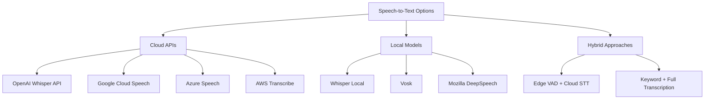
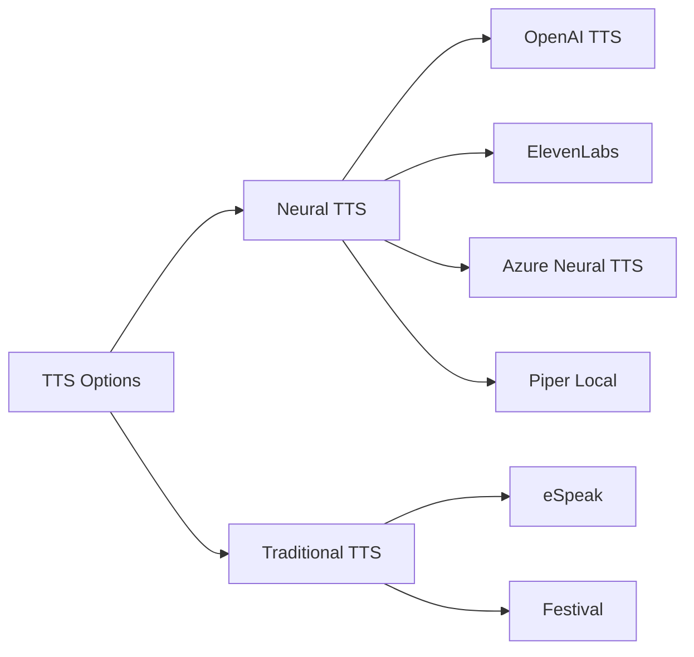

# Speech Recognition and Synthesis

Voice interaction is essential for natural human-robot communication. This guide covers state-of-the-art speech-to-text (STT) and text-to-speech (TTS) systems, wake word detection, and real-time audio processing with ROS 2.

## Speech-to-Text Engines

### Modern STT Options



**Comparison Table**:

| Engine | WER | Latency | Cost | Languages | Privacy |
|--------|-----|---------|------|-----------|---------|
| Whisper (large-v3) | 5-10% | 1-3s | Free | 99+ | Local |
| OpenAI Whisper API | 5-10% | 200-500ms | $ | 99+ | Cloud |
| Google Cloud Speech | 5-8% | 100-300ms | $$ | 125+ | Cloud |
| Azure Speech | 5-8% | 100-300ms | $$ | 100+ | Cloud |
| Vosk | 10-15% | 100-200ms | Free | 20+ | Local |

### Whisper Integration with ROS 2

OpenAI's Whisper provides excellent accuracy and multilingual support:

```python
# whisper_stt_node.py
import rclpy
from rclpy.node import Node
from audio_common_msgs.msg import AudioData
from std_msgs.msg import String
import whisper
import numpy as np
import io
import wave


class WhisperSTTNode(Node):
    """ROS 2 node for Whisper speech-to-text."""

    def __init__(self):
        super().__init__('whisper_stt_node')

        # Parameters
        self.declare_parameter('model_size', 'base')
        self.declare_parameter('language', 'en')
        self.declare_parameter('device', 'cuda')

        model_size = self.get_parameter('model_size').value
        self.language = self.get_parameter('language').value
        device = self.get_parameter('device').value

        # Load Whisper model
        self.get_logger().info(f'Loading Whisper model: {model_size}')
        self.model = whisper.load_model(model_size, device=device)
        self.get_logger().info('Whisper model loaded')

        # Audio buffer
        self.audio_buffer = []
        self.sample_rate = 16000
        self.is_recording = False

        # Subscribers
        self.audio_sub = self.create_subscription(
            AudioData,
            'audio_input',
            self.audio_callback,
            10
        )

        self.control_sub = self.create_subscription(
            String,
            'stt_control',
            self.control_callback,
            10
        )

        # Publishers
        self.transcript_pub = self.create_publisher(
            String,
            'speech_transcript',
            10
        )

        self.get_logger().info('Whisper STT Node initialized')

    def audio_callback(self, msg):
        """Receive audio data."""
        if self.is_recording:
            # Convert audio bytes to numpy array
            audio_data = np.frombuffer(msg.data, dtype=np.int16)
            self.audio_buffer.append(audio_data)

    def control_callback(self, msg):
        """Handle recording control commands."""
        command = msg.data.lower()

        if command == 'start':
            self.start_recording()
        elif command == 'stop':
            self.stop_recording()
        elif command == 'transcribe':
            self.transcribe_audio()

    def start_recording(self):
        """Start recording audio."""
        self.is_recording = True
        self.audio_buffer = []
        self.get_logger().info('Started recording')

    def stop_recording(self):
        """Stop recording audio."""
        self.is_recording = False
        self.get_logger().info('Stopped recording')

    def transcribe_audio(self):
        """Transcribe buffered audio using Whisper."""
        if not self.audio_buffer:
            self.get_logger().warn('No audio to transcribe')
            return

        # Concatenate audio chunks
        audio_array = np.concatenate(self.audio_buffer)

        # Convert to float32 and normalize
        audio_float = audio_array.astype(np.float32) / 32768.0

        # Transcribe
        self.get_logger().info('Transcribing audio...')

        result = self.model.transcribe(
            audio_float,
            language=self.language,
            fp16=False
        )

        transcript = result['text'].strip()

        # Publish transcript
        msg = String()
        msg.data = transcript
        self.transcript_pub.publish(msg)

        self.get_logger().info(f'Transcript: {transcript}')

        # Clear buffer
        self.audio_buffer = []


def main(args=None):
    rclpy.init(args=args)
    node = WhisperSTTNode()

    try:
        rclpy.spin(node)
    except KeyboardInterrupt:
        pass
    finally:
        node.destroy_node()
        rclpy.shutdown()


if __name__ == '__main__':
    main()
```

### Cloud STT with Google Cloud Speech

For ultra-low latency, use streaming recognition:

```python
# google_cloud_stt_node.py
import rclpy
from rclpy.node import Node
from audio_common_msgs.msg import AudioData
from std_msgs.msg import String
from google.cloud import speech_v1p1beta1 as speech
import queue
import threading


class GoogleCloudSTTNode(Node):
    """ROS 2 node for Google Cloud Speech-to-Text."""

    def __init__(self):
        super().__init__('google_cloud_stt_node')

        # Initialize Google Cloud Speech client
        self.client = speech.SpeechClient()

        # Audio configuration
        self.sample_rate = 16000
        self.language_code = 'en-US'

        # Audio queue for streaming
        self.audio_queue = queue.Queue()

        # Subscribers
        self.audio_sub = self.create_subscription(
            AudioData,
            'audio_input',
            self.audio_callback,
            10
        )

        # Publishers
        self.transcript_pub = self.create_publisher(
            String,
            'speech_transcript',
            10
        )

        self.interim_pub = self.create_publisher(
            String,
            'interim_transcript',
            10
        )

        # Start streaming thread
        self.streaming_thread = threading.Thread(
            target=self.streaming_recognize,
            daemon=True
        )
        self.streaming_thread.start()

        self.get_logger().info('Google Cloud STT Node initialized')

    def audio_callback(self, msg):
        """Receive audio data and queue for streaming."""
        self.audio_queue.put(msg.data)

    def audio_generator(self):
        """Generator for streaming audio data."""
        while True:
            audio_chunk = self.audio_queue.get()
            if audio_chunk is None:
                break
            yield audio_chunk

    def streaming_recognize(self):
        """Perform streaming speech recognition."""

        # Configure recognition
        config = speech.RecognitionConfig(
            encoding=speech.RecognitionConfig.AudioEncoding.LINEAR16,
            sample_rate_hertz=self.sample_rate,
            language_code=self.language_code,
            enable_automatic_punctuation=True,
            model='latest_long',
            use_enhanced=True
        )

        streaming_config = speech.StreamingRecognitionConfig(
            config=config,
            interim_results=True,
            single_utterance=False
        )

        # Create audio stream
        audio_generator = self.audio_generator()
        requests = (
            speech.StreamingRecognizeRequest(audio_content=content)
            for content in audio_generator
        )

        # Start streaming recognition
        responses = self.client.streaming_recognize(
            streaming_config,
            requests
        )

        # Process responses
        for response in responses:
            if not response.results:
                continue

            result = response.results[0]

            if result.is_final:
                # Publish final transcript
                transcript = result.alternatives[0].transcript
                msg = String()
                msg.data = transcript
                self.transcript_pub.publish(msg)
                self.get_logger().info(f'Final: {transcript}')
            else:
                # Publish interim transcript
                transcript = result.alternatives[0].transcript
                msg = String()
                msg.data = transcript
                self.interim_pub.publish(msg)


def main(args=None):
    rclpy.init(args=args)
    node = GoogleCloudSTTNode()

    try:
        rclpy.spin(node)
    except KeyboardInterrupt:
        pass
    finally:
        node.destroy_node()
        rclpy.shutdown()


if __name__ == '__main__':
    main()
```

## Text-to-Speech Synthesis

### TTS Engine Comparison



**Quality vs Speed**:

| Engine | Naturalness | Latency | Cost | Voices | Emotional Control |
|--------|-------------|---------|------|--------|-------------------|
| OpenAI TTS | Excellent | 200-400ms | $ | 6 | Limited |
| ElevenLabs | Excellent | 300-500ms | $$ | 1000+ | Yes |
| Azure Neural | Excellent | 200-400ms | $$ | 400+ | Yes |
| Piper | Very Good | 50-100ms | Free | 50+ | No |
| eSpeak | Poor | &lt;50ms | Free | Many | No |

### OpenAI TTS Integration

```python
# openai_tts_node.py
import rclpy
from rclpy.node import Node
from std_msgs.msg import String
from audio_common_msgs.msg import AudioData
import openai
import io
import os


class OpenAITTSNode(Node):
    """ROS 2 node for OpenAI text-to-speech."""

    def __init__(self):
        super().__init__('openai_tts_node')

        # Initialize OpenAI client
        self.client = openai.OpenAI(
            api_key=os.getenv('OPENAI_API_KEY')
        )

        # Parameters
        self.declare_parameter('voice', 'alloy')
        self.declare_parameter('model', 'tts-1')
        self.declare_parameter('speed', 1.0)

        self.voice = self.get_parameter('voice').value
        self.model = self.get_parameter('model').value
        self.speed = self.get_parameter('speed').value

        # Subscriber for text input
        self.text_sub = self.create_subscription(
            String,
            'text_to_speak',
            self.text_callback,
            10
        )

        # Publisher for audio output
        self.audio_pub = self.create_publisher(
            AudioData,
            'audio_output',
            10
        )

        self.get_logger().info(f'OpenAI TTS Node initialized (voice: {self.voice})')

    def text_callback(self, msg):
        """Synthesize speech from text."""
        text = msg.data

        if not text.strip():
            return

        self.get_logger().info(f'Speaking: {text}')

        try:
            # Generate speech
            response = self.client.audio.speech.create(
                model=self.model,
                voice=self.voice,
                input=text,
                speed=self.speed
            )

            # Stream audio data
            audio_data = response.content

            # Publish audio
            audio_msg = AudioData()
            audio_msg.data = audio_data
            self.audio_pub.publish(audio_msg)

            self.get_logger().info('Speech synthesis complete')

        except Exception as e:
            self.get_logger().error(f'TTS failed: {str(e)}')


def main(args=None):
    rclpy.init(args=args)
    node = OpenAITTSNode()

    try:
        rclpy.spin(node)
    except KeyboardInterrupt:
        pass
    finally:
        node.destroy_node()
        rclpy.shutdown()


if __name__ == '__main__':
    main()
```

### Local TTS with Piper

For privacy and offline operation:

```python
# piper_tts_node.py
import rclpy
from rclpy.node import Node
from std_msgs.msg import String
from audio_common_msgs.msg import AudioData
import subprocess
import tempfile
import os


class PiperTTSNode(Node):
    """ROS 2 node for Piper local TTS."""

    def __init__(self):
        super().__init__('piper_tts_node')

        # Parameters
        self.declare_parameter('model_path', '/models/piper/en_US-lessac-medium.onnx')
        self.declare_parameter('piper_executable', 'piper')

        self.model_path = self.get_parameter('model_path').value
        self.piper_exec = self.get_parameter('piper_executable').value

        # Subscriber
        self.text_sub = self.create_subscription(
            String,
            'text_to_speak',
            self.text_callback,
            10
        )

        # Publisher
        self.audio_pub = self.create_publisher(
            AudioData,
            'audio_output',
            10
        )

        self.get_logger().info('Piper TTS Node initialized')

    def text_callback(self, msg):
        """Synthesize speech using Piper."""
        text = msg.data

        if not text.strip():
            return

        self.get_logger().info(f'Speaking: {text}')

        try:
            # Create temporary file for audio output
            with tempfile.NamedTemporaryFile(suffix='.wav', delete=False) as temp_audio:
                temp_audio_path = temp_audio.name

            # Run Piper
            process = subprocess.Popen(
                [self.piper_exec, '--model', self.model_path, '--output_file', temp_audio_path],
                stdin=subprocess.PIPE,
                stdout=subprocess.PIPE,
                stderr=subprocess.PIPE
            )

            stdout, stderr = process.communicate(input=text.encode('utf-8'))

            if process.returncode == 0:
                # Read generated audio
                with open(temp_audio_path, 'rb') as f:
                    audio_data = f.read()

                # Publish audio
                audio_msg = AudioData()
                audio_msg.data = audio_data
                self.audio_pub.publish(audio_msg)

                self.get_logger().info('Speech synthesis complete')
            else:
                self.get_logger().error(f'Piper failed: {stderr.decode()}')

            # Clean up
            os.remove(temp_audio_path)

        except Exception as e:
            self.get_logger().error(f'TTS failed: {str(e)}')


def main(args=None):
    rclpy.init(args=args)
    node = PiperTTSNode()

    try:
        rclpy.spin(node)
    except KeyboardInterrupt:
        pass
    finally:
        node.destroy_node()
        rclpy.shutdown()


if __name__ == '__main__':
    main()
```

## Wake Word Detection

### Wake Word Engines

```python
# wake_word_detector.py
import rclpy
from rclpy.node import Node
from audio_common_msgs.msg import AudioData
from std_msgs.msg import Bool
import pvporcupine
import numpy as np
import struct


class WakeWordDetector(Node):
    """Detect wake words using Porcupine."""

    def __init__(self):
        super().__init__('wake_word_detector')

        # Parameters
        self.declare_parameter('access_key', '')
        self.declare_parameter('keywords', ['jarvis', 'computer'])
        self.declare_parameter('sensitivities', [0.5, 0.5])

        access_key = self.get_parameter('access_key').value
        keywords = self.get_parameter('keywords').value
        sensitivities = self.get_parameter('sensitivities').value

        # Initialize Porcupine
        self.porcupine = pvporcupine.create(
            access_key=access_key,
            keywords=keywords,
            sensitivities=sensitivities
        )

        self.get_logger().info(f'Wake words: {keywords}')

        # Subscribers
        self.audio_sub = self.create_subscription(
            AudioData,
            'audio_input',
            self.audio_callback,
            10
        )

        # Publishers
        self.wake_pub = self.create_publisher(
            Bool,
            'wake_word_detected',
            10
        )

        self.keyword_pub = self.create_publisher(
            String,
            'detected_keyword',
            10
        )

        self.get_logger().info('Wake Word Detector initialized')

    def audio_callback(self, msg):
        """Process audio for wake word detection."""

        # Convert audio to PCM16
        pcm = struct.unpack_from("h" * (len(msg.data) // 2), msg.data)

        # Process frame
        keyword_index = self.porcupine.process(pcm)

        if keyword_index >= 0:
            # Wake word detected
            keyword = self.porcupine.keywords[keyword_index]

            self.get_logger().info(f'Wake word detected: {keyword}')

            # Publish detection
            wake_msg = Bool()
            wake_msg.data = True
            self.wake_pub.publish(wake_msg)

            keyword_msg = String()
            keyword_msg.data = keyword
            self.keyword_pub.publish(keyword_msg)

    def destroy_node(self):
        """Clean up resources."""
        if hasattr(self, 'porcupine'):
            self.porcupine.delete()
        super().destroy_node()


def main(args=None):
    rclpy.init(args=args)
    node = WakeWordDetector()

    try:
        rclpy.spin(node)
    except KeyboardInterrupt:
        pass
    finally:
        node.destroy_node()
        rclpy.shutdown()


if __name__ == '__main__':
    main()
```

### Custom Wake Word Training

```python
# custom_wake_word.py
import torch
import torchaudio
from torch import nn
import numpy as np


class WakeWordModel(nn.Module):
    """Simple CNN-based wake word detection model."""

    def __init__(self, num_classes=2):
        super().__init__()

        self.conv1 = nn.Conv2d(1, 32, kernel_size=3, stride=1, padding=1)
        self.conv2 = nn.Conv2d(32, 64, kernel_size=3, stride=1, padding=1)
        self.conv3 = nn.Conv2d(64, 128, kernel_size=3, stride=1, padding=1)

        self.pool = nn.MaxPool2d(2, 2)
        self.dropout = nn.Dropout(0.5)

        self.fc1 = nn.Linear(128 * 4 * 4, 256)
        self.fc2 = nn.Linear(256, num_classes)

        self.relu = nn.ReLU()

    def forward(self, x):
        x = self.pool(self.relu(self.conv1(x)))
        x = self.pool(self.relu(self.conv2(x)))
        x = self.pool(self.relu(self.conv3(x)))

        x = x.view(x.size(0), -1)

        x = self.relu(self.fc1(x))
        x = self.dropout(x)
        x = self.fc2(x)

        return x


class CustomWakeWordDetector(Node):
    """Custom wake word detector using trained model."""

    def __init__(self):
        super().__init__('custom_wake_word_detector')

        # Load model
        self.model = WakeWordModel()
        self.model.load_state_dict(torch.load('wake_word_model.pth'))
        self.model.eval()

        # Audio parameters
        self.sample_rate = 16000
        self.window_size = 1.0  # seconds
        self.hop_size = 0.5  # seconds

        # MFCC transform
        self.mfcc_transform = torchaudio.transforms.MFCC(
            sample_rate=self.sample_rate,
            n_mfcc=40,
            melkwargs={'n_fft': 400, 'hop_length': 160}
        )

        # Audio buffer
        self.audio_buffer = []

        # Subscribers
        self.audio_sub = self.create_subscription(
            AudioData,
            'audio_input',
            self.audio_callback,
            10
        )

        # Publishers
        self.wake_pub = self.create_publisher(Bool, 'wake_word_detected', 10)

    def audio_callback(self, msg):
        """Process audio for wake word."""

        # Convert to numpy
        audio_data = np.frombuffer(msg.data, dtype=np.int16)
        self.audio_buffer.extend(audio_data)

        # Check if we have enough audio
        window_samples = int(self.window_size * self.sample_rate)

        if len(self.audio_buffer) >= window_samples:
            # Extract window
            window = np.array(self.audio_buffer[:window_samples])

            # Detect wake word
            detected = self.detect_wake_word(window)

            if detected:
                self.get_logger().info('Wake word detected!')

                wake_msg = Bool()
                wake_msg.data = True
                self.wake_pub.publish(wake_msg)

            # Slide window
            hop_samples = int(self.hop_size * self.sample_rate)
            self.audio_buffer = self.audio_buffer[hop_samples:]

    def detect_wake_word(self, audio_window):
        """Detect wake word in audio window."""

        # Convert to tensor
        audio_tensor = torch.from_numpy(audio_window).float() / 32768.0

        # Compute MFCC
        mfcc = self.mfcc_transform(audio_tensor.unsqueeze(0))

        # Resize to model input size
        mfcc_resized = torch.nn.functional.interpolate(
            mfcc.unsqueeze(0),
            size=(32, 32),
            mode='bilinear'
        )

        # Forward pass
        with torch.no_grad():
            output = self.model(mfcc_resized)
            probabilities = torch.softmax(output, dim=1)

            # Class 1 is wake word
            wake_prob = probabilities[0, 1].item()

            return wake_prob > 0.7  # Threshold


def main(args=None):
    rclpy.init(args=args)
    node = CustomWakeWordDetector()

    try:
        rclpy.spin(node)
    except KeyboardInterrupt:
        pass
    finally:
        node.destroy_node()
        rclpy.shutdown()


if __name__ == '__main__':
    main()
```

## Voice Activity Detection (VAD)

### WebRTC VAD

```python
# vad_node.py
import rclpy
from rclpy.node import Node
from audio_common_msgs.msg import AudioData
from std_msgs.msg import Bool
import webrtcvad
import collections


class VADNode(Node):
    """Voice Activity Detection using WebRTC VAD."""

    def __init__(self):
        super().__init__('vad_node')

        # Parameters
        self.declare_parameter('aggressiveness', 2)
        self.declare_parameter('frame_duration_ms', 30)
        self.declare_parameter('sample_rate', 16000)

        aggressiveness = self.get_parameter('aggressiveness').value
        self.frame_duration_ms = self.get_parameter('frame_duration_ms').value
        self.sample_rate = self.get_parameter('sample_rate').value

        # Initialize VAD
        self.vad = webrtcvad.Vad(aggressiveness)

        # Frame parameters
        self.frame_size = int(self.sample_rate * self.frame_duration_ms / 1000)

        # Ring buffer for smoothing
        self.ring_buffer = collections.deque(maxlen=10)
        self.triggered = False

        # Audio buffer
        self.audio_buffer = bytearray()

        # Subscribers
        self.audio_sub = self.create_subscription(
            AudioData,
            'audio_input',
            self.audio_callback,
            10
        )

        # Publishers
        self.vad_pub = self.create_publisher(Bool, 'voice_detected', 10)

        self.speech_audio_pub = self.create_publisher(
            AudioData,
            'speech_audio',
            10
        )

        self.get_logger().info('VAD Node initialized')

    def audio_callback(self, msg):
        """Process audio for voice activity."""

        # Add to buffer
        self.audio_buffer.extend(msg.data)

        # Process complete frames
        while len(self.audio_buffer) >= self.frame_size * 2:  # 2 bytes per sample
            # Extract frame
            frame = bytes(self.audio_buffer[:self.frame_size * 2])
            self.audio_buffer = self.audio_buffer[self.frame_size * 2:]

            # Check VAD
            is_speech = self.vad.is_speech(frame, self.sample_rate)

            # Add to ring buffer
            self.ring_buffer.append((frame, is_speech))

            # Count speech frames in buffer
            num_voiced = len([f for f, speech in self.ring_buffer if speech])

            # State machine for triggering
            if not self.triggered:
                if num_voiced > 0.8 * self.ring_buffer.maxlen:
                    # Start of speech
                    self.triggered = True
                    self.get_logger().info('Speech started')

                    # Publish detection
                    vad_msg = Bool()
                    vad_msg.data = True
                    self.vad_pub.publish(vad_msg)

            else:
                if num_voiced < 0.2 * self.ring_buffer.maxlen:
                    # End of speech
                    self.triggered = False
                    self.get_logger().info('Speech ended')

                    # Publish end
                    vad_msg = Bool()
                    vad_msg.data = False
                    self.vad_pub.publish(vad_msg)

                # Publish speech audio
                if self.triggered:
                    audio_msg = AudioData()
                    audio_msg.data = frame
                    self.speech_audio_pub.publish(audio_msg)


def main(args=None):
    rclpy.init(args=args)
    node = VADNode()

    try:
        rclpy.spin(node)
    except KeyboardInterrupt:
        pass
    finally:
        node.destroy_node()
        rclpy.shutdown()


if __name__ == '__main__':
    main()
```

## Noise Robustness and Enhancement

### Audio Preprocessing Pipeline

```python
# audio_preprocessor.py
import rclpy
from rclpy.node import Node
from audio_common_msgs.msg import AudioData
import numpy as np
import noisereduce as nr
from scipy import signal


class AudioPreprocessor(Node):
    """Preprocess audio for improved speech recognition."""

    def __init__(self):
        super().__init__('audio_preprocessor')

        # Parameters
        self.declare_parameter('sample_rate', 16000)
        self.declare_parameter('enable_noise_reduction', True)
        self.declare_parameter('enable_normalization', True)
        self.declare_parameter('enable_preemphasis', True)

        self.sample_rate = self.get_parameter('sample_rate').value
        self.enable_nr = self.get_parameter('enable_noise_reduction').value
        self.enable_norm = self.get_parameter('enable_normalization').value
        self.enable_preemph = self.get_parameter('enable_preemphasis').value

        # Noise profile (learned from first few seconds)
        self.noise_profile = None
        self.noise_samples = []
        self.noise_learning = True

        # Subscribers
        self.audio_sub = self.create_subscription(
            AudioData,
            'audio_raw',
            self.audio_callback,
            10
        )

        # Publishers
        self.clean_audio_pub = self.create_publisher(
            AudioData,
            'audio_clean',
            10
        )

        self.get_logger().info('Audio Preprocessor initialized')

    def audio_callback(self, msg):
        """Preprocess incoming audio."""

        # Convert to numpy array
        audio = np.frombuffer(msg.data, dtype=np.int16).astype(np.float32) / 32768.0

        # Learn noise profile
        if self.noise_learning:
            self.noise_samples.extend(audio)

            if len(self.noise_samples) > self.sample_rate * 2:  # 2 seconds
                self.noise_profile = np.array(self.noise_samples)
                self.noise_learning = False
                self.get_logger().info('Noise profile learned')
                return

        # Apply preprocessing
        if self.enable_nr and self.noise_profile is not None:
            audio = self.reduce_noise(audio)

        if self.enable_norm:
            audio = self.normalize_audio(audio)

        if self.enable_preemph:
            audio = self.apply_preemphasis(audio)

        # Convert back to int16
        audio_int16 = (audio * 32768.0).astype(np.int16)

        # Publish
        clean_msg = AudioData()
        clean_msg.data = audio_int16.tobytes()
        self.clean_audio_pub.publish(clean_msg)

    def reduce_noise(self, audio):
        """Reduce background noise."""
        try:
            reduced = nr.reduce_noise(
                y=audio,
                sr=self.sample_rate,
                y_noise=self.noise_profile,
                stationary=True
            )
            return reduced
        except:
            return audio

    def normalize_audio(self, audio):
        """Normalize audio amplitude."""
        max_amplitude = np.max(np.abs(audio))

        if max_amplitude > 0:
            return audio / max_amplitude * 0.9  # Leave headroom
        else:
            return audio

    def apply_preemphasis(self, audio, coef=0.97):
        """Apply preemphasis filter to boost high frequencies."""
        return np.append(audio[0], audio[1:] - coef * audio[:-1])


def main(args=None):
    rclpy.init(args=args)
    node = AudioPreprocessor()

    try:
        rclpy.spin(node)
    except KeyboardInterrupt:
        pass
    finally:
        node.destroy_node()
        rclpy.shutdown()


if __name__ == '__main__':
    main()
```

### Adaptive Noise Cancellation

```python
# adaptive_noise_canceller.py
import numpy as np
from scipy.signal import lfilter


class AdaptiveNoiseC anceller:
    """Least Mean Squares (LMS) adaptive filter for noise cancellation."""

    def __init__(self, filter_length=32, step_size=0.01):
        self.filter_length = filter_length
        self.step_size = step_size
        self.weights = np.zeros(filter_length)

    def filter(self, signal_with_noise, reference_noise):
        """Apply adaptive filtering.

        Args:
            signal_with_noise: Primary input (speech + noise)
            reference_noise: Reference input (noise only)

        Returns:
            Cleaned signal
        """
        output = np.zeros(len(signal_with_noise))

        for i in range(self.filter_length, len(signal_with_noise)):
            # Get reference segment
            x = reference_noise[i-self.filter_length:i][::-1]

            # Estimate noise
            y = np.dot(self.weights, x)

            # Error signal (cleaned output)
            e = signal_with_noise[i] - y
            output[i] = e

            # Update weights (LMS algorithm)
            self.weights += self.step_size * e * x

        return output


class AdaptiveNCNode(Node):
    """ROS 2 node for adaptive noise cancellation."""

    def __init__(self):
        super().__init__('adaptive_nc_node')

        self.anc = AdaptiveNoiseCanceller()

        # Subscribers
        self.signal_sub = self.create_subscription(
            AudioData,
            'audio_signal',
            self.signal_callback,
            10
        )

        self.noise_sub = self.create_subscription(
            AudioData,
            'audio_noise_reference',
            self.noise_callback,
            10
        )

        # Publishers
        self.clean_pub = self.create_publisher(AudioData, 'audio_clean', 10)

        self.signal_buffer = None
        self.noise_buffer = None

    def signal_callback(self, msg):
        """Receive signal audio."""
        self.signal_buffer = np.frombuffer(msg.data, dtype=np.int16).astype(np.float32)
        self.process_if_ready()

    def noise_callback(self, msg):
        """Receive noise reference audio."""
        self.noise_buffer = np.frombuffer(msg.data, dtype=np.int16).astype(np.float32)
        self.process_if_ready()

    def process_if_ready(self):
        """Process when both buffers are ready."""
        if self.signal_buffer is not None and self.noise_buffer is not None:
            # Apply adaptive filtering
            clean = self.anc.filter(self.signal_buffer, self.noise_buffer)

            # Publish
            clean_msg = AudioData()
            clean_msg.data = clean.astype(np.int16).tobytes()
            self.clean_pub.publish(clean_msg)

            # Clear buffers
            self.signal_buffer = None
            self.noise_buffer = None
```

## Multi-Language Support

### Language Detection and Switching

```python
# multilingual_stt_node.py
import rclpy
from rclpy.node import Node
from audio_common_msgs.msg import AudioData
from std_msgs.msg import String
import whisper
from langdetect import detect, LangDetectException
import numpy as np


class MultilingualSTTNode(Node):
    """Multilingual speech recognition with automatic language detection."""

    def __init__(self):
        super().__init__('multilingual_stt_node')

        # Load Whisper model
        self.model = whisper.load_model("medium")

        # Supported languages
        self.supported_languages = {
            'en': 'English',
            'es': 'Spanish',
            'fr': 'French',
            'de': 'German',
            'zh': 'Chinese',
            'ja': 'Japanese',
            'ko': 'Korean',
            'ar': 'Arabic'
        }

        # Current language
        self.current_language = 'en'

        # Audio buffer
        self.audio_buffer = []

        # Subscribers
        self.audio_sub = self.create_subscription(
            AudioData,
            'audio_input',
            self.audio_callback,
            10
        )

        self.control_sub = self.create_subscription(
            String,
            'stt_control',
            self.control_callback,
            10
        )

        # Publishers
        self.transcript_pub = self.create_publisher(
            String,
            'speech_transcript',
            10
        )

        self.language_pub = self.create_publisher(
            String,
            'detected_language',
            10
        )

        self.get_logger().info('Multilingual STT Node initialized')

    def audio_callback(self, msg):
        """Buffer audio data."""
        audio_data = np.frombuffer(msg.data, dtype=np.int16)
        self.audio_buffer.append(audio_data)

    def control_callback(self, msg):
        """Handle control commands."""
        if msg.data == 'transcribe':
            self.transcribe_multilingual()

    def transcribe_multilingual(self):
        """Transcribe with automatic language detection."""
        if not self.audio_buffer:
            return

        # Concatenate audio
        audio_array = np.concatenate(self.audio_buffer)
        audio_float = audio_array.astype(np.float32) / 32768.0

        # First, detect language
        result = self.model.transcribe(
            audio_float,
            task='transcribe',
            language=None  # Auto-detect
        )

        detected_lang = result.get('language', 'en')
        transcript = result['text'].strip()

        self.get_logger().info(f'Detected language: {detected_lang}')
        self.get_logger().info(f'Transcript: {transcript}')

        # Publish language
        lang_msg = String()
        lang_msg.data = detected_lang
        self.language_pub.publish(lang_msg)

        # Publish transcript
        transcript_msg = String()
        transcript_msg.data = transcript
        self.transcript_pub.publish(transcript_msg)

        # Clear buffer
        self.audio_buffer = []


def main(args=None):
    rclpy.init(args=args)
    node = MultilingualSTTNode()

    try:
        rclpy.spin(node)
    except KeyboardInterrupt:
        pass
    finally:
        node.destroy_node()
        rclpy.shutdown()


if __name__ == '__main__':
    main()
```

## Complete Voice Command Pipeline

### Integrated System

```python
#!/usr/bin/env python3
"""
Complete voice command pipeline integrating all components.
"""

import rclpy
from rclpy.node import Node
from audio_common_msgs.msg import AudioData
from std_msgs.msg import String, Bool
import numpy as np


class VoiceCommandPipeline(Node):
    """Complete voice command processing pipeline."""

    def __init__(self):
        super().__init__('voice_command_pipeline')

        # State machine
        self.state = 'IDLE'  # IDLE, WAKE_DETECTED, LISTENING, PROCESSING

        # Audio buffer for speech
        self.speech_buffer = []

        # Subscribers
        self.wake_sub = self.create_subscription(
            Bool,
            'wake_word_detected',
            self.wake_callback,
            10
        )

        self.vad_sub = self.create_subscription(
            Bool,
            'voice_detected',
            self.vad_callback,
            10
        )

        self.speech_audio_sub = self.create_subscription(
            AudioData,
            'speech_audio',
            self.speech_audio_callback,
            10
        )

        self.transcript_sub = self.create_subscription(
            String,
            'speech_transcript',
            self.transcript_callback,
            10
        )

        # Publishers
        self.stt_control_pub = self.create_publisher(
            String,
            'stt_control',
            10
        )

        self.tts_pub = self.create_publisher(
            String,
            'text_to_speak',
            10
        )

        self.command_pub = self.create_publisher(
            String,
            'voice_commands',
            10
        )

        self.status_pub = self.create_publisher(
            String,
            'pipeline_status',
            10
        )

        self.get_logger().info('Voice Command Pipeline initialized')
        self.publish_status('IDLE - Waiting for wake word')

    def wake_callback(self, msg):
        """Handle wake word detection."""
        if msg.data and self.state == 'IDLE':
            self.state = 'WAKE_DETECTED'
            self.get_logger().info('Wake word detected, listening for command')

            # Acknowledge wake
            self.speak("Yes?")

            self.publish_status('WAKE_DETECTED - Listening')

    def vad_callback(self, msg):
        """Handle voice activity detection."""
        if self.state == 'WAKE_DETECTED':
            if msg.data:
                # Speech started
                self.state = 'LISTENING'
                self.speech_buffer = []
                self.publish_status('LISTENING - Recording command')

            elif self.state == 'LISTENING':
                # Speech ended
                self.state = 'PROCESSING'
                self.get_logger().info('Speech ended, processing')

                # Trigger transcription
                control_msg = String()
                control_msg.data = 'transcribe'
                self.stt_control_pub.publish(control_msg)

                self.publish_status('PROCESSING - Transcribing')

    def speech_audio_callback(self, msg):
        """Collect speech audio."""
        if self.state == 'LISTENING':
            audio_data = np.frombuffer(msg.data, dtype=np.int16)
            self.speech_buffer.append(audio_data)

    def transcript_callback(self, msg):
        """Handle transcription result."""
        if self.state == 'PROCESSING':
            transcript = msg.data
            self.get_logger().info(f'Command: {transcript}')

            # Publish as voice command
            command_msg = String()
            command_msg.data = transcript
            self.command_pub.publish(command_msg)

            # Acknowledge
            self.speak("Got it")

            # Reset state
            self.state = 'IDLE'
            self.speech_buffer = []
            self.publish_status('IDLE - Command received')

    def speak(self, text):
        """Trigger TTS."""
        tts_msg = String()
        tts_msg.data = text
        self.tts_pub.publish(tts_msg)

    def publish_status(self, status):
        """Publish pipeline status."""
        status_msg = String()
        status_msg.data = status
        self.status_pub.publish(status_msg)


def main(args=None):
    rclpy.init(args=args)
    node = VoiceCommandPipeline()

    try:
        rclpy.spin(node)
    except KeyboardInterrupt:
        pass
    finally:
        node.destroy_node()
        rclpy.shutdown()


if __name__ == '__main__':
    main()
```

### Launch File

```python
# voice_pipeline_launch.py
from launch import LaunchDescription
from launch_ros.actions import Node


def generate_launch_description():
    return LaunchDescription([
        # Audio capture
        Node(
            package='audio_capture',
            executable='audio_capture_node',
            name='audio_capture',
            parameters=[{
                'sample_rate': 16000,
                'channels': 1,
                'format': 'S16LE'
            }]
        ),

        # Audio preprocessing
        Node(
            package='conversational_robotics',
            executable='audio_preprocessor',
            name='audio_preprocessor',
            parameters=[{
                'enable_noise_reduction': True,
                'enable_normalization': True
            }]
        ),

        # Wake word detection
        Node(
            package='conversational_robotics',
            executable='wake_word_detector',
            name='wake_word',
            parameters=[{
                'keywords': ['jarvis', 'robot'],
                'sensitivities': [0.5, 0.5]
            }]
        ),

        # Voice activity detection
        Node(
            package='conversational_robotics',
            executable='vad_node',
            name='vad',
            parameters=[{
                'aggressiveness': 2
            }]
        ),

        # Speech-to-text
        Node(
            package='conversational_robotics',
            executable='whisper_stt_node',
            name='stt',
            parameters=[{
                'model_size': 'base',
                'language': 'en'
            }]
        ),

        # Text-to-speech
        Node(
            package='conversational_robotics',
            executable='openai_tts_node',
            name='tts',
            parameters=[{
                'voice': 'alloy',
                'model': 'tts-1'
            }]
        ),

        # Pipeline coordinator
        Node(
            package='conversational_robotics',
            executable='voice_command_pipeline',
            name='pipeline',
            output='screen'
        )
    ])
```

## Emotion Detection from Speech

### Prosody Analysis

```python
# emotion_detector.py
import rclpy
from rclpy.node import Node
from std_msgs.msg import String
from audio_common_msgs.msg import AudioData
import librosa
import numpy as np
import torch
from transformers import Wav2Vec2ForSequenceClassification, Wav2Vec2Processor


class EmotionDetector(Node):
    """Detect emotion from speech using Wav2Vec2."""

    def __init__(self):
        super().__init__('emotion_detector')

        # Load emotion recognition model
        model_name = "ehcalabres/wav2vec2-lg-xlsr-en-speech-emotion-recognition"

        self.processor = Wav2Vec2Processor.from_pretrained(model_name)
        self.model = Wav2Vec2ForSequenceClassification.from_pretrained(model_name)

        # Emotion labels
        self.emotions = ['angry', 'calm', 'disgust', 'fearful', 'happy', 'neutral', 'sad', 'surprised']

        # Subscribers
        self.audio_sub = self.create_subscription(
            AudioData,
            'speech_audio',
            self.audio_callback,
            10
        )

        # Publishers
        self.emotion_pub = self.create_publisher(String, 'detected_emotion', 10)

        self.get_logger().info('Emotion Detector initialized')

    def audio_callback(self, msg):
        """Detect emotion from audio."""

        # Convert audio
        audio = np.frombuffer(msg.data, dtype=np.int16).astype(np.float32) / 32768.0

        # Process
        inputs = self.processor(
            audio,
            sampling_rate=16000,
            return_tensors="pt",
            padding=True
        )

        # Predict
        with torch.no_grad():
            logits = self.model(**inputs).logits

        probabilities = torch.nn.functional.softmax(logits, dim=-1)
        predicted_id = torch.argmax(probabilities, dim=-1).item()

        emotion = self.emotions[predicted_id]
        confidence = probabilities[0, predicted_id].item()

        self.get_logger().info(f'Emotion: {emotion} ({confidence:.2f})')

        # Publish
        emotion_msg = String()
        emotion_msg.data = f"{emotion}:{confidence:.2f}"
        self.emotion_pub.publish(emotion_msg)


def main(args=None):
    rclpy.init(args=args)
    node = EmotionDetector()

    try:
        rclpy.spin(node)
    except KeyboardInterrupt:
        pass
    finally:
        node.destroy_node()
        rclpy.shutdown()


if __name__ == '__main__':
    main()
```

## Key Takeaways

1. **Whisper Excellence**: OpenAI Whisper provides state-of-the-art accuracy for STT
2. **Wake Words**: Use dedicated wake word detection to avoid constant listening
3. **VAD Essential**: Voice activity detection reduces false transcriptions
4. **Noise Reduction**: Preprocess audio for robust recognition in real environments
5. **Streaming vs Batch**: Choose based on latency requirements
6. **Multi-language**: Whisper handles 99+ languages with automatic detection
7. **Emotion Awareness**: Detect user emotion for adaptive robot responses
8. **Pipeline Integration**: Coordinate wake word, VAD, STT, and TTS seamlessly

## Hands-On Exercises

### Exercise 1: Custom Wake Word

Record 50+ samples of your custom wake word and train a detection model. Integrate with the voice pipeline and test false positive/negative rates.

### Exercise 2: Noise Robustness Testing

Test your STT system with:
- Background music at different volumes
- Multiple speakers talking
- Environmental noise (fan, traffic)
- Different accents and speaking styles

Measure Word Error Rate (WER) in each condition.

### Exercise 3: Real-time Streaming STT

Implement streaming recognition that provides interim results as the user speaks. Display partial transcripts with visual feedback.

### Exercise 4: Multilingual Robot

Create a robot that can:
- Detect the user's language automatically
- Respond in the same language
- Handle mid-conversation language switching

Test with at least 3 languages.

### Exercise 5: Emotion-Aware Responses

Build a system that:
- Detects user emotion from speech
- Adjusts robot response tone accordingly
- Uses appropriate TTS voice/style
- Logs emotional patterns over time

## Additional Resources

### Documentation
- [OpenAI Whisper](https://github.com/openai/whisper)
- [Google Cloud Speech-to-Text](https://cloud.google.com/speech-to-text)
- [Porcupine Wake Word](https://picovoice.ai/platform/porcupine/)
- [WebRTC VAD](https://github.com/wiseman/py-webrtcvad)

### Research Papers
- "Robust Speech Recognition via Large-Scale Weak Supervision" (Whisper, OpenAI 2022)
- "Wav2Vec 2.0: A Framework for Self-Supervised Learning of Speech Representations"
- "SpecAugment: A Simple Data Augmentation Method for ASR"

### Tools and Libraries
- [Librosa](https://librosa.org/) - Audio analysis
- [SpeechBrain](https://speechbrain.github.io/) - Speech processing toolkit
- [Piper TTS](https://github.com/rhasspy/piper) - Local neural TTS

### Datasets
- [Common Voice](https://commonvoice.mozilla.org/) - Multilingual speech data
- [LibriSpeech](http://www.openslr.org/12/) - English audiobook corpus
- [RAVDESS](https://zenodo.org/record/1188976) - Emotional speech database

---

**Next**: [Multimodal Interaction](./multimodal-interaction.mdx) - Combine vision, speech, and gestures for natural robot interaction.

**Previous**: [GPT Integration](./gpt-integration.mdx) - Integrate LLMs for robot reasoning and control.