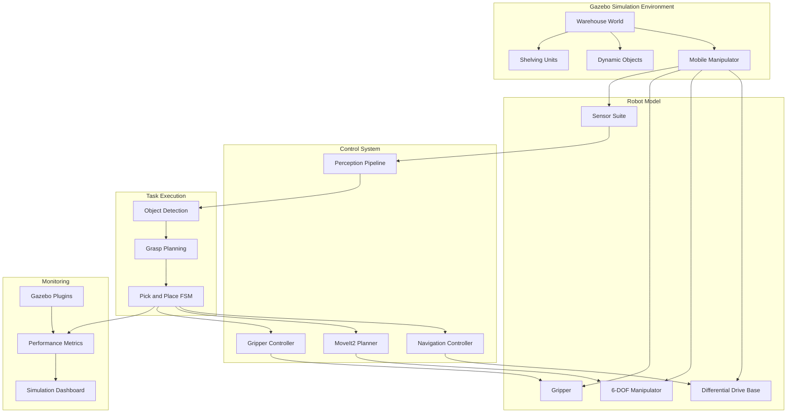
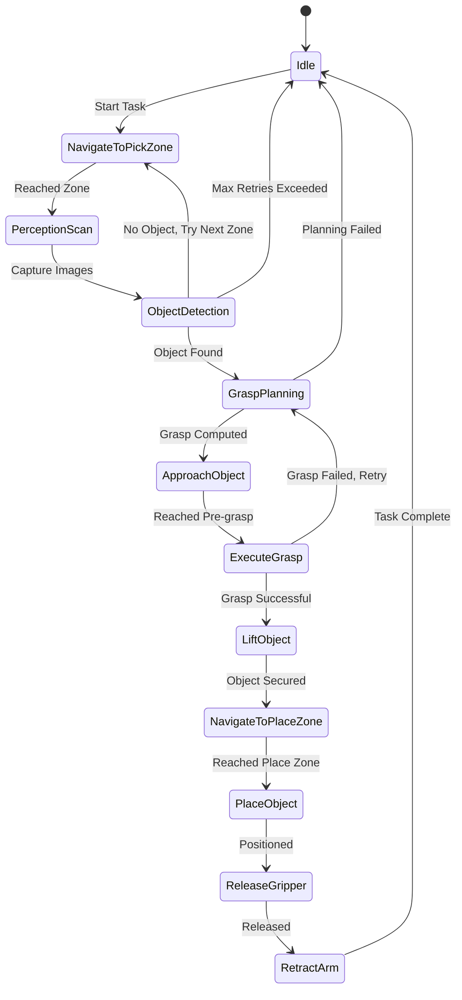

# Gazebo Simulation: Warehouse Robot Pick-and-Place

## Overview

This assessment evaluates your proficiency in robot simulation by requiring you to build a complete warehouse automation system in Gazebo. You will design a custom simulation environment, create a mobile manipulator robot model, and implement autonomous pick-and-place operations.

**Estimated Time:** 25-35 hours
**Difficulty:** Intermediate to Advanced
**Prerequisites:** URDF/SDF Modeling, Gazebo Basics, ROS 2 Control, Mobile Manipulation

## Project Objectives

Demonstrate mastery of:

- Custom Gazebo world creation with realistic physics
- Complex URDF/SDF robot modeling with mobile bases and manipulators
- Sensor integration and simulation (cameras, LiDAR, force sensors)
- Motion planning for mobile manipulation
- Gazebo plugin development for custom behaviors
- Performance optimization and physics tuning
- Comprehensive simulation testing and validation

## System Architecture



## Detailed Requirements

### 1. Custom Gazebo World Design (30 points)

Create a realistic warehouse environment with proper lighting, physics, and interactive elements.

**World Specifications:**

**Environment Dimensions:**
- Warehouse floor: 20m x 15m
- Ceiling height: 4m
- 3-4 shelving units with multiple levels
- Designated pick zones (3) and place zones (2)
- Charging station area
- Emergency stop zone

**Required Elements:**

1. **Shelving Units** (SDF models)
   ```xml
   <model name="warehouse_shelf">
     <static>true</static>
     <link name="frame">
       <collision name="collision">
         <geometry>
           <mesh>
             <uri>model://warehouse_shelf/meshes/shelf.dae</uri>
           </mesh>
         </geometry>
       </collision>
       <visual name="visual">
         <geometry>
           <mesh>
             <uri>model://warehouse_shelf/meshes/shelf.dae</uri>
           </mesh>
         </geometry>
       </visual>
     </link>
   </model>
   ```

2. **Dynamic Objects** (at least 10 pickable items)
   - Boxes: 3 sizes (0.05m, 0.1m, 0.15m cubes)
   - Cylinders: Cans, bottles (varied heights)
   - Custom meshes: Product models
   - Physical properties: mass (0.1-2.0 kg), friction coefficients
   - Color-coded for classification tasks

3. **Lighting Configuration**
   - Overhead warehouse lighting (4-6 point lights)
   - Directional sunlight through windows
   - Ambient lighting for realistic shadows
   - Configured for optimal camera performance

4. **Floor and Walls**
   - Textured concrete floor with realistic friction (0.8-1.0)
   - Marked navigation zones (different colors/textures)
   - Boundary walls with collision geometry
   - Optional: Floor markings for QR code navigation

**Physics Engine Configuration:**
```xml
<physics type="ode">
  <max_step_size>0.001</max_step_size>
  <real_time_factor>1.0</real_time_factor>
  <real_time_update_rate>1000</real_time_update_rate>
  <gravity>0 0 -9.81</gravity>
  <ode>
    <solver>
      <type>quick</type>
      <iters>50</iters>
      <sor>1.3</sor>
    </solver>
    <constraints>
      <cfm>0.0</cfm>
      <erp>0.2</erp>
      <contact_max_correcting_vel>100.0</contact_max_correcting_vel>
      <contact_surface_layer>0.001</contact_surface_layer>
    </constraints>
  </ode>
</physics>
```

**World Quality Criteria:**
- Visual realism: Proper textures, lighting, shadows
- Physics accuracy: Stable object stacking, realistic collisions
- Performance: Maintains real-time factor > 0.9 on target hardware
- Modularity: Easy to add/remove objects programmatically

### 2. Mobile Manipulator Robot Model (30 points)

Design a complete URDF model combining a mobile base with a robotic arm and gripper.

**Robot Specifications:**

#### Mobile Base (Differential Drive)
- **Dimensions:** 0.6m (L) x 0.4m (W) x 0.3m (H)
- **Wheels:** 2 driven wheels (0.1m diameter) + 1 caster
- **Maximum velocity:** 1.0 m/s linear, 2.0 rad/s angular
- **Sensors:**
  - Front-facing 2D LiDAR (270° FOV, 0.1-10m range)
  - Wheel encoders (simulated odometry)
  - IMU for orientation estimation

**URDF Structure Example:**
```xml
<robot name="warehouse_robot">
  <!-- Base Link -->
  <link name="base_link">
    <inertial>
      <mass value="20.0"/>
      <inertia ixx="0.5" ixy="0" ixz="0" iyy="0.8" iyz="0" izz="1.0"/>
    </inertial>
    <visual>
      <geometry>
        <box size="0.6 0.4 0.3"/>
      </geometry>
      <material name="blue"/>
    </visual>
    <collision>
      <geometry>
        <box size="0.6 0.4 0.3"/>
      </geometry>
    </collision>
  </link>

  <!-- Wheels with proper friction -->
  <link name="left_wheel">
    <inertial>
      <mass value="2.0"/>
      <inertia ixx="0.01" ixy="0" ixz="0" iyy="0.005" iyz="0" izz="0.005"/>
    </inertial>
    <collision>
      <geometry>
        <cylinder radius="0.05" length="0.04"/>
      </geometry>
      <surface>
        <friction>
          <ode>
            <mu>1.0</mu>
            <mu2>1.0</mu2>
          </ode>
        </friction>
      </surface>
    </collision>
  </link>

  <!-- More links and joints... -->
</robot>
```

#### Manipulator Arm (6 DOF)
- **Configuration:** Vertical 6R serial chain
- **Reach:** 0.8m horizontal, 1.2m vertical
- **Payload capacity:** 5 kg
- **Joint limits:** Realistic ranges preventing self-collision
- **Joint Controllers:**
  - Position control for all joints
  - Effort limits: [50, 50, 40, 30, 20, 10] Nm
  - Velocity limits: [2.0, 2.0, 2.5, 3.0, 3.0, 3.5] rad/s

**Joint Configuration:**
```yaml
# controllers.yaml
controller_manager:
  ros__parameters:
    update_rate: 100

    joint_state_broadcaster:
      type: joint_state_broadcaster/JointStateBroadcaster

    arm_controller:
      type: joint_trajectory_controller/JointTrajectoryController

arm_controller:
  ros__parameters:
    joints:
      - shoulder_pan_joint
      - shoulder_lift_joint
      - elbow_joint
      - wrist_1_joint
      - wrist_2_joint
      - wrist_3_joint
    command_interfaces:
      - position
    state_interfaces:
      - position
      - velocity
    allow_partial_joints_goal: false
```

#### Gripper (Parallel Jaw)
- **Type:** Two-finger parallel gripper
- **Jaw width:** 0-0.15m opening
- **Gripping force:** 20-100 N (adjustable)
- **Finger sensors:** Contact sensors for grasp detection
- **Actuation:** Mimic joints or Gazebo grasp plugin

**Gripper Implementation Options:**

*Option 1: Mimic Joints*
```xml
<joint name="gripper_joint" type="prismatic">
  <parent link="gripper_base"/>
  <child link="left_finger"/>
  <axis xyz="0 1 0"/>
  <limit lower="0" upper="0.075" effort="100" velocity="0.2"/>
</joint>

<joint name="gripper_mimic_joint" type="prismatic">
  <parent link="gripper_base"/>
  <child link="right_finger"/>
  <axis xyz="0 -1 0"/>
  <mimic joint="gripper_joint" multiplier="1.0"/>
  <limit lower="0" upper="0.075" effort="100" velocity="0.2"/>
</joint>
```

*Option 2: Gazebo Grasp Plugin*
```xml
<gazebo>
  <plugin name="gazebo_grasp_fix" filename="libgazebo_grasp_fix.so">
    <arm>
      <arm_name>robot_arm</arm_name>
      <gripper_link>left_finger</gripper_link>
      <gripper_link>right_finger</gripper_link>
    </arm>
    <forces_angle_tolerance>100</forces_angle_tolerance>
    <update_rate>10</update_rate>
    <grip_count_threshold>3</grip_count_threshold>
  </plugin>
</gazebo>
```

#### Sensor Suite
1. **RGB-D Camera** (wrist-mounted)
   - Resolution: 640x480
   - FOV: 60° horizontal, 45° vertical
   - Depth range: 0.5-5.0m
   - Frame rate: 30 Hz

2. **2D LiDAR** (base-mounted)
   - Range: 0.1-10m
   - Angular resolution: 1°
   - Scan rate: 10 Hz

3. **Force/Torque Sensor** (wrist)
   - Measures end-effector forces
   - Used for contact detection and compliant grasping

**Sensor Gazebo Plugins:**
```xml
<!-- RGB-D Camera -->
<gazebo reference="camera_link">
  <sensor type="depth" name="camera">
    <update_rate>30.0</update_rate>
    <camera>
      <horizontal_fov>1.047</horizontal_fov>
      <image>
        <width>640</width>
        <height>480</height>
        <format>R8G8B8</format>
      </image>
      <clip>
        <near>0.5</near>
        <far>5.0</far>
      </clip>
    </camera>
    <plugin name="camera_controller" filename="libgazebo_ros_camera.so">
      <ros>
        <namespace>/robot</namespace>
        <remapping>camera/image_raw:=camera/rgb/image_raw</remapping>
        <remapping>camera/depth/image_raw:=camera/depth/image_raw</remapping>
        <remapping>camera/camera_info:=camera/rgb/camera_info</remapping>
      </ros>
      <frame_name>camera_optical_frame</frame_name>
    </plugin>
  </sensor>
</gazebo>
```

### 3. Autonomous Navigation System (15 points)

Implement navigation capabilities for the mobile base using Nav2 or custom controllers.

**Navigation Requirements:**

1. **Map Generation**
   - Create static occupancy grid map of warehouse
   - Include no-go zones and preferred paths
   - Resolution: 0.05m per pixel

2. **Path Planning**
   - Global planner: A* or NavFn
   - Local planner: DWA or TEB
   - Recovery behaviors for stuck situations

3. **Localization**
   - AMCL for probabilistic localization
   - Initial pose setting capability
   - Localization quality monitoring

**Navigation Configuration:**
```yaml
# nav2_params.yaml
controller_server:
  ros__parameters:
    controller_frequency: 20.0
    FollowPath:
      plugin: "dwb_core::DWBLocalPlanner"
      min_vel_x: -0.5
      max_vel_x: 1.0
      max_vel_theta: 2.0
      min_speed_xy: 0.0
      max_speed_xy: 1.0
      acc_lim_x: 2.0
      acc_lim_theta: 3.0
      sim_time: 1.5
```

**Performance Targets:**
- Navigation success rate: > 95% in obstacle-free paths
- Average time to goal (10m distance): < 20 seconds
- Path smoothness: No unnecessary oscillations
- Collision avoidance: Zero collisions during testing

### 4. Object Manipulation Pipeline (25 points)

Develop a complete pick-and-place system integrating perception, planning, and execution.

**Pipeline Architecture:**



**Component Specifications:**

#### A. Perception System
- **Object Detection:**
  - Use YOLOv8 or classical computer vision (color/shape)
  - Minimum accuracy: 90% on test objects
  - Detection rate: > 5 Hz

- **Pose Estimation:**
  - 6-DOF pose from RGB-D data
  - Position accuracy: ± 2cm
  - Orientation accuracy: ± 5°

- **Scene Understanding:**
  - Identify multiple objects in scene
  - Handle partial occlusions
  - Filter noise and false positives

**Perception Node Example:**
```python
class ObjectPerception(Node):
    def __init__(self):
        super().__init__('object_perception')
        self.rgb_sub = self.create_subscription(
            Image, '/camera/rgb/image_raw', self.rgb_callback, 10)
        self.depth_sub = self.create_subscription(
            Image, '/camera/depth/image_raw', self.depth_callback, 10)
        self.detection_pub = self.create_publisher(
            DetectionArray, '/detected_objects', 10)

    def detect_objects(self, rgb_image, depth_image):
        # YOLOv8 inference
        detections = self.model.predict(rgb_image)

        # 3D pose estimation
        object_poses = []
        for det in detections:
            pose = self.estimate_3d_pose(det, depth_image)
            object_poses.append(pose)

        return object_poses
```

#### B. Grasp Planning
- **Approach:** Analytical grasp generation or sampling-based
- **Grasp Quality Metrics:** Force closure, wrench space analysis
- **Constraints:** Collision-free, reachable, stable
- **Output:** 6-DOF grasp pose + pre-grasp pose

**Grasp Planner Requirements:**
- Generate 5-10 candidate grasps per object
- Rank by quality score (stability, reachability)
- Account for gripper geometry and object shape
- Validate grasp feasibility with collision checking

#### C. Motion Planning (MoveIt2 Integration)
- **Planning Groups:**
  - `mobile_base`: Differential drive navigation
  - `arm`: 6-DOF manipulator
  - `gripper`: Parallel jaw control
  - `mobile_manipulator`: Combined base + arm planning

- **Motion Planning Pipeline:**
  1. Plan base motion to pre-grasp pose
  2. Plan arm motion to grasp approach
  3. Linear approach to grasp pose
  4. Close gripper
  5. Retreat motion with object
  6. Plan to place location
  7. Release and retreat

**MoveIt Configuration:**
```yaml
# moveit_config.yaml
planning_pipelines:
  ompl:
    planning_plugin: ompl_interface/OMPLPlanner
    request_adapters: >-
      default_planner_request_adapters/AddTimeOptimalParameterization
      default_planner_request_adapters/FixWorkspaceBounds
      default_planner_request_adapters/FixStartStateBounds
    planner_configs:
      RRTConnect:
        type: geometric::RRTConnect
        range: 0.0
      RRTstar:
        type: geometric::RRTstar
        range: 0.0
        goal_bias: 0.05
```

#### D. Task Execution State Machine
- Implement using FlexBE, SMACH, or custom FSM
- Handle errors and retries gracefully
- Log all state transitions for debugging
- Publish task progress for monitoring

### 5. Gazebo Plugin Development (10 points)

Create custom Gazebo plugins to enhance simulation capabilities.

**Required Plugins:**

#### A. Performance Metrics Plugin
Tracks and reports simulation performance data:
- Task completion time
- Distance traveled
- Energy consumption (estimated)
- Collision events
- Grasp success/failure count

**Plugin Structure:**
```cpp
namespace gazebo {
class PerformanceMetricsPlugin : public WorldPlugin {
public:
    void Load(physics::WorldPtr _world, sdf::ElementPtr _sdf) override {
        this->world_ = _world;
        this->update_connection_ = event::Events::ConnectWorldUpdateBegin(
            std::bind(&PerformanceMetricsPlugin::OnUpdate, this));

        // Initialize ROS 2 publisher
        this->ros_node_ = std::make_shared<rclcpp::Node>("performance_metrics");
        this->metrics_pub_ = this->ros_node_->create_publisher<...>(
            "/simulation/metrics", 10);
    }

    void OnUpdate() {
        // Collect metrics
        // Publish to ROS topic
    }
};

GZ_REGISTER_WORLD_PLUGIN(PerformanceMetricsPlugin)
}
```

#### B. Object Spawner Plugin
Dynamically spawns objects at runtime:
- Random placement within pick zones
- Varied object types and poses
- Configurable spawn rate
- ROS service interface for manual spawning

**Service Interface:**
```python
# Call spawner service
ros2 service call /spawn_object gazebo_msgs/srv/SpawnModel \
  "{model_name: 'box_1',
    model_xml: '$(cat models/box/model.sdf)',
    initial_pose: {position: {x: 1.0, y: 2.0, z: 0.5}}}"
```

### 6. Physics Tuning and Optimization (5 points)

Optimize simulation performance while maintaining realism.

**Tuning Checklist:**
- [ ] Contact parameters: CFM, ERP adjusted for stable grasping
- [ ] Solver iterations: Balanced for accuracy vs speed
- [ ] Collision meshes: Simplified where appropriate
- [ ] Update rates: Matched to control requirements
- [ ] Real-time factor: > 0.9 sustained during operation

**Performance Profiling:**
```bash
# Monitor real-time factor
gz stats

# Profile physics performance
gz physics -v

# Check update rates
ros2 topic hz /clock
```

## Package Structure

```
warehouse_robot_sim/
├── CMakeLists.txt
├── package.xml
├── README.md
├── config/
│   ├── nav2_params.yaml
│   ├── controllers.yaml
│   ├── moveit_config/
│   │   ├── moveit.yaml
│   │   ├── kinematics.yaml
│   │   └── joint_limits.yaml
│   └── sensors.yaml
├── launch/
│   ├── warehouse_world.launch.py
│   ├── spawn_robot.launch.py
│   ├── navigation.launch.py
│   ├── manipulation.launch.py
│   └── complete_system.launch.py
├── models/
│   ├── warehouse_shelf/
│   │   ├── model.sdf
│   │   └── meshes/
│   ├── pickable_objects/
│   │   ├── box_small/
│   │   ├── box_medium/
│   │   └── cylinder/
│   └── warehouse_robot/
│       ├── model.urdf.xacro
│       ├── model.sdf
│       └── meshes/
├── worlds/
│   ├── warehouse.world
│   ├── warehouse_empty.world
│   └── test_arena.world
├── src/
│   ├── object_perception.py
│   ├── grasp_planner.py
│   ├── task_executor.py
│   ├── manipulation_controller.cpp
│   └── plugins/
│       ├── performance_metrics_plugin.cpp
│       └── object_spawner_plugin.cpp
├── scripts/
│   ├── spawn_objects.py
│   ├── run_benchmark.py
│   └── analyze_results.py
└── test/
    ├── test_navigation.py
    ├── test_manipulation.py
    └── test_integration.py
```

## Grading Rubric

### Simulation Quality (30 points)

| Component | Points | Criteria |
|-----------|--------|----------|
| World Design | 12 | Realistic environment, proper lighting, textured surfaces, logical layout |
| Physics Accuracy | 10 | Stable object interactions, realistic collisions, proper friction/gravity |
| Visual Quality | 5 | Good textures, appropriate materials, professional appearance |
| Performance | 3 | Real-time factor > 0.9, smooth rendering, no stuttering |

### Robot Model (30 points)

| Component | Points | Criteria |
|-----------|--------|----------|
| Mechanical Design | 10 | Proper links/joints, accurate dimensions, realistic mass/inertia |
| Sensor Integration | 8 | All required sensors, correct placement, proper configuration |
| Controller Setup | 7 | ROS 2 Control configured, joint limits enforced, smooth motion |
| URDF Quality | 5 | Clean structure, proper namespaces, modular design |

### Manipulation Task (25 points)

| Component | Points | Criteria |
|-----------|--------|----------|
| Object Detection | 7 | Accurate detection, handles multiple objects, robust to lighting |
| Grasp Planning | 8 | Generates valid grasps, collision-free, high success rate |
| Motion Planning | 6 | Smooth trajectories, collision avoidance, efficient paths |
| Task Execution | 4 | Complete pick-place cycle, error handling, state management |

### Documentation (15 points)

| Component | Points | Criteria |
|-----------|--------|----------|
| README | 6 | Comprehensive instructions, architecture overview, usage examples |
| Code Documentation | 4 | Inline comments, function docstrings, clear variable names |
| Demo Video | 3 | Shows full workflow, explains components, professional quality |
| Technical Report | 2 | Design decisions, challenges, performance analysis |

## Success Criteria

### Minimum Requirements
- [ ] Warehouse world loads without errors
- [ ] Robot model spawns correctly with all sensors active
- [ ] Mobile base navigates to designated waypoints (5/5 success)
- [ ] Arm reaches commanded joint positions within ±0.05 rad
- [ ] Gripper opens/closes on command
- [ ] Detects at least 3 different object types with > 85% accuracy
- [ ] Completes pick-and-place task for 3 objects in 10 minutes

### Performance Metrics
- [ ] **Navigation Accuracy:** Reaches goal within 10cm position, 5° orientation
- [ ] **Manipulation Success Rate:** > 80% grasp success on known objects
- [ ] **Task Completion Time:** < 3 minutes per pick-place cycle
- [ ] **Collision Avoidance:** Zero collisions during planned motions
- [ ] **Simulation Stability:** No physics explosions or model failures

### Advanced Criteria (for top grades)
- [ ] Handles 5+ different object types
- [ ] Grasp success rate > 90%
- [ ] Real-time factor sustained at > 0.95
- [ ] Recovers from grasp failures automatically
- [ ] Custom Gazebo plugins functioning correctly

## Submission Guidelines

### Required Deliverables

1. **Complete ROS 2 Package**
   - Source code for all nodes and plugins
   - Compiled binaries (or build instructions)
   - All model files and world definitions

2. **README.md** (minimum 3 pages)
   - System overview with architecture diagram
   - Installation instructions (dependencies, build steps)
   - Launch instructions for different scenarios
   - Configuration parameter explanations
   - Known issues and limitations

3. **Demo Video** (6-10 minutes)
   - Warehouse environment tour
   - Robot model showcase (sensors, joints)
   - Navigation demonstration
   - Pick-and-place task execution (multiple objects)
   - Failure recovery example
   - Code walkthrough of key components

4. **Technical Report** (PDF, 4-6 pages)
   - Design methodology and architecture choices
   - Physics tuning process and parameters
   - Grasp planning algorithm explanation
   - Performance analysis with data/graphs
   - Challenges encountered and solutions
   - Future improvements

5. **Test Results**
   - Automated test output logs
   - Performance benchmarks (CSV/JSON)
   - Screenshots of successful task completion

### Submission Format

```bash
warehouse_robot_submission/
├── warehouse_robot_sim/       # ROS 2 package
├── README.md
├── TECHNICAL_REPORT.pdf
├── DEMO_VIDEO_LINK.txt
├── test_results/
│   ├── navigation_tests.log
│   ├── manipulation_tests.log
│   └── performance_metrics.csv
└── screenshots/
    ├── warehouse_overview.png
    ├── robot_model.png
    └── successful_grasp.png
```

Compress as: `lastname_firstname_gazebo_project.zip` (< 500 MB)

## Common Pitfalls and Debugging

### 1. Physics Instability
**Symptoms:** Objects jittering, robot shaking, simulation crashes
**Causes:** Improper inertia, colliding geometries, poor contact parameters
**Solutions:**
- Verify inertia tensors are physically plausible
- Add collision margins to prevent inter-penetration
- Reduce max step size: `<max_step_size>0.001</max_step_size>`
- Increase solver iterations: `<iters>100</iters>`

### 2. Grasping Failures
**Symptoms:** Objects slip through gripper, unstable grasps
**Causes:** Insufficient friction, collision issues, plugin configuration
**Solutions:**
- Increase finger friction: `<mu>1.5</mu>`, `<mu2>1.5</mu2>`
- Use Gazebo grasp fix plugin
- Ensure contact sensors are properly configured
- Tune grasp force parameters

### 3. Slow Simulation Performance
**Symptoms:** Real-time factor < 0.5, choppy rendering
**Causes:** Complex meshes, too many constraints, inefficient plugins
**Solutions:**
- Simplify collision meshes (use boxes/cylinders where possible)
- Reduce sensor update rates
- Profile with `gzserver --verbose`
- Disable GUI for headless testing

### 4. TF Tree Errors
**Symptoms:** `Could not transform from X to Y`
**Causes:** Missing transforms, incorrect frame IDs, timing issues
**Solutions:**
- Verify all links in URDF have proper parent-child relationships
- Check Gazebo publishes `tf` correctly
- Use `ros2 run tf2_tools view_frames` to visualize tree
- Ensure consistent use of `sim_time`

### 5. MoveIt Planning Failures
**Symptoms:** `ABORTED: No motion plan found`
**Causes:** Invalid start state, unreachable goal, collision in path
**Solutions:**
- Visualize planning scene in RViz to check collisions
- Increase planning time: `planning_time: 10.0`
- Adjust goal tolerances if position is slightly unreachable
- Check joint limits in URDF vs MoveIt config

### Debugging Commands

```bash
# Verify world loads
gz world -v warehouse.world

# Check model validity
gz sdf -k model.sdf

# Monitor simulation performance
gz stats -p

# Inspect model in isolation
gazebo models/warehouse_robot/model.sdf

# Test URDF syntax
check_urdf model.urdf

# Launch with verbose logging
ros2 launch warehouse_robot_sim complete_system.launch.py \
  log_level:=debug

# Record simulation for playback
ros2 bag record /tf /joint_states /camera/rgb/image_raw
```

## Bonus Challenges (Extra Credit)

### Advanced Features (+10 points each)

1. **Multi-Object Manipulation**
   - Simultaneously track and plan for 5+ objects
   - Optimize pick sequence for minimum total time
   - Handle dynamic object addition/removal

2. **Sim-to-Real Transfer**
   - Implement domain randomization in simulation
   - Add realistic sensor noise models
   - Document sim-to-real gap analysis

3. **Human-Robot Interaction**
   - Add virtual human models to warehouse
   - Implement safety zones and speed reduction
   - Collision avoidance with moving obstacles

4. **Learning-Based Grasp Planning**
   - Train grasp quality CNN on synthetic data
   - Integrate with existing pipeline
   - Compare performance vs analytical method

5. **Fleet Management**
   - Spawn 2-3 robots in same environment
   - Coordinate task allocation
   - Prevent inter-robot collisions

## Testing Procedures

### Unit Tests

```python
# test_navigation.py
def test_navigation_to_waypoint():
    # Send goal to Nav2
    goal = NavigateToPose.Goal()
    goal.pose.header.frame_id = 'map'
    goal.pose.pose.position.x = 5.0
    goal.pose.pose.position.y = 3.0

    # Wait for result
    result = nav_client.send_goal_async(goal)
    assert result.status == GoalStatus.STATUS_SUCCEEDED

    # Check final position
    current_pose = get_robot_pose()
    assert distance(current_pose, goal.pose.pose) < 0.1
```

### Integration Tests

```python
# test_integration.py
def test_complete_pick_place():
    # 1. Navigate to pick zone
    navigate_to_pose(pick_zone_pose)

    # 2. Detect object
    detected_objects = perception.detect_objects()
    assert len(detected_objects) > 0

    # 3. Plan and execute grasp
    grasp_result = manipulation.pick_object(detected_objects[0])
    assert grasp_result.success == True

    # 4. Navigate to place zone
    navigate_to_pose(place_zone_pose)

    # 5. Place object
    place_result = manipulation.place_object()
    assert place_result.success == True
```

### Performance Benchmarks

Run standardized benchmark suite:
```bash
python3 scripts/run_benchmark.py --trials 10 --output results.csv
```

Expected metrics:
- Average task time: < 180 seconds
- Grasp success rate: > 80%
- Navigation success: > 95%
- Collision count: 0

## Additional Resources

### Gazebo and Simulation
- [Gazebo Tutorials](http://gazebosim.org/tutorials)
- [SDF Format Specification](http://sdformat.org/)
- [Gazebo ROS 2 Integration](https://github.com/ros-simulation/gazebo_ros_pkgs)
- [URDF Tutorial](https://docs.ros.org/en/humble/Tutorials/Intermediate/URDF/URDF-Main.html)

### Mobile Manipulation
- [MoveIt2 Documentation](https://moveit.picknik.ai/main/index.html)
- [Nav2 Documentation](https://navigation.ros.org/)
- [Grasp Planning Theory](https://manipulation.csail.mit.edu/pick.html) - MIT Course
- [Mobile Manipulation Roadmap](https://ieeexplore.ieee.org/document/9363523)

### Example Projects
- [Fetch Robot Simulation](https://github.com/fetchrobotics/fetch_gazebo)
- [TIAGo Warehouse Demo](https://github.com/pal-robotics/tiago_simulation)
- [AWS RoboMaker Warehouse](https://github.com/aws-robotics/aws-robomaker-small-warehouse-world)

### Tools
- [Blender](https://www.blender.org/) - 3D modeling for custom meshes
- [FreeCAD](https://www.freecadweb.org/) - Parametric CAD for robot design
- [MeshLab](https://www.meshlab.net/) - Mesh simplification and repair

## Evaluation Timeline

- **Week 1:** World design and robot URDF modeling
- **Week 2:** Sensor integration and navigation setup
- **Week 3:** Manipulation pipeline development
- **Week 4:** Integration, testing, optimization, and documentation

**Submission Deadline:** 4 weeks from project start
**Late Policy:** -15% per day, maximum 2 days late accepted

---

**Questions?** Use office hours or post in the course forum. Happy simulating!
