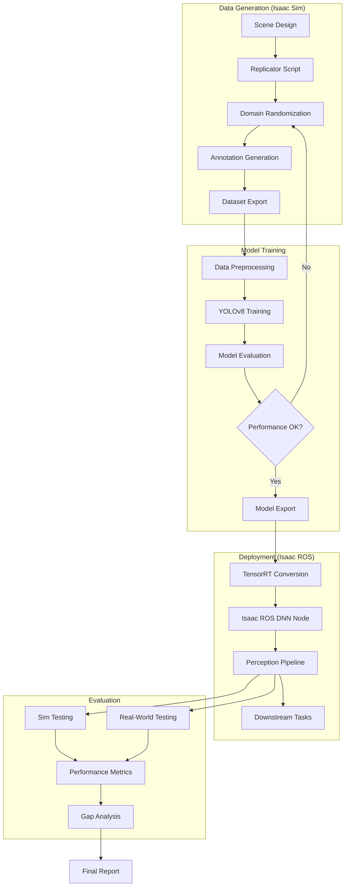
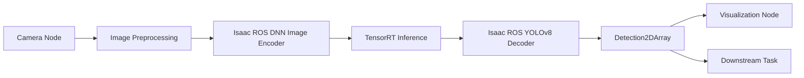

# Isaac Sim: Synthetic Data Generation and Object Detection Pipeline

## Overview

This capstone assessment evaluates your ability to build production-ready perception systems using NVIDIA Isaac Sim. You will create a complete pipeline from synthetic data generation through model training and deployment, demonstrating mastery of modern computer vision workflows for robotics.

**Estimated Time:** 30-40 hours
**Difficulty:** Advanced
**Prerequisites:** Isaac Sim Basics, Python, Deep Learning Fundamentals, ROS 2, Computer Vision

## Project Objectives

Demonstrate proficiency in:

- Designing photorealistic Isaac Sim scenes for data generation
- Using Replicator API for domain randomization and dataset creation
- Training object detection models on synthetic data
- Deploying models on Isaac ROS for real-time inference
- Evaluating sim-to-real transfer and performance optimization
- Documenting complete ML pipelines for reproducibility

## System Architecture



## Detailed Requirements

### 1. Isaac Sim Scene Design (25 points)

Create a photorealistic simulation environment optimized for object detection dataset generation.

**Scene Specifications:**

#### Environment Design
- **Setting:** Industrial inspection station or retail shelf scenario
- **Dimensions:** 3m x 3m workspace, camera views from 0.5-2.0m distance
- **Lighting:** Configurable overhead and spot lighting with HDR environment maps
- **Background:** Realistic textures, variable clutter elements

**Required Elements:**

1. **Camera Configuration**
   - Primary camera: RGB sensor (1920x1080 or 1280x720)
   - Secondary sensors: Depth, segmentation, normals (for analysis)
   - Camera poses: 5-10 viewpoint variations
   - Lens parameters: Focal length, aperture, distortion configurable

2. **Object Assets** (minimum 8 classes)
   - Industrial parts: Gears, bolts, connectors
   - Retail items: Boxes, cans, bottles
   - Custom objects: At least 2 classes with unique CAD models
   - Asset variations: 3-5 models per class for diversity

3. **Randomization Targets**
   - Object poses: Position, orientation (6-DOF)
   - Object properties: Color, metallic/roughness, scale (±20%)
   - Scene lighting: Color temperature (2500-6500K), intensity (0.5-2.0x)
   - Background: Texture swaps, clutter placement
   - Camera: Pose variation, exposure, noise

**Scene Setup Example:**

```python
# isaac_scene_setup.py
import omni.replicator.core as rep
import omni.isaac.core.utils.stage as stage_utils
from omni.isaac.core import World

class PerceptionSceneBuilder:
    def __init__(self):
        self.world = World(stage_units_in_meters=1.0)
        self.asset_paths = {}

    def setup_environment(self):
        """Configure scene environment and lighting"""
        # Add ground plane
        stage_utils.add_reference_to_stage(
            usd_path="/Isaac/Environments/Simple_Room/simple_room.usd",
            prim_path="/World/Environment"
        )

        # Configure lighting
        self.dome_light = rep.create.light(
            light_type="Dome",
            rotation=(0, 0, 0),
            intensity=1000,
            texture=rep.distribution.choice([
                "cloudy_sky.hdr",
                "industrial_hall.hdr",
                "studio_small.hdr"
            ])
        )

        # Add area lights
        self.key_light = rep.create.light(
            light_type="Rect",
            position=(2, 2, 3),
            rotation=(-45, -45, 0),
            intensity=rep.distribution.uniform(500, 2000),
            color=rep.distribution.uniform((0.9, 0.9, 0.9), (1.0, 1.0, 1.0))
        )

    def load_object_assets(self):
        """Load and organize object assets"""
        self.asset_paths = {
            "gear": [
                "/Assets/Gears/gear_small.usd",
                "/Assets/Gears/gear_medium.usd",
                "/Assets/Gears/gear_large.usd"
            ],
            "bolt": [
                "/Assets/Fasteners/bolt_m6.usd",
                "/Assets/Fasteners/bolt_m8.usd"
            ],
            "box": [
                "/Assets/Boxes/cardboard_small.usd",
                "/Assets/Boxes/cardboard_medium.usd"
            ],
            # Add more classes...
        }

    def create_randomization_graph(self):
        """Define Replicator randomization logic"""
        # Object spawning area
        surface = rep.create.plane(
            scale=(0.5, 0.5, 1),
            position=(0, 0, 0.8),
            visible=False
        )

        # Register objects for randomization
        with rep.trigger.on_frame(num_frames=5000):
            # Select random object class and variant
            for obj_class, variants in self.asset_paths.items():
                with rep.create.group():
                    obj = rep.create.from_usd(
                        rep.distribution.choice(variants),
                        semantics=[("class", obj_class)]
                    )

                    # Randomize pose
                    with obj:
                        rep.modify.pose(
                            position=rep.distribution.uniform(
                                (-0.3, -0.3, 0.8),
                                (0.3, 0.3, 1.2)
                            ),
                            rotation=rep.distribution.uniform(
                                (0, 0, 0),
                                (360, 360, 360)
                            )
                        )

                        # Randomize appearance
                        rep.randomizer.color(
                            colors=rep.distribution.uniform(
                                (0.1, 0.1, 0.1),
                                (0.9, 0.9, 0.9)
                            )
                        )

            # Camera randomization
            camera = rep.create.camera(
                position=rep.distribution.uniform(
                    (0.5, -0.5, 1.0),
                    (1.5, 0.5, 2.0)
                ),
                look_at=(0, 0, 0.9)
            )

            # Render and annotate
            render_product = rep.create.render_product(
                camera, (1280, 720)
            )

            return render_product
```

**Quality Criteria:**
- Scene loads without errors in Isaac Sim 2023.1 or later
- Achieves 30+ FPS during generation on RTX 3080 or better
- Objects are physically plausible (no floating, interpenetration)
- Lighting produces realistic shadows and reflections
- Background provides visual diversity without overwhelming objects

### 2. Replicator-Based Dataset Generation (25 points)

Implement a comprehensive data generation pipeline using Isaac Sim Replicator.

**Dataset Specifications:**

| Requirement | Value |
|-------------|-------|
| Total Images | 5,000 minimum (train: 3,500, val: 1,000, test: 500) |
| Object Classes | 8-12 distinct classes |
| Instances per Image | 3-8 objects (variable) |
| Image Resolution | 1280x720 or 1920x1080 |
| Annotation Format | COCO JSON or YOLO TXT |
| Augmentation Variety | 10+ randomization parameters |

**Replicator Script Requirements:**

```python
# data_generation_pipeline.py
import omni.replicator.core as rep
import omni.isaac.core
import numpy as np
import json
from pathlib import Path

class SyntheticDataGenerator:
    def __init__(self, output_dir, num_frames=5000):
        self.output_dir = Path(output_dir)
        self.num_frames = num_frames
        self.annotations = []

    def setup_writers(self, render_product):
        """Configure output writers for data and annotations"""
        # RGB writer
        rgb_writer = rep.WriterRegistry.get("BasicWriter")
        rgb_writer.initialize(
            output_dir=str(self.output_dir / "images"),
            rgb=True,
            bounding_box_2d_tight=True,
            semantic_segmentation=True,
            distance_to_camera=True
        )
        rgb_writer.attach([render_product])

        # Custom COCO annotation writer
        self.coco_data = {
            "images": [],
            "annotations": [],
            "categories": []
        }

        return rgb_writer

    def register_classes(self, class_names):
        """Create COCO category entries"""
        for idx, name in enumerate(class_names):
            self.coco_data["categories"].append({
                "id": idx + 1,
                "name": name,
                "supercategory": "object"
            })

    def convert_to_coco(self, bbox_data, image_id):
        """Convert Replicator bbox format to COCO"""
        for ann_id, bbox in enumerate(bbox_data):
            x_min, y_min = bbox['x_min'], bbox['y_min']
            width = bbox['x_max'] - bbox['x_min']
            height = bbox['y_max'] - bbox['y_min']

            coco_ann = {
                "id": len(self.coco_data["annotations"]) + 1,
                "image_id": image_id,
                "category_id": bbox['semanticId'],
                "bbox": [x_min, y_min, width, height],
                "area": width * height,
                "iscrowd": 0
            }
            self.coco_data["annotations"].append(coco_ann)

    def run_generation(self):
        """Execute data generation loop"""
        print(f"Generating {self.num_frames} synthetic images...")

        # Replicator orchestrator runs the randomization graph
        rep.orchestrator.run()

        for frame_idx in range(self.num_frames):
            # Step simulation
            rep.orchestrator.step(rt_subframes=4)

            # Retrieve annotations (this is simplified; actual implementation
            # would use Replicator's annotation backend)
            # In practice, use rep.AnnotatorRegistry or BasicWriter output

            if frame_idx % 100 == 0:
                print(f"Progress: {frame_idx}/{self.num_frames}")

        # Save COCO annotations
        with open(self.output_dir / "annotations.json", 'w') as f:
            json.dump(self.coco_data, f, indent=2)

        print(f"Dataset generation complete. Saved to {self.output_dir}")

    def generate_dataset_report(self):
        """Create summary statistics"""
        report = {
            "total_images": len(self.coco_data["images"]),
            "total_annotations": len(self.coco_data["annotations"]),
            "classes": [cat["name"] for cat in self.coco_data["categories"]],
            "avg_objects_per_image": len(self.coco_data["annotations"]) /
                                      len(self.coco_data["images"])
        }

        # Class distribution
        class_counts = {}
        for ann in self.coco_data["annotations"]:
            cat_id = ann["category_id"]
            class_name = self.coco_data["categories"][cat_id - 1]["name"]
            class_counts[class_name] = class_counts.get(class_name, 0) + 1

        report["class_distribution"] = class_counts

        # Save report
        with open(self.output_dir / "dataset_report.json", 'w') as f:
            json.dump(report, f, indent=2)

        return report
```

**Domain Randomization Parameters:**

Implement at least 10 of these:

1. **Object Randomization**
   - Position (XYZ within workspace)
   - Orientation (full 6-DOF)
   - Scale (0.8-1.2x nominal size)
   - Color/albedo (RGB variation)
   - Material properties (metallic, roughness)

2. **Scene Randomization**
   - Background textures (10+ options)
   - Clutter objects (random placement)
   - Surface materials (table/platform)

3. **Lighting Randomization**
   - Light intensity (0.5-2.0x)
   - Light position (within bounds)
   - Light color temperature (2500-6500K)
   - HDR environment map selection
   - Shadow sharpness

4. **Camera Randomization**
   - Viewpoint position (spherical sampling)
   - Look-at target (small jitter)
   - Focal length (within realistic range)
   - Exposure compensation (±2 stops)
   - Sensor noise (Gaussian, Poisson)

**Dataset Quality Metrics:**

Your generated dataset must meet these criteria:

- [ ] **Class Balance:** No class has < 10% or > 20% of total annotations
- [ ] **Object Size Diversity:** Bounding boxes span 10-1000 pixels in area
- [ ] **Occlusion Levels:** 20-40% of objects partially occluded
- [ ] **Lighting Diversity:** Brightness histogram spans 50-200 range
- [ ] **Visual Variation:** SSIM between random image pairs < 0.3

### 3. Model Training Pipeline (30 points)

Train a YOLOv8 object detection model on your synthetic dataset.

**Training Specifications:**

| Parameter | Value |
|-----------|-------|
| Architecture | YOLOv8n, YOLOv8s, or YOLOv8m |
| Input Resolution | 640x640 (standard) or 1280x1280 (advanced) |
| Batch Size | 16-32 (depending on GPU memory) |
| Epochs | 100+ (with early stopping) |
| Optimizer | AdamW or SGD with momentum |
| Augmentation | Mosaic, MixUp, HSV jitter, flip |
| Validation Split | 20% of training data |

**Training Script:**

```python
# train_detector.py
from ultralytics import YOLO
import yaml
from pathlib import Path
import wandb  # Optional: for experiment tracking

class DetectorTrainer:
    def __init__(self, dataset_path, model_size='s'):
        self.dataset_path = Path(dataset_path)
        self.model_size = model_size
        self.model = YOLO(f'yolov8{model_size}.pt')

    def prepare_dataset_yaml(self):
        """Create dataset configuration for YOLO"""
        dataset_config = {
            'path': str(self.dataset_path),
            'train': 'images/train',
            'val': 'images/val',
            'test': 'images/test',
            'nc': 8,  # Number of classes
            'names': [
                'gear', 'bolt', 'box', 'cylinder',
                'connector', 'can', 'bottle', 'custom'
            ]
        }

        config_path = self.dataset_path / 'dataset.yaml'
        with open(config_path, 'w') as f:
            yaml.dump(dataset_config, f)

        return config_path

    def train(self, epochs=100, imgsz=640, batch=16):
        """Execute training loop"""
        dataset_yaml = self.prepare_dataset_yaml()

        # Optional: Initialize W&B for tracking
        # wandb.init(project="isaac-perception", name="yolov8-synthetic")

        results = self.model.train(
            data=str(dataset_yaml),
            epochs=epochs,
            imgsz=imgsz,
            batch=batch,
            patience=20,  # Early stopping
            save=True,
            device=0,  # GPU
            workers=8,
            optimizer='AdamW',
            lr0=0.001,
            weight_decay=0.0005,
            # Augmentation
            mosaic=1.0,
            mixup=0.1,
            hsv_h=0.015,
            hsv_s=0.7,
            hsv_v=0.4,
            degrees=10.0,
            translate=0.1,
            scale=0.5,
            flipud=0.0,
            fliplr=0.5,
            # Validation
            val=True,
            plots=True,
            save_period=10
        )

        return results

    def evaluate(self, test_data_path):
        """Evaluate on test set"""
        metrics = self.model.val(
            data=test_data_path,
            split='test',
            imgsz=640,
            batch=16,
            save_json=True,
            save_hybrid=True
        )

        return metrics

    def export_for_deployment(self, format='onnx'):
        """Export model for production"""
        export_path = self.model.export(
            format=format,
            imgsz=640,
            half=True,  # FP16 for faster inference
            simplify=True,
            opset=12  # ONNX opset version
        )

        return export_path
```

**Training Requirements:**

1. **Hyperparameter Tuning**
   - Conduct 3+ experiments with different learning rates
   - Document choices in training log
   - Use validation metrics to guide selection

2. **Monitoring and Logging**
   - Save training curves (loss, mAP, precision, recall)
   - Log best model checkpoint
   - Track GPU utilization and training time

3. **Ablation Studies** (at least 2)
   - Effect of domain randomization (train with/without)
   - Impact of dataset size (2500 vs 5000 images)
   - Model size comparison (YOLOv8n vs YOLOv8s vs YOLOv8m)

**Performance Targets:**

Your trained model must achieve:

- [ ] **mAP@0.5:** > 0.75 on validation set
- [ ] **mAP@0.5:0.95:** > 0.50 on validation set
- [ ] **Per-class AP:** > 0.60 for all classes
- [ ] **Inference Speed:** > 30 FPS at 640x640 on RTX 3080
- [ ] **Model Size:** < 100 MB (post-export)

### 4. Isaac ROS Deployment (25 points)

Deploy your trained model on Isaac ROS for real-time inference.

**Deployment Architecture:**



**Isaac ROS Pipeline Setup:**

```python
# isaac_ros_detection_node.py
import rclpy
from rclpy.node import Node
from sensor_msgs.msg import Image
from vision_msgs.msg import Detection2DArray
from cv_bridge import CvBridge
import isaac_ros_tensor_rt  # Isaac ROS TensorRT
import isaac_ros_dnn_encoders  # Isaac ROS DNN preprocessing

class IsaacROSDetectionPipeline(Node):
    def __init__(self):
        super().__init__('isaac_detection_pipeline')

        # Parameters
        self.declare_parameter('model_path',
                               '/workspaces/models/yolov8_fp16.engine')
        self.declare_parameter('confidence_threshold', 0.5)
        self.declare_parameter('nms_threshold', 0.45)

        # Publishers and subscribers
        self.image_sub = self.create_subscription(
            Image,
            '/camera/image_raw',
            self.image_callback,
            10
        )

        self.detection_pub = self.create_publisher(
            Detection2DArray,
            '/detections',
            10
        )

        self.bridge = CvBridge()

        # Load TensorRT model
        self.setup_tensorrt_engine()

    def setup_tensorrt_engine(self):
        """Initialize TensorRT engine for inference"""
        model_path = self.get_parameter('model_path').value

        # This is a simplified representation
        # Actual implementation uses Isaac ROS TensorRT node
        self.get_logger().info(f"Loading model from {model_path}")

    def image_callback(self, msg):
        """Process incoming images"""
        # Convert ROS Image to CV format
        cv_image = self.bridge.imgmsg_to_cv2(msg, "bgr8")

        # Inference happens in Isaac ROS TensorRT node
        # This callback would receive detections from that node

        pass

    def publish_detections(self, detections):
        """Publish detections as Detection2DArray"""
        detection_array = Detection2DArray()
        detection_array.header.stamp = self.get_clock().now().to_msg()
        detection_array.header.frame_id = "camera_frame"

        # Populate detections
        # ...

        self.detection_pub.publish(detection_array)
```

**Launch File for Isaac ROS:**

```python
# isaac_detection_launch.py
from launch import LaunchDescription
from launch_ros.actions import Node, ComposableNodeContainer
from launch_ros.descriptions import ComposableNode

def generate_launch_description():
    return LaunchDescription([
        # Image preprocessing node
        ComposableNodeContainer(
            name='isaac_ros_container',
            namespace='',
            package='rclcpp_components',
            executable='component_container_mt',
            composable_node_descriptions=[
                # DNN Image Encoder
                ComposableNode(
                    package='isaac_ros_dnn_encoders',
                    plugin='nvidia::isaac_ros::dnn_inference::DnnImageEncoderNode',
                    name='dnn_image_encoder',
                    parameters=[{
                        'input_image_width': 1280,
                        'input_image_height': 720,
                        'network_image_width': 640,
                        'network_image_height': 640,
                        'image_mean': [0.0, 0.0, 0.0],
                        'image_stddev': [255.0, 255.0, 255.0],
                    }],
                    remappings=[
                        ('/image', '/camera/image_raw'),
                        ('/tensor', '/tensor_pub')
                    ]
                ),

                # TensorRT Inference
                ComposableNode(
                    package='isaac_ros_tensor_rt',
                    plugin='nvidia::isaac_ros::dnn_inference::TensorRTNode',
                    name='tensor_rt_node',
                    parameters=[{
                        'model_file_path': '/workspaces/models/yolov8_fp16.engine',
                        'engine_file_path': '/workspaces/models/yolov8_fp16.engine',
                        'input_tensor_names': ['images'],
                        'output_tensor_names': ['output0'],
                        'output_binding_names': ['output0'],
                        'force_engine_update': False
                    }]
                ),

                # YOLOv8 Decoder
                ComposableNode(
                    package='isaac_ros_yolov8',
                    plugin='nvidia::isaac_ros::yolov8::YoloV8DecoderNode',
                    name='yolov8_decoder',
                    parameters=[{
                        'confidence_threshold': 0.5,
                        'nms_threshold': 0.45,
                    }]
                ),
            ],
            output='screen'
        ),

        # Visualization node
        Node(
            package='isaac_ros_visualization',
            executable='detection_visualizer',
            name='detection_viz',
            parameters=[{
                'class_names': [
                    'gear', 'bolt', 'box', 'cylinder',
                    'connector', 'can', 'bottle', 'custom'
                ]
            }]
        )
    ])
```

**Deployment Requirements:**

1. **Model Conversion**
   - Convert PyTorch → ONNX → TensorRT
   - Enable FP16 precision for speedup
   - Verify accuracy after quantization

2. **Performance Optimization**
   - Profile inference latency with `nsys`
   - Optimize preprocessing (GPU acceleration)
   - Use zero-copy buffers where possible

3. **Integration Testing**
   - Test on live camera feed (simulated or real)
   - Measure end-to-end latency (camera → detections)
   - Validate detection quality matches training metrics

**Deployment Criteria:**

- [ ] TensorRT engine builds without errors
- [ ] Inference runs at > 30 FPS on Jetson AGX or RTX GPU
- [ ] End-to-end latency < 100ms (camera to published detections)
- [ ] Detection accuracy within 5% of training results
- [ ] ROS 2 node handles camera dropout gracefully

### 5. Evaluation and Sim-to-Real Analysis (20 points)

Comprehensively evaluate your perception pipeline on both synthetic and real data.

**Evaluation Components:**

#### A. Synthetic Data Evaluation

Test on held-out Isaac Sim test set (500 images):

```python
# evaluate_on_sim.py
from ultralytics import YOLO
import json
from pathlib import Path

class SimEvaluator:
    def __init__(self, model_path, test_data_path):
        self.model = YOLO(model_path)
        self.test_data = Path(test_data_path)

    def run_evaluation(self):
        """Compute standard detection metrics"""
        results = self.model.val(
            data=str(self.test_data / 'dataset.yaml'),
            split='test',
            imgsz=640,
            batch=16,
            save_json=True,
            plots=True
        )

        metrics = {
            'mAP_50': results.box.map50,
            'mAP_50_95': results.box.map,
            'precision': results.box.p,
            'recall': results.box.r,
            'per_class_ap': results.box.maps.tolist()
        }

        return metrics

    def analyze_failure_cases(self, iou_threshold=0.3):
        """Identify common failure modes"""
        # Run inference and compare to ground truth
        # Categorize errors: false positives, false negatives, localization errors
        pass
```

**Required Metrics:**
- Precision, Recall, F1-score per class
- mAP@0.5 and mAP@0.5:0.95
- Confusion matrix
- Inference speed (FPS, latency)

#### B. Real-World Evaluation (if feasible)

If real camera available:

1. **Qualitative Testing**
   - Capture 50+ real images of target objects
   - Run inference and visually inspect results
   - Document failure cases with images

2. **Quantitative Analysis** (optional but recommended)
   - Manually annotate 50 real images
   - Compute mAP on real test set
   - Compare to synthetic performance

**Real-World Test Scenarios:**
- Varied lighting (bright, dim, mixed)
- Different backgrounds (cluttered, clean)
- Occlusions (partial, heavy)
- Viewing angles (front, side, angled)

#### C. Sim-to-Real Gap Analysis

**Gap Metrics:**
```python
# sim_to_real_gap.py
def compute_sim2real_gap(sim_metrics, real_metrics):
    """Calculate performance degradation"""
    gap = {
        'mAP_drop': sim_metrics['mAP_50'] - real_metrics['mAP_50'],
        'precision_drop': sim_metrics['precision'] - real_metrics['precision'],
        'recall_drop': sim_metrics['recall'] - real_metrics['recall'],
        'relative_performance': real_metrics['mAP_50'] / sim_metrics['mAP_50']
    }

    return gap
```

**Analysis Requirements:**
- Identify domain shift factors (lighting, texture, geometry)
- Propose mitigation strategies (more randomization, real data augmentation)
- Document in technical report with visualizations

#### D. Performance Profiling

Detailed timing analysis:

```bash
# Profile with NVIDIA Nsight Systems
nsys profile -t cuda,nvtx,osrt \
  ros2 run isaac_detection isaac_detection_node

# Analyze bottlenecks
# - Image transfer time
# - Preprocessing overhead
# - Inference latency
# - Post-processing and NMS
```

**Performance Report Should Include:**
- Breakdown of latency components
- GPU utilization percentage
- Memory usage (VRAM, RAM)
- FPS achieved vs theoretical maximum
- Suggestions for optimization

## Package Structure

```
isaac_perception_pipeline/
├── README.md
├── requirements.txt
├── setup.py
├── config/
│   ├── replicator_config.yaml
│   ├── training_config.yaml
│   └── isaac_ros_params.yaml
├── isaac_sim/
│   ├── scene_setup.py
│   ├── data_generation.py
│   ├── randomizers/
│   │   ├── lighting_randomizer.py
│   │   ├── object_randomizer.py
│   │   └── camera_randomizer.py
│   └── assets/
│       ├── objects/
│       └── environments/
├── training/
│   ├── train_detector.py
│   ├── evaluate_model.py
│   ├── export_model.py
│   └── utils/
│       ├── dataset_utils.py
│       └── visualization.py
├── isaac_ros_deployment/
│   ├── launch/
│   │   └── isaac_detection_launch.py
│   ├── src/
│   │   └── detection_node.cpp
│   ├── config/
│   │   └── model_config.yaml
│   └── models/
│       ├── yolov8.onnx
│       └── yolov8_fp16.engine
├── evaluation/
│   ├── evaluate_on_sim.py
│   ├── evaluate_on_real.py
│   ├── sim2real_analysis.py
│   └── performance_profiling.py
├── scripts/
│   ├── generate_dataset.sh
│   ├── train_pipeline.sh
│   ├── deploy_to_isaac_ros.sh
│   └── run_full_evaluation.sh
├── data/
│   ├── synthetic/
│   │   ├── train/
│   │   ├── val/
│   │   └── test/
│   └── real/
│       └── test/
└── results/
    ├── training_logs/
    ├── evaluation_reports/
    └── profiling_data/
```

## Grading Rubric

### Dataset Quality (25 points)

| Component | Points | Criteria |
|-----------|--------|----------|
| Scene Design | 8 | Photorealistic, proper physics, diverse elements |
| Replicator Implementation | 10 | Comprehensive randomization, clean code, configurable |
| Annotation Quality | 4 | Accurate bounding boxes, COCO compliance, no errors |
| Dataset Statistics | 3 | Balanced classes, sufficient instances, documented |

### Model Performance (30 points)

| Component | Points | Criteria |
|-----------|--------|----------|
| Training Process | 8 | Proper setup, hyperparameter tuning, logged experiments |
| Validation Metrics | 12 | mAP@0.5 > 0.75, per-class performance balanced |
| Inference Speed | 5 | > 30 FPS at target resolution, optimized |
| Model Export | 5 | Successful ONNX/TensorRT conversion, validated |

### Deployment (25 points)

| Component | Points | Criteria |
|-----------|--------|----------|
| Isaac ROS Integration | 10 | Proper node setup, composable architecture, no errors |
| Real-time Performance | 8 | < 100ms latency, stable at 30+ FPS |
| Code Quality | 4 | Clean, documented, follows ROS 2 patterns |
| Error Handling | 3 | Graceful failures, informative logs |

### Evaluation & Analysis (20 points)

| Component | Points | Criteria |
|-----------|--------|----------|
| Sim Testing | 6 | Comprehensive metrics, per-class analysis, documented |
| Real Testing | 6 | Qualitative or quantitative on real data, gap analysis |
| Performance Profiling | 5 | Detailed timing breakdown, bottleneck identification |
| Technical Report | 3 | Clear presentation, actionable insights, professional |

## Success Criteria

### Core Requirements
- [ ] Generated dataset with 5,000+ images and accurate annotations
- [ ] YOLOv8 model trained achieving mAP@0.5 > 0.75
- [ ] Model deployed on Isaac ROS with < 100ms latency
- [ ] All 8+ object classes detected with AP > 0.60
- [ ] Evaluation report comparing sim and real performance

### Advanced Criteria (for top grades)
- [ ] mAP@0.5:0.95 > 0.55 on validation set
- [ ] Real-world testing with quantitative metrics
- [ ] Sim-to-real gap < 15% in mAP
- [ ] Inference speed > 60 FPS with optimizations
- [ ] Comprehensive ablation studies documented

## Submission Guidelines

### Required Deliverables

1. **Complete Project Package**
   - All source code (scene setup, training, deployment)
   - Generated dataset (or link if > 5GB)
   - Trained model weights (.pt and .engine files)
   - Configuration files

2. **README.md** (minimum 4 pages)
   - Project overview and architecture
   - Installation instructions (Isaac Sim, dependencies)
   - Dataset generation workflow
   - Training and deployment instructions
   - Usage examples with command snippets
   - Known limitations

3. **Technical Report** (PDF, 8-12 pages)
   - **Introduction:** Problem statement, objectives
   - **Methodology:**
     - Scene design rationale
     - Domain randomization strategy
     - Model architecture choice
   - **Experiments:**
     - Training process and hyperparameters
     - Ablation study results
     - Performance profiling data
   - **Results:**
     - Quantitative metrics with tables/graphs
     - Qualitative analysis with example images
     - Sim-to-real gap analysis
   - **Discussion:**
     - Failure case analysis
     - Limitations and challenges
     - Future improvements
   - **Conclusion:** Key findings and takeaways
   - **References:** Cite papers, documentation

4. **Demo Video** (8-12 minutes)
   - Isaac Sim scene walkthrough
   - Data generation process demonstration
   - Training progress visualization
   - Inference demo (sim and optionally real)
   - Code walkthrough of key components
   - Results discussion with visual examples

5. **Evaluation Artifacts**
   - Training logs and curves (TensorBoard, W&B, or plots)
   - Test set predictions with visualizations
   - Performance profiling reports (Nsight Systems)
   - Confusion matrices and per-class metrics

### Submission Format

```
lastname_firstname_isaac_perception/
├── isaac_perception_pipeline/    # Full project
├── README.md
├── TECHNICAL_REPORT.pdf
├── DEMO_VIDEO_LINK.txt
├── models/
│   ├── best.pt
│   ├── yolov8.onnx
│   └── yolov8_fp16.engine
├── dataset/                      # Or link to cloud storage
│   └── dataset_samples/          # At least 100 sample images
├── evaluation_results/
│   ├── metrics.json
│   ├── confusion_matrix.png
│   ├── training_curves.png
│   └── profiling_report.pdf
└── supplementary/
    ├── failure_cases/
    └── ablation_studies/
```

Compress (excluding full dataset): `lastname_firstname_isaac_perception.zip`
Dataset link (Google Drive, AWS S3, etc.): Include in README

## Common Pitfalls and Solutions

### 1. Replicator Performance Issues
**Problem:** Data generation extremely slow (< 5 FPS)
**Causes:** Complex scenes, too many randomizers, inefficient code
**Solutions:**
- Simplify collision meshes (use primitives where possible)
- Batch randomizations instead of per-frame changes
- Reduce render resolution during generation
- Use headless mode: `./isaac-sim.sh --no-window`
- Profile with `omni.kit.profiler`

### 2. Annotation Misalignment
**Problem:** Bounding boxes don't match objects
**Causes:** Incorrect semantic labeling, timing issues, coordinate transforms
**Solutions:**
- Verify semantics are applied to correct prims
- Use `rep.AnnotatorRegistry` consistently
- Validate with visualization: overlay boxes on images
- Check for label mapping errors in COCO conversion

### 3. Poor Model Generalization
**Problem:** High training accuracy but low validation performance
**Causes:** Overfitting, insufficient randomization, data leakage
**Solutions:**
- Increase domain randomization diversity
- Add more augmentation during training
- Ensure train/val split is proper (no duplicates)
- Use regularization (dropout, weight decay)

### 4. TensorRT Conversion Failures
**Problem:** ONNX to TensorRT conversion errors
**Causes:** Unsupported ops, dynamic shapes, version mismatches
**Solutions:**
- Use `--opset 12` for ONNX export
- Fix input shapes: `--input-shape images:1x3x640x640`
- Update to compatible TensorRT version (8.5+)
- Check operator support: `trtexec --onnx=model.onnx --verbose`

### 5. Deployment Latency Issues
**Problem:** Inference much slower than expected
**Causes:** CPU-GPU transfers, suboptimal preprocessing, memory copies
**Solutions:**
- Use GPU for image preprocessing
- Enable DMA buffers in Isaac ROS
- Profile to identify bottleneck: `nsys profile`
- Optimize batch size and use CUDA streams

### Debugging Commands

```bash
# Isaac Sim headless mode
./isaac-sim.sh --no-window --/app/window/drawMouse=false

# Verify ONNX model
python -m onnxruntime.tools.check_model yolov8.onnx

# Test TensorRT engine
trtexec --loadEngine=yolov8_fp16.engine --dumpProfile

# Profile Isaac ROS node
nsys profile -o isaac_ros_profile ros2 run isaac_detection detection_node

# Monitor ROS topics
ros2 topic hz /detections
ros2 topic echo /detections --once

# Visualize in RViz
ros2 run rviz2 rviz2 -d config/detection_viz.rviz
```

## Bonus Challenges (Extra Credit)

### Advanced Extensions (+10 points each)

1. **3D Object Detection**
   - Generate 3D bounding box annotations
   - Train 3D detection model (e.g., PointPillars)
   - Deploy on Isaac ROS with depth sensor

2. **Active Learning Pipeline**
   - Implement uncertainty-based sample selection
   - Iteratively generate hard examples
   - Show performance improvement over random sampling

3. **Multi-Task Learning**
   - Add segmentation or keypoint detection
   - Train multi-head model jointly
   - Compare to single-task baseline

4. **Sim-to-Real Domain Adaptation**
   - Implement CycleGAN or style transfer
   - Fine-tune on small real dataset
   - Measure improvement in real-world mAP

5. **Distributed Training**
   - Set up multi-GPU training with DDP
   - Benchmark speedup vs single GPU
   - Scale to 10,000+ image dataset

## Additional Resources

### Isaac Sim and Replicator
- [Isaac Sim Documentation](https://docs.omniverse.nvidia.com/isaacsim/latest/index.html)
- [Replicator Tutorial](https://docs.omniverse.nvidia.com/extensions/latest/ext_replicator.html)
- [Synthetic Data Generation Guide](https://developer.nvidia.com/blog/synthetic-data-generation-with-omniverse-replicator/)

### YOLOv8 Training
- [Ultralytics YOLOv8 Docs](https://docs.ultralytics.com/)
- [YOLOv8 Training Tips](https://github.com/ultralytics/ultralytics/wiki)
- [Object Detection Metrics Explained](https://learnopencv.com/mean-average-precision-map-object-detection-model-evaluation-metric/)

### Isaac ROS
- [Isaac ROS Documentation](https://nvidia-isaac-ros.github.io/)
- [TensorRT Integration Guide](https://nvidia-isaac-ros.github.io/concepts/dnn_inference/index.html)
- [Isaac ROS YOLOv8](https://nvidia-isaac-ros.github.io/repositories_and_packages/isaac_ros_object_detection/isaac_ros_yolov8/index.html)

### Research Papers
- [Domain Randomization for Transferring Deep Neural Networks](https://arxiv.org/abs/1703.06907)
- [Training Deep Networks with Synthetic Data](https://arxiv.org/abs/1804.06516)
- [YOLOv8 Architecture](https://github.com/ultralytics/ultralytics)

### Tools
- [CVAT](https://www.cvat.ai/) - Annotation tool for validation
- [Netron](https://netron.app/) - Model visualization
- [TensorBoard](https://www.tensorflow.org/tensorboard) - Training monitoring
- [Weights & Biases](https://wandb.ai/) - Experiment tracking

## Evaluation Timeline

- **Week 1:** Isaac Sim scene design and asset preparation
- **Week 2:** Replicator implementation and dataset generation
- **Week 3:** Model training, hyperparameter tuning, ablation studies
- **Week 4:** Isaac ROS deployment, evaluation, profiling, documentation

**Submission Deadline:** 4 weeks from project start
**Late Policy:** -15% per day, maximum 2 days late

---

**Questions?** Contact instructor or use course discussion forum. Best of luck building your perception pipeline!
